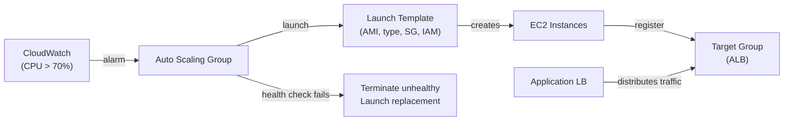

# ASG

- An Auto Scaling Group in AWS is a service that manages a group of EC2 instances, ensuring that:
  - A minimum number of instances are always running.
  - It can scale out (add instances) or scale in (remove instances) based on:
    - CPU/memory/load metrics
    - Custom CloudWatch alarms
    - Scheduled actions
- It is primarily used for high availability and automatic elasticity.


# How ASG Works for EC2

- **Launch Template/Launch Configuration:** Defines AMI, instance type, key pair, security groups, IAM role, etc.
- **Min/Max/Desired Capacity:** Minimum, maximum, and initial number of instances to maintain.
- **Scaling Policies:**
  - *Simple Scaling*
    - It is a legacy policy that triggers one scaling action per alarm. It doesn't react in steps like Step Scaling — it's just "if alarm fires, do this one thing."

  - *Target tracking* (e.g., maintain 60% CPU utilization)
    - Simplest to configure
    - Automatically scales out/in
    - Uses CloudWatch metrics
    - Works well when demand is gradual and fluctuating
        ```
        {
        "TargetValue": 60.0,
        "PredefinedMetricSpecification": {
            "PredefinedMetricType": "ASGAverageCPUUtilization"
        }
        }
        ```
  - *Step scaling*
    - You define CloudWatch alarms and step adjustments.
    - Example:
      - If CPU > 60% → add 1 instance
      - If CPU > 80% → add 2 instances
      - If CPU < 40% → remove 1 instance
    - More granular control
    - Does not continuously monitor like target tracking
    - Requires defining:
      - CloudWatch alarms
      - Scaling steps (step adjustments)

        ```
        [
        {
            "MetricIntervalLowerBound": 0,
            "MetricIntervalUpperBound": 20,
            "ScalingAdjustment": 1
        },
        {
            "MetricIntervalLowerBound": 20,
            "ScalingAdjustment": 2
        }
        ]
        ```
  - *Predictive Scaling*
  - Uses historical usage data and ML to predict demand
  - Automatically creates scheduled scaling actions based on predicted load
  - Good for highly predictable traffic patterns (e.g., daily usage spikes)

  - *Scheduled scaling*
    - Scale the ASG at specific times or intervals, regardless of metrics.
    - You define a schedule using:
      - Specific times (cron/UTC)
      - Recurring intervals
    - ASG changes capacity (desired/min/max) based on time.

- **Health Checks:**
  - EC2 or ELB-based health checks
  - Unhealthy instances are terminated and replaced

- **Load Balancer Integration:**
  - ELB/NLB/ALB can distribute traffic among instances in ASG

- **Lifecycle Hooks:** 
  - Run scripts/actions on launching or terminating instances (e.g., configure software, deregister from services)


# ASGs in EKS Node Groups

- EKS supports two types of node management:
  - **A. Managed Node Groups (Preferred):**
    - AWS creates and manages ASGs for you.
    - You don’t manage the ASG directly; EKS does it under the hood.
    - Scaling is done via:
      - EKS console or eksctl
      - Kubernetes Cluster Autoscaler (optional)
    - Updates and node replacements are automated.
    - AMI and launch template are abstracted, but you can use custom launch templates if desired.

        ```
        # eksctl config for managed node group
        managedNodeGroups:
        - name: ng-1
            instanceType: t3.medium
            desiredCapacity: 2
            minSize: 1
            maxSize: 5
            volumeSize: 20
            ssh:
            allow: true
        ```

    - Behind the scenes:
      - An EC2 Auto Scaling Group is created and managed by EKS.
      - Tags are added like:
        - k8s.io/cluster-autoscaler/enabled
        - k8s.io/cluster-autoscaler/<cluster-name>: owned
    - How scaling works:
      - Manual: Scale via eksctl, AWS Console, or API.
      - Automatic: Use the Cluster Autoscaler with the correct ASG tags.


  - **B. Self-Managed Node Groups**
    - You create and manage the ASG yourself (like regular EC2 ASGs).
    - You install the worker nodes using a custom launch template or user data script.
    - More flexibility, but more operational overhead.
    - Required when:
      - Using ARM architecture
      - Using specific custom AMIs
      - Running on spot fleets
    - Scaling behavior same as regular EC2 ASG, plus Cluster Autoscaler support if properly configured.


# What Happens When You Delete an ASG?

- By default:
  - All EC2 instances that are part of the ASG are terminated.
  - If you want to retain the instances, you must detach them before deletion.


- Scaling policies linked to the ASG are deleted.
- Scheduled scaling actions are removed.
- CloudWatch alarms specifically associated with those policies may also be deleted (unless shared elsewhere).
- Lifecycle hooks (launching/terminating) are also removed.

- Classic ELB – instances are deregistered
- ALB/NLB (Target Group) – instances are deregistered and removed from the target group


# Scaling policies in Case of EKS Managed ASG

- We can enable scaling policy at asg level and avoid using cluster autoscaler for scaling 
- But this scaling would totally based on node specific, Kubernetes would not be aware about it 
- Cluster autoscaler does auto scaling according to pods, if it needs to schedule new pods it will upscale or there is no pods to schedule on particular node it will downscale 

**Drawbacks**
- Sometimes asg can upscale the nodes despite of there are no pods in pending state to schedule 
- It might not scale when the pod is in pending beacuse of the pod 

**Pros**
- We can use it when we know the traffic pattern by scheduling the scaling 
- We can use it for lower envs to reduce cost 

---

## ASG Architecture



## Lifecycle Hooks

Allow you to run custom scripts during launch or termination:

```bash
# Add launch hook (e.g., wait for application warmup before serving traffic)
aws autoscaling put-lifecycle-hook \
  --auto-scaling-group-name my-asg \
  --lifecycle-hook-name warmup-hook \
  --lifecycle-transition autoscaling:EC2_INSTANCE_LAUNCHING \
  --default-result CONTINUE \
  --heartbeat-timeout 300    # 5 min to complete hook action

# Signal completion from instance userdata/script
aws autoscaling complete-lifecycle-action \
  --auto-scaling-group-name my-asg \
  --lifecycle-hook-name warmup-hook \
  --lifecycle-action-result CONTINUE \
  --instance-id $(curl -s http://169.254.169.254/latest/meta-data/instance-id)
```

**Use cases:**
- Launch hook: bootstrap agent installation, warm up app caches, register with service discovery
- Terminate hook: drain connections, deregister from Consul, flush logs to S3

## Spot Instances in ASG

```bash
# Mixed instances policy — 2 on-demand baseline + spot for the rest
aws autoscaling create-auto-scaling-group \
  --auto-scaling-group-name spot-asg \
  --min-size 2 --max-size 20 --desired-capacity 5 \
  --mixed-instances-policy '{
    "InstancesDistribution": {
      "OnDemandBaseCapacity": 2,
      "OnDemandPercentageAboveBaseCapacity": 0,
      "SpotAllocationStrategy": "capacity-optimized"
    },
    "LaunchTemplate": {
      "LaunchTemplateSpecification": {
        "LaunchTemplateId": "lt-abc123",
        "Version": "$Latest"
      },
      "Overrides": [
        {"InstanceType": "m5.large"},
        {"InstanceType": "m5a.large"},
        {"InstanceType": "m4.large"}
      ]
    }
  }'
```

## Instance Refresh — Zero-Downtime Updates

```bash
# Roll out new AMI/launch template version across all instances
aws autoscaling start-instance-refresh \
  --auto-scaling-group-name my-asg \
  --preferences '{
    "MinHealthyPercentage": 80,
    "InstanceWarmup": 60,
    "CheckpointPercentages": [20, 50, 100],
    "CheckpointDelay": 600
  }'
```

## Common Interview Questions

**Q: Scaling policies — target tracking vs step scaling?**
Target tracking: simplest, AWS manages the math — you specify a target (70% CPU) and AWS continuously adjusts instances to maintain it. Best for predictable load. Step scaling: you define explicit thresholds and step sizes (if CPU > 60% add 1, if > 80% add 3) — more control but requires tuning. Use target tracking as the default; step scaling when you need asymmetric scale-up vs scale-down behavior.

**Q: Lifecycle hooks — why and when?**
Without hooks, an instance is considered healthy the moment it passes the EC2 status check — but your application might take 2 minutes to warm up. A launch hook keeps the instance in `Pending:Wait` state until your script signals `CONTINUE` — preventing the ALB from sending traffic before the app is ready. Terminate hooks do the reverse: keep the instance in `Terminating:Wait` so you can drain in-flight requests or flush buffers before the instance disappears.

**Q: Instance Refresh vs blue-green deployment?**
Instance Refresh: rolling update of instances in the same ASG — CloudWatch checks health, replaces in batches (20% at a time with checkpoints). Simpler, in-place. Blue-green: two separate ASGs/target groups — traffic switched at the load balancer (0% → 10% canary → 100%). Blue-green allows instant rollback (switch back to old target group). Use Instance Refresh for simple AMI updates; use blue-green when you need instant rollback capability.
