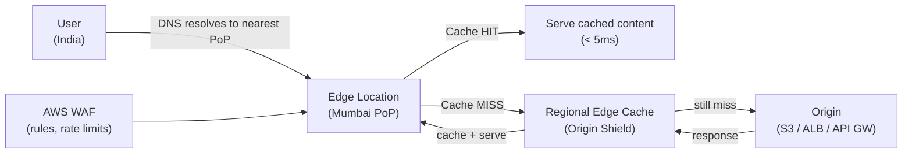

- Amazon CloudFront is a Content Delivery Network (CDN) service offered by AWS.
It delivers web content (HTML, CSS, JS, images, videos, APIs, etc.) quickly and securely to users around the world by caching it closer to them.

# Key Components of CloudFront

1. Origin:
   - The backend where your content is stored. Can be:
     - S3 Bucket
     - EC2 instance
     - Application Load Balancer
     - Any HTTP server (even outside AWS)

2. Edge Locations:
   - Global CDN servers that cache your content to reduce latency.

3. Distribution:
   - A configuration that tells CloudFront how to serve your content. 
   - You create a distribution and specify the origin and settings.

4. Cache Behavior:
   - Rules that control how CloudFront responds to requests (e.g., cache path /images/*, forward headers, TTL).

5. Invalidation:
   - Used to remove or refresh cached content from edge locations before the TTL expires.

6. Signed URLs/Cookies:
   - Used for restricting access to private content.

7. Viewer Protocol Policy:
   - Forces HTTP or HTTPS, or allows both.

8. Origin Access Control (OAC) or Origin Access Identity (OAI):
   - Mechanisms to securely restrict S3 access only to CloudFront.

# How CloudFront Works (Simplified Flow):

- User makes a request (e.g., https://cdn.example.com/image.jpg)
- CloudFront checks the nearest edge location.
- If cached, it serves the file immediately (low latency ✅).
- If not cached (cache miss), it fetches it from the origin, caches it at the edge, and returns it to the user.
- Future requests from nearby users are served from the cache.

# Types of Content Delivered

- Static: Images, CSS, JavaScript, fonts, videos
- Dynamic: API responses (with low TTL or no caching)
- Live/Streaming Media: HLS, MPEG-DASH
- Entire websites: Via S3 or custom origins


# Security Features

- HTTPS: Encrypts content in transit

- WAF integration: Protect against web exploits

- Geo-restriction: Block users from specific countries

- Signed URLs/Cookies: Restrict access to authorized users only

- Shielded origins: Protect backend from direct access

# Common Use Cases

Use Case	                                       Explanation
✅ Faster Website Load Times	                      Cache static content near users (e.g., images, scripts)
📽️ Video Streaming	                                Deliver videos via HLS/DASH
🌍 Global Distribution	                           Serve global audiences with low latency
🔒 Secure Content Delivery	                       Signed URLs for authorized access only
🛡️ API Acceleration + Security	                    Speed up APIs and protect them with AWS WAF
🧺 E-Commerce Sites	                               Cache product images, speed up delivery pages
☁️ Static Website Hosting	                        Host entire website using S3 + CloudFront


# S3 + CloudFront Static Website
Store your static website files in an S3 bucket.

Create a CloudFront distribution with the S3 bucket as the origin.

Restrict bucket access to only CloudFront using OAI/OAC.

Set custom domain (e.g., www.mysite.com) and attach an SSL cert via ACM.

Cache settings and behaviors for /index.html, /images/*, etc.

Deploy!

# Benefits of Using CloudFront
Global low latency & high transfer speeds

Scalable & integrates with all AWS services

Custom cache rules and content access control

Easy to use with custom domains and HTTPS

Reduces load on origin servers (less cost)

---

## Architecture



## Cache Behavior Configuration

```bash
# Cache policy — controls what gets cached and for how long
aws cloudfront create-cache-policy \
  --cache-policy-config '{
    "Name": "api-cache-policy",
    "DefaultTTL": 3600,
    "MaxTTL": 86400,
    "MinTTL": 0,
    "ParametersInCacheKeyAndForwardedToOrigin": {
      "HeadersConfig": {"HeaderBehavior": "none"},
      "CookiesConfig": {"CookieBehavior": "none"},
      "QueryStringsConfig": {"QueryStringBehavior": "whitelist",
        "QueryStrings": {"Quantity": 1, "Items": ["version"]}}
    }
  }'
```

**Cache behavior path patterns:**
```
/api/*        → TTL: 0 (no cache — dynamic)
/images/*     → TTL: 86400 (24hr cache)
/static/*     → TTL: 31536000 (1 year — immutable)
/             → TTL: 300 (5 min — HTML)
```

## Origin Access Control (OAC) — Secure S3

Prevent direct S3 access — only CloudFront can read the bucket:

```json
// S3 bucket policy — allow only CloudFront service
{
  "Version": "2012-10-17",
  "Statement": [{
    "Effect": "Allow",
    "Principal": {"Service": "cloudfront.amazonaws.com"},
    "Action": "s3:GetObject",
    "Resource": "arn:aws:s3:::my-bucket/*",
    "Condition": {
      "StringEquals": {
        "AWS:SourceArn": "arn:aws:cloudfront::123:distribution/ABCDEF123"
      }
    }
  }]
}
```

## Signed URLs vs Signed Cookies

| | Signed URL | Signed Cookies |
|--|-----------|---------------|
| Scope | Single file | Multiple files (pattern) |
| Use case | Download a specific file | Authorized subscriber streaming |
| Cookie support | No extra headers | Browser sends cookies automatically |
| Example | S3 pre-signed equivalent | Paid video course content |

```python
# Generate CloudFront signed URL (Python)
import boto3
from botocore.signers import CloudFrontSigner
from datetime import datetime, timedelta, timezone
import rsa

def rsa_signer(message):
    with open('private_key.pem', 'rb') as key_file:
        private_key = rsa.PrivateKey.load_pkcs1(key_file.read())
    return rsa.sign(message, private_key, 'SHA-1')

signer = CloudFrontSigner('KEY_PAIR_ID', rsa_signer)
signed_url = signer.generate_presigned_url(
    'https://d1234abcd.cloudfront.net/video/premium.mp4',
    date_less_than=datetime.now(timezone.utc) + timedelta(hours=1)
)
```

## CloudFront Functions vs Lambda@Edge

| | CloudFront Functions | Lambda@Edge |
|--|---------------------|------------|
| Location | 200+ edge locations | Regional edge caches (~13 regions) |
| Latency | < 1ms | 1-10ms |
| Use case | Simple URL rewrites, header manipulation | Complex auth, A/B testing, image resize |
| Cost | 1/10th of Lambda@Edge | Higher |
| Runtime | JavaScript (ES5.1) | Node.js, Python |

```javascript
// CloudFront Function — redirect www to non-www
function handler(event) {
    var request = event.request;
    var host = request.headers.host.value;
    if (host.startsWith('www.')) {
        return {
            statusCode: 301,
            statusDescription: 'Moved Permanently',
            headers: {
                location: { value: 'https://' + host.slice(4) + request.uri }
            }
        };
    }
    return request;
}
```

## Invalidation

```bash
# Invalidate specific paths
aws cloudfront create-invalidation \
  --distribution-id ABCDEF123 \
  --paths "/index.html" "/api/v1/products"

# Wildcard invalidation (expensive — avoid frequent use)
aws cloudfront create-invalidation \
  --distribution-id ABCDEF123 \
  --paths "/*"

# Better: use versioned asset URLs instead of invalidation
# /static/app.abc123.js  → new hash = new URL → no invalidation needed
```

## Common Interview Questions

**Q: CloudFront cache miss — how do you reduce them?**
(1) Set appropriate cache TTLs — static assets (images, JS, CSS) can cache for 1 year if versioned. (2) Use Origin Shield — an additional caching layer between edge locations and origin, reducing origin traffic by batching cache misses. (3) Ensure your app returns `Cache-Control: max-age=3600` headers. (4) Avoid including user-specific data in cached responses.

**Q: How do you invalidate CDN cache safely?**
Best practice: avoid invalidations by using versioned asset URLs (`app.abc123.js`) — new content = new URL, old content stays cached until TTL. When you must invalidate (e.g., HTML pages), invalidate specific paths (`/index.html`) not wildcards (`/*`) — wildcards cost $0.005 per path after the first 1000. For index files, set TTL to 5 minutes so you rarely need invalidations.

**Q: CloudFront vs ALB for API traffic?**
CloudFront for: global API caching (responses that don't change per-user), DDoS protection via Shield Standard, WAF at edge, and geographic distribution. ALB for: dynamic user-specific requests that can't be cached, WebSocket connections, VPC-internal traffic. Common pattern: CloudFront in front of ALB for the security/CDN benefits (WAF, Shield, HTTPS termination) even for APIs, with `Cache-Control: no-cache` on dynamic endpoints.
