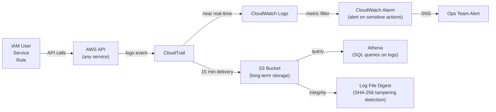

- AWS CloudTrail is a service that records all API calls made in your AWS account.
- This includes:

Who made the request (user, role, service)

What was requested (e.g., StartInstances)

When it was made

Where it came from (IP address, AWS region)

The response/result

- It captures both:

Management events (e.g., EC2 start/stop, IAM changes)

Data events (e.g., S3 object access, Lambda invokes)

# How Does It Work?

CloudTrail automatically records events across most AWS services.

You can create a trail, which is a configuration that tells CloudTrail to log events and deliver them to an S3 bucket.

Optionally, send logs to CloudWatch Logs, EventBridge, or third-party SIEM tools.


# Key Use Cases

✅ Security                             Auditing	Track changes to IAM, security groups, etc.
🔍 User Activity Tracking	            Know who did what, when, and from where
🕵️‍♂️ Incident Response	                Investigate breaches or suspicious activity
📜 Compliance	                        Required for compliance frameworks like PCI-DSS, HIPAA, ISO, etc.
📦 Resource Change History	            Identify when a resource was created, modified, or deleted
📈 Monitoring and Alerting	            Use with CloudWatch to trigger alerts on sensitive actions


# Key Features

Event History	View last 90 days of events in the console
Trails (Single/Multi-Region)	Automatically log events across regions
Data Events	Fine-grained logging for S3 and Lambda
Integration with CloudWatch Logs	For near real-time alerts and monitoring
Log File Integrity Validation	Detect tampering with logs (using SHA-256 digest files)
Organization Trails (AWS Org)	Log events across all accounts in an org centrally
Encryption with SSE-KMS	Secure logs with AWS KMS

# What is a Trail?

A trail is a CloudTrail configuration that:

Specifies where to deliver logs (S3 bucket)

Enables logging for management/data events

Can be configured per region or multi-region

You can have:

Event history (default, no config needed): View recent 90 days in console

Trail (configured): Send to S3, CloudWatch, etc., for long-term auditing


# How to Use CloudTrail (Step-by-Step)

- View recent activity (no setup needed)
Go to AWS Console > CloudTrail > Event History

See events for last 90 days (filter by user, event type, service, etc.)

- Create a Trail (for long-term logging)
Go to AWS CloudTrail > Trails

Click Create Trail

Choose:

Trail name

S3 bucket to store logs (create new or use existing)

Enable for all regions (recommended)

Optionally send logs to CloudWatch Logs

Choose events to log:

Management events

Data events (for S3, Lambda, etc.)

Insight events (for unusual activity detection)

Save

✅ Now CloudTrail will start delivering logs to your S3 bucket.


#  Tools to Use with CloudTrail
Amazon Athena – Query CloudTrail logs in S3

AWS Config – Track configuration changes (complement CloudTrail)

CloudWatch Alarms – Alert on specific events (e.g., DeleteBucket)

Amazon Detective – Investigate activity across services

AWS Security Hub – Centralized security findings

---

## CloudTrail Architecture



## Event Types

| Type | Examples | Cost |
|------|---------|------|
| **Management events** | `CreateBucket`, `RunInstances`, `DeleteUser` | Free (first copy of each trail) |
| **Data events** | S3 object reads/writes, Lambda invocations | $0.10/100k events |
| **Insight events** | Unusual API activity patterns | $0.35/100k write mgmt events |

## Security Alerts — CloudWatch Metric Filters

```bash
# Create metric filter for root account usage (critical!)
aws logs put-metric-filter \
  --log-group-name CloudTrail/MyOrg \
  --filter-name RootAccountUsage \
  --filter-pattern '{ $.userIdentity.type = "Root" && $.userIdentity.invokedBy NOT EXISTS && $.eventType != "AwsServiceEvent" }' \
  --metric-transformations '[{
    "metricName": "RootAccountUsageCount",
    "metricNamespace": "CISBenchmark",
    "metricValue": "1"
  }]'

# Alert on: Unauthorized API calls
# Filter: { $.errorCode = "AccessDenied" }

# Alert on: Security group changes
# Filter: { $.eventName = "AuthorizeSecurityGroupIngress" || $.eventName = "RevokeSecurityGroupIngress" }

# Alert on: IAM policy changes
# Filter: { $.eventName = "CreatePolicy" || $.eventName = "AttachRolePolicy" }

# Alert on: CloudTrail itself being stopped!
# Filter: { $.eventName = "StopLogging" }
```

## Querying CloudTrail with Athena

```sql
-- Create Athena table over CloudTrail S3 logs
CREATE EXTERNAL TABLE cloudtrail_logs (
    eventVersion STRING,
    userIdentity STRUCT<type:STRING,principalId:STRING,arn:STRING,accountId:STRING>,
    eventTime STRING,
    eventSource STRING,
    eventName STRING,
    awsRegion STRING,
    sourceIPAddress STRING,
    requestParameters STRING,
    responseElements STRING,
    errorCode STRING,
    errorMessage STRING
)
ROW FORMAT SERDE 'com.amazon.emr.hive.serde.CloudTrailSerde'
STORED AS INPUTFORMAT 'com.amazon.emr.cloudtrail.CloudTrailInputFormat'
OUTPUTFORMAT 'org.apache.hadoop.hive.ql.io.HiveIgnoreKeyTextOutputFormat'
LOCATION 's3://my-cloudtrail-bucket/AWSLogs/123456789/CloudTrail/';

-- Who deleted an S3 bucket?
SELECT eventTime, userIdentity.arn, sourceIPAddress, requestParameters
FROM cloudtrail_logs
WHERE eventName = 'DeleteBucket'
  AND eventTime BETWEEN '2026-06-15T00:00:00Z' AND '2026-06-16T00:00:00Z'
ORDER BY eventTime DESC;

-- All IAM changes in last 24 hours
SELECT eventTime, eventName, userIdentity.arn, requestParameters
FROM cloudtrail_logs
WHERE eventSource = 'iam.amazonaws.com'
  AND eventTime > date_add('hour', -24, now())
ORDER BY eventTime DESC;

-- Find who made unauthorized calls (potential security incident)
SELECT sourceIPAddress, userIdentity.arn, eventName, COUNT(*) as attempts
FROM cloudtrail_logs
WHERE errorCode = 'AccessDenied'
  AND eventTime > date_add('hour', -24, now())
GROUP BY sourceIPAddress, userIdentity.arn, eventName
ORDER BY attempts DESC
LIMIT 20;
```

## Organization Trail

```bash
# Create org-wide trail (logs ALL accounts in the organization)
aws cloudtrail create-trail \
  --name org-wide-trail \
  --s3-bucket-name org-cloudtrail-central \
  --is-organization-trail \
  --is-multi-region-trail \
  --enable-log-file-validation   # SHA-256 tamper detection

# Protect trail from modification (attach SCP)
# SCP: Deny cloudtrail:DeleteTrail, cloudtrail:StopLogging to all accounts
```

## Log File Integrity Validation

```bash
# Validate that log files haven't been tampered with
aws cloudtrail validate-logs \
  --trail-arn arn:aws:cloudtrail:us-east-1:123:trail/my-trail \
  --start-time 2026-06-15T00:00:00Z \
  --end-time 2026-06-16T00:00:00Z

# Output: 
# Logs in s3://my-bucket/... are VALID (SHA-256 digest matches)
```

## Common Interview Questions

**Q: CloudTrail vs CloudWatch — what's the difference?**
CloudTrail: records every API call made to AWS services — who did what, when, from where. Answers "who deleted that S3 bucket?" It's an audit trail, not metrics. CloudWatch: monitors resource metrics (CPU, memory, custom), logs, and alarms. Answers "is my application healthy?" They're complementary: CloudTrail events → CloudWatch Logs metric filters → CloudWatch Alarms → alerts.

**Q: How do you detect unauthorized access using CloudTrail?**
(1) Create CloudWatch metric filter for `errorCode = "AccessDenied"` → alarm when many unauthorized calls from same IP in 5 minutes (brute force indicator). (2) Create filter for root account usage (should be near-zero). (3) Create filter for IAM changes (policy attachments, new users). (4) Use GuardDuty — it analyzes CloudTrail, VPC Flow Logs, and DNS logs with ML to detect anomalies automatically. (5) Query Athena on incidents for forensics.

**Q: Can someone disable CloudTrail to cover their tracks?**
Technically yes if they have IAM permissions. Defense: (1) SCP in AWS Organizations denying `cloudtrail:DeleteTrail` and `cloudtrail:StopLogging` for all member accounts. (2) CloudWatch alarm + SNS alert for `StopLogging` API call. (3) IAM permissions boundary preventing even admin users from modifying trails. The alert on trail modification is the most important compensating control.
