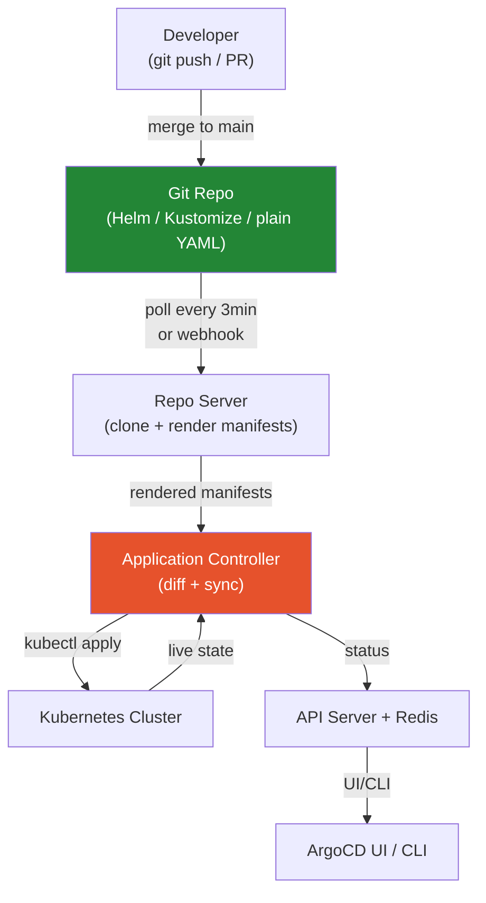

# ArgoCD — Complete Reference

> GitOps continuous delivery tool for Kubernetes. Git is the single source of truth — ArgoCD continuously reconciles the cluster state with what's declared in Git. Runs inside the cluster and **pulls** from Git; CI systems never push directly to the cluster.

---

## What is GitOps?

GitOps = Git as the sole source of truth for infrastructure and application config. No one `kubectl apply`s directly to production. Every change goes through a PR → merge → automatic sync.

**The four GitOps principles:**
1. **Declarative** — the entire system state is expressed declaratively (YAML in Git)
2. **Versioned** — Git provides version history, auditability, and rollback
3. **Pulled automatically** — an agent inside the cluster polls/receives Git changes (not CI pushing)
4. **Continuously reconciled** — the agent continuously compares desired (Git) vs live (cluster) state and converges

**Pull model vs Push model:**

| | Push (traditional CI/CD) | Pull (GitOps / ArgoCD) |
|---|---|---|
| Who deploys | CI system pushes to cluster | ArgoCD inside cluster pulls from Git |
| Cluster credentials in | CI secrets | Not needed in CI — ArgoCD runs in-cluster |
| Drift detection | None — CI only runs on commit | Continuous — ArgoCD re-syncs drifted state |
| Auditability | CI logs (ephemeral) | Git history (permanent, PR-traceable) |

---

## Architecture — ArgoCD Components



**Component responsibilities:**

| Component | Role |
|-----------|------|
| **Repo Server** | Clones Git repos; renders Helm/Kustomize/plain YAML into Kubernetes manifests; caches rendered output in Redis |
| **Application Controller** | The reconciliation engine; compares rendered desired state (from Repo Server) with live cluster state; triggers syncs; updates Application status |
| **API Server** | REST/gRPC API; serves the UI and CLI; enforces RBAC; manages SSO; stateless |
| **Redis** | Caches rendered manifests and live cluster state to reduce API server load |
| **Dex** | (Optional) OIDC identity provider for SSO integration (GitHub, Google, LDAP) |

---

## Application CRD — The Core Object

```yaml
apiVersion: argoproj.io/v1alpha1
kind: Application
metadata:
  name: my-app
  namespace: argocd                  # Applications always live in argocd namespace
spec:
  project: team-platform             # AppProject for RBAC isolation

  source:
    repoURL: https://github.com/org/my-app
    targetRevision: main             # branch, tag, or commit SHA
    path: k8s/overlays/production    # path within the repo

  destination:
    server: https://kubernetes.default.svc  # in-cluster target
    namespace: my-app-prod

  syncPolicy:
    automated:
      prune: true        # delete resources that were removed from Git
      selfHeal: true     # revert manual kubectl changes automatically
    syncOptions:
      - CreateNamespace=true         # create destination namespace if missing
      - ServerSideApply=true         # use server-side apply (handles large CRDs)
      - RespectIgnoreDifferences=true
    retry:
      limit: 5
      backoff:
        duration: 5s
        factor: 2
        maxDuration: 3m

  ignoreDifferences:                 # fields ArgoCD should ignore during diff
    - group: apps
      kind: Deployment
      jsonPointers:
        - /spec/replicas             # ignore replica count (managed by HPA)
```

---

## Sync Status vs Health Status

ArgoCD tracks two orthogonal states:

**Sync Status** — is Git = cluster?
| Status | Meaning |
|--------|---------|
| `Synced` | Cluster matches Git exactly |
| `OutOfSync` | Cluster differs from Git (drift, new commit, or resource added outside ArgoCD) |
| `Unknown` | ArgoCD can't determine state |

**Health Status** — are K8s resources healthy?
| Status | Meaning |
|--------|---------|
| `Healthy` | All resources are running and ready |
| `Progressing` | Rolling update in progress (Deployment rolling out) |
| `Degraded` | Resources are failing (CrashLoopBackOff, Pod not ready) |
| `Suspended` | Deliberately paused (e.g. CronJob suspended) |
| `Missing` | Resource doesn't exist in cluster |

**Common pattern — OutOfSync but Healthy:** Someone ran `kubectl edit` on a Deployment, changing a non-critical annotation. ArgoCD sees drift (OutOfSync) but the app is healthy. `selfHeal: true` would revert this automatically.

---

## Sync Policies — Automated vs Manual

```yaml
# Manual sync (default — no syncPolicy.automated)
# Operator must click "Sync" in UI or run: argocd app sync my-app

# Automated sync
syncPolicy:
  automated:
    prune: true       # delete resources removed from Git (DANGEROUS without testing)
    selfHeal: true    # revert direct kubectl changes (essential for GitOps compliance)

# Automated with prune=false (safer default):
# New resources auto-synced; removed resources NOT auto-deleted (manual cleanup)

# Manual sync with specific revision:
argocd app sync my-app --revision v1.2.3
argocd app sync my-app --dry-run    # preview what would change (no apply)
argocd app sync my-app --force      # replace resources (not just patch)
```

**Sync windows — block syncs during maintenance:**
```yaml
apiVersion: argoproj.io/v1alpha1
kind: AppProject
spec:
  syncWindows:
    - kind: allow
      schedule: "0 9 * * MON-FRI"  # allow syncs 9am Mon-Fri only
      duration: 8h
      applications: ["*"]
      namespaces: ["production"]
    - kind: deny
      schedule: "0 22 * * *"        # deny syncs after 10pm
      duration: 6h
```

---

## Sync Waves & Hooks — Ordering Resource Creation

**Sync waves** — numeric order; ArgoCD waits for all resources in wave N to be healthy before starting N+1:

```yaml
# Wave -1: infrastructure first (namespaces, ConfigMaps, PVCs)
metadata:
  annotations:
    argocd.argoproj.io/sync-wave: "-1"

# Wave 0 (default): application Deployment
metadata:
  annotations:
    argocd.argoproj.io/sync-wave: "0"

# Wave 1: after app is up (Ingress, HPA rules)
metadata:
  annotations:
    argocd.argoproj.io/sync-wave: "1"
```

**Hooks** — Jobs that run at lifecycle points:

```yaml
apiVersion: batch/v1
kind: Job
metadata:
  name: db-migration
  annotations:
    argocd.argoproj.io/hook: PreSync              # runs BEFORE sync
    argocd.argoproj.io/hook-delete-policy: HookSucceeded  # clean up if successful
spec:
  template:
    spec:
      restartPolicy: Never
      containers:
        - name: migrate
          image: my-app:v1.2.3
          command: ["./migrate.sh"]
```

| Hook | When it runs | Use case |
|------|------|------|
| `PreSync` | Before sync begins | DB migrations, pre-flight checks |
| `Sync` | During sync (alongside resources) | Custom resource creation ordering |
| `PostSync` | After all resources are healthy | Smoke tests, notifications |
| `SyncFail` | If sync fails | Rollback jobs, alerting |
| `Skip` | Never (skips the resource during sync) | Disabling a resource temporarily |

---

## App of Apps Pattern

A parent Application manages child Application objects — bootstraps an entire cluster from Git:

```yaml
# Root application — manages all other applications
apiVersion: argoproj.io/v1alpha1
kind: Application
metadata:
  name: root-app
  namespace: argocd
spec:
  source:
    repoURL: https://github.com/org/gitops
    targetRevision: main
    path: apps/                      # directory containing Application YAML files
  destination:
    server: https://kubernetes.default.svc
    namespace: argocd               # Applications themselves go to argocd namespace

---
# apps/payments.yaml — a child Application
apiVersion: argoproj.io/v1alpha1
kind: Application
metadata:
  name: payments-service
  namespace: argocd
spec:
  source:
    path: services/payments/overlays/production
  destination:
    namespace: payments-prod
```

**Problem with App of Apps:** Every child Application YAML must be manually created and maintained. ApplicationSet was created to solve this.

---

## ApplicationSet — Dynamic Application Generation

Generates many Applications from one template using generators:

```yaml
apiVersion: argoproj.io/v1alpha1
kind: ApplicationSet
metadata:
  name: team-apps
  namespace: argocd
spec:
  generators:
    # Git generator — one App per matching directory in repo
    - git:
        repoURL: https://github.com/org/gitops
        revision: main
        directories:
          - path: apps/*/overlays/production

    # List generator — explicit list of environments
    - list:
        elements:
          - cluster: staging
            url: https://staging.k8s.example.com
          - cluster: production
            url: https://prod.k8s.example.com

    # Cluster generator — one App per registered ArgoCD cluster
    - clusters:
        selector:
          matchLabels:
            environment: production

    # Matrix generator — cartesian product of two generators
    - matrix:
        generators:
          - git:
              directories: [{path: "apps/*"}]
          - clusters:
              selector:
                matchLabels:
                  environment: staging

  template:
    metadata:
      name: '{{path.basename}}'     # folder name becomes app name
    spec:
      project: default
      source:
        repoURL: https://github.com/org/gitops
        targetRevision: main
        path: '{{path}}'
      destination:
        server: https://kubernetes.default.svc
        namespace: '{{path.basename}}'
      syncPolicy:
        automated:
          selfHeal: true
          prune: true
```

**ApplicationSet vs App of Apps:**
- App of Apps: static — you write and maintain each Application YAML manually
- ApplicationSet: dynamic — one template generates N Applications automatically, scales with no additional YAML maintenance

---

## AppProject — RBAC Isolation

Projects isolate teams from each other — which repos they can deploy from, which clusters/namespaces they can deploy to, which resource types they can manage:

```yaml
apiVersion: argoproj.io/v1alpha1
kind: AppProject
metadata:
  name: team-payments
  namespace: argocd
spec:
  # Which Git repos can source code come from?
  sourceRepos:
    - https://github.com/org/payments-service
    - https://charts.helm.sh/stable    # Helm chart repos allowed

  # Which clusters/namespaces can be deployed to?
  destinations:
    - namespace: payments-*           # wildcard namespace match
      server: https://kubernetes.default.svc

  # Which Kubernetes resource types are allowed?
  clusterResourceWhitelist:
    - group: ""
      kind: Namespace                 # only allow creating Namespaces at cluster level
  namespaceResourceBlacklist:
    - group: ""
      kind: ResourceQuota             # prevent team from removing quota limits

  # Project-level RBAC (roles within the project)
  roles:
    - name: developers
      policies:
        - p, proj:team-payments:developers, applications, get, team-payments/*, allow
        - p, proj:team-payments:developers, applications, sync, team-payments/*, allow
      groups:
        - payments-team               # maps to SSO group
```

---

## Secrets in GitOps — Never Commit Plaintext

| Approach | How | Pros | Cons |
|----------|-----|------|------|
| **External Secrets Operator (ESO)** | `ExternalSecret` CRD syncs from AWS Secrets Manager / Vault → K8s Secret | Provider-agnostic; secret never in Git | Requires ESO operator deployed |
| **Sealed Secrets** | Encrypt K8s Secret with cluster's public key; commit encrypted `SealedSecret` to Git | Encrypted secret IS in Git (version controlled) | Cluster-specific encryption key; rotation is hard |
| **SOPS + Helm Secrets** | Encrypt individual values in `values.yaml` with KMS/GPG | Works with existing Helm charts | Adds SOPS plugin dependency |
| **Vault Agent Injector** | Vault sidecar injects secrets as files/env vars at pod start | Central secret management; dynamic secrets | Vault dependency; sidecar resource overhead |
| **ArgoCD Vault Plugin** | ArgoCD plugin renders `<path:secret/data/myapp#key>` placeholders with Vault values | No sidecar needed | Plugin maintenance |

```yaml
# External Secrets Operator example
apiVersion: external-secrets.io/v1beta1
kind: ExternalSecret
metadata:
  name: db-credentials
spec:
  refreshInterval: 1h
  secretStoreRef:
    name: aws-secrets-manager
    kind: ClusterSecretStore
  target:
    name: db-credentials             # creates this K8s Secret
  data:
    - secretKey: DB_PASSWORD
      remoteRef:
        key: production/myapp/db
        property: password
```

---

## Multi-Cluster Management

ArgoCD can manage multiple clusters from a single control plane:

```bash
# Add a remote cluster (ArgoCD creates a ServiceAccount in the target cluster)
argocd cluster add my-production-context     # uses current kubeconfig context
argocd cluster list                          # list all registered clusters

# ArgoCD installs a ServiceAccount in kube-system of the target cluster
# and stores the token in a Secret in the argocd namespace
```

```yaml
# Deploy to a remote cluster
spec:
  destination:
    server: https://my-production-cluster.example.com   # registered cluster URL
    namespace: my-app
```

**Multi-cluster topologies:**
- **Hub-and-spoke:** one ArgoCD in a management cluster controls all app clusters — most common
- **Standalone per cluster:** one ArgoCD per cluster — more operational overhead, better blast radius isolation
- **Hierarchical:** ArgoCD instances manage each other

---

## Argo Rollouts — Progressive Delivery

```yaml
apiVersion: argoproj.io/v1alpha1
kind: Rollout
metadata:
  name: my-app
spec:
  replicas: 10
  strategy:
    canary:
      steps:
        - setWeight: 10             # send 10% of traffic to new version
        - pause: {duration: 10m}   # wait 10 min
        - setWeight: 30
        - pause: {}                # wait for manual approval or analysis
        - setWeight: 60
        - pause: {duration: 5m}
        - setWeight: 100           # full rollout
      analysis:
        templates:
          - templateName: success-rate    # auto-rollback if error rate spikes
        startingStep: 2                   # start analysis after step 2
        args:
          - name: service-name
            value: my-app-canary

---
# Blue-Green strategy
spec:
  strategy:
    blueGreen:
      activeService: my-app-active        # current production traffic
      previewService: my-app-preview      # new version traffic for testing
      autoPromotionEnabled: false         # require manual promotion
      scaleDownDelaySeconds: 30           # wait before removing old version

---
# AnalysisTemplate — defines success criteria
apiVersion: argoproj.io/v1alpha1
kind: AnalysisTemplate
metadata:
  name: success-rate
spec:
  metrics:
    - name: success-rate
      interval: 1m
      successCondition: result[0] >= 0.95    # 95% success rate required
      failureLimit: 3
      provider:
        prometheus:
          address: http://prometheus:9090
          query: |
            sum(rate(http_requests_total{status!~"5.."}[5m])) /
            sum(rate(http_requests_total[5m]))
```

---

## ArgoCD CLI — Common Commands

```bash
# ─── Login ───────────────────────────────────────────────────────
argocd login argocd.example.com --sso         # SSO login
argocd login argocd.example.com \
  --username admin \
  --password $(kubectl -n argocd get secret argocd-initial-admin-secret \
               -o jsonpath="{.data.password}" | base64 -d)

# ─── App management ──────────────────────────────────────────────
argocd app list                               # list all apps
argocd app get my-app                         # detailed status + diff summary
argocd app diff my-app                        # show exact diff (Git vs cluster)
argocd app sync my-app                        # trigger sync immediately
argocd app sync my-app --dry-run              # preview changes without applying
argocd app sync my-app --revision v1.2.3      # sync to specific git revision
argocd app sync my-app --force                # replace instead of patch (for immutable field changes)
argocd app sync my-app --prune               # sync and also prune removed resources

# ─── Rollback ────────────────────────────────────────────────────
argocd app history my-app                     # list all deployment history
argocd app rollback my-app 3                  # roll back to history ID 3
# NOTE: rollback creates an OutOfSync state (cluster doesn't match current Git HEAD)

# ─── App CRUD ────────────────────────────────────────────────────
argocd app create my-app \
  --repo https://github.com/org/my-app \
  --path k8s/overlays/production \
  --dest-server https://kubernetes.default.svc \
  --dest-namespace my-app-prod \
  --sync-policy automated \
  --auto-prune \
  --self-heal

argocd app delete my-app                      # delete app (leaves K8s resources)
argocd app delete my-app --cascade            # delete app + all K8s resources it manages

# ─── Repo & cluster management ───────────────────────────────────
argocd repo add https://github.com/org/private-repo \
  --username git \
  --password $GITHUB_TOKEN

argocd cluster add my-context                 # register a cluster
argocd cluster list                           # list registered clusters

# ─── Project management ──────────────────────────────────────────
argocd proj list
argocd proj create team-payments --dest '*,*' --src '*'

# ─── Admin ───────────────────────────────────────────────────────
argocd admin initial-password -n argocd       # show initial admin password
argocd admin settings validate --argocd-cm-path argocd-cm.yaml
```

---

## ArgoCD RBAC — Access Control

```yaml
# argocd-rbac-cm ConfigMap
apiVersion: v1
kind: ConfigMap
metadata:
  name: argocd-rbac-cm
  namespace: argocd
data:
  policy.default: role:readonly    # default role for authenticated users

  policy.csv: |
    # Format: p, <role>, <resource>, <action>, <object>, allow/deny
    # Format: g, <user/group>, <role>

    # Built-in roles: role:admin, role:readonly

    # Custom role — can sync but not delete
    p, role:developer, applications, get, */*, allow
    p, role:developer, applications, sync, */*, allow
    p, role:developer, applications, override, */*, allow

    # Map SSO group to role
    g, org:engineering, role:developer

    # Project-scoped role
    p, role:payments-deployer, applications, sync, team-payments/*, allow
    g, payments-team, role:payments-deployer

  # Scope to read from SSO groups
  scopes: "[groups]"
```

---

## Troubleshooting ArgoCD

```bash
# ─── App stuck OutOfSync ─────────────────────────────────────────
argocd app diff my-app               # see what's different
argocd app sync my-app --force       # if diff is a legitimate immutable field change

# Check if the diff is expected (should be in ignoreDifferences):
# e.g. HPA controlling replicas → add /spec/replicas to ignoreDifferences

# ─── App stuck Progressing ───────────────────────────────────────
kubectl get pods -n my-app-prod      # check pod status
kubectl describe deploy -n my-app-prod my-app  # check events for rollout issue
argocd app get my-app --refresh      # force re-check of cluster state

# ─── Repo Server can't clone repo ────────────────────────────────
kubectl logs -n argocd -l app.kubernetes.io/name=argocd-repo-server
# Common: SSH key not configured, Git token expired, private repo missing creds
argocd repo list                     # check repo connection status

# ─── Application Controller errors ──────────────────────────────
kubectl logs -n argocd -l app.kubernetes.io/name=argocd-application-controller
# Common: RBAC insufficient permissions to apply certain resource types

# ─── Hard reset — delete and recreate app ────────────────────────
argocd app delete my-app             # keeps K8s resources
argocd app create ...                # recreate the Application

# ─── Refresh cache ───────────────────────────────────────────────
argocd app get my-app --hard-refresh  # force re-clone and re-render from Git

# ─── Check webhook delivery ──────────────────────────────────────
# Go to GitHub repo Settings → Webhooks → check delivery status
# ArgoCD webhook endpoint: https://argocd.example.com/api/webhook
```

---

## Interview Q&A

**Q: What is ArgoCD and why do teams use it?**
ArgoCD is a GitOps-based continuous delivery tool for Kubernetes. It runs inside the cluster as a controller that continuously watches a Git repository and reconciles the cluster state with what's declared in Git. Teams use it because: (1) Git becomes the audit trail for every deployment — every change is a PR with review, approval, and authorship; (2) drift detection — if someone manually `kubectl applies` a change, ArgoCD detects and reverts it; (3) rollback is just `git revert`; (4) no cluster credentials in CI pipelines — ArgoCD is in-cluster.

**Q: App of Apps vs ApplicationSet — which do you use and when?**
App of Apps: a parent Application points to a directory of Application YAML files. Every new service requires manually creating and committing another Application YAML. It works but doesn't scale — with 50 services, maintaining 50 Application YAMLs becomes a chore. ApplicationSet solves this with generators: a Git directory generator automatically creates one Application per matching path in the repo — no Application YAML needed per service. ApplicationSet supersedes App of Apps for any setup with many similar applications. Use App of Apps only if you need fine-grained control over individual application specs that doesn't fit a template.

**Q: How do sync waves work, and why would you use them?**
Sync waves are numeric annotations on resources (`argocd.argoproj.io/sync-wave: "N"`). ArgoCD applies resources in ascending order — it waits for all resources in wave N to be healthy before applying wave N+1. You use them to enforce ordering: namespace and ConfigMaps at wave -1, database migrations as a PreSync hook, the main application at wave 0, and smoke test Jobs at PostSync. Without waves, all resources are applied simultaneously, and a Deployment that starts before its ConfigMap exists will crash-loop unnecessarily.

**Q: How do you handle secrets in a GitOps workflow?**
You never commit plaintext secrets to Git. The standard approaches: External Secrets Operator (ESO) — commit an ExternalSecret CRD that references a path in AWS Secrets Manager or Vault; ESO syncs the actual secret value into a K8s Secret. The ExternalSecret object (not the value) is what's in Git. Alternative: Sealed Secrets — encrypt the K8s Secret with the cluster's public key and commit the SealedSecret to Git; only the cluster can decrypt it. The tradeoff is Sealed Secrets are cluster-specific (can't use the same sealed secret on a different cluster without re-encrypting).

**Q: What happens when ArgoCD detects a diff between Git and the cluster?**
ArgoCD marks the app `OutOfSync`. If `automated.selfHeal: true` is set, it immediately triggers a sync to bring the cluster back to the Git state — this happens within ~3 minutes (default poll interval) or instantly if a webhook is configured. If not automated, it just reports OutOfSync and waits for a manual sync. This is how GitOps enforces immutability — even if an operator runs `kubectl edit`, ArgoCD will revert it. This is why you disable selfHeal for resources managed by external systems (like HPA modifying replica count) by adding them to `ignoreDifferences`.

**Q: ArgoCD app is stuck Progressing. How do you diagnose it?**
`argocd app get my-app` shows which resources are in Progressing state. For a Deployment, this means the rollout is not completing — `kubectl get pods -n <namespace>` shows pods in a non-Ready state. `kubectl describe pod <pod>` shows events: image pull error, OOMKilled, readiness probe failing, etc. If it's a health check issue in ArgoCD itself (it thinks the Deployment is unhealthy when it's not), you can customize resource health checks in ArgoCD's ConfigMap. If the rollout genuinely never finishes, check if `minReadySeconds` or a PodDisruptionBudget is blocking progress.

**Q: How would you implement a canary deployment with ArgoCD?**
Use Argo Rollouts alongside ArgoCD. Instead of a standard Deployment, define a Rollout resource with a canary strategy: weight steps (10% → 30% → 100%), pause steps for manual approval or time delays, and an AnalysisTemplate that queries Prometheus for error rate. ArgoCD syncs the Rollout object from Git; Argo Rollouts controller manages the actual pod split and traffic weights (via the Service or a supported ingress controller like NGINX or Istio). If the analysis fails, Rollouts automatically rolls back to the previous version.
