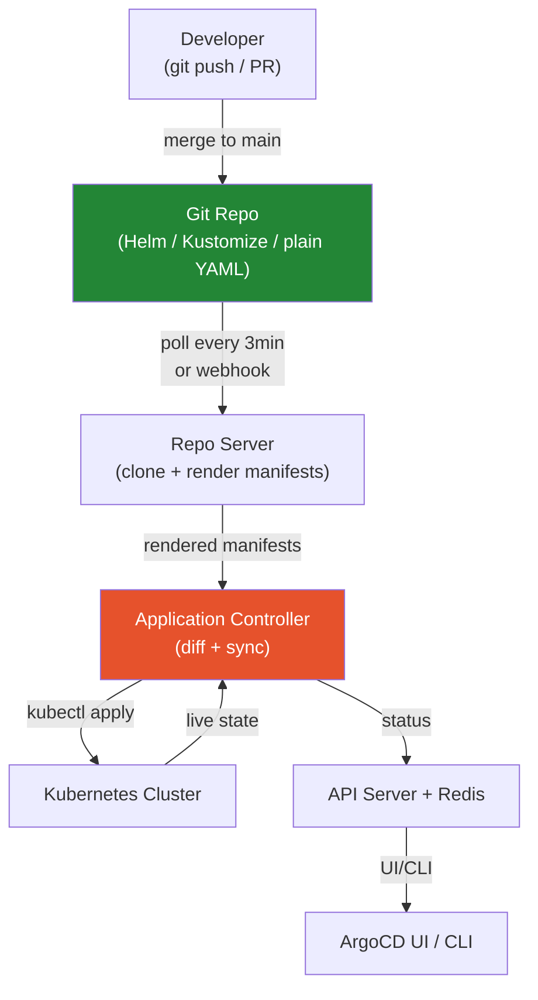

# ArgoCD

> GitOps continuous delivery tool for Kubernetes. Git is the single source of truth — ArgoCD continuously reconciles the cluster state with what's declared in Git.

## What is GitOps?

GitOps = Git as the sole source of truth for infrastructure and application config. No one `kubectl apply`s directly to production. Every change goes through a PR → merge → automatic sync.

**Pull model:** ArgoCD runs _inside_ the cluster and pulls from Git. CI doesn't push to the cluster — more secure (no kubectl credentials in CI).

## Architecture



## Application CRD

```yaml
apiVersion: argoproj.io/v1alpha1
kind: Application
metadata:
  name: my-app
  namespace: argocd
spec:
  project: team-platform
  source:
    repoURL: https://github.com/org/my-app
    targetRevision: main
    path: k8s/overlays/production
  destination:
    server: https://kubernetes.default.svc
    namespace: my-app-prod
  syncPolicy:
    automated:
      prune: true        # delete resources removed from Git
      selfHeal: true     # revert manual kubectl changes
    syncOptions:
      - CreateNamespace=true
    retry:
      limit: 5
      backoff:
        duration: 5s
        factor: 2
        maxDuration: 3m
```

## Sync Policies

| Policy | Behavior |
|--------|----------|
| **Manual** | Operator clicks "Sync" or runs `argocd app sync` |
| **Automated** | Syncs whenever Git changes (poll every 3 min or via webhook) |
| **selfHeal: true** | Reverts direct `kubectl` changes |
| **prune: true** | Deletes resources removed from Git |

## Sync Waves & Hooks

Control the **order** of resource creation:

```yaml
# Wave -1: namespace and ConfigMaps first
metadata:
  annotations:
    argocd.argoproj.io/sync-wave: "-1"

# Wave 1: application after DB
metadata:
  annotations:
    argocd.argoproj.io/sync-wave: "1"
```

**Hooks** run at specific lifecycle points:

```yaml
apiVersion: batch/v1
kind: Job
metadata:
  name: db-migration
  annotations:
    argocd.argoproj.io/hook: PreSync
    argocd.argoproj.io/hook-delete-policy: HookSucceeded
spec:
  template:
    spec:
      containers:
        - name: migrate
          image: my-app:v1.2.3
          command: ["./migrate.sh"]
```

| Hook | When |
|------|------|
| `PreSync` | Before sync (DB migrations) |
| `Sync` | During sync |
| `PostSync` | After all resources healthy (smoke tests) |
| `SyncFail` | If sync fails (rollback/alert) |

## App of Apps Pattern

A parent Application manages child Application objects — bootstraps a cluster:

```yaml
spec:
  source:
    path: apps/   # directory of Application YAML files
  destination:
    namespace: argocd
```

## ApplicationSet — Dynamic Generation

Generates many Applications from one template:

```yaml
apiVersion: argoproj.io/v1alpha1
kind: ApplicationSet
metadata:
  name: team-apps
spec:
  generators:
    - git:
        repoURL: https://github.com/org/gitops
        revision: main
        directories:
          - path: apps/*/overlays/production
  template:
    metadata:
      name: '{{path.basename}}'
    spec:
      project: default
      source:
        repoURL: https://github.com/org/gitops
        targetRevision: main
        path: '{{path}}'
      destination:
        server: https://kubernetes.default.svc
        namespace: '{{path.basename}}'
      syncPolicy:
        automated:
          selfHeal: true
```

## AppProject — RBAC Isolation

```yaml
apiVersion: argoproj.io/v1alpha1
kind: AppProject
metadata:
  name: team-payments
spec:
  sourceRepos:
    - https://github.com/org/payments-service
  destinations:
    - namespace: payments-*
      server: https://kubernetes.default.svc
```

## Secrets in GitOps

| Approach | How |
|----------|-----|
| **External Secrets Operator** | ExternalSecret CRD syncs from AWS Secrets Manager → K8s Secret |
| **Sealed Secrets** | Encrypt Secret in repo; controller decrypts |
| **SOPS + Helm Secrets** | Encrypt values.yaml fields with KMS/GPG |
| **Vault Agent Injector** | Vault sidecar injects secrets at pod start |

## Argo Rollouts — Canary Deploys

```yaml
strategy:
  canary:
    steps:
      - setWeight: 10      # 10% traffic to new version
      - pause: {duration: 10m}
      - setWeight: 50
      - pause: {duration: 10m}
      - setWeight: 100
    analysis:
      templates:
        - templateName: success-rate   # auto-rollback if error rate spikes
```

## Common Interview Questions

**Q: ArgoCD vs Flux — which would you choose?**
ArgoCD: better UI, App/AppProject CRD model, mature RBAC — good for teams needing visibility. Flux: CNCF project, more modular, better image automation. ArgoCD is more commonly asked in interviews. Both are production-grade.

**Q: App of Apps vs ApplicationSet?**
App of Apps: a parent Application points to Application YAML files — requires manual maintenance per app. ApplicationSet uses generators to dynamically create Applications — scales better, no repetition. ApplicationSet supersedes App of Apps.

**Q: How do sync waves work?**
Wave numbers are sorted numerically (lower first). ArgoCD waits for all resources in wave N to be healthy before starting wave N+1. Common pattern: ConfigMaps at -2, DB migrations at -1, app at 0, smoke test at PostSync.

**Q: How do you handle secrets in GitOps?**
External Secrets Operator (ESO): define ExternalSecret CRD referencing AWS Secrets Manager — ESO syncs into K8s Secret. The ExternalSecret (not the value) is safe to commit. Alternative: Sealed Secrets (encrypted secrets in Git, cluster-specific decryption).
