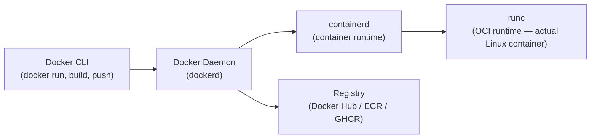

# Docker — Complete Reference

> Docker is an open platform for building, shipping, and running containerized applications. It packages an app with all its dependencies into a portable, isolated unit called a **container** — same behavior on a laptop, in CI, and in production. Based on Linux namespaces and cgroups; a container manager does lightweight virtualisation where host and guest systems share the same kernel.

---

## Architecture — How Docker Actually Works



**Component breakdown:**
- **Docker CLI** — client binary you interact with; sends commands to dockerd via Unix socket `/var/run/docker.sock`
- **dockerd** — daemon that manages images, containers, volumes, networks; delegates actual container running to containerd
- **containerd** — industry-standard container runtime (CNCF); manages container lifecycle (create, start, stop, destroy); also used directly by Kubernetes (no dockerd involved in prod K8s)
- **runc** — low-level OCI runtime; the thing that actually calls `clone()` and `unshare()` to create Linux namespaces; spawns the container process
- **Registry** — stores and distributes images; Docker Hub is the default; ECR, GHCR, GCR in enterprise

---

## Linux Internals — What Makes Containers Work

| Technology | What Docker uses it for |
|-----------|------------------------|
| **Namespaces** | Isolation: PID (process tree), Network (own stack), Mount (own filesystem), UTS (hostname), IPC, User |
| **cgroups v2** | Resource limits: CPU, memory, disk I/O per container — hard enforcement at kernel level |
| **Union FS (overlayfs)** | Layered image filesystem — shared base layers, only writes go to a writable top layer |
| **seccomp** | System call filtering — restrict what syscalls a container can make (Docker's default profile blocks ~44 dangerous syscalls) |
| **capabilities** | Fine-grained Linux privilege control — containers drop most capabilities by default instead of running full root |
| **AppArmor / SELinux** | MAC (mandatory access control) — kernel-enforced policy on what the container process can access |

**Namespace deep dive:**
```
When `docker run` executes, runc calls clone() with flags:
  CLONE_NEWPID   → container PID 1 is isolated; can't see host PIDs
  CLONE_NEWNET   → own network stack (eth0, lo, iptables rules)
  CLONE_NEWNS    → own mount table (/ is the image's filesystem)
  CLONE_NEWUTS   → own hostname (container name by default)
  CLONE_NEWIPC   → own IPC namespace (message queues, semaphores)

User namespaces (optional):
  CLONE_NEWUSER  → map container root (uid 0) to an unprivileged host UID
                   → rootless containers
```

---

## Image Layers & overlayfs — How Images Work on Disk

```
Image on disk (overlayfs layers):
┌─────────────────────────────────┐
│ Container write layer (rw)      │  ← only new/changed files go here
├─────────────────────────────────┤
│ Layer: COPY . .   (your code)   │  ← read-only image layer
├─────────────────────────────────┤
│ Layer: RUN npm install          │  ← read-only (node_modules)
├─────────────────────────────────┤
│ Layer: COPY package.json .      │  ← read-only
├─────────────────────────────────┤
│ Base: node:20-alpine            │  ← read-only, shared across containers
└─────────────────────────────────┘

overlayfs merges all read-only layers into a unified view.
Writes use Copy-on-Write: file is copied to the rw layer, then modified.
Multiple containers share the same read-only base layers — zero duplication.
```

**Why this matters:**
- `docker pull` only downloads layers you don't have — deduplication is automatic
- `docker build` caches each layer — unchanged instructions reuse cache without re-running
- 100 containers running the same image share one on-disk copy of the base layers
- Container's filesystem is ephemeral — stops or removes wipe the rw layer

---

## Dockerfile — Instruction Reference

```dockerfile
# ─── Core Instructions ───
FROM node:20-alpine AS base          # base image; AS name = multi-stage label
WORKDIR /app                         # set working dir (creates if not exists)
COPY package*.json ./                # copy from build context to container
ADD https://example.com/file.tar /   # ADD also unpacks tarballs and supports URLs
RUN npm ci --only=production         # execute command in new layer (cached)
ENV NODE_ENV=production              # set environment variable (persists to runtime)
ARG VERSION=1.0.0                    # build-time variable (not in final image, use for secrets)
EXPOSE 3000                          # documents intent; does NOT actually publish port
CMD ["node", "server.js"]           # default command (overrideable with docker run ...)
ENTRYPOINT ["node"]                  # fixed command; CMD becomes default args
LABEL version="1.0" maintainer="me" # metadata key-value pairs

# ─── File operations ───
COPY --chown=node:node . .           # copy with ownership (avoid chmod layer)
COPY --from=builder /app/dist /dist  # copy from another build stage

# ─── User ───
RUN addgroup -S app && adduser -S app -G app
USER app                             # switch to non-root; affects CMD/ENTRYPOINT

# ─── Health check ───
HEALTHCHECK --interval=30s --timeout=5s --retries=3 \
  CMD curl -f http://localhost:3000/health || exit 1

# ─── Volume ───
VOLUME ["/data"]                     # declares a mount point (docker will create volume)
```

---

## Dockerfile — Best Practices & Layer Ordering

```dockerfile
# ❌ BAD — COPY . . early → cache invalidated on every code change
FROM node:20-alpine
COPY . .
RUN npm install
CMD ["node", "server.js"]

# ✅ GOOD — deps first (changes rarely) → code last (changes often)
FROM node:20-alpine
WORKDIR /app
COPY package*.json ./          # only invalidates cache when deps change
RUN npm ci --only=production
COPY . .                       # code last → cache reused for npm install
CMD ["node", "server.js"]
```

**Golden rules:**
1. **Put things that change least first** — base image, package files, dependency install
2. **Put things that change most last** — your source code
3. **Combine RUN commands** that belong together — each `RUN` is a layer
   ```dockerfile
   # ❌ 3 layers, each with metadata overhead
   RUN apt-get update
   RUN apt-get install -y curl
   RUN rm -rf /var/lib/apt/lists/*

   # ✅ 1 layer
   RUN apt-get update && apt-get install -y curl && rm -rf /var/lib/apt/lists/*
   ```
4. **Use `.dockerignore`** to exclude `node_modules`, `.git`, build artifacts from the build context
5. **Never store secrets in Dockerfile** — ARG and ENV values are visible in `docker history`

---

## Multi-Stage Builds — Minimal Final Images

```dockerfile
# ─── Stage 1: Build ───────────────────────────────────────
FROM golang:1.22-alpine AS builder
WORKDIR /build
COPY go.mod go.sum ./
RUN go mod download                      # cache deps separately
COPY . .
RUN CGO_ENABLED=0 GOOS=linux \
    go build -ldflags="-s -w" -o server . # -s -w strips debug info → smaller binary

# ─── Stage 2: Final image ─────────────────────────────────
FROM scratch                             # empty base — minimal attack surface
COPY --from=builder /build/server /server
COPY --from=builder /etc/ssl/certs /etc/ssl/certs  # for HTTPS
EXPOSE 8080
ENTRYPOINT ["/server"]

# Result: ~800MB build stage → ~8MB final image
# No compiler, no Go toolchain, no shell in production image
```

**Common base images for final stage:**

| Base | Size | Use case |
|---|---|---|
| `scratch` | 0 bytes | Statically compiled Go/Rust binaries |
| `alpine` | ~5MB | Anything needing a shell/package manager |
| `distroless/static` | ~2MB | No shell, no package manager, but has CA certs |
| `distroless/base` | ~20MB | libc + CA certs — for dynamically-linked binaries |
| `ubi9-minimal` | ~100MB | RHEL-compatible; required for Red Hat certification |

---

## .dockerignore — Keeping Build Context Clean

```
# .dockerignore
node_modules/          # don't send local node_modules to daemon
.git/                  # git history not needed
*.md                   # docs not needed
.env                   # NEVER send secrets
dist/                  # local build artifacts
coverage/              # test coverage
**/*.test.js           # test files
Dockerfile*            # Dockerfile itself (convention)
docker-compose*.yml    # compose files
.github/               # CI config
```

**Why it matters:** The Docker daemon gets sent a "build context" (the directory you pass to `docker build`) over a socket. Without `.dockerignore`, large `node_modules` or `.git` directories inflate the context size — a 200MB `node_modules` makes every build stall for seconds before Docker even reads the first instruction.

---

## BuildKit — Modern Build Engine

BuildKit is Docker's default build engine since Docker 23.0. Enable explicitly:
```bash
DOCKER_BUILDKIT=1 docker build .
# or in daemon.json: { "features": { "buildkit": true } }
```

**Key BuildKit features:**

```dockerfile
# ── Secret mounting — doesn't appear in layers ──────────────────────────
# docker build --secret id=npm_token,src=$HOME/.npmrc .
RUN --mount=type=secret,id=npm_token \
    NPM_TOKEN=$(cat /run/secrets/npm_token) npm install

# ── Cache mounts — persist between builds ───────────────────────────────
RUN --mount=type=cache,target=/root/.cache/pip \
    pip install -r requirements.txt
# pip cache persists across builds → only downloads changed packages

# ── SSH forwarding — use host SSH keys during build ─────────────────────
# docker build --ssh default .
RUN --mount=type=ssh \
    git clone git@github.com:org/private-repo.git

# ── Bind mounts — read host files without COPY ──────────────────────────
RUN --mount=type=bind,source=.,target=/src \
    cd /src && go test ./...
```

**docker buildx — multi-platform builds:**
```bash
# Create a builder that supports multiple platforms
docker buildx create --name multiarch --use

# Build for AMD64 and ARM64, push to registry
docker buildx build \
  --platform linux/amd64,linux/arm64 \
  -t my-app:v1.0 \
  --push .

# Build locally for current platform only (no --push)
docker buildx build --platform linux/amd64 -t my-app:v1.0 --load .
```

---

## Essential Commands — Build & Run

```bash
# ─── Build ───────────────────────────────────────────────────────
docker build -t my-app:v1.0 .                          # build from current dir
docker build -t my-app:debug --target builder .        # stop at a named stage
docker build --no-cache -t my-app:v1.0 .               # ignore layer cache
docker build --build-arg VERSION=1.2.3 -t my-app .     # pass ARG value
docker build -f Dockerfile.prod -t my-app:prod .       # custom Dockerfile name

# ─── Run ─────────────────────────────────────────────────────────
docker run -d --name app -p 8080:8080 my-app:v1.0      # detached, named, port mapped
docker run --rm -it my-app:v1.0 sh                     # interactive, auto-remove on exit
docker run -e DB_HOST=postgres \
           -e DB_PASS=$(cat secret.txt) \
           -v /host/data:/app/data \
           my-app:v1.0

# Resource limits (maps to cgroups)
docker run --cpus="0.5" --memory="256m" \
           --memory-swap="256m" my-app:v1.0            # --memory-swap=memory means no swap

# Restart policy
docker run --restart=unless-stopped my-app             # restart on crash, not on manual stop
# Options: no | always | on-failure[:N] | unless-stopped

# ─── Inspect & Debug ─────────────────────────────────────────────
docker ps -a                                           # list all containers
docker logs app --follow --tail 100                    # stream logs
docker exec -it app sh                                 # shell into running container
docker exec -it app env                                # print env vars
docker stats                                           # live CPU/mem/net/disk usage
docker top app                                         # processes inside container
docker inspect app                                     # full JSON metadata
docker inspect app | jq '.[0].NetworkSettings'         # extract specific fields
docker diff app                                        # what files changed in container

# ─── Image Management ────────────────────────────────────────────
docker images                                          # list local images
docker pull nginx:1.25-alpine                          # pull image
docker push my-app:v1.0                                # push to registry
docker tag my-app:v1.0 my-app:latest                   # create alias tag
docker rmi my-app:v1.0                                 # remove image
docker history my-app:v1.0                             # show layer history (sizes + commands)
docker image inspect my-app:v1.0                       # full image metadata
docker save my-app:v1.0 | gzip > my-app.tar.gz        # export to tar
docker load < my-app.tar.gz                            # import from tar (air-gap deploys)

# ─── Cleanup ─────────────────────────────────────────────────────
docker system prune -af --volumes                      # remove all unused: images, containers, volumes, networks
docker image prune -a                                  # only unused images
docker container prune                                 # only stopped containers
docker volume prune                                    # only unused volumes
```

---

## Docker Networking — Deep Dive

**Network drivers:**

| Driver | Description | When to use |
|--------|-------------|-------------|
| **bridge** (default) | Isolated virtual network; containers communicate by name | Single-host, isolated app stacks |
| **host** | Container shares host's network namespace (no isolation) | Maximum performance, port forwarding apps |
| **overlay** | Multi-host network (Docker Swarm); VXLAN tunnel | Swarm services across multiple hosts |
| **macvlan** | Container gets its own MAC/IP on the physical network | Legacy apps that need to be on LAN |
| **none** | No networking at all | Batch jobs, completely isolated processing |

```bash
# ─── Bridge networking ───────────────────────────────────────────
docker network create my-net                           # create custom bridge
docker run --network my-net --name db postgres         # put postgres on my-net
docker run --network my-net -e DB_HOST=db my-app       # db resolves by container name via Docker DNS

# Why custom bridge > default bridge:
# Default bridge: containers only reachable by IP (no DNS by name)
# Custom bridge: automatic DNS — container name resolves to container IP

# ─── DNS between containers ─────────────────────────────────────
# On a custom network, Docker runs an embedded DNS server at 127.0.0.11
# Every container can resolve other containers by name or network alias

docker run --network my-net --network-alias cache redis  # alias "cache" resolves to this container
docker run --network my-net --add-host db:192.168.1.5 my-app  # inject a custom /etc/hosts entry

# ─── Inspect ─────────────────────────────────────────────────────
docker network ls                                      # list networks
docker network inspect my-net                          # which containers are connected, subnet, etc.
docker network connect my-net container2               # attach a running container to a network
docker network disconnect my-net container2            # detach
```

---

## Docker Volumes — Data Persistence

```
Three types:
┌─────────────────────────────────────────────────────┐
│ Named Volume (docker managed)                       │
│   docker run -v pgdata:/var/lib/postgresql/data     │
│   Stored at: /var/lib/docker/volumes/pgdata/_data   │
│   Survives: container stop/remove                   │
│   Best for: database data, persistent app state     │
├─────────────────────────────────────────────────────┤
│ Bind Mount (host path)                              │
│   docker run -v $(pwd)/config:/app/config:ro        │
│   Maps a specific host path into the container      │
│   Best for: dev hot-reload, config injection        │
├─────────────────────────────────────────────────────┤
│ tmpfs (in-memory, not written to disk)              │
│   docker run --tmpfs /tmp:size=100m                 │
│   Best for: secrets, caches, scratch space          │
└─────────────────────────────────────────────────────┘
```

```bash
# Named volumes
docker volume create pgdata
docker run -v pgdata:/var/lib/postgresql/data postgres
docker volume inspect pgdata                           # see mountpoint on host
docker volume ls
docker volume rm pgdata

# Bind mounts
docker run -v $(pwd):/app my-app                      # full dir mount (dev hot-reload)
docker run -v $(pwd)/nginx.conf:/etc/nginx/nginx.conf:ro nginx  # single file, read-only

# Volume in Dockerfile (declared, but bind mount overrides at runtime)
VOLUME ["/data"]

# Backup a volume
docker run --rm -v pgdata:/data -v $(pwd):/backup \
  alpine tar czf /backup/pgdata-backup.tar.gz /data
```

---

## Docker Security — Hardening Containers

```dockerfile
# 1. Run as non-root user
RUN addgroup -S appgroup && adduser -S appuser -G appgroup
USER appuser

# 2. Read-only filesystem (with writable tmpfs for /tmp if needed)
# docker run --read-only --tmpfs /tmp:size=50m my-app

# 3. Drop all capabilities, add only what's needed
# docker run --cap-drop ALL --cap-add NET_BIND_SERVICE my-app
# Common needed caps: NET_BIND_SERVICE (port < 1024), SYS_PTRACE (debug)

# 4. Don't store secrets in images or ENV
# ❌ Bad:
ENV DB_PASSWORD=mysecret
# ✅ Good: pass at runtime or use BuildKit secret mounts
# docker run -e DB_PASSWORD=$DB_PASSWORD my-app

# 5. Use distroless or scratch base images (no shell = no shell exploitation)
FROM gcr.io/distroless/static-debian11

# 6. Pin exact versions (avoid :latest tag in production)
FROM node:20.11.1-alpine3.19   # exact version + specific Alpine release
```

**Security scan:**
```bash
docker scout cves my-app:v1.0          # Docker Scout (built-in since Docker Desktop 4.17)
trivy image my-app:v1.0                # Trivy — popular OSS CVE scanner
docker scan my-app:v1.0                # legacy (Snyk-backed)
```

**Runtime security flags:**
```bash
docker run \
  --read-only \                        # immutable filesystem
  --cap-drop ALL \                     # remove all Linux capabilities
  --cap-add NET_BIND_SERVICE \         # add back only what's needed
  --security-opt no-new-privileges \   # prevent privilege escalation
  --security-opt seccomp=custom.json \ # custom seccomp profile
  --user 1000:1000 \                   # non-root UID:GID
  my-app
```

---

## Health Checks — Container Readiness

```dockerfile
# In Dockerfile
HEALTHCHECK --interval=30s \      # how often to run
            --timeout=5s \         # max time for check to complete
            --start-period=10s \   # grace period after container starts
            --retries=3 \          # failures before marked unhealthy
  CMD curl -f http://localhost:3000/health || exit 1
  # exit 0 = healthy, exit 1 = unhealthy

# For non-HTTP services
HEALTHCHECK CMD pg_isready -U postgres || exit 1   # PostgreSQL
HEALTHCHECK CMD redis-cli ping | grep PONG || exit 1  # Redis
```

```bash
# Check health status
docker inspect --format='{{.State.Health.Status}}' my-container
# States: starting | healthy | unhealthy

docker inspect --format='{{json .State.Health}}' my-container | jq .
# Shows last 5 health check results and output

# In docker-compose, health check is a prerequisite:
depends_on:
  db:
    condition: service_healthy    # wait until db is healthy before starting api
```

---

## Resource Management — CPU & Memory

```bash
# CPU limits
docker run --cpus="1.5" my-app           # 1.5 cores (absolute, cgroups cpu.max)
docker run --cpu-shares=512 my-app        # relative weight (default 1024); only matters under contention
docker run --cpuset-cpus="0,1" my-app     # pin to specific CPU cores

# Memory limits
docker run --memory="512m" my-app         # max memory (OOM kill if exceeded)
docker run --memory-swap="512m" my-app    # --memory-swap = memory means NO swap allowed
docker run --memory-reservation="256m" \  # soft limit (scheduler preference, not hard)
           --memory="512m" my-app

# What happens when container hits memory limit:
# → Linux OOM killer kills the process inside the container
# → Container exits with OOM status
# → docker inspect shows: "OOMKilled": true

# See resource usage
docker stats --no-stream                  # one-time snapshot
docker stats --format "{{.Name}}: {{.CPUPerc}} CPU {{.MemUsage}}"
```

---

## Docker vs containerd vs CRI-O

| | Docker Engine | containerd | CRI-O |
|--|--------|-----------|-------|
| **Kubernetes CRI** | ❌ (dockershim removed in K8s 1.24) | ✅ (direct via CRI plugin) | ✅ |
| **CLI** | docker | ctr, nerdctl | crictl |
| **Image build** | ✅ (BuildKit) | ✅ (nerdctl build / buildkitd) | ❌ (use Buildah) |
| **Default runtime** | ❌ | ✅ EKS, GKE | ✅ OpenShift |
| **Daemon weight** | Heavy (dockerd + containerd + runc) | Medium (containerd + runc) | Light |

**In Kubernetes post-1.24:**
```bash
# Docker is NOT used on K8s nodes — containerd manages pods directly
systemctl status containerd    # running on each node
crictl ps                      # list containers (equivalent of docker ps, node-level)
crictl logs <container-id>     # equivalent of docker logs
crictl exec -it <id> sh        # equivalent of docker exec
```

**Why Docker still matters for DevOps:**
- **Development:** docker desktop + docker-compose still dominant for local dev
- **Image building:** CI pipelines use Docker or Kaniko/Buildah to build images
- **Docker Hub / registries:** image distribution layer is Docker-protocol regardless of runtime

---

## Container Image Registry

```bash
# ─── Docker Hub ─────────────────────────────────────────────────
docker login                                           # authenticate to Docker Hub
docker push myuser/my-app:v1.0                         # push to Docker Hub

# ─── Amazon ECR ─────────────────────────────────────────────────
# Login (tokens expire every 12h)
aws ecr get-login-password --region us-east-1 | \
  docker login --username AWS --password-stdin \
  123456789.dkr.ecr.us-east-1.amazonaws.com

# Tag and push
docker tag my-app:v1.0 123456789.dkr.ecr.us-east-1.amazonaws.com/my-app:v1.0
docker push 123456789.dkr.ecr.us-east-1.amazonaws.com/my-app:v1.0

# Pull in K8s (if node has IAM role — no imagePullSecret needed on EKS)
# image: 123456789.dkr.ecr.us-east-1.amazonaws.com/my-app:v1.0

# ─── GitHub Container Registry (GHCR) ───────────────────────────
echo $GITHUB_TOKEN | docker login ghcr.io -u USERNAME --password-stdin
docker tag my-app:v1.0 ghcr.io/org/my-app:v1.0
docker push ghcr.io/org/my-app:v1.0

# ─── Image tag strategies ────────────────────────────────────────
# Semantic version: v1.2.3 — immutable, best for releases
# Git SHA: abc1234 — immutable, great for CI traceability
# Branch: main — mutable, useful for dev/staging environments
# :latest — mutable, avoid in production (never know what you're deploying)
```

---

## Docker in CI/CD Pipelines

```yaml
# ─── GitHub Actions example ─────────────────────────────────────
name: Build and Push
on:
  push:
    branches: [main]

jobs:
  build:
    runs-on: ubuntu-latest
    permissions:
      contents: read
      packages: write

    steps:
      - uses: actions/checkout@v4

      - name: Set up Docker Buildx
        uses: docker/setup-buildx-action@v3

      - name: Login to GHCR
        uses: docker/login-action@v3
        with:
          registry: ghcr.io
          username: ${{ github.actor }}
          password: ${{ secrets.GITHUB_TOKEN }}

      - name: Build and push
        uses: docker/build-push-action@v5
        with:
          context: .
          platforms: linux/amd64,linux/arm64
          push: true
          tags: |
            ghcr.io/${{ github.repository }}:${{ github.sha }}
            ghcr.io/${{ github.repository }}:latest
          cache-from: type=gha          # GitHub Actions cache
          cache-to: type=gha,mode=max

# ─── Kaniko (build inside K8s, no Docker daemon) ─────────────────
# Used when: Docker socket not available in CI pods (security policy)
# docker.io/gcr.io/kaniko-project/executor:latest
# Reads Dockerfile, pushes directly to registry — no daemon required
```

**DinD (Docker in Docker) — avoid if possible:**
```yaml
# DinD: run a Docker daemon inside a CI pod
# Problem: requires privileged containers — security risk
# Better: use kaniko, buildah, or share host Docker socket with caution
services:
  - name: docker:dind
    privileged: true    # ← this is the security concern
```

---

## Docker Compose — Quick Reference

```yaml
# docker-compose.yml
services:
  api:
    build:
      context: .
      target: production
    image: my-api:${VERSION:-latest}
    ports:
      - "3000:3000"
    environment:
      - DB_HOST=postgres
    env_file:
      - .env                          # load from file (git-ignored)
    depends_on:
      postgres:
        condition: service_healthy    # wait for health check
    healthcheck:
      test: ["CMD", "curl", "-f", "http://localhost:3000/health"]
      interval: 30s
      timeout: 5s
      retries: 3
    restart: unless-stopped
    volumes:
      - ./config:/app/config:ro
    networks:
      - app-net

  postgres:
    image: postgres:16-alpine
    environment:
      POSTGRES_DB: myapp
      POSTGRES_USER: ${DB_USER}
      POSTGRES_PASSWORD_FILE: /run/secrets/db_password
    volumes:
      - pgdata:/var/lib/postgresql/data
    healthcheck:
      test: ["CMD-SHELL", "pg_isready -U ${DB_USER}"]
      interval: 10s
    secrets:
      - db_password

volumes:
  pgdata:

networks:
  app-net:
    driver: bridge

secrets:
  db_password:
    file: ./secrets/db_password.txt
```

```bash
docker compose up -d                  # start all services detached
docker compose up -d --build          # rebuild images then start
docker compose down                   # stop and remove containers/networks
docker compose down -v                # also remove volumes
docker compose logs -f api            # stream logs for one service
docker compose exec api sh            # shell into a running service
docker compose ps                     # service status
docker compose restart api            # restart one service
docker compose scale worker=3         # run 3 replicas of worker service
```

---

## Troubleshooting Docker — Common Problems

**Container exits immediately:**
```bash
docker logs <container>               # see why it exited — check stderr
docker run -it my-app sh             # override CMD with a shell to investigate
docker inspect <container> | jq '.[0].State'  # ExitCode, OOMKilled, Error
```

**Port already in use:**
```bash
ss -tlnp | grep 8080                 # what's listening on 8080?
docker ps --format "{{.Ports}}"      # which containers have port bindings?
```

**Container can't reach host or other containers:**
```bash
docker exec -it app sh
# inside:
ping db                              # test DNS resolution + connectivity
nslookup db                          # confirm DNS resolves container name
curl -v http://db:5432               # test TCP connectivity
```

**Image build slow / cache not working:**
```bash
docker build --progress=plain .      # verbose output — see exactly what's cached
docker history my-app:v1.0           # see which layers are biggest
# Fix: reorder Dockerfile — deps before source code
```

**No space left on device:**
```bash
docker system df                     # see disk usage by Docker
docker system prune -af --volumes    # nuclear cleanup — remove everything unused
du -sh /var/lib/docker/              # total Docker disk usage on host
```

**OOM killed:**
```bash
docker inspect <container> | jq '.[0].State.OOMKilled'  # true if OOM killed
# Fix: increase --memory limit, or investigate memory leak in application
```

---

## Docker Daemon Configuration

```json
// /etc/docker/daemon.json
{
  "log-driver": "json-file",
  "log-opts": {
    "max-size": "10m",              // rotate logs after 10MB
    "max-file": "3"                 // keep last 3 log files
  },
  "storage-driver": "overlay2",    // recommended FS driver
  "default-address-pools": [
    {"base": "172.30.0.0/16", "size": 24}  // custom IP range for bridge networks
  ],
  "insecure-registries": [],        // allow HTTP registries (dev only)
  "registry-mirrors": [
    "https://mirror.gcr.io"         // pull-through cache for Docker Hub
  ],
  "live-restore": true,             // keep containers running during dockerd restart
  "default-runtime": "runc",
  "runtimes": {
    "nvidia": {                     // add NVIDIA runtime for GPU containers
      "path": "nvidia-container-runtime",
      "runtimeArgs": []
    }
  }
}
```

```bash
systemctl restart docker            # apply daemon.json changes
journalctl -u docker -f             # stream docker daemon logs
```

---

## Interview Q&A

**Q: How do Docker containers provide isolation without a separate kernel?**
Namespaces create isolated views for each container: PID namespace (can't see other containers' processes), network namespace (own network stack), mount namespace (own filesystem view), UTS (own hostname). cgroups enforce resource limits. The host kernel handles all syscalls — there's no guest OS. Containers start in milliseconds vs VMs that boot an OS because there's no hypervisor and no guest kernel to boot.

**Q: Explain Docker image layers. Why does layer ordering matter?**
Each Dockerfile instruction creates an immutable layer. Docker caches each layer — if the instruction and all preceding layers are unchanged, Docker reuses the cached layer without re-running. Put things that change least first (base image, package files, dependency install) and things that change most last (source code). A `COPY . .` before `npm install` means every code change invalidates the install layer. Flip the order and install runs from cache unless `package.json` changes.

**Q: Multi-stage builds — why use them?**
Build stage uses a full SDK (compiler, build tools — potentially ~500MB). Final stage starts from scratch or a minimal base and copies only the compiled binary. Result: ~5-15MB final image vs ~500MB. Benefits: smaller attack surface (no compiler in prod), smaller pull times, fewer CVEs in production image. Classic example: Go binary built in `golang:alpine` then copied to `scratch`.

**Q: Container runs as root — what's the actual risk?**
If an attacker escapes the container (via a kernel vulnerability), they have root on the host. Even within the container, running as root means any RCE gives the attacker full container permissions. Mitigation: (1) `USER appuser` in Dockerfile, (2) `--cap-drop ALL` removes Linux capabilities like `CAP_NET_RAW` and `CAP_SYS_ADMIN`, (3) `--read-only` filesystem, (4) `--security-opt no-new-privileges` prevents privilege escalation via setuid binaries.

**Q: How does overlayfs work and why can't containers see each other's writes?**
overlayfs merges multiple read-only image layers into a unified view, plus one writable layer on top. Reads come from whichever layer has the file (searched top-down). Writes use Copy-on-Write: the file is copied from the read-only layer to the writable top layer, then modified. Each container gets its own writable layer on top of the shared read-only image layers, so writes are invisible to other containers. This is also why container data is ephemeral — the writable layer is discarded on container removal.

**Q: What's the difference between CMD and ENTRYPOINT?**
`ENTRYPOINT` defines the fixed executable that always runs. `CMD` provides default arguments to ENTRYPOINT (or the default command if no ENTRYPOINT). When you do `docker run my-app arg1`, arg1 replaces CMD but ENTRYPOINT is fixed. Common pattern: `ENTRYPOINT ["/usr/local/bin/entrypoint.sh"]` + `CMD ["--default-flag"]` — the entrypoint script does initialization, then `exec "$@"` to run CMD. Using exec form (`["node", "server.js"]`) is critical — shell form (`node server.js`) wraps in `/bin/sh -c`, making the process a child of sh rather than PID 1, which means signals (SIGTERM from `docker stop`) are not delivered to the actual process.

**Q: Your container keeps getting OOM-killed in production. What do you do?**
First, confirm: `docker inspect <container> | jq '.[0].State.OOMKilled'`. Check what's consuming memory: look at `docker stats`, check application metrics, heap dumps if it's a JVM app. Check if there's a memory leak (memory grows over time) vs just undersized limits (constant usage near limit). Short-term: increase `--memory` limit. Medium-term: profile the application, fix the leak. JVM gotcha: JVM by default uses 25% of host memory — in a container with explicit limits, you must set `-Xmx` explicitly or the JVM will use too much memory relative to the container limit.

**Q: What's the difference between a Docker volume and a bind mount?**
Bind mounts map a specific host path into the container — you control exactly where on the host the data lives. Volumes are managed by Docker — the data lives in Docker's storage area (`/var/lib/docker/volumes/`), and Docker handles creation, listing, backup, and removal. Volumes are preferred for production data because they're portable (not tied to a specific host path), can be managed by Docker, and work with volume drivers for remote storage (EFS, NFS). Bind mounts are preferred for development (hot-reload of source code, injecting config files) and for sharing specific host files.
