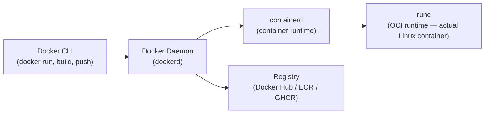

- Docker is an open platform for developers and sysadmins to build, ship, and run distributed applications.
  
- Consisting of Docker Engine, a portable, lightweight runtime and packaging tool, and Docker Hub, a cloud service for sharing applications and automating workflows.

- Docker enables apps to be quickly assembled from components and eliminates the friction between development, QA, and production environments. 

- As a result, IT can ship faster and run the same app, unchanged, on laptops, data center VMs, and any cloud.

- A container manager does lightweight virtualisation
(host and guest systems share the same kernel)

- It is based on linux namespaces and cgroups

---

## Architecture



## Linux Internals

| Technology | What Docker uses it for |
|-----------|------------------------|
| **Namespaces** | Isolation: PID, Network, Mount, UTS (hostname), IPC, User |
| **cgroups** | Resource limits: CPU, memory, disk I/O per container |
| **Union FS** | Layered image filesystem (overlayfs) — shared base layers |
| **seccomp** | System call filtering — restrict what syscalls a container can make |
| **capabilities** | Fine-grained Linux privilege control (instead of full root) |

## Image Layers & Build

```dockerfile
# Dockerfile — each instruction = a layer (cached independently)
FROM golang:1.22-alpine AS builder       # base layer
WORKDIR /app
COPY go.mod go.sum ./                    # separate layer — cached until deps change
RUN go mod download
COPY . .
RUN CGO_ENABLED=0 go build -o server .

# Multi-stage: final image has no build tools
FROM scratch                             # empty base — minimal attack surface
COPY --from=builder /app/server /server
COPY --from=builder /etc/ssl/certs /etc/ssl/certs
EXPOSE 8080
ENTRYPOINT ["/server"]
```

**Multi-stage builds:** compile in a full SDK image, copy only the binary to a minimal final image. Result: image goes from ~800MB (golang:alpine) to ~10MB (scratch + binary).

## Essential Commands

```bash
# Build
docker build -t my-app:v1.0 .
docker build --target builder -t my-app:debug .    # stop at a specific stage
docker buildx build --platform linux/amd64,linux/arm64 -t my-app:v1.0 --push .

# Run
docker run -d --name app -p 8080:8080 my-app:v1.0
docker run --rm -it my-app:v1.0 sh                 # interactive, auto-remove
docker run -e DB_HOST=postgres -v /data:/app/data my-app:v1.0

# Resource limits
docker run --cpus="0.5" --memory="256m" my-app:v1.0

# Inspect & debug
docker logs app --follow --tail 100
docker exec -it app sh                              # shell into running container
docker stats                                        # live resource usage
docker inspect app                                  # full JSON config

# Cleanup
docker system prune -af --volumes                   # remove all unused resources
docker image prune -a                               # remove unused images

# Registry
docker pull 123456789.dkr.ecr.us-east-1.amazonaws.com/my-app:v1.0
docker push my-app:v1.0
docker tag my-app:v1.0 my-app:latest
```

## Networking

```bash
# Network types
docker network create my-net                    # bridge (default — isolated)
docker run --network host my-app               # host (share host network stack)
docker run --network none my-app               # no network

# Connect containers
docker run --network my-net --name db postgres
docker run --network my-net -e DB_HOST=db my-app   # DNS: container name resolves

# Expose ports
docker run -p 8080:8080 my-app         # host:container
docker run -p 127.0.0.1:8080:8080 my-app  # only localhost
```

## Volumes

```bash
# Named volume (persists, managed by Docker)
docker volume create pgdata
docker run -v pgdata:/var/lib/postgresql/data postgres

# Bind mount (map host path into container)
docker run -v $(pwd):/app my-app     # hot-reload in dev
docker run -v $(pwd)/config:/etc/app/config:ro my-app  # read-only

# tmpfs (in-memory, not written to disk — for secrets)
docker run --tmpfs /tmp:size=100m my-app
```

## Security Best Practices

```dockerfile
# Run as non-root user
RUN addgroup -S appgroup && adduser -S appuser -G appgroup
USER appuser

# Read-only filesystem
# docker run --read-only --tmpfs /tmp my-app

# Drop all capabilities, add only what's needed
# docker run --cap-drop ALL --cap-add NET_BIND_SERVICE my-app

# Don't store secrets in images
# ❌ Bad:
ENV DB_PASSWORD=mysecret
# ✅ Good:
# Pass at runtime: docker run -e DB_PASSWORD=$DB_PASSWORD
# Or use secrets: docker secret create db_pass - < db_pass.txt
```

## Docker vs containerd vs CRI-O

| | Docker | containerd | CRI-O |
|--|--------|-----------|-------|
| Kubernetes CRI | ❌ (via dockershim, removed in 1.24) | ✅ | ✅ |
| CLI | docker | ctr, nerdctl | crictl |
| Build | ✅ (Buildkit) | ✅ (nerdctl build) | ❌ (use Buildah) |
| Used by | Dev environments | EKS, GKE (default) | OpenShift |

**In Kubernetes:** containers are managed by containerd or CRI-O directly — Docker daemon is not used on nodes.

## Common Interview Questions

**Q: How do Docker containers provide isolation without a separate kernel?**
Namespaces create isolated views for each container: PID namespace (can't see other containers' processes), network namespace (own network stack), mount namespace (own filesystem view). cgroups enforce resource limits. The host kernel handles all syscalls — there's no guest OS. This is why containers start in milliseconds vs VMs that boot an OS.

**Q: Docker layers — why do they matter for build speed and image size?**
Each Dockerfile instruction creates a layer. Layers are cached: if a layer's instruction and all preceding layers haven't changed, Docker reuses the cache. Put rarely-changing instructions first (FROM, dependency installs) and frequently-changing ones last (COPY . .) for maximum cache reuse. Unused layers still contribute to image size — use multi-stage builds to discard build tools and intermediate files.

**Q: Multi-stage builds — why use them?**
Build stage uses a full SDK (compiler, build tools — ~500MB). Final stage starts from scratch or a minimal base and copies only the compiled binary. Result: ~5-15MB final image vs ~500MB. Benefits: smaller attack surface (no compiler in prod), smaller pull times, faster deployments, fewer vulnerabilities in the final image.

**Q: Container runs as root — what's the risk?**
If an attacker escapes the container, they have root on the host. Mitigation: (1) `USER appuser` in Dockerfile — non-root user. (2) `--cap-drop ALL` — remove Linux capabilities. (3) `--read-only` — immutable container filesystem. (4) `seccomp` profiles — filter dangerous syscalls. (5) Pod Security Standards in Kubernetes — enforce `runAsNonRoot: true`.


