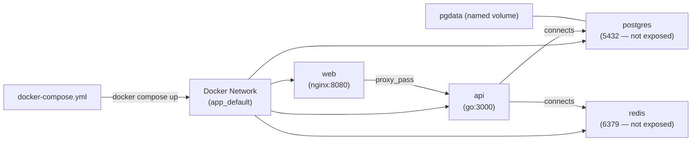

# Docker Compose

> Define and run multi-container applications. A single YAML file describes all services, networks, and volumes. One command to start everything: `docker compose up`.

## Architecture



## Full Example — Production-Like Stack

```yaml
# docker-compose.yml
services:
  # Nginx reverse proxy
  nginx:
    image: nginx:1.25-alpine
    ports:
      - "80:80"
      - "443:443"
    volumes:
      - ./nginx/nginx.conf:/etc/nginx/nginx.conf:ro
      - ./certs:/etc/ssl/certs:ro
    depends_on:
      api:
        condition: service_healthy    # wait until api is healthy
    restart: unless-stopped

  # Application
  api:
    build:
      context: .
      dockerfile: Dockerfile
      target: production              # multi-stage: only build production stage
    image: my-api:${VERSION:-latest}  # use VERSION env var or "latest"
    environment:
      - DB_HOST=postgres
      - DB_PORT=5432
      - DB_NAME=${POSTGRES_DB}
      - DB_USER=${POSTGRES_USER}
      - DB_PASSWORD=${POSTGRES_PASSWORD}
      - REDIS_URL=redis://redis:6379
    env_file:
      - .env                          # load from .env file
    depends_on:
      postgres:
        condition: service_healthy
      redis:
        condition: service_started
    healthcheck:
      test: ["CMD", "curl", "-f", "http://localhost:3000/health"]
      interval: 30s
      timeout: 10s
      retries: 3
      start_period: 40s               # grace period at startup
    restart: unless-stopped
    deploy:
      resources:
        limits:
          cpus: "1.0"
          memory: 512M

  # Database
  postgres:
    image: postgres:15-alpine
    environment:
      POSTGRES_DB: ${POSTGRES_DB:-mydb}
      POSTGRES_USER: ${POSTGRES_USER:-admin}
      POSTGRES_PASSWORD: ${POSTGRES_PASSWORD}  # required — no default for secrets
    volumes:
      - pgdata:/var/lib/postgresql/data         # named volume for persistence
      - ./db/init:/docker-entrypoint-initdb.d:ro  # init scripts
    healthcheck:
      test: ["CMD-SHELL", "pg_isready -U ${POSTGRES_USER:-admin}"]
      interval: 10s
      timeout: 5s
      retries: 5
    # No ports exposed — only accessible within Docker network
    restart: unless-stopped

  # Cache
  redis:
    image: redis:7-alpine
    command: redis-server --maxmemory 256mb --maxmemory-policy allkeys-lru
    volumes:
      - redisdata:/data
    restart: unless-stopped

  # Background worker
  worker:
    build:
      context: .
      target: production
    command: ./worker --queue default
    environment:
      - REDIS_URL=redis://redis:6379
      - DB_HOST=postgres
    depends_on:
      - redis
      - postgres
    restart: unless-stopped

volumes:
  pgdata:         # named volume — survives container restart
  redisdata:
```

## Key Directives

### depends_on with Health Checks

```yaml
depends_on:
  postgres:
    condition: service_healthy   # wait for healthcheck to pass
  redis:
    condition: service_started   # just wait for container to start
  migrations:
    condition: service_completed_successfully  # wait for one-shot job
```

### Networks — Isolation

```yaml
services:
  api:
    networks:
      - frontend
      - backend

  postgres:
    networks:
      - backend      # only on backend — frontend services can't reach it

  nginx:
    networks:
      - frontend     # only on frontend

networks:
  frontend:
  backend:
    internal: true   # no external internet access from this network
```

### Override Files — Multiple Environments

```bash
# Default: docker-compose.yml
# Override: docker-compose.override.yml (auto-merged for dev)
# Production: docker-compose.prod.yml

# Development (auto-merges docker-compose.override.yml)
docker compose up

# Production (explicit override)
docker compose -f docker-compose.yml -f docker-compose.prod.yml up -d
```

```yaml
# docker-compose.override.yml — dev overrides
services:
  api:
    build:
      target: development     # use dev stage (with hot-reload)
    volumes:
      - .:/app                # mount source for hot-reload
    environment:
      - DEBUG=true
    ports:
      - "3000:3000"           # expose for local debugging

  postgres:
    ports:
      - "5432:5432"           # expose in dev for DB client access
```

## Essential Commands

```bash
# Start all services (build if needed)
docker compose up --build

# Start in background
docker compose up -d

# View logs (follow)
docker compose logs -f api

# Execute command in running container
docker compose exec api bash
docker compose exec postgres psql -U admin mydb

# Scale a service
docker compose up -d --scale worker=3

# Rebuild one service
docker compose up -d --build api

# Stop all
docker compose down

# Stop and delete volumes (DANGER — deletes data)
docker compose down -v

# Pull latest images
docker compose pull

# See running services
docker compose ps

# See resource usage
docker compose stats
```

## .env File — Variable Substitution

```bash
# .env (never commit to Git — add to .gitignore)
POSTGRES_DB=mydb
POSTGRES_USER=admin
POSTGRES_PASSWORD=supersecret
VERSION=1.2.3
```

```yaml
# docker-compose.yml references .env automatically
environment:
  - DB_NAME=${POSTGRES_DB}
  - VERSION=${VERSION:-latest}     # default if not set
```

## Docker Compose vs Kubernetes

| | Docker Compose | Kubernetes |
|--|---------------|-----------|
| Complexity | Simple | Complex |
| Scale | Single host | Multi-node cluster |
| Self-healing | Restart policy only | Controllers + health checks |
| Rolling updates | ❌ (stop/start) | ✅ |
| Load balancing | None (single host) | Services + Ingress |
| Secret management | .env file | K8s Secrets + ESO |
| Use case | Local dev, simple apps | Production at scale |

## Common Interview Questions

**Q: Docker Compose vs Kubernetes — when to use each?**
Compose for: local development environments, simple single-host deployments, development/testing stacks (run entire system locally with one command). Kubernetes for: production, multi-node, auto-scaling, rolling updates, service discovery across pods, enterprise reliability. Many teams use Compose for local dev and K8s for staging/production.

**Q: How do you handle secrets in Docker Compose?**
Best practice: use `.env` files (excluded from Git via `.gitignore`) with environment variable substitution. For production Docker Compose deployments, use Docker Secrets (Swarm mode) or reference secrets via environment from a secret manager. Never hardcode secrets in `docker-compose.yml` — it goes into version control.

**Q: How does `depends_on` with `condition: service_healthy` work?**
Docker Compose waits to start the dependent service until the health check of the dependency returns healthy. The dependency must have a `healthcheck` defined. Without the `condition` option, `depends_on` only waits for the container to start (not for the application inside to be ready) — a common source of "connection refused at startup" bugs.

**Q: How do you run different configs for dev vs production?**
Use override files: `docker-compose.yml` (base config), `docker-compose.override.yml` (auto-merged in dev — adds volume mounts, exposes ports, debug mode), `docker-compose.prod.yml` (production-specific — removes volume mounts, uses registry images). `docker compose up` auto-merges the override; production uses `docker compose -f docker-compose.yml -f docker-compose.prod.yml up`.
