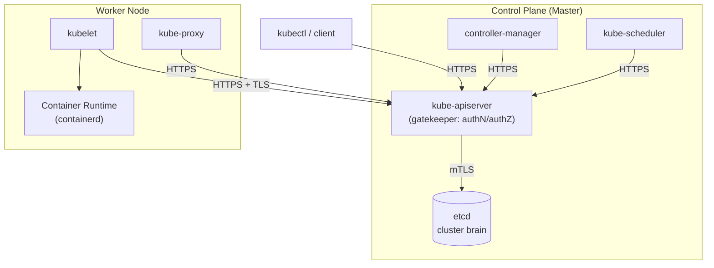

# Kubernetes Architecture

> Kubernetes is an orchestration platform for containers — it decides where workloads run, keeps them running, and exposes a single API (`kube-apiserver`) as the only front door into cluster state. Everything below is "how does a request/heartbeat actually flow between these processes," which is the level real-world outages and interview questions both operate at.

## Control Plane Overview



**Every arrow above only ever points at `kube-apiserver`.** No control-plane or node component talks to any other component directly — this single-entry-point design is *why* RBAC, admission control, and audit logging can all be enforced consistently in one place (see [RBAC.md](../Components/RBAC/RBAC.md) and [AdmissionWebhooks.md](../Components/AdmissionWebhooks/AdmissionWebhooks.md)).

## Master (Control Plane) Nodes

All cluster-managing processes run here. Four core processes:

1. **API Server** — the cluster's gateway/entrypoint. Receives every request (from `kubectl`, kubelet, controllers, everything), authenticates and authorizes it, and is the *only* component allowed to read/write `etcd` directly.
2. **Scheduler** — decides which node a new Pod should run on (based on resource requests, taints/tolerations, affinity — see [Scheduling.md](../Components/Scheduling/Scheduling.md)), then writes that decision back through the API server. It never talks to kubelet directly; kubelet discovers the assignment by watching the API server.
3. **Controller Manager** — runs the reconcile loops that detect drift between desired and actual state (e.g., a pod died, a Deployment needs more replicas) and issues corrective API calls. Every built-in controller (Deployment, ReplicaSet, Node lifecycle, etc.) is bundled into this single binary.
4. **etcd** — a strongly consistent, distributed key-value store; the literal "cluster brain." It stores *all* cluster state (every object's spec and status) but never application data — a Pod's `spec` lives in etcd, the bytes your app writes to disk do not.

## Worker Nodes

Worker nodes run the actual workloads. Three processes must be installed on every node:

1. **Container Runtime** — containerd (or another CRI-compliant runtime) that actually creates/runs containers.
2. **kubelet** — the node's agent: registers the node, starts/stops pods per the scheduler's decision, runs health probes, and reports status back. Full breakdown in [kubelet responsibilities](#kubelet-responsibilities) below.
3. **kube-proxy** — implements Kubernetes Services by programming the node's networking rules so traffic to a Service reaches the right Pod. Full breakdown in [kube-proxy](#kube-proxy) below, and the packet-level mechanics in [Networking.md](../Networking/Networking.md).

## How Worker Nodes Talk to Master Components

All communication to the control plane goes through `kube-apiserver` — no component (scheduler, etcd, controllers, kubelet) talks to any other directly.

```
Worker Node
  kubelet
    │
    │ HTTPS + TLS (443)
    ▼
kube-apiserver
```

| From        | To             | Protocol    |
| ----------- | -------------- | ----------- |
| kubelet     | kube-apiserver | HTTPS (TLS) |
| kube-proxy  | kube-apiserver | HTTPS       |
| controllers | kube-apiserver | HTTPS       |
| scheduler   | kube-apiserver | HTTPS       |
| etcd        | kube-apiserver | mTLS        |
| kubectl     | kube-apiserver | HTTPS       |

## Node Bootstrap: How a Worker Node Joins the Cluster

1. **Node starts** — EC2 (or bare metal/VM) boots, containerd starts, kubelet starts.
2. **kubelet authenticates** — presents either a client certificate (x509) or, on EKS, an IAM identity.
3. **kubelet registers itself** as a `Node` object:
   ```yaml
   kind: Node
   metadata:
     name: ip-10-0-1-23
   ```
4. **API server validates** — AuthN (cert/IAM) then AuthZ (RBAC) before the node is accepted into the cluster.

### Continuous Communication (Heartbeat Loop)

kubelet reports to the API server every few seconds: node status, pod status, resource usage. **If heartbeats stop, the node is marked `NotReady`, the built-in `node.kubernetes.io/unreachable` `NoExecute` taint is applied, and pod eviction follows** after a grace period (see [Scheduling.md](../Components/Scheduling/Scheduling.md) for the exact taint/toleration mechanics behind this).

```bash
# For example, verify a node's real-time heartbeat/condition state:
kubectl get node ip-10-0-1-23 -o jsonpath='{.status.conditions}'
kubectl describe node ip-10-0-1-23 | grep -A5 Conditions
```

## kubelet Responsibilities

1. **Node registration & heartbeat** — registers the node, sends status/CPU/memory/conditions (`Ready`, `DiskPressure`, etc.).
2. **Pod lifecycle management** — watches the API server for pods assigned to this node, creates containers via the container runtime, restarts crashed containers, kills pods on deletion. Flow: `API Server → kubelet → containerd`.
3. **Container health checks** — executes `livenessProbe`/`readinessProbe`/`startupProbe` and reports results back to the API server.
4. **Volume & storage management** — attaches volumes via CSI, mounts them into pods, handles unmount on deletion (full flow in [volumeCreationFlow.md](../Flows/volumeCreationFlow.md)).
5. **Secret & ConfigMap delivery** — fetches them from the API server, mounts as files or injects as env vars (see [ConfigMapSecret.md](../Components/ConfigMapSecret/ConfigMapSecret.md)).
6. **Resource enforcement** — applies CPU limits via cgroups and memory limits via OOMKill, in cooperation with the kernel.
7. **Log & exec APIs** — enables `kubectl logs`, `kubectl exec`, `kubectl port-forward`.
8. **Static pods** — reads pod manifests directly from disk (bypassing the API server for definition, though status is still reported up) — this is how self-managed clusters bootstrap the control plane's own pods (e.g., `kube-apiserver` itself often runs as a static pod).

## kube-proxy

kube-proxy implements Kubernetes Services. It is responsible for: Service VIP (ClusterIP), load balancing to pods, and NAT rules. Runs as a DaemonSet on every node.

**Operating Modes**

| Mode      | Used for |
| --------- | ----------- |
| `iptables` | Most common default |
| `ipvs` | High-scale clusters (thousands of Services) |
| `userspace` | Deprecated |

**Role of iptables / IPVS (the kernel does the real work)**

- **iptables mode** — random, per-connection backend selection; DNAT rules; relies on `conntrack` to track established connections.
- **IPVS mode** — a real kernel load-balancer; supports round-robin, least-connection, and hashing algorithms; scales better at very high Service/endpoint counts than iptables' linear rule-chain lookup.

kube-proxy only *programs* these rules when Endpoints change — the kernel does 100% of actual packet forwarding. The complete DNAT packet walk-through (what a ClusterIP request actually looks like on the wire) is in [Networking.md](../Networking/Networking.md).

> **Service declares, kube-proxy configures, kernel forwards.**

## Common Interview Questions

**Q: Why does every component talk only to the API server instead of to each other directly?**
It centralizes authentication, authorization, and audit logging in exactly one place — every request, no matter its origin, goes through the same AuthN → AuthZ → admission pipeline (see [AdmissionWebhooks.md](../Components/AdmissionWebhooks/AdmissionWebhooks.md)). It also decouples every component's lifecycle from every other's: the scheduler can restart, crash, or be upgraded without kubelet needing a direct connection to it — kubelet just keeps watching the API server and picks up wherever state left off. This hub-and-spoke design is also what makes etcd safe to be the single source of truth: only the API server ever touches it directly, so there's one component responsible for consistency, not N.

**Q: What actually happens, step by step, when a node stops responding?**
kubelet's heartbeat to the API server (sent every few seconds) stops arriving. After a configured grace period, the node controller (inside controller-manager) marks the Node's condition `Ready=Unknown` and then `NotReady`, and applies the built-in `node.kubernetes.io/unreachable` taint with `NoExecute` effect. Pods on that node don't tolerate this taint (unless explicitly configured to), so after the taint's `tolerationSeconds` grace period elapses they're evicted and rescheduled elsewhere — assuming they're managed by a controller (Deployment/StatefulSet/etc.) that will recreate them; bare pods are simply gone. This delay is intentional — instant eviction on every transient network blip would cause unnecessary mass-rescheduling storms.

**Q: On EKS, why can't you see EC2 instances for your master nodes?**
Because AWS runs and isolates the control plane in its own managed infrastructure, not in your account's visible compute — you only ever see the *worker* node EC2 instances. The control plane's network interfaces (ENIs) are provisioned into your VPC so private connectivity works and latency is low, but the actual kube-apiserver/etcd/scheduler/controller-manager processes run on AWS-managed hosts you have no access to. This is the core trade-off versus self-managed Kubernetes: you give up direct control-plane visibility and etcd access in exchange for AWS handling upgrades, HA, and etcd operations for you — for instance, a self-managed cluster's etcd backup/restore strategy is entirely your responsibility, while on EKS it's AWS's.

**Q: Where does static pod manifests fit into control-plane bootstrapping, and why does it matter?**
Static pods are defined by a manifest file sitting directly on a node's filesystem that kubelet watches and runs *without* going through the API server for their definition (their status still gets mirrored up as a "mirror pod" object, but their source of truth is the local file, not etcd). This solves the chicken-and-egg problem of self-managed clusters: how do you start `kube-apiserver` itself as a pod when there's no API server yet to schedule it? kubelet on the control-plane node runs it as a static pod straight from disk. This is largely irrelevant on EKS (AWS manages the control plane's own bootstrapping), but is a core mechanic in kubeadm-based or other self-managed clusters, and a common "why is this pod named `kube-apiserver-<node>` and unkillable via kubectl delete" point of confusion.
