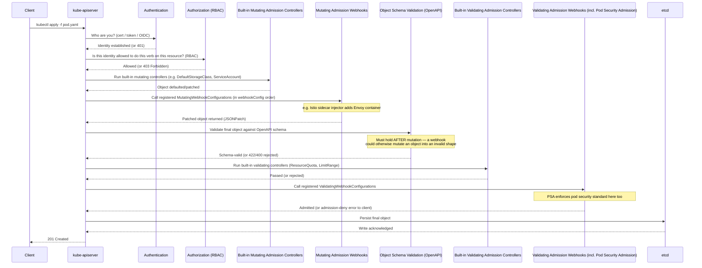

# Kubernetes Admission Webhooks

> Admission webhooks are the last two gates a request passes through before it's written to etcd — mutating webhooks rewrite the object, validating webhooks accept/reject it. Get `failurePolicy` wrong and a single crashed webhook pod can brick every `kubectl apply` cluster-wide — this is the highest-blast-radius misconfiguration in the whole API server pipeline.

## The Full API Request Pipeline

Every write request (`create`/`update`/`delete`/`connect`) to the API server passes through this exact sequence. Order matters — it's the #1 thing interviewers probe.



**Why mutating runs before validating:** validation must judge the object the cluster will actually run — the fully-mutated, final version — not the raw object the user submitted. If validation ran first, a mutating webhook could inject something afterward that violates policy (e.g. inject a privileged sidecar after a validating webhook already approved the "safe" pod spec), silently defeating the policy. Mutate first, then validate the *result*.

**Why schema validation sits between them:** mutating webhooks return JSONPatches that get applied blind — nothing stops a buggy webhook from producing a structurally invalid object (wrong type, missing required field). The API server re-validates against the OpenAPI schema after all mutations, before handing the object to validating webhooks, so validating webhooks never have to defend against a malformed object — they only ever see something schema-valid, even if semantically wrong.

**Why AuthN/AuthZ run before any admission stage:** admission (mutating/validating) is expensive — it calls out over the network to external webhook servers. There's no reason to pay that cost, or expose webhook servers to arbitrary payloads, for a request that fails identity or RBAC checks anyway. AuthN/AuthZ are pure in-process checks and always run first.

## MutatingWebhookConfiguration vs ValidatingWebhookConfiguration

Both are **separate, cluster-scoped API objects** (`admissionregistration.k8s.io/v1`). Neither runs code itself — each just registers one or more webhook *rules* that tell the API server "for requests matching X, call this HTTPS endpoint."

| Aspect | MutatingWebhookConfiguration | ValidatingWebhookConfiguration |
|---|---|---|
| Can modify the object? | ✅ Yes — returns a JSONPatch | ❌ No — allow/deny + optional message only |
| Runs in pipeline | Before schema validation | After schema validation |
| Ordering across multiple webhooks | Order matters — patches compose sequentially | Order doesn't matter — all must approve (logical AND) |
| Typical real-world examples | Istio sidecar injector, Kyverno mutate policies, defaulting webhooks | OPA Gatekeeper, Kyverno validate policies, Pod Security Admission, cert-manager CRD validation |
| Response on rejection | N/A (mutation doesn't reject, though it can error) | `allowed: false` + `status.message` surfaced to the client |

Each `webhooks[]` entry references a target via `clientConfig`:

- **`service`** — in-cluster: `{ namespace, name, path, port }`, resolved via the cluster's Service (most common — webhook server runs as a Deployment behind a ClusterIP Service in the cluster).
- **`url`** — external HTTPS endpoint outside the cluster (SaaS policy engines, etc.).
- **`caBundle`** — PEM-encoded CA certificate(s) the API server uses to verify the webhook server's TLS certificate. Webhook calls are **always HTTPS** — plaintext admission callbacks aren't supported. Since webhook servers commonly run with self-signed or internal-CA certs (cert-manager or a Helm-generated cert are the usual sources), `caBundle` is mandatory; without it (or with the wrong CA), the API server can't verify the endpoint's cert and the call fails closed/open depending on `failurePolicy`.

## `failurePolicy`: Fail vs Ignore — the critical production gotcha

`failurePolicy` decides what happens when the webhook endpoint is **unreachable, times out, or returns an error** — not what happens on a normal allow/deny response.

| Value | Behavior on webhook unreachable/timeout/error | Trade-off |
|---|---|---|
| `Fail` | The **entire matching operation is rejected** | Enforces the policy even during an outage, but an outage now blocks all matching creates/updates cluster-wide |
| `Ignore` | The operation is **allowed through** as if the webhook didn't exist | Preserves availability, but the policy is silently unenforced during the outage |

**The failure mode that actually happens in production:** a webhook is registered broadly (e.g. matches all `pods`, all namespaces) with `failurePolicy: Fail`. The webhook's own Deployment gets OOMKilled, or its Service has no healthy endpoints, or someone rotates a cert and forgets to update `caBundle`. Now **every pod create/update in the cluster fails admission** — including the webhook's own replacement pod, if it happens to live in a namespace the rule matches and nobody excluded it. You can't fix the webhook because fixing it requires creating a pod, which the broken webhook itself blocks. This is the classic chicken-and-egg admission-webhook deadlock.

**Standard mitigations:**

1. **Scope narrowly** — use `namespaceSelector` and/or `objectSelector` so the rule only matches what it needs to govern, never everything. Always exclude `kube-system` (core control-plane and CNI/CoreDNS pods must never be blocked by a workload policy webhook) and the webhook's **own namespace** (so its own upgrade/recovery pods are never subject to itself).
2. **Short `timeoutSeconds`** (max 30s, usually set to 2–10s) — a hung webhook fails fast instead of making every API call in the cluster hang.
3. **Roll out new webhooks with `failurePolicy: Ignore` first.** Prove stability in production for a burn-in period, watch for false negatives/timeouts, then flip to `Fail` once confident. Never ship a brand-new webhook straight to `Fail`.
4. Run the webhook server itself as a highly-available Deployment (2+ replicas, PodDisruptionBudget, resource requests that won't get it evicted) — the webhook is now load-bearing infrastructure, not just another app.

## `sideEffects`

Tells the API server whether calling this webhook has side effects **outside** the admission request itself (e.g. calling out to provision cloud resources, writing to an external system) — critical for dry-run safety.

| Value | Meaning |
|---|---|
| `None` | Webhook has zero side effects — safe to call even during `--dry-run=server` |
| `NoneOnDryRun` | Webhook has side effects normally, but explicitly detects `request.dryRun == true` and skips them |
| `Some` (deprecated) | Has side effects, no dry-run awareness — API server may warn or skip calling it under dry-run |
| `Unknown` (deprecated) | Not declared — treated conservatively |

If a webhook has real side effects and doesn't declare `NoneOnDryRun` correctly, `kubectl apply --dry-run=server` (which real GitOps/CI pipelines use to validate manifests before applying) can trigger the webhook's real side effect even though nothing is actually being persisted — e.g. a webhook that increments an external quota counter on every call, blowing through the quota purely from dry-run validation traffic.

## `reinvocationPolicy` (mutating webhooks only)

Multiple mutating webhooks can be registered, and they run in a defined order, each seeing the output of the previous one. The problem: webhook B might mutate the object in a way that **invalidates or interacts with** a mutation webhook A already made earlier in the chain. `reinvocationPolicy` decides whether the API server goes back and re-calls earlier webhooks.

| Value | Behavior |
|---|---|
| `Never` (default) | Each webhook is called exactly once, in order. No re-invocation even if a later webhook's mutation affects an earlier webhook's assumptions |
| `IfNeeded` | If a later webhook mutates the object, **earlier mutating webhooks that support re-invocation are called again** on the updated object (bounded retry — max 10 cumulative calls, then the request fails) |

Example: a resource-limits-defaulting webhook (A) sets `resources.limits.memory` based on a label. A later webhook (B) injects a sidecar container that changes the pod's total resource footprint. Without `IfNeeded`, A never sees the sidecar and its defaulting logic is stale. With `IfNeeded`, A is re-invoked on the object post-sidecar-injection and can recompute correctly. Only set this if your webhook is actually idempotent (safe to run twice) — non-idempotent mutations (e.g. "append a value" instead of "set a value") will duplicate on re-invocation.

## `matchPolicy`: Equivalent vs Exact

Kubernetes resources can be requested via multiple API versions that are wire-compatible (e.g. a Deployment via `apps/v1` today, historically also `extensions/v1beta1`). `matchPolicy` decides whether a webhook rule written for one version also fires for equivalent older/newer versions of the same resource.

| Value | Behavior |
|---|---|
| `Equivalent` (default) | Webhook is invoked for the specified version **and** any other version of that resource the API server considers equivalent (convertible without loss) |
| `Exact` | Webhook is invoked **only** for the literal `apiVersion`/`resource` listed in `rules` — a request using a different (even equivalent) version is not intercepted |

Gotcha: if you write a rule matching only `apps/v1` Deployments with `matchPolicy: Exact`, and some old client or controller still submits `extensions/v1beta1` Deployments, your webhook silently never sees those requests — a policy enforcement gap that's invisible until an audit finds resources that should have been mutated/validated but weren't. `Equivalent` is the safer default and is rarely worth overriding.

## Real-World Examples

| Tool | Webhook type | What it does |
|---|---|---|
| **Istio** (`istio-sidecar-injector`) | Mutating | Injects the Envoy sidecar container (+ init container for iptables redirection) into every pod created in a namespace labeled `istio-injection: enabled` |
| **OPA Gatekeeper** | Validating (primarily) | Policy-as-code — `ConstraintTemplate` + `Constraint` CRDs compiled to Rego, enforced as a ValidatingWebhookConfiguration. See dedicated notes: [OPAGatekeeper.md](../OPAGatekeeper/OPAGatekeeper.md) |
| **Kyverno** | Both — validating and mutating (and generating) | YAML-native policy engine; increasingly used for mutation (auto-inject labels/resources) as well as validation, positioned as the no-Rego alternative to Gatekeeper |
| **cert-manager** | Validating | Validates its own CRDs (`Certificate`, `Issuer`, `ClusterIssuer`) at admission time — e.g. rejects a `Certificate` referencing a non-existent `Issuer` kind, or invalid key usage combinations, before they're persisted |
| **Pod Security Admission (PSA)** | Built-in validating admission controller (not a webhook, but occupies the same pipeline stage) | Enforces `privileged`/`baseline`/`restricted` Pod Security Standards per-namespace via labels — replaced PodSecurityPolicy (removed in 1.25) |

## Full Example: MutatingWebhookConfiguration + ValidatingWebhookConfiguration

See `webhookconfig.yaml` for the complete set. Key excerpt — a mutating webhook that injects a sidecar, scoped defensively to avoid the `kube-system`/self-namespace deadlock:

```yaml
apiVersion: admissionregistration.k8s.io/v1
kind: MutatingWebhookConfiguration
metadata:
  name: sidecar-injector.example.com
webhooks:
  - name: sidecar-injector.example.com
    admissionReviewVersions: ["v1"]
    sideEffects: None                  # required field — no external side effects
    timeoutSeconds: 5                  # fail fast, don't hang every pod create in the cluster
    reinvocationPolicy: IfNeeded       # re-run if a later webhook further mutates the pod
    matchPolicy: Equivalent            # also match older/equivalent API versions of Pod
    failurePolicy: Fail                # only safe because this rule is narrowly scoped below
    rules:
      - apiGroups: [""]
        apiVersions: ["v1"]
        operations: ["CREATE"]
        resources: ["pods"]
        scope: "Namespaced"
    namespaceSelector:                 # NEVER match kube-system or the webhook's own namespace —
      matchExpressions:                # avoids the chicken-and-egg deadlock: if this webhook is down,
        - key: kubernetes.io/metadata.name    # its own fix/restart pod must still be creatable.
          operator: NotIn
          values: ["kube-system", "sidecar-injector-system"]
    objectSelector:
      matchLabels:
        istio-injection: enabled       # only pods in namespaces/labels opting in
    clientConfig:
      service:
        name: sidecar-injector-webhook
        namespace: sidecar-injector-system
        path: "/mutate"
        port: 443
      caBundle: <base64-encoded-CA-cert>   # required — webhook calls are always HTTPS
```

## Debugging & Troubleshooting

```bash
# List all registered webhook configurations cluster-wide
kubectl get validatingwebhookconfigurations,mutatingwebhookconfigurations

# Inspect a specific one — check rules, failurePolicy, namespaceSelector, caBundle presence
kubectl describe mutatingwebhookconfiguration sidecar-injector.example.com

# Confirm the webhook Service actually has healthy endpoints (the #1 cause of
# "webhook unreachable" outages — Service exists but backing pods are down/unready)
kubectl get endpoints sidecar-injector-webhook -n sidecar-injector-system
kubectl get pods -n sidecar-injector-system -o wide

# Check the webhook server's own logs for panics/errors on the admission path
kubectl logs -n sidecar-injector-system deploy/sidecar-injector-webhook

# The actual error returned to the user includes the webhook name + its message —
# read it carefully, it tells you exactly which webhook rejected and why:
#   Error from server: admission webhook "sidecar-injector.example.com" denied the
#   request: pod spec missing required label "team"
kubectl apply -f pod.yaml   # reproduce and read the full denial message

# INCIDENT RESPONSE: a broken webhook (failurePolicy: Fail, unreachable) is
# blocking ALL matching creates cluster-wide. Fastest unblock:
kubectl delete mutatingwebhookconfiguration sidecar-injector.example.com
# or, less destructively, flip it open without deleting the object:
kubectl patch mutatingwebhookconfiguration sidecar-injector.example.com \
  --type='json' -p='[{"op":"replace","path":"/webhooks/0/failurePolicy","value":"Ignore"}]'
# CAVEAT: this removes enforcement entirely until the underlying webhook server
# issue is fixed and the configuration is restored/re-tightened to `Fail`.
```

## Common Interview Questions

**Q: Why do mutating webhooks run before validating webhooks, and not the other way around?**
Because validation is supposed to judge the final object the cluster will actually schedule and run, not the raw object the client submitted. If validation ran first, it would approve an object that a later mutation could still alter — e.g. a validating policy approves a pod with no privileged containers, and then a mutating webhook injects a privileged sidecar afterward, completely bypassing the check. Running mutation first and validation second guarantees validating webhooks always see the true, final shape of the object, which is the only version that matters for policy enforcement.

**Q: A cluster-wide MutatingWebhookConfiguration with `failurePolicy: Fail` has an unhealthy backing Service. What happens, and how do you recover?**
Every operation matching that webhook's rules — potentially all pod creates/updates cluster-wide if scoped broadly — is rejected outright, because `Fail` treats "can't reach the webhook" the same as "webhook said no." If the rule wasn't scoped to exclude `kube-system` and the webhook's own namespace, you can hit a deadlock: you can't create a fix/restart pod for the webhook itself because the broken webhook blocks that create too. Fastest recovery is to `kubectl patch` the configuration's `failurePolicy` to `Ignore` (or delete it outright) to unblock the cluster immediately, fix the actual webhook server issue (bad image, OOM, cert mismatch), then restore/re-tighten the configuration. The postmortem fix is always to add `namespaceSelector` exclusions and a short `timeoutSeconds` so this can't recur.

**Q: What's the practical difference between `failurePolicy: Fail` and `Ignore`, and when would you choose each?**
`Fail` closes on failure — a webhook outage blocks the matching operation, which enforces the policy even under failure but risks cluster-wide disruption. `Ignore` fails open — the operation proceeds as if the webhook wasn't there, preserving availability but silently leaving the policy unenforced during the outage (with no alert unless you're separately monitoring webhook health). Security/compliance-critical policies (e.g. "no privileged containers") generally want `Fail` once proven stable, because fail-open defeats the purpose. But you always launch a *new* webhook with `Ignore`, watch it in production, and only flip to `Fail` after you trust its uptime and correctness — shipping straight to `Fail` on day one is how clusters get bricked by a webhook bug nobody's tested yet.

**Q: What does `sideEffects: None` actually protect against?**
It tells the API server the webhook is safe to call during a dry-run (`kubectl apply --dry-run=server`, or `kubectl diff`) without triggering real-world consequences. If a webhook calls out to provision a cloud resource, decrement a quota, or send a notification, and it's marked `None` when it actually has side effects, dry-run traffic will silently trigger those real effects even though nothing was actually applied. The correct declaration for a webhook with real side effects that's dry-run-aware is `NoneOnDryRun` — the webhook itself must check `request.dryRun` and skip the side-effecting logic when true.

**Q: Explain `reinvocationPolicy` — why would a mutating webhook need to be called twice?**
Because mutating webhooks in a chain execute in order, each one only seeing the object as mutated by everything before it — never anything that comes after. If webhook A sets a field based on some property of the pod, and webhook B (later in the chain) changes that property, A's earlier decision is now stale relative to the final object. `reinvocationPolicy: IfNeeded` tells the API server to re-invoke earlier webhooks whose declared policy allows it, if a later webhook actually changed the object, so A gets a second pass against the up-to-date pod spec. It's capped (max ~10 total invocations) to prevent infinite mutation loops, and it's only safe to enable on webhooks whose mutation logic is idempotent — a webhook that appends to a list rather than sets a value will duplicate entries if re-invoked.

**Q: How is Pod Security Admission different from a validating admission webhook, and where does it sit in the pipeline?**
PSA is a built-in validating admission *controller*, compiled into `kube-apiserver` itself, not a webhook that makes a network call to an external server. It occupies the validating-admission stage of the pipeline (same conceptual slot as ValidatingWebhookConfigurations) and enforces the `privileged`/`baseline`/`restricted` Pod Security Standards based on labels set on the namespace (`pod-security.kubernetes.io/enforce=restricted`, etc.). Because it's in-process, it has no `failurePolicy`/`caBundle`/network-reachability concerns — it can never "go down" independently of the API server itself. It replaced PodSecurityPolicy (removed in 1.25), which was itself an admission controller with a much more complex binding model.

**Q: `kubectl apply` returns "admission webhook denied the request." How do you figure out which webhook, and is it a bug in the webhook or a legitimate policy violation?**
The error message itself names the specific webhook (`admission webhook "<name>" denied the request: <message>`) and usually includes the human-readable reason the webhook's own code generated — read that message first, most of the time it's a legitimate policy violation (missing required label, resource limits not set, disallowed image registry) and the fix is in your manifest. If the message is generic, empty, or the request just times out instead of returning a clear denial, suspect the webhook server itself: check `kubectl get endpoints` for the backing Service (no healthy pods is the most common cause), check the webhook server's logs for a panic on that specific request payload, and check `caBundle` currency if this coincides with a recent cert rotation. Never assume "it's just broken" and reach for `failurePolicy: Ignore` or deletion before confirming it isn't actually catching a real, intended violation.
