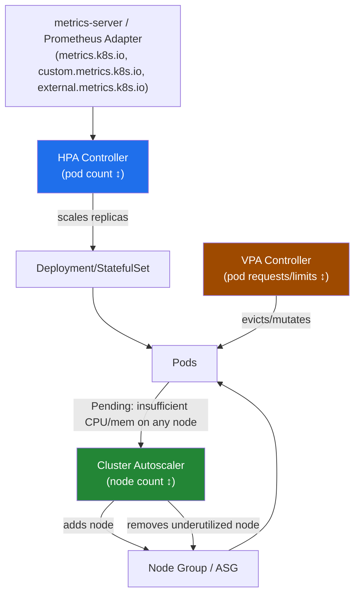
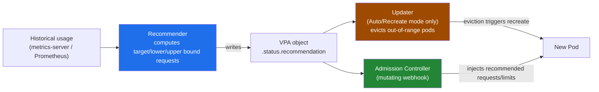
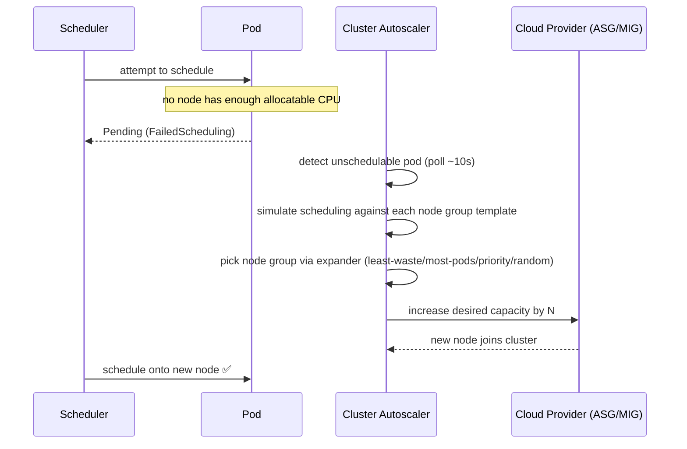

# Kubernetes Autoscaling: HPA, VPA & Cluster Autoscaler

> Three independent controllers answer three different questions: "more pod copies?" (HPA), "bigger pods?" (VPA), "more nodes?" (Cluster Autoscaler). Interviewers ask about them as one end-to-end scaling story — pod-level and node-level scaling have to cooperate, or they actively fight each other.

## The Unified Scaling Story



**The layering:** HPA and VPA operate on **pods** (how many, how big). Cluster Autoscaler operates on **nodes** (how many machines exist to run those pods). HPA/VPA decisions create pod pressure; CA reacts to that pressure by changing cluster capacity. None of them talk to each other directly — they react to shared signals (`Pending` pods, resource utilization, metrics APIs).

---

## Part 1: Horizontal Pod Autoscaler (HPA)

HPA changes **replica count** based on observed metrics. It's a control loop (default sync every 15s) that reads a metric, computes a desired replica count, and patches `spec.replicas` on the target (Deployment/StatefulSet/ReplicaSet).

### Metrics Dependency — the #1 gotcha

HPA does **not** collect metrics itself. It queries the aggregated metrics APIs:

| API | Source | Metric examples |
|-----|--------|------------------|
| `metrics.k8s.io` | **metrics-server** (must be installed separately) | CPU, memory (resource metrics) |
| `custom.metrics.k8s.io` | Prometheus Adapter (or similar) | requests-per-second, queue depth |
| `external.metrics.k8s.io` | Prometheus Adapter / cloud provider adapter | SQS queue length, Kafka consumer lag |

Without metrics-server running, `kubectl get hpa` shows `TARGETS: <unknown>/80%` **forever** — HPA never scales, and there's no error event beyond `FailedGetResourceMetric` in `kubectl describe hpa`. This is the single most common HPA outage in the wild: someone deletes/misconfigures metrics-server (or its kubelet TLS cert verification fails) and every HPA in the cluster silently freezes at its last known replica count.

```bash
# Verify metrics-server is actually serving data
kubectl get apiservices | grep metrics
kubectl top nodes
kubectl top pods -n production

# Diagnose a stuck HPA
kubectl describe hpa my-app-hpa
# Look for: FailedGetResourceMetric, FailedComputeMetricsReplicas events
```

### autoscaling/v2: Multiple Metrics

`autoscaling/v2` (GA since 1.23; supersedes `v1` which only supported CPU) lets you scale on several metrics at once — CPU, memory, custom, and external simultaneously. **HPA computes a desired replica count per metric, then takes the MAX across all of them.** This is a conservative, availability-biased design: if any single metric says "scale up," the whole workload scales up.

```yaml
apiVersion: autoscaling/v2
kind: HorizontalPodAutoscaler
metadata:
  name: api-server-hpa
  namespace: production
spec:
  scaleTargetRef:
    apiVersion: apps/v1
    kind: Deployment
    name: api-server
  minReplicas: 3
  maxReplicas: 20
  metrics:
    - type: Resource
      resource:
        name: cpu
        target:
          type: Utilization
          averageUtilization: 60   # % of requested CPU (not limit!)
    - type: Resource
      resource:
        name: memory
        target:
          type: Utilization
          averageUtilization: 75
    - type: Pods
      pods:
        metric:
          name: http_requests_per_second   # from Prometheus Adapter
        target:
          type: AverageValue
          averageValue: "500"              # per-pod average, not cluster total
    - type: External
      external:
        metric:
          name: sqs_queue_messages_visible
          selector:
            matchLabels:
              queue: order-processing
        target:
          type: AverageValue
          averageValue: "30"                # target 30 msgs/pod in flight
  behavior:
    scaleUp:
      stabilizationWindowSeconds: 0          # near-immediate — react fast to load spikes
      policies:
        - type: Percent
          value: 100                        # can double pod count per period
          periodSeconds: 15
        - type: Pods
          value: 4                          # or add at most 4 pods per period
          periodSeconds: 15
      selectPolicy: Max                      # take whichever policy allows MORE pods
    scaleDown:
      stabilizationWindowSeconds: 300        # 5 min — avoid flapping on transient dips
      policies:
        - type: Percent
          value: 25                         # remove at most 25% of pods per period
          periodSeconds: 60
      selectPolicy: Min                       # take whichever policy is MORE conservative
```

**`averageUtilization` vs `AverageValue`:** `Utilization` is a percentage of the pod's **requested** resource (a pod requesting 500m CPU at 60% target scales when it's using ~300m — note this means requests must be set correctly or the percentage is meaningless). `AverageValue` is a raw absolute number (e.g., 500 req/s per pod) — used for custom/external metrics where there's no "request" baseline to divide by.

### The Scaling Formula

```
desiredReplicas = ceil( currentReplicas × ( currentMetricValue / desiredMetricValue ) )
```

Worked example: 4 replicas running, target CPU utilization 60%, current average utilization measured at 90%.

```
desiredReplicas = ceil( 4 × (90 / 60) ) = ceil( 4 × 1.5 ) = ceil(6) = 6
```

Scale from 4 → 6 pods. If instead current utilization drops to 20%: `ceil(4 × (20/60)) = ceil(1.33) = 2` → scale down to 2 (subject to `minReplicas` and the scale-down stabilization window/policy limiting how fast it actually happens).

A subtlety worth stating out loud in an interview: if the ratio is close to 1.0 (within a default 10% tolerance), HPA does **not** scale at all — this dead-band prevents thrashing on noise around the target.

### Stabilization Windows — Why the Asymmetry Is Intentional

| | Scale-Up | Scale-Down |
|---|---|---|
| Default `stabilizationWindowSeconds` | `0` (effectively immediate) | `300` (5 minutes) |
| Rationale | Under-provisioning during a real spike = outage/latency SLO breach. Bias toward reacting fast. | Over-provisioning briefly just costs money. Bias toward caution — avoid killing pods for a metric that dips for 30s and rebounds. |
| Mechanism | Looks at the max desired value over the window (short/no window = react to latest) | Looks at the **max** recommended replica count over the whole trailing window — deliberately picks the *least aggressive* scale-down seen recently |

This asymmetry is the classic "scale up fast, scale down slow" pattern used everywhere in ops (same idea behind TCP congestion avoidance, alerting hysteresis, etc.) — cost of over-scaling is minutes of wasted compute; cost of under-scaling is a production incident.

### Custom/External Metrics: Scaling on Queue Depth

CPU is a poor proxy for load in async/event-driven workloads. A worker pulling from SQS or a Kafka consumer group can sit at near-0% CPU while messages back up (e.g., waiting on a slow downstream API) — a CPU-based HPA will never scale it, and the queue grows unbounded. The fix is to scale on the actual backlog:

- **Prometheus Adapter** exposes `custom.metrics.k8s.io`/`external.metrics.k8s.io` backed by PromQL queries (e.g., `kafka_consumergroup_lag`), which HPA then consumes like any other metric.
- **KEDA** (Kubernetes Event-Driven Autoscaling) has largely superseded hand-rolled Prometheus Adapter configs for this use case. KEDA ships 60+ built-in "scalers" (SQS, Kafka, RabbitMQ, Azure Service Bus, Cron, Prometheus, etc.) as CRDs (`ScaledObject`) — no PromQL/adapter YAML to hand-maintain — and it can scale a Deployment to/from **zero** replicas, which a plain HPA cannot do (HPA's `minReplicas` floor is 1... technically 0 is allowed since 1.16+ with a metric source that supports it, but in practice this is KEDA's core value proposition). Under the hood KEDA still creates a standard HPA object — it's a metrics-adapter + activation layer on top, not a replacement for the HPA control loop itself.

```bash
kubectl get hpa api-server-hpa
kubectl describe hpa api-server-hpa   # check Events for ScalingLimited, FailedGetExternalMetric
kubectl get --raw "/apis/external.metrics.k8s.io/v1beta1" | jq .   # confirm external metrics API is registered
```

---

## Part 2: Vertical Pod Autoscaler (VPA)

VPA changes **resource requests/limits** on pods, instead of (or in addition to) pod count. It answers "is this pod correctly sized?" — a common real-world problem where engineers set CPU/memory requests once at launch and never revisit them, leading to chronic over- or under-provisioning.

### Three Components



| Component | Job |
|-----------|-----|
| **Recommender** | Watches historical + current resource usage, computes recommended requests (target/lower-bound/upper-bound/uncapped-target), writes them to `VPA.status`. Runs continuously regardless of update mode — even in `Off` mode this keeps working. |
| **Updater** | Only acts in `Auto`/`Recreate` mode. Checks running pods against the recommendation; if a pod is significantly out of range, **evicts** it so it comes back through the admission controller with new values. |
| **Admission Controller** | A mutating webhook that intercepts pod creation and rewrites `resources.requests`/`limits` to match the current recommendation — this is the only path that actually changes numbers; the Updater's job is just to force a recreation. |

### Update Modes

| Mode | Behavior | Disruption |
|------|----------|-----------|
| `Off` | Recommender only — recommendations visible via `kubectl describe vpa`, nothing is applied automatically | None — pure observability, safe to run everywhere as a "right-sizing advisor" |
| `Initial` | Recommendation applied only at pod creation time (via admission webhook) | None to running pods — never touches them |
| `Recreate` | Applied at creation AND running pods are evicted/recreated when out of range | Pod restart (brief unavailability unless replicated) |
| `Auto` | Currently behaves like `Recreate` (intended to eventually use in-place resize when stable) | Same as `Recreate` today |

```yaml
apiVersion: autoscaling.k8s.io/v1
kind: VerticalPodAutoscaler
metadata:
  name: worker-vpa
  namespace: production
spec:
  targetRef:
    apiVersion: apps/v1
    kind: Deployment
    name: worker
  updatePolicy:
    updateMode: "Off"          # start in Off in prod — observe before letting it evict pods
  resourcePolicy:
    containerPolicies:
      - containerName: "*"
        minAllowed:
          cpu: 100m
          memory: 128Mi
        maxAllowed:
          cpu: 4
          memory: 8Gi
        controlledResources: ["cpu", "memory"]
        controlledValues: RequestsAndLimits   # or RequestsOnly to leave limits untouched
```

```bash
# Off mode: pure recommendation, safe to run alongside anything
kubectl describe vpa worker-vpa
# Look at Status.Recommendation.ContainerRecommendations — target/lowerBound/upperBound
```

**Why eviction/recreate at all?** Historically Kubernetes had no way to change a running container's resource requests without restarting it — `resources` was immutable after pod creation. `Recreate`/`Auto` mode is VPA working around that limitation the only way it could: delete the pod, let the ReplicaSet controller create a replacement, and the admission webhook stamps the new pod with updated values.

**In-place Pod Vertical Scaling** (`InPlacePodVerticalScaling` feature gate, alpha in 1.27, beta and maturing in later releases) changes this: it lets `kubectl` / the API server patch `resources` on a running pod without a restart, for container runtimes that support it (containerd/CRI-O with support for live resource updates on cgroups v2). Once this is stable and VPA is updated to use it, VPA's disruptive evict/recreate cycle goes away for the common case — this is one of the most-cited "on the roadmap" answers in senior interviews because it directly fixes VPA's biggest operational complaint.

### HPA + VPA on the Same Metric: The Conflict

**Never point HPA and VPA at the same metric on the same resource** (e.g., both scaling on CPU utilization). Here's the feedback loop: VPA raises a pod's CPU **request** because observed usage is high. HPA's target is `averageUtilization: 60%`, which is `usage / request`. The moment VPA increases the request, the utilization percentage **drops** (same usage, bigger denominator) — HPA now thinks it's under-loaded and may scale pods **down**, concentrating load onto fewer, differently-sized pods, which then spikes utilization again and triggers VPA to resize again. The two controllers chase each other's tail — thrashing, not converging.

**Safe combination:** HPA on a metric VPA doesn't touch — a custom/external metric like requests-per-second or queue depth — while VPA independently right-sizes CPU/memory requests. This way HPA answers "how many pods do we need for this traffic level" and VPA answers "how big should each pod be," with no shared denominator between them.

```bash
kubectl get vpa worker-vpa -o jsonpath='{.status.recommendation}' | jq .
kubectl get hpa,vpa -n production   # sanity-check nothing targets the same resource+metric
```

---

## Part 3: Cluster Autoscaler (CA)

HPA/VPA scale **pods**; Cluster Autoscaler scales **nodes**. It watches for scheduling failures and node underutilization, and adds/removes nodes by talking to the cloud provider's node-group API (ASG, MIG, VMSS).

### Scale-Out Trigger: Pending Pods

CA scale-out is driven entirely by pods stuck in `Pending` with a `FailedScheduling` event because **no existing node has enough allocatable CPU/memory** (or other requirement — GPU, taint/toleration, affinity) to fit them. CA does not look at "average cluster CPU is at 80%" — it looks at unschedulable pods.

For each node group it manages, CA **simulates** scheduling the pending pod against that group's launch template (instance type, labels, taints) to determine whether adding a node from that group would let the pod schedule. It picks among node groups that would work using an **expander strategy**.



### Scale-In Trigger: Sustained Underutilization

A node is a scale-down candidate when its utilization (sum of requests / allocatable, for both CPU and memory) stays **below ~50%** (default `scale-down-utilization-threshold`) for a sustained period (default 10 minutes, `scale-down-unneeded-time`) **and** every pod on it could be rescheduled onto other nodes.

CA will **not** remove a node if any pod on it:

- Would violate a **PodDisruptionBudget** if evicted.
- Has the annotation `"cluster-autoscaler.kubernetes.io/safe-to-evict": "false"` — used deliberately for things like local-storage-backed pods, or pods doing work that must not be interrupted mid-task.
- Is a **bare pod** not backed by a controller (no Deployment/ReplicaSet/Job/StatefulSet) — CA can't guarantee it'll be recreated elsewhere, so by default it blocks scale-down (override with `"cluster-autoscaler.kubernetes.io/safe-to-evict": "true"` if you're sure).
- Is a kube-system pod without `PodDisruptionBudget` set (some CA setups special-case this), or has local storage / `emptyDir` it depends on across restart.
- Is a DaemonSet pod — these don't block scale-down since they get recreated on any node automatically, but they also don't count toward "useful" utilization.

```bash
# Watch CA decisions (deployed as a pod in kube-system on self-managed clusters; EKS-managed autoscaling hides some of this)
kubectl -n kube-system logs deployment/cluster-autoscaler | grep -i "scale_down\|scale_up"

# See why a pod is unschedulable
kubectl describe pod pending-pod-xyz | grep -A5 Events

# Node annotation to protect a node from ever being removed
kubectl annotate node <node-name> cluster-autoscaler.kubernetes.io/scale-down-disabled=true

# Pod annotation to block eviction during scale-down
# (set in pod spec, not via kubectl annotate on a running pod, since Pod templates are immutable in place)
```

### Expander Strategies

When more than one node group could satisfy a pending pod, the **expander** picks which one to grow:

| Expander | Optimizes For | Typical Use |
|----------|---------------|--------------|
| `least-waste` (default-ish, commonly recommended) | Smallest leftover CPU/memory after the pod is scheduled — avoids over-provisioning | Mixed instance-type node groups, general-purpose clusters |
| `most-pods` | Node group that can schedule the **most** of the currently pending pods at once | Batch workloads with many small pending pods |
| `priority` | Node groups ranked by a user-defined priority list (`cluster-autoscaler-priority-expander` ConfigMap) | Prefer cheaper Spot node groups first, fall back to On-Demand |
| `random` | No optimization — picks arbitrarily among viable groups | Testing, or when all groups are equivalent |

Multiple expanders can be chained (e.g., `priority,least-waste`) — ties from the first are broken by the next.

### Karpenter: The Modern Alternative (AWS)

| | Cluster Autoscaler | Karpenter |
|---|---|---|
| Node source | Pre-defined node groups / ASGs — CA picks *among* existing groups | Launches EC2 instances directly (no ASG) — computes the right instance type/size per pending pod |
| Scale-out latency | Slower — bound by ASG scaling activity + CA's poll/simulate loop | Faster — provisions nodes directly, skips ASG orchestration overhead |
| Bin-packing | Coarse — limited to whatever instance shapes exist in predefined groups | Fine-grained — picks from the full EC2 instance catalog to closely match pending pod requirements, reducing waste |
| Consolidation | Reactive only — waits for the utilization threshold + timer | Proactive **consolidation** — continuously looks for opportunities to replace/bin-pack nodes onto fewer/cheaper instances, not just remove idle ones |
| Config model | Node groups (Terraform/eksctl-managed ASGs) + expander preference | `NodePool`/`EC2NodeClass` CRDs — declarative constraints (instance families, zones, capacity type), no ASG to manage |
| Spot handling | Possible via priority expander + separate spot node groups | Native Spot interruption handling built in |

For an interview answer: CA is the portable, cloud-agnostic, "safe default" that works anywhere the cluster-autoscaler cloud provider plugin exists; Karpenter (AWS-native, though now has ports for other providers) trades that portability for materially faster and more efficient node provisioning by cutting the ASG middleman out of the loop entirely.

---

## Common Interview Questions

**Q: HPA says targets are `<unknown>` and never scales — what's your first move?**
This is almost always a metrics-pipeline problem, not an HPA problem. First check `kubectl get apiservices | grep metrics.k8s.io` — if it's not `Available=True`, metrics-server is down, unreachable, or its TLS cert validation against kubelets is failing (common on self-managed clusters with self-signed kubelet certs — fixed by `--kubelet-insecure-tls` as a stopgap, or fixing cert trust properly). Second, `kubectl top pods` — if that fails too, it confirms the API itself is broken rather than something HPA-specific. Third, `kubectl describe hpa` and read the Events for `FailedGetResourceMetric`. Only after confirming the metrics API is healthy do I look at the HPA spec itself (wrong `resource.name`, missing `resources.requests` on the target containers — Utilization-type metrics are meaningless without a request baseline to divide by).

**Q: Walk me through why HPA takes the MAX across multiple metrics instead of an average.**
Because HPA's job is to guarantee enough capacity, and each metric represents an independent constraint that could each individually cause a bad outcome if under-provisioned. If CPU says "need 5 pods" and queue depth says "need 12 pods," averaging to 8 or 9 would leave the queue backing up even though CPU looks fine — you'd be trading a real, visible problem (growing queue/latency) for a false sense of balance. Taking the max means every constraint gets satisfied simultaneously; the cost is you can over-provision relative to any single metric, but that's a deliberate, conservative trade favoring availability over cost efficiency.

**Q: Why is the default scale-down stabilization window 5 minutes but scale-up is near-instant?**
Cost asymmetry. Under-scaling during a genuine traffic spike causes request queuing, latency SLO breaches, possibly cascading failures — an outage. Over-scaling during a transient dip just costs a few extra minutes of compute spend. The 5-minute window also specifically prevents flapping: HPA looks at the *maximum* recommended replica count over the trailing window before scaling down, so a metric that dips for 30 seconds and recovers never actually triggers a pod removal. Scale-up has no equivalent bias toward caution because there's no comparable downside to reacting fast.

**Q: When would you choose Prometheus Adapter custom metrics over just relying on CPU/memory HPA?**
Whenever CPU/memory is a poor proxy for actual load — the textbook case is an async worker pulling from a queue (SQS, Kafka, RabbitMQ) making a slow downstream call. The worker can sit at 5% CPU utilization while blocked on I/O, even as the backlog grows into the thousands — a CPU-based HPA will never scale it out, and the business-visible symptom (growing lag, missed SLA on message processing) has zero correlation with the metric HPA is watching. Scaling on the actual backlog (queue depth, consumer lag) ties replica count directly to the thing you actually care about. In practice today I'd reach for KEDA over hand-rolling Prometheus Adapter rules for this — it ships pre-built scalers for most queue/broker systems and can scale to zero, which plain HPA + Prometheus Adapter can't do cleanly.

**Q: VPA in `Auto` mode evicted a pod I didn't expect — what happened and how do you prevent it?**
The Updater compared the running pod's current requests against the Recommender's latest target and decided it was significantly out of range (outside the recommendation's bounds by more than its internal threshold), so it evicted the pod to force a recreation through the admission webhook with updated values. This is disruptive by design in `Auto`/`Recreate` mode — there's no in-place resize path on most clusters today. To prevent surprise evictions: run VPA in `Off` mode first in any environment you care about, review recommendations via `kubectl describe vpa` for at least a full traffic cycle (including peak), and only flip to `Auto` once you trust the numbers — ideally paired with a PodDisruptionBudget so the Updater can't evict more pods at once than your availability budget allows.

**Q: Why do HPA and VPA fight each other when both target CPU?**
Because VPA changes the denominator that HPA's percentage-based target is measured against. HPA's CPU utilization metric is `usage / request`. If VPA raises the request because usage has been consistently high, that same usage now computes to a lower percentage — HPA reads this as "load dropped" and may scale pods down, concentrating traffic onto fewer pods, which spikes usage again, which VPA reacts to by resizing again. It's a closed feedback loop with no stable equilibrium. The fix is architectural, not tunable: give HPA and VPA disjoint responsibilities — HPA on a custom/external metric (RPS, queue depth) that VPA doesn't influence, VPA independently owning CPU/memory requests.

**Q: A pod has been Pending for 10 minutes on a cluster with Cluster Autoscaler enabled — what do you check?**
First, confirm it's actually a capacity problem: `kubectl describe pod` and read the `FailedScheduling` event message — it'll usually say something like "0/12 nodes are available: 12 Insufficient cpu." If it's a real capacity gap, check whether CA even manages a node group that could satisfy the pod's requirements — if the pod needs a GPU/taint-tolerated node and no node group has that capability, CA has nothing to scale and will just keep failing the simulation silently. Then check `cluster-autoscaler` logs in `kube-system` for the specific node group evaluation output. Common root causes beyond "no matching node group": hitting the node group's `maxSize` cap, cloud provider API throttling/quota limits on instance launch, or a pod anti-affinity/topology constraint that no single new node can satisfy no matter how many are added.

**Q: What blocks Cluster Autoscaler from scaling a node down even when it's clearly underutilized?**
Several things, and this is a common on-call surprise: a PodDisruptionBudget that can't tolerate losing that pod right now; the `cluster-autoscaler.kubernetes.io/safe-to-evict: "false"` annotation (deliberately set for pods doing non-interruptible work, or relying on node-local state); a bare pod with no owning controller (CA refuses by default since it can't guarantee it gets rescheduled); or a pod using `emptyDir` / local storage the workload can't safely lose. Practically, when a node "should" scale down but doesn't, `kubectl describe node` for what's still running on it plus checking each of those pods for blocking annotations/PDBs is the standard diagnostic path — it's rarely a CA bug, almost always one of these deliberate safety guards doing its job.

**Q: When would you reach for Karpenter instead of Cluster Autoscaler?**
When node provisioning speed and bin-packing efficiency matter more than staying cloud-agnostic — Karpenter is AWS-native (with growing support elsewhere) and launches right-sized EC2 instances directly rather than picking among pre-defined ASGs, which means faster scale-out (no ASG orchestration hop) and tighter packing (it can choose from the full instance catalog instead of whatever shapes your node groups happen to have). It also does proactive consolidation — continuously looking for chances to replace nodes with cheaper/better-packed alternatives — rather than CA's purely reactive "wait for utilization to drop and stay low" model. The trade-off is giving up CA's portability and its long track record; teams fully committed to AWS with cost/density as a priority tend to move to Karpenter, while multi-cloud or more conservative shops stick with CA.
