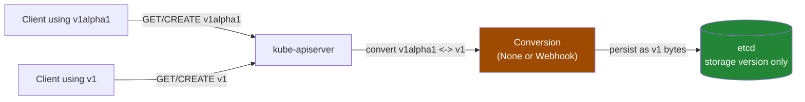
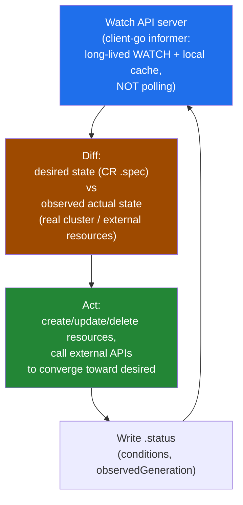

# Custom Resources, CRDs & the Operator Pattern

> A CRD teaches the API server a new noun (`kind`); a controller is the verb that actually does something with it. Confusing "I defined a CRD" with "I built an operator" is the single most common gap in interview answers on this topic — this doc draws that line sharply.

## What a CRD Actually Is

A **CustomResourceDefinition** registers a brand-new `kind` with the running `kube-apiserver` — no forking, no rebuilding, no separate binary. Once applied:

- The API server dynamically creates REST endpoints for it (e.g. `/apis/certs.example.com/v1/namespaces/*/certificates`)
- Objects of that kind are stored in **etcd**, exactly like Pods or Deployments — same storage, same watch mechanism, same resourceVersion/optimistic-concurrency semantics
- `kubectl get/describe/apply/edit/delete` all work automatically — kubectl talks to the discovery API, sees the new resource, and treats it like any built-in type
- **RBAC** applies natively — `Role`/`ClusterRole` rules referencing the CRD's group/resource work exactly like rules for built-in resources; nothing special to wire up

All of this comes for free, without writing a single line of a custom API server.

### CRDs vs. API Aggregation (`APIService`)

This is the other extension mechanism, and interviewers like to check you know it exists and *why you'd avoid it*.

| Aspect | CRD | API Aggregation (`APIService`) |
|---|---|---|
| Mechanism | Declarative object; built-in apiserver machinery serves it | You run a genuinely separate API server process, registered via `APIService`, that the main apiserver proxies requests to |
| Storage | Always etcd, via the standard apiserver storage layer | Fully custom — you can back it with any datastore |
| Business logic in request path | Not possible (pure CRUD + schema validation + optional webhooks) | Full control — arbitrary logic on every GET/LIST/WATCH/CREATE |
| Operational complexity | Low — one YAML manifest | High — you build, deploy, secure, and keep highly-available a real API server (TLS, auth, HA) |
| Examples | 99% of real-world extensions: cert-manager, Prometheus Operator, ArgoCD, Crossplane | `metrics.k8s.io` (metrics-server), `custom.metrics.k8s.io` |
| When to use | Almost always — default choice | Only when you need storage/behavior a CRD structurally cannot provide (e.g. metrics APIs that are never persisted to etcd) |

CRDs win by default because the operational cost of aggregation (running and securing another API server) is rarely justified — almost every "extend Kubernetes" use case is "store some structured desired-state, then reconcile it," which a CRD + controller handles completely.

---

## Structural Schemas: Validation at the API Layer

Modern CRDs (`apiextensions.k8s.io/v1`, GA since 1.16) **require** an OpenAPI v3 validation schema per version: `spec.versions[].schema.openAPIV3Schema`. This must be a **structural schema** — every field reachable from the root must have its `type` specified (no unconstrained `additionalProperties: true` blobs, no schema-less catch-alls).

Why this matters operationally: it moves validation from "some webhook or controller code notices bad input later" to "the API server itself rejects the request synchronously, before it's ever persisted." A `kubectl apply` with a typo'd field name or wrong type gets a `400` immediately — the same experience you get from a built-in resource like a Pod with a bad `restartPolicy` value.

Structural schemas also unlock:
- `kubectl explain <customkind>` — works automatically, no extra effort (see Debugging below)
- `additionalPrinterColumns` — custom columns in `kubectl get`
- Pruning of unknown fields by default (unless `x-kubernetes-preserve-unknown-fields: true` is set)
- Defaulting (`default:` values in the schema)

```bash
# Confirm the CRD's schema round-trips as structural (apiserver rejects non-structural on apply)
kubectl apply -f crd.yaml
kubectl get crd certificates.certs.example.com -o yaml | grep -A5 openAPIV3Schema
```

---

## Multi-Version CRDs: `served`, `storage`, and Conversion

A CRD can expose multiple API versions simultaneously (e.g. `v1alpha1` and `v1`) while an ecosystem migrates. Two independent booleans per version control this:

| Field | Meaning |
|---|---|
| `served` | Is this version reachable via the API at all? Clients can `kubectl get` / apply against it. |
| `storage` | Is this THE version etcd actually persists as bytes? **Exactly one** version across the whole `versions` list must set `storage: true` — never zero, never more than one. |

Every `served` version that is *not* the storage version gets converted to/from the storage version on every read/write. This conversion is the mechanism that lets old clients keep using `v1alpha1` while new clients use `v1` and etcd only ever stores one canonical shape.



### Conversion strategies

| Strategy | How it works | When it's safe |
|---|---|---|
| `None` (default) | Objects are returned unchanged across versions — apiserver does zero transformation | Only when versions are trivially compatible: pure additive fields with defaults, no renames, no restructuring |
| `Webhook` | apiserver calls a `ConversionReview` webhook (your own HTTPS service) that transforms the object between versions | Whenever schemas actually differ — renamed/restructured/split fields, changed types |

In `crd.yaml` in this folder, `v1alpha1.spec.dnsName` (singular string) became `v1.spec.dnsNames` (array) — a real structural change. `None` would silently drop or mismatch that field on conversion, so a **Conversion Webhook** is mandatory there. The webhook is just another `ClientConfig` pointing at a Service — same shape as a `ValidatingWebhookConfiguration`/`MutatingWebhookConfiguration`.

---

## The Most Important Point: A CRD Is Completely Inert

Defining `kind: Certificate` does exactly one thing: it lets you `kubectl apply` Certificate objects and have them land in etcd. **Nothing watches them. Nothing acts on them.** You can create a hundred Certificate objects and not a single TLS cert gets issued — the CRD has no more behavior than a JSON document store.

The thing that makes a CRD *do* something is a **Custom Controller** — ordinary code (usually Go, via `client-go`/`controller-runtime`) that:
1. Watches the API server for Certificate objects
2. Looks at each one's `spec`
3. Takes real action (calls Let's Encrypt, writes a Secret, whatever)
4. Writes results back to `status`

When a controller manages the **full lifecycle of an application** (not just one resource type, but install, upgrade, backup, scaling, failure recovery) it's conventionally called an **Operator**. Every operator is built from a controller; not every controller rises to the level of "operator" — the term is about scope of responsibility, not a different mechanism.

**CRD + Controller = Operator pattern.** This pairing is the single most important concept to nail in this whole topic.

---

## The Reconcile Loop

This is the actual mechanism every controller runs, whether it's a hand-rolled `client-go` informer loop or a `controller-runtime`-scaffolded operator.



**Watch, not poll.** `client-go` informers open a long-lived HTTP watch connection to the API server and maintain a local in-memory cache (an indexed store) kept in sync via that stream. Reconcile logic reads from the local cache, not from a fresh API call each time — cheap, low-latency, and doesn't hammer the apiserver. This is the same mechanism the built-in controllers in `kube-controller-manager` use.

**Level-triggered, not edge-triggered — this is the crux.** A well-written reconcile function does **not** try to reason about "what just changed" (that would be edge-triggered — fragile, and misses events lost during a restart). Instead it asks, every time it runs: *"given the current spec, what should reality look like, and does it look like that right now?"* It recomputes the full desired state from scratch and re-applies whatever's missing, every single time — regardless of whether it's the first reconcile ever or the 10,000th, and regardless of *why* it was triggered (could be a real spec change, could just be the periodic resync).

**Consequence: idempotency is a design requirement, not a nice-to-have.** Because the loop can be re-run at any time — after a crash, after a leader-election handover, on a resync timer even with zero changes — every action inside `Act` must be safe to execute repeatedly with no ill effect if the desired state is already achieved (`CreateOrUpdate`, not blind `Create`). This is precisely what makes controllers self-healing: if someone `kubectl delete`s a resource the controller created, the very next reconcile notices the diff and recreates it, with no special "someone deleted my thing" code path at all.

---

## Real-World CRDs Worth Namedropping

| Project | CRD(s) | What it automates |
|---|---|---|
| cert-manager | `Certificate`, `ClusterIssuer`/`Issuer` | TLS certificate issuance and automatic renewal (ACME/Let's Encrypt, Vault, custom CAs) |
| Prometheus Operator | `ServiceMonitor`, `PodMonitor`, `PrometheusRule` | Declarative scrape target discovery and alerting/recording rules, instead of hand-editing `prometheus.yml` |
| ArgoCD | `Application` | GitOps sync target — declares "this Git path should equal this cluster state," ArgoCD's controller continuously reconciles the diff |
| Crossplane | Composite Resources (`XRD`-defined), Managed Resources | Provisions actual cloud infrastructure (RDS instances, S3 buckets, VPCs) through Kubernetes-native objects and reconcile loops |

Naming these unprompted signals you've actually operated Kubernetes beyond the built-in object types, not just read the docs once.

---

## Operator Capability Model

A community-defined maturity ladder (originally from the Operator Framework) for describing *how much* an operator automates — useful vocabulary for grading an operator in conversation rather than a hard technical spec.

| Level | Capability |
|---|---|
| 1. Basic Install | Automated provisioning/installation of the managed application |
| 2. Seamless Upgrades | Patch and minor version upgrades handled automatically |
| 3. Full Lifecycle Management | App lifecycle actions: backup, restore, failure recovery, scaling triggered by the operator itself |
| 4. Deep Insights | Exposes metrics, alerts, log processing, workload analysis for the managed app |
| 5. Auto Pilot | Auto-scaling, auto-tuning, auto-healing — the operator makes and executes decisions with no human in the loop |

Most CRD-based tools you'll meet in the wild (cert-manager, Prometheus Operator) sit around level 2-3. Level 5 operators are rare and high-value — that's the pitch behind things like Crossplane compositions with drift-correction, or database operators that auto-tune based on observed load.

---

## Building One: kubebuilder / operator-sdk

You don't need to write reconcile loops from scratch. Two standard scaffolding tools generate the boilerplate on top of `client-go` and, more commonly today, **`controller-runtime`** (a higher-level framework that wraps informers, work queues, leader election, and the `Reconcile(ctx, req) (Result, error)` interface):

- **kubebuilder** — CNCF-adjacent, generates CRD manifests directly from Go struct tags (`+kubebuilder:validation:...` markers), scaffolds the Reconciler, webhook, and RBAC manifests
- **operator-sdk** (Operator Framework / Red Hat) — built on the same `controller-runtime` foundations; also supports Ansible- and Helm-based operators for teams that don't want to write Go

Both produce the same shape of artifact: CRD YAML + a Deployment running a controller binary with a `Reconcile` function you fill in. Knowing this — even without deep Go detail — signals you understand operators as *build targets*, not just things you consume from a Helm chart.

---

## Debugging & Verification

```bash
# Is the CRD even registered?
kubectl get crd
kubectl get crd certificates.certs.example.com -o yaml

# Structural schema pays off here — works automatically, no extra docs needed
kubectl explain certificate
kubectl explain certificate.spec.issuerRef

# Inspect an instance and its reconcile status
kubectl describe certificate api-tls-cert -n production
# Look at status.conditions — Ready=True/False, and the reason/message the
# controller wrote. A CR with NO status.conditions populated at all, ever,
# is a strong signal the controller isn't running or isn't watching this
# object/namespace — not that everything is fine.

# Find and check the controller/operator itself — it's just a Deployment
kubectl get pods -n cert-operator-system
kubectl logs -n cert-operator-system deploy/cert-operator-controller-manager -f
# Grep for reconcile errors, rate-limited requeues, webhook conversion failures
```

A healthy operator populates `status.conditions` with a `Ready`/`type` condition plus `observedGeneration` (so you can tell if status reflects the *current* spec or a stale one after an edit). If `metadata.generation` has moved past `status.observedGeneration`, the controller hasn't caught up yet — check its logs before assuming the resource itself is broken.

---

## Common Interview Questions

**Q: What's the difference between a CRD and a controller/operator?**
A CRD is purely a schema registration — it tells the API server "here's a new kind, here's its shape, store it in etcd, serve it over REST." It has zero behavior on its own. A controller is the code that watches objects of that kind and reconciles them toward reality; when that controller manages a whole application's lifecycle (install, upgrade, backup, scaling) it's called an operator. People conflate "I wrote a CRD" with "I built an operator" constantly — an interviewer probing this wants to hear you draw the line between the inert schema and the active reconciler explicitly.

**Q: Why would you choose CRDs over API aggregation (APIService)?**
Almost always for operational cost. A CRD is a YAML manifest served entirely by the existing apiserver machinery — storage, watch, RBAC, discovery all come free. API aggregation means standing up and operating a genuinely separate API server process (TLS, HA, auth, its own failure modes) that the main apiserver proxies to. You only reach for aggregation when a CRD's constraints are a hard blocker — most commonly when the data should never be persisted to etcd at all, like `metrics.k8s.io`, which serves live numbers computed on the fly rather than stored objects.

**Q: What does `served` vs `storage` control on a multi-version CRD, and what happens if you get it wrong?**
`served` controls whether clients can call that version's endpoints at all; `storage` controls which single version's byte representation etcd actually persists. Exactly one version must have `storage: true` — the apiserver rejects the CRD otherwise. Every other served version gets converted to/from the storage version on every read and write. Get it wrong (e.g. flip storage to a version with an incompatible or buggy conversion) and you risk silently corrupting or truncating fields on existing objects the next time they're touched, since the "true" persisted shape has changed underneath clients still reading the old version.

**Q: When do you need a Conversion Webhook instead of the default `None` strategy?**
`None` just passes the object through unchanged across versions — safe only when the versions are wire-compatible, e.g. purely additive fields with sane defaults. The moment a field is renamed, restructured (string to array, nested object reshaped), or split, `None` will silently drop or misinterpret data during conversion. A Conversion Webhook is a small HTTPS service you run that the apiserver calls with a `ConversionReview` request to do the actual field-by-field transform. It's mandatory whenever schema evolution isn't trivial, and it's a common outage source if the webhook is unavailable — conversions fail closed, so if your webhook pod is down, `kubectl get` on the non-storage version can start erroring.

**Q: Why are reconcile loops described as level-triggered rather than edge-triggered, and why does that matter?**
An edge-triggered design reacts to "what changed" — fragile, because you can miss events (controller restart, watch reconnect gaps) and then never notice a resource needs attention. A level-triggered design ignores history entirely: on every invocation it asks "given the spec right now, what should exist, and does it exist?" and converges toward that, regardless of whether it's reacting to a real change, a periodic resync, or a cold start after a crash. This is what makes controllers safe to kill and restart at any point, and what makes them self-healing — if something outside the controller deletes a resource it owns, the very next reconcile just recreates it with no special-cased "detect deletion" logic.

**Q: Why does idempotency matter so much for controller actions, specifically?**
Because a level-triggered loop can and will run the same logic on an already-converged object — on every resync interval, on every unrelated watch event that happens to touch the object, after every restart. If `Act` does a blind `Create()` on every run, the second reconcile after the resource already exists fails or duplicates it. Real controllers use `CreateOrUpdate`/`Apply`-style patches so re-running the reconcile when nothing actually needs to change is a safe no-op. This is a design requirement baked into `controller-runtime`'s API, not an edge case you bolt on later.

**Q: How do you verify an operator is actually healthy in a running cluster, not just that the CRD exists?**
`kubectl get crd` and `kubectl explain <kind>` only tell you the schema is registered — they say nothing about whether anything is reconciling. Check `kubectl describe <customresource>` for `status.conditions`: a well-built operator populates a `Ready` condition (and ideally `observedGeneration`) after every reconcile. A CR that's been sitting there with an empty `status` block is the tell that the controller pod isn't running, isn't watching that namespace, or is stuck erroring before it ever calls the status-update. Cross-check with `kubectl logs` on the controller Deployment for reconcile errors, and compare `metadata.generation` against `status.observedGeneration` to catch a controller that's alive but lagging behind the latest spec edit.

**Q: What's a structural schema and why did Kubernetes make it mandatory?**
A structural OpenAPI v3 schema requires every field reachable from the root to declare an explicit `type` — no untyped catch-all blobs. It moved CRD validation from "hope a webhook or the controller catches bad input" to "the apiserver itself rejects malformed objects synchronously at admission, before they ever reach etcd." It's also the prerequisite for several conveniences that used to require extra tooling: automatic `kubectl explain` support, defaulting, pruning of unknown fields, and `additionalPrinterColumns` in `kubectl get` output — all of it derives from the schema being structural enough for the apiserver to reason about.
