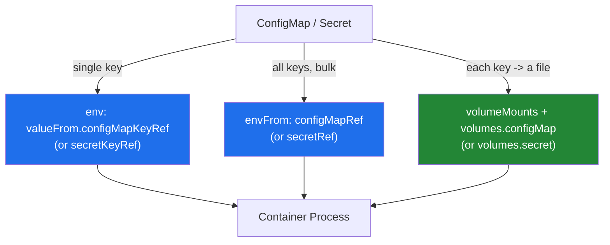
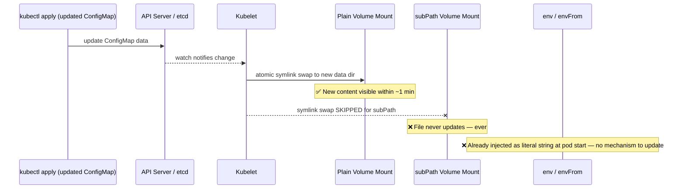
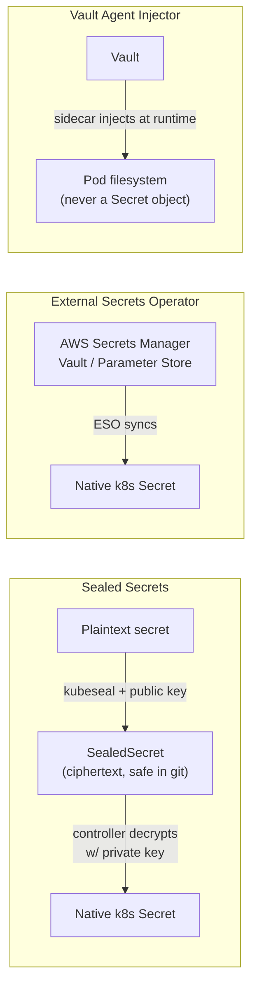

# Kubernetes ConfigMap & Secret

> Decouple configuration and credentials from container images. Both are key-value API objects consumed the same way (env var or volume mount) — the difference is Secrets get base64 encoding, tighter RBAC defaults, and (if you configure it) encryption at rest. Most production incidents here aren't about the objects themselves — they're about stale config after an update, or an RBAC role that "just grants read" and actually leaks every secret in the namespace.

## Creation Methods

| Method | Command | Use case |
|--------|---------|----------|
| Literal | `kubectl create configmap app-config --from-literal=LOG_LEVEL=info` | One or two ad-hoc key-value pairs |
| From file | `kubectl create configmap app-config --from-file=app.properties` | Whole config file as a single key (filename becomes key) |
| From directory | `kubectl create configmap app-config --from-file=./config/` | Multiple files → multiple keys in one object |
| From env-file | `kubectl create configmap app-config --from-env-file=app.env` | `KEY=VALUE` per line, bulk import (e.g., `.env` files) |

Secrets mirror the same flags, plus type-specific helpers:

```bash
kubectl create secret generic db-creds --from-literal=username=admin --from-literal=password='S3cr3t!'
kubectl create secret tls web-tls --cert=tls.crt --key=tls.key
kubectl create secret docker-registry regcred \
  --docker-server=ghcr.io --docker-username=me --docker-password=$GH_TOKEN
```

✅ Declarative YAML (checked into git) is preferred for anything beyond ad-hoc debugging — imperative `create` commands aren't reproducible or reviewable. See `configmap.yaml` / `secret.yaml` in this directory for full examples.

---

## Consumption Methods

Three ways to get a ConfigMap/Secret into a running container — same mechanics for both object types.



```yaml
# Single key -> single env var
env:
  - name: LOG_LEVEL
    valueFrom:
      configMapKeyRef:
        name: app-config
        key: LOG_LEVEL

# Every key in the object -> an env var (bulk, no per-key wiring)
envFrom:
  - configMapRef:
      name: app-config
  - secretRef:
      name: db-creds

# Volume mount: each key becomes a file under mountPath
volumes:
  - name: config-volume
    configMap:
      name: app-config
containers:
  - volumeMounts:
      - name: config-volume
        mountPath: /etc/app/config
```

| Method | Live update on change? | Notes |
|--------|------------------------|-------|
| `env` via `valueFrom` | ❌ Never | Captured once at container start. Requires pod restart to pick up new values. |
| `envFrom` | ❌ Never | Same as above — bulk doesn't change the freezing behavior. |
| Volume mount (no `subPath`) | ✅ Eventually (~1 min, or near-instant with watch cache) | kubelet syncs the mounted content periodically. App must re-read the file (or watch it) to notice. |
| Volume mount **with `subPath`** | ❌ Never | See gotcha below — this is the #1 "why isn't my config change taking effect" bug. |

---

## Secret Types

| Type | Purpose | Key fields |
|------|---------|-----------|
| `Opaque` | Generic, unstructured key-value data (default) | Any keys you define |
| `kubernetes.io/tls` | Cert + private key pair, consumed directly by Ingress `spec.tls` | `tls.crt`, `tls.key` (exact key names required) |
| `kubernetes.io/dockerconfigjson` | Image pull credentials for private registries | `.dockerconfigjson` |
| `kubernetes.io/service-account-token` | Auto-mounted token for a ServiceAccount to authenticate to the API server | `token`, `ca.crt`, `namespace` |
| `kubernetes.io/basic-auth` | Username/password pair, standardized keys | `username`, `password` |
| `kubernetes.io/ssh-auth` | SSH private key | `ssh-privatekey` |

```yaml
apiVersion: v1
kind: Secret
metadata:
  name: web-tls
type: kubernetes.io/tls        # Ingress reads this type directly — no custom logic needed
data:
  tls.crt: LS0tLS1CRUdJTi...   # base64(PEM cert chain)
  tls.key: LS0tLS1CRUdJTi...   # base64(PEM private key)
---
apiVersion: networking.k8s.io/v1
kind: Ingress
metadata:
  name: web
spec:
  tls:
    - hosts: ["app.example.com"]
      secretName: web-tls       # Ingress controller reads tls.crt/tls.key from this secret
  rules:
    - host: app.example.com
      http:
        paths:
          - path: /
            pathType: Prefix
            backend:
              service:
                name: web-svc
                port: { number: 80 }
```

### Base64 is encoding, not encryption

```bash
echo -n 'S3cr3t!' | base64        # -> UzNjcjN0IQ==
echo -n 'UzNjcjN0IQ==' | base64 -d  # -> S3cr3t!  (trivially reversible, no key needed)
```

`kubectl get secret db-creds -o jsonpath='{.data.password}' | base64 -d` recovers the plaintext instantly for anyone with `get` RBAC on that object. Base64 exists so binary/arbitrary data survives JSON/YAML transport — it is **not** a security control. Treat Secret manifests as equivalent to plaintext credentials for access-control purposes.

---

## etcd-at-Rest: The Encryption Gap

By default, Secrets are stored in etcd **base64-encoded, not encrypted**. Anyone with access to etcd directly, or to an etcd snapshot/backup, can extract every secret in the cluster in plaintext-equivalent form — RBAC on the Kubernetes API doesn't protect data at the storage layer.

Real encryption at rest requires configuring an `EncryptionConfiguration` on the API server, backed by a KMS provider:

```yaml
# /etc/kubernetes/encryption-config.yaml — referenced via --encryption-provider-config on kube-apiserver
apiVersion: apiserver.config.k8s.io/v1
kind: EncryptionConfiguration
resources:
  - resources: ["secrets"]
    providers:
      - kms:
          name: aws-kms
          endpoint: unix:///var/run/kmsplugin/socket.sock  # aws-encryption-provider sidecar talks to AWS KMS
          cachesize: 1000
          timeout: 3s
      - identity: {}   # fallback — leave last so existing unencrypted secrets remain readable during migration
```

Without this, `etcdctl get /registry/secrets/production/db-creds` (with direct etcd access) returns the base64 blob in the clear — no additional barrier. Managed services (EKS, GKE) offer this as a checkbox (EKS: "Secrets encryption" using a customer KMS key) — always enable it for production clusters holding real credentials.

```bash
# Verify a secret is actually encrypted in etcd (requires etcd access, run from a control-plane node)
ETCDCTL_API=3 etcdctl get /registry/secrets/production/db-creds --print-value-only | hexdump -C | head -1
# Encrypted: starts with k8s:enc:kms:v1: or k8s:enc:aescbc:v1:
# Unencrypted: readable base64/JSON structure
```

---

## RBAC Nuance: `get` vs `list`/`watch` on Secrets

This is the most commonly over-permissioned RBAC mistake in real clusters.

| Verb | What it actually grants | Risk |
|------|--------------------------|------|
| `get` | Read **one named secret** — caller must already know the name | Bounded — limited to secrets the caller explicitly requests and is scoped to |
| `list` | Read the **full contents (including `data`) of every secret** matching the query in that namespace | Effectively read-access to ALL secrets, not just names |
| `watch` | Same as `list`, but streamed continuously — every future secret content too | Same blast radius as `list`, ongoing |

```yaml
# DANGEROUS — looks like "read-only," actually leaks every secret in the namespace
apiVersion: rbac.authorization.k8s.io/v1
kind: Role
metadata:
  name: looks-safe-readonly
  namespace: production
rules:
  - apiGroups: [""]
    resources: ["secrets"]
    verbs: ["list", "watch"]   # returns full Secret objects, not just names — data included

---
# SAFER — scope get to specific named resources only, never grant list/watch on secrets broadly
apiVersion: rbac.authorization.k8s.io/v1
kind: Role
metadata:
  name: scoped-secret-reader
  namespace: production
rules:
  - apiGroups: [""]
    resources: ["secrets"]
    verbs: ["get"]
    resourceNames: ["db-creds", "web-tls"]   # explicit allowlist — no wildcard discovery
```

```bash
# Audit: find any Role/ClusterRole granting list or watch on secrets
kubectl get roles,clusterroles -A -o json | \
  jq -r '.items[] | select(.rules[]? | .resources[]? == "secrets" and (.verbs[]? == "list" or .verbs[]? == "watch")) | .metadata.name'
```

If a team asks for "read-only access to secrets for debugging," grant `get` with an explicit `resourceNames` list — never blanket `list`/`watch`.

---

## The Auto-Reload Gotcha (subPath vs env vars vs plain volume mounts)



- **Plain volume mount:** kubelet maintains the ConfigMap/Secret content locally and periodically syncs it (default sync period, or near-immediate with the watch-based cache in newer kubelet versions). Kubernetes updates the file by creating a new versioned directory and **atomically swapping a symlink** — apps see the new content the next time they open the file.
- **`subPath` volume mount:** breaks this mechanism entirely. `subPath` bind-mounts a single file/path out of the source volume directly, so there's no symlink to swap — the file is **frozen at whatever it was when the pod started**, permanently, until the pod is recreated. This is the single most common "I updated the ConfigMap and nothing changed" production bug.
- **Env vars (`valueFrom` or `envFrom`):** injected once by kubelet at container start as literal process environment — there is no live-update mechanism at all, `subPath` or not. Only a pod restart re-reads the source object.

```bash
# Confirm what a running pod actually sees vs what's currently in the ConfigMap
kubectl get configmap app-config -o yaml
kubectl exec -it app-demo -- cat /etc/app/config/app.properties
# If these differ and the mount isn't subPath, give it ~60s and re-check before assuming it's broken
```

**Rule of thumb:** avoid `subPath` for anything expected to change at runtime. If you must mount a single file from a ConfigMap (e.g., to avoid clobbering an existing directory), accept that updates require a pod restart, or restructure to mount the whole directory instead.

---

## Immutable ConfigMaps & Secrets

```yaml
apiVersion: v1
kind: ConfigMap
metadata:
  name: app-config-a1b2c3d4   # hash-suffixed name — the object is never edited, only replaced
immutable: true                # rejects any update to `data`/`binaryData` — must delete+recreate or version the name
data:
  LOG_LEVEL: "info"
```

**Performance benefit:** kubelet and the API server skip setting up a watch on immutable objects, since they're guaranteed never to change. At scale (thousands of pods each mounting ConfigMaps), this measurably reduces API server load and kubelet memory/CPU spent tracking watches.

**Safety benefit:** prevents an accidental in-place `kubectl edit` from silently changing config under a running fleet (which, combined with the subPath gotcha above, produces very confusing partial rollouts). To change an immutable object, you create a **new object with a new name** — conventionally content-hash-suffixed — and update the Deployment/Pod spec to reference it.

This is exactly the pattern **Kustomize's `configMapGenerator`** automates: it computes a hash of the ConfigMap content, appends it to the name, and rewrites every reference to it automatically, so a content change always produces a new object name and a genuinely new Deployment spec (which naturally triggers a rollout — see below).

---

## Triggering a Rollout When Config Changes

Deployments do **not** automatically restart pods when a referenced ConfigMap/Secret changes — the pod template hash is unaffected because the reference (the name) hasn't changed, only the content. Three standard patterns:

| Pattern | Mechanism | Trade-off |
|---------|-----------|-----------|
| Checksum annotation | Hash of the ConfigMap content injected as a pod template annotation | Manual/templated (Helm idiom); simple, no extra controller |
| Reloader (stakater) | Controller watches ConfigMaps/Secrets, triggers `kubectl rollout restart` on annotated Deployments | Extra controller to run/maintain; works with any manifest tooling, not just Helm |
| Kustomize `configMapGenerator` | Name-hash suffix changes → Deployment spec itself changes → rollout is automatic | Cleanest — no annotation trick needed, but requires Kustomize-based workflow |

```yaml
# Helm-chart idiom: checksum annotation forces the pod template to differ whenever the ConfigMap does
spec:
  template:
    metadata:
      annotations:
        checksum/config: "{{ include (print $.Template.BasePath \"/configmap.yaml\") . | sha256sum }}"
        # any change to configmap.yaml's rendered content changes this annotation,
        # which changes the pod template hash, which triggers a normal rolling update
```

```yaml
# Reloader: annotate the Deployment, no changes needed to how the ConfigMap/Secret itself is managed
apiVersion: apps/v1
kind: Deployment
metadata:
  name: web
  annotations:
    reloader.stakater.com/auto: "true"   # restarts this Deployment's pods when ANY mounted CM/Secret changes
```

```bash
# Manual equivalent while debugging (or if no automation is wired up)
kubectl rollout restart deployment/web -n production
kubectl rollout status deployment/web -n production
```

Kustomize's approach is covered in more depth in the dedicated Kustomize notes — the short version is `configMapGenerator` + `nameSuffixHash` gives you immutability and automatic rollouts for free, at the cost of managing manifests through Kustomize.

---

## External Secrets Management for Production

Native Kubernetes Secrets have two structural weaknesses: base64 isn't encryption, and the source of truth lives inside the cluster (and often gets copied into git as plaintext YAML by accident). Three common approaches, in increasing order of isolation:



| Approach | Source of truth | Blast radius if etcd compromised | Blast radius if git compromised | Notes |
|----------|------------------|-----------------------------------|-----------------------------------|-------|
| **Sealed Secrets** | Git (ciphertext) + cluster (private key) | Full — decrypted Secret still lives in etcd like any other | None — ciphertext is safe to commit; only the cluster's private key can decrypt | Simplest to adopt; still ends up as a native Secret in etcd, so etcd encryption-at-rest still matters |
| **External Secrets Operator (ESO)** | External vault (AWS Secrets Manager, Parameter Store, HashiCorp Vault) | Full — ESO materializes a native Secret in etcd too | None — nothing secret-shaped is ever in git | Source of truth fully outside both cluster and git; rotation happens centrally in the external store |
| **Vault Agent Injector** | Vault only | None — secret is never persisted as a k8s object at all, only in the pod's in-memory/tmpfs filesystem | None | Strongest isolation; adds a sidecar + Vault dependency to every pod's startup path |

**Recommendation:** default to **External Secrets Operator** for most production teams — it removes secrets from git entirely (bigger real-world leak vector than etcd) while still giving you native `Secret` objects that existing tooling (env vars, volume mounts, Helm charts) already knows how to consume. Reach for **Vault Agent Injector** only when you specifically need to guarantee secrets never touch etcd at all (strict compliance/blast-radius requirements) — it's the strongest isolation but adds real operational overhead per pod. Use **Sealed Secrets** only as a lightweight upgrade path when you can't yet stand up an external secrets store but need to stop committing plaintext YAML to git.

---

## Common Interview Questions

**Q: Is a Kubernetes Secret actually secure?**
No, not by itself. The `data` field is base64-encoded, which is encoding, not encryption — trivially reversible with `base64 -d`, no key required. Real security comes from three separate layers stacked on top: RBAC restricting who can `get`/`list` the object, encryption at rest via an `EncryptionConfiguration` + KMS provider so etcd itself doesn't hold plaintext-equivalent data, and network/transport encryption (TLS to the API server). Treat "it's a Secret object" as organizational convention, not a security guarantee — anyone who can read it via the API, or read etcd directly without encryption-at-rest configured, has the plaintext.

**Q: Why is granting `list` on secrets more dangerous than granting `get`?**
`get` requires the caller to already know and name a specific secret — it's bounded to exactly what they ask for. `list` (and `watch`) returns the full Secret objects — including `data` — for everything matching the query, which in practice means every secret in the namespace (or cluster, for ClusterRole). A role that says "read-only access to secrets" using `list` isn't giving visibility into what secrets exist — it's handing over the contents of all of them. This is one of the most common RBAC over-permissioning mistakes; the fix is `get` scoped with an explicit `resourceNames` allowlist.

**Q: I updated a ConfigMap but the running pod still has the old value — why?**
Depends on how it's consumed. If it's an env var (`valueFrom` or `envFrom`), it was captured once at container start and will never update without a pod restart — full stop. If it's a volume mount, kubelet does sync it (periodic sync, roughly a minute, or faster with the watch-based cache) via an atomic symlink swap — but if the mount uses `subPath`, that symlink-swap mechanism is bypassed entirely and the file is frozen forever at pod-start content. Check whether the consumption is env-based or subPath-based before assuming propagation is just slow.

**Q: How do you actually trigger a rollout when a ConfigMap changes, given Deployments don't watch them?**
Since the Deployment's pod template only changes if something in the pod spec itself changes, you need to force that: a checksum/hash annotation of the ConfigMap content on the pod template (the common Helm pattern) so any content change alters the annotation and triggers a normal rolling update; the Reloader controller, which watches ConfigMaps/Secrets and issues rollout restarts for annotated Deployments without touching the chart; or Kustomize's `configMapGenerator`, which name-hashes the ConfigMap so a content change produces a genuinely new object name and reference, triggering a rollout as a side effect of the name change itself.

**Q: What's the benefit of marking a ConfigMap or Secret `immutable: true`?**
Two distinct benefits. Performance: the API server and kubelet skip setting up watches on immutable objects since they can never change, which measurably reduces load at scale (thousands of pods watching thousands of ConfigMaps adds up). Safety: it prevents an accidental in-place edit from silently corrupting config under a live fleet — you're forced to create a new object with a new name (typically hash-suffixed) and update the Deployment reference, which also naturally produces a new pod template and a clean rollout, rather than pods picking up a half-changed ConfigMap mid-edit.

**Q: Walk me through the Secret types you'd actually use in a real cluster.**
`Opaque` is the generic catch-all for arbitrary key-value data like DB credentials. `kubernetes.io/tls` holds exactly `tls.crt`/`tls.key` and is consumed directly by an Ingress's `spec.tls` — the Ingress controller reads it without any custom glue. `kubernetes.io/dockerconfigjson` holds registry auth and is referenced via `imagePullSecrets` so kubelet can pull from a private registry. `kubernetes.io/service-account-token` is auto-created (or requested via the TokenRequest API in modern clusters) and auto-mounted into pods so they can authenticate to the API server as their ServiceAccount — this is the one most people never create by hand but interact with constantly through `kubectl exec`-style debugging of pod identity issues.

**Q: How would you get secrets into a cluster without ever putting plaintext in git or trusting etcd's default state?**
Three tiers depending on how strict you need to be. Sealed Secrets encrypts client-side with a public key so ciphertext is safe to commit to git, decrypted in-cluster by a controller holding the private key — simplest to adopt but still ends up as a native Secret sitting in etcd. External Secrets Operator syncs from an external store (AWS Secrets Manager, Parameter Store, Vault) into native k8s Secrets, keeping the actual source of truth entirely outside the cluster and out of git — my default recommendation for most teams since it eliminates the far more common git-leak vector while still producing objects existing tooling understands. Vault Agent Injector goes furthest: a sidecar injects secrets straight into the pod's filesystem at runtime and they're never persisted as a Secret object at all, giving the strongest isolation at the cost of a Vault dependency and sidecar overhead on every pod.

**Q: Does encryption at rest happen by default in Kubernetes?**
No. Out of the box, Secrets are stored in etcd as base64 — readable by anyone with etcd access or an etcd backup, with no encryption layer at all. Enabling real encryption requires configuring an `EncryptionConfiguration` on the API server specifying a provider — `identity` (no-op, default), `aescbc`/`aesgcm` (local key, weaker key management), or a `kms` provider that delegates to an external key management service like AWS KMS via the `aws-encryption-provider` sidecar. Managed clusters (EKS, GKE) expose this as a setup-time checkbox — skipping it means every etcd snapshot or backup is effectively a plaintext credential dump.
