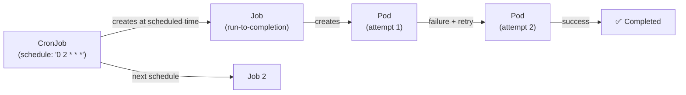

# Kubernetes CronJob

> Schedule Jobs to run at specific times or intervals. Uses cron syntax. Each CronJob run creates a Job, which creates one or more Pods.

## CronJob → Job → Pod Hierarchy



## Full CronJob Example

```yaml
apiVersion: batch/v1
kind: CronJob
metadata:
  name: db-backup
  namespace: production
spec:
  schedule: "0 2 * * *"             # 2am daily (UTC)
  timeZone: "Asia/Kolkata"          # K8s 1.27+ supports timezone
  concurrencyPolicy: Forbid         # don't start if previous still running
  successfulJobsHistoryLimit: 3     # keep last 3 successful job records
  failedJobsHistoryLimit: 5         # keep last 5 failed job records
  startingDeadlineSeconds: 300      # if missed schedule by 5min, skip
  jobTemplate:
    spec:
      backoffLimit: 3               # retry up to 3 times on failure
      activeDeadlineSeconds: 3600   # kill job if still running after 1hr
      completions: 1                # number of successful pods required
      parallelism: 1                # run 1 pod at a time
      template:
        spec:
          restartPolicy: OnFailure  # CronJob pods must use OnFailure or Never
          containers:
            - name: backup
              image: postgres:15
              command:
                - /bin/sh
                - -c
                - |
                  pg_dump -h $DB_HOST -U $DB_USER $DB_NAME | \
                  gzip | \
                  aws s3 cp - s3://my-backups/$(date +%Y-%m-%d)/backup.sql.gz
              env:
                - name: DB_HOST
                  value: "postgres.prod.svc.cluster.local"
                - name: DB_USER
                  valueFrom:
                    secretKeyRef:
                      name: db-creds
                      key: username
                - name: DB_NAME
                  value: "mydb"
                - name: PGPASSWORD
                  valueFrom:
                    secretKeyRef:
                      name: db-creds
                      key: password
              resources:
                requests:
                  cpu: 100m
                  memory: 256Mi
                limits:
                  memory: 512Mi
          serviceAccountName: backup-sa    # IRSA for S3 access
```

## Cron Schedule Syntax

```
┌───────────── minute (0-59)
│ ┌───────────── hour (0-23)
│ │ ┌───────────── day of month (1-31)
│ │ │ ┌───────────── month (1-12)
│ │ │ │ ┌───────────── day of week (0-6, Sunday=0)
│ │ │ │ │
* * * * *
```

| Schedule | Description |
|----------|-------------|
| `0 2 * * *` | Daily at 2am |
| `*/15 * * * *` | Every 15 minutes |
| `0 0 * * 0` | Every Sunday midnight |
| `0 9-17 * * 1-5` | Every hour, 9am-5pm, Mon-Fri |
| `0 0 1 * *` | First day of every month |
| `@daily` | Once a day at midnight |
| `@hourly` | Once an hour at :00 |

## ConcurrencyPolicy

| Policy | Behavior | Use case |
|--------|----------|---------|
| `Allow` | New job starts even if previous still running | Independent runs |
| `Forbid` | Skip new run if previous still running | DB backup (no overlap) |
| `Replace` | Kill previous, start new | Data sync (always want latest) |

## Job vs CronJob

| | Job | CronJob |
|--|-----|---------|
| Trigger | Manual / one-shot | Scheduled (cron) |
| Use case | Database migration, batch import | Backups, reports, cleanups |
| Recurrence | Run once to completion | Repeating schedule |

```bash
# Manually trigger a CronJob immediately (for testing)
kubectl create job --from=cronjob/db-backup manual-backup-test -n production

# Check CronJob status
kubectl get cronjob db-backup -n production
kubectl describe cronjob db-backup -n production

# See created jobs
kubectl get jobs -n production --sort-by=.metadata.creationTimestamp

# See pods from a job
kubectl get pods -l job-name=db-backup-28900080 -n production

# View logs
kubectl logs -l job-name=db-backup-28900080 -n production
```

## Common Patterns

### Parallel Work Distribution

```yaml
spec:
  completions: 10    # need 10 successful pods
  parallelism: 3     # run 3 at a time
```

The Job creates batches of pods until all `completions` finish successfully.

### Suspend CronJob (Maintenance Window)

```bash
# Pause
kubectl patch cronjob db-backup -p '{"spec":{"suspend":true}}'

# Resume
kubectl patch cronjob db-backup -p '{"spec":{"suspend":false}}'
```

## Common Interview Questions

**Q: CronJob vs Job — when to use each?**
Job for: one-time tasks (database migration before a deploy, ad-hoc data import, generate a one-time report). CronJob for: recurring scheduled tasks (nightly backups, hourly metric snapshots, weekly cleanups). CronJob creates a new Job on each schedule trigger — it's just a scheduler wrapper around Job.

**Q: What `restartPolicy` can CronJob pods use?**
Only `OnFailure` or `Never` — not `Always`. `Always` is for long-running services (Deployments). CronJob pods are batch workloads that should run to completion, so `Always` would cause them to restart indefinitely even after success. Use `OnFailure` to retry failed pods up to `backoffLimit`.

**Q: What happens if a CronJob misses its schedule?**
If `startingDeadlineSeconds` is set, Kubernetes counts missed schedules within that window. If more than 100 schedules are missed (e.g., clock skew or controller down), the CronJob is disabled with an error. Set a reasonable `startingDeadlineSeconds` (e.g., 300 for non-critical jobs) so missed schedules don't block future ones.

**Q: How do you prevent CronJob overlaps?**
Set `concurrencyPolicy: Forbid` — if the previous Job is still running when the new schedule fires, the new run is skipped. Use this for backup jobs, report generators, anything that would cause data corruption or double-processing if run concurrently. Set `activeDeadlineSeconds` to ensure runaway jobs eventually get killed.
