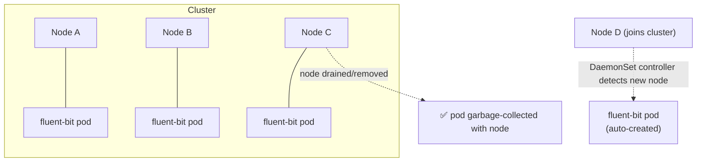

# Kubernetes DaemonSet

> Ensures exactly one copy of a pod runs on every node (or every matching node) in the cluster — used for node-level agents (logging, monitoring, CNI, CSI, security) that must exist wherever a node exists, not for horizontally-scaled application replicas.

## Core Guarantee

A DaemonSet has no `replicas` field. The pod count is **derived from cluster topology**, not something you set: one pod per node that matches the DaemonSet's node selector/affinity (or every node, if unconstrained). When a new node joins the cluster, the DaemonSet controller automatically schedules a pod onto it. When a node is removed/drained/deleted, its pod is garbage-collected with it. This is fundamentally different from a Deployment, where the controller doesn't care which node a replica lands on — it only cares about hitting a replica count.



## Common Real-World Use Cases

| Category | Examples | Why DaemonSet |
|---|---|---|
| Log/metrics collection | Fluent Bit, Filebeat, Prometheus Node Exporter, Datadog Agent | Needs to read host log files / host `/proc`, `/sys` on every node |
| CNI plugins | Calico (`calico-node`), Cilium | Networking must be programmed on every node before pods can get IPs |
| CSI node plugins | `csi-node-driver` (EBS, GCE PD, Azure Disk) | Volume mount/unmount operations happen on the node the pod is scheduled to |
| Security/compliance agents | Falco, security scanners, endpoint agents | Runtime threat detection needs a sensor on every node, including control-plane |

## Scheduling Mechanics: Since Kubernetes 1.12

Pre-1.12, the DaemonSet controller placed pods directly, bypassing the default scheduler entirely — it just set `spec.nodeName` itself. This caused problems: DaemonSet pods didn't go through normal predicates, so they could ignore node resource pressure, taints logic inconsistencies, and other scheduling constraints that regular pods respected, leading to divergent behavior and duplicated scheduling logic to maintain.

Since 1.12 (`ScheduleDaemonSetPods` became default and was later removed as a feature gate — it's just how it works now), the DaemonSet controller instead creates the pod with a **required node affinity term** referencing the exact node (`kubernetes.io/hostname: <node>`), and hands it to the normal kube-scheduler like any other pod. This unifies scheduling logic: the same predicates (resource fit, taints, affinity, pod topology) are evaluated consistently for every pod type, and DaemonSet pods correctly show up as `Pending` when a node genuinely lacks capacity instead of being force-placed.

| | Pre-1.12 | 1.12+ (current) |
|---|---|---|
| Placement | DaemonSet controller sets `nodeName` directly | Controller injects required node affinity; kube-scheduler places the pod |
| Respects resource pressure | No — could be force-placed | Yes — normal scheduling predicates apply |
| Consistent with other pod types | No — separate code path | Yes — single scheduling code path |

## Full DaemonSet Example (Fluent Bit Log Agent)

```yaml
apiVersion: apps/v1
kind: DaemonSet
metadata:
  name: fluent-bit
  namespace: kube-system
spec:
  selector:
    matchLabels:
      app: fluent-bit
  updateStrategy:
    type: RollingUpdate
    rollingUpdate:
      maxUnavailable: 1        # update 1 node's agent pod at a time
  template:
    metadata:
      labels:
        app: fluent-bit
    spec:
      serviceAccountName: fluent-bit
      priorityClassName: system-node-critical   # protect from preemption under node pressure
      tolerations:
        - key: node-role.kubernetes.io/control-plane   # required to run on control-plane nodes
          operator: Exists
          effect: NoSchedule
      containers:
        - name: fluent-bit
          image: fluent/fluent-bit:2.2
          resources:
            requests:           # multiplied across EVERY node in the fleet — see gotcha below
              cpu: 50m
              memory: 64Mi
            limits:
              cpu: 200m
              memory: 128Mi
          volumeMounts:
            - name: varlog
              mountPath: /var/log
              readOnly: true
            - name: varlibdockercontainers
              mountPath: /var/lib/docker/containers
              readOnly: true
      volumes:
        - name: varlog
          hostPath:
            path: /var/log                      # host node's log directory
        - name: varlibdockercontainers
          hostPath:
            path: /var/lib/docker/containers     # container stdout/stderr files
```

Full example with both the agent and a GPU-only variant: `daemonset.yaml` in this folder.

## Tolerations and Node Taints

Regular pods are repelled from tainted nodes unless they carry a matching toleration. A node-level agent that must run *everywhere* — including the control-plane — needs explicit tolerations for it:

```yaml
tolerations:
  - key: node-role.kubernetes.io/control-plane
    operator: Exists
    effect: NoSchedule
```

DaemonSet pods also get several **built-in tolerations automatically added by the API server**, without you writing them — this is DaemonSet-specific behavior, not something regular pods get:

| Taint | Effect | Purpose |
|---|---|---|
| `node.kubernetes.io/not-ready` | `NoExecute` | Auto-tolerated (no `tolerationSeconds`) so the agent isn't evicted when a node briefly goes `NotReady` |
| `node.kubernetes.io/unreachable` | `NoExecute` | Auto-tolerated — survives transient network partitions to the node |
| `node.kubernetes.io/disk-pressure`, `memory-pressure`, `pid-pressure` | `NoSchedule` | Auto-tolerated — agent keeps monitoring/collecting even while the node is under resource pressure |
| `node.kubernetes.io/unschedulable` | `NoSchedule` | Auto-tolerated — agent still runs on cordoned nodes |

This matters operationally: a regular Deployment pod gets evicted from a node that goes `NotReady` for more than `tolerationSeconds` (default 300s); a DaemonSet pod for a monitoring agent does **not**, by design — you want visibility into the node precisely while it's having trouble.

## Targeting a Subset of Nodes

Not every DaemonSet needs to run on every node. The standard pattern for restricting to a subset — e.g., an NVIDIA device plugin that only makes sense on GPU nodes — is `nodeSelector` (or node affinity for more complex matching) combined with a matching toleration for any custom taint on those nodes:

```yaml
spec:
  template:
    spec:
      nodeSelector:
        accelerator: nvidia-gpu     # only nodes carrying this label get a pod
      tolerations:
        - key: nvidia.com/gpu
          operator: Exists
          effect: NoSchedule
```

Nodes without the label simply never get a pod scheduled — no `Pending` pod is created for them, unlike a Deployment where a `nodeSelector` mismatch across all nodes leaves replicas stuck `Pending`.

## Update Strategies

| Strategy | Behavior | When to use |
|---|---|---|
| `RollingUpdate` (default) | Controller deletes and recreates pods node-by-node, respecting `maxUnavailable` | Standard case — most logging/monitoring/CNI agents |
| `OnDelete` | New pod spec is saved, but old pods are left running until **you manually delete** the pod on that node | Sensitive infra agents (CNI, CSI) where you need to control rollout timing per node — e.g., upgrade CNI on one node, validate networking, then proceed manually |

```yaml
updateStrategy:
  type: RollingUpdate
  rollingUpdate:
    maxUnavailable: 1    # or a percentage, e.g. "10%"
```

With `OnDelete`, `kubectl rollout status` will not progress on its own — you're expected to script or manually trigger `kubectl delete pod <pod> -n <ns>` per node in whatever order/pace you choose.

## Interaction with `kubectl drain`

DaemonSet-managed pods are **not evicted** by a normal drain — they're designed to run on every node, including ones under maintenance (a log/CNI/CSI agent is often *more* important on a node being drained, not less). If you run a plain `kubectl drain <node>` on a node running DaemonSet pods, the drain will fail or hang with an error like:

```
error: cannot delete Pods declared in DaemonSet: kube-system/fluent-bit, kube-system/calico-node
```

The fix — pass `--ignore-daemonsets`:

```bash
kubectl drain <node-name> --ignore-daemonsets --delete-emptydir-data
```

Someone unfamiliar with this flag typically sees the drain command return an error immediately (or block on the DaemonSet pods specifically while other pods evict fine) and assumes something is broken with the node — the actual cause is simply that drain refuses to touch DaemonSet-owned pods without explicit confirmation, since they'll just get recreated by the controller anyway (or are expected to keep running through the drain, like CNI).

## DaemonSets and PodDisruptionBudgets

PDBs generally don't apply meaningfully to DaemonSet pods. A PDB expresses "keep at least N (or at most M unavailable) out of a group of interchangeable replicas that might be voluntarily scaled down" — that model fits a Deployment/ReplicaSet/StatefulSet, where pods are fungible members of a pool. DaemonSet pods aren't a pool being scaled down; each one is pinned to a specific node and is the *only* instance for that node. There's no "spare capacity" concept for a DaemonSet pod — either the node has its agent running or it doesn't. Applying a PDB to a DaemonSet's pods mostly just adds friction during drains (another disruption check to satisfy) without protecting anything meaningful, since draining a DaemonSet pod isn't a voluntary reduction in redundancy the way scaling down a Deployment is.

## Resource Requests: The Fleet-Wide Multiplier Gotcha

Every request/limit set on a DaemonSet pod's spec is **applied once per node**, forever, on every node in the cluster — not once total. A "harmless" `256Mi` memory request on a logging agent, times 500 nodes, is 128Gi of allocatable memory reserved before a single application pod is scheduled. This is a classic cost/capacity-planning gotcha: if a node's allocatable capacity looks mysteriously eaten up — "why is 15% of every node's allocatable CPU/memory gone before any workload runs" — the answer is almost always accumulated DaemonSet requests (logging agent + CNI + CSI + security agent + node-exporter, each with their own request, stacked on every single node). Audit with:

```bash
# List all DaemonSets across all namespaces with their pod resource requests
kubectl get daemonset -A -o custom-columns=NS:.metadata.namespace,NAME:.metadata.name,CPU_REQ:.spec.template.spec.containers[0].resources.requests.cpu,MEM_REQ:.spec.template.spec.containers[0].resources.requests.memory

# Check allocatable vs. what's actually reserved on a node
kubectl describe node <node-name> | grep -A 10 "Allocated resources"
```

Keep DaemonSet resource requests tight and evidence-based (profile actual usage) — over-requesting here doesn't cost you one pod's worth of slack, it costs you a whole cluster's worth.

## Verification and Troubleshooting Commands

```bash
# Check rollout status and per-node counts (desired/current/ready/up-to-date/available)
kubectl get daemonset fluent-bit -n kube-system

# Confirm it's actually one pod per matching node
kubectl get pods -n kube-system -l app=fluent-bit -o wide

# Full status incl. events (scheduling failures, image pull errors, etc.)
kubectl describe daemonset fluent-bit -n kube-system

# Watch rollout progress (only meaningful for RollingUpdate, not OnDelete)
kubectl rollout status daemonset/fluent-bit -n kube-system

# Force a rollout after a ConfigMap change (no image change)
kubectl rollout restart daemonset/fluent-bit -n kube-system

# Find nodes NOT running the expected agent pod (diff against node list)
kubectl get nodes -o name
kubectl get pods -n kube-system -l app=fluent-bit -o jsonpath='{.items[*].spec.nodeName}'
```

## Common Interview Questions

**Q: Why doesn't a DaemonSet have a `replicas` field?**
Because the desired pod count isn't a number you choose — it's derived from cluster topology: one pod per node matching the DaemonSet's node selector/affinity. Add a node that matches, the controller creates a pod there automatically; remove a node, its pod goes with it. This inverts the Deployment model (fixed count, scheduler picks nodes) into a topology-driven model (node set determines count, scheduler just confirms placement is feasible). It's why you scale a DaemonSet by labeling/unlabeling nodes, not by patching a replica count.

**Q: How did DaemonSet scheduling change in Kubernetes 1.12, and why does it matter?**
Before 1.12, the DaemonSet controller bypassed the scheduler and set `nodeName` on pods directly, which meant DaemonSet pods didn't consistently respect resource pressure, taints, or other scheduling predicates the way normal pods did — two parallel scheduling code paths existed and could diverge. Since 1.12, the controller instead injects a required node affinity term pinning the pod to a specific node and submits it to the normal kube-scheduler like any other pod. This unifies scheduling logic across all pod types and means a DaemonSet pod can legitimately sit `Pending` if that node genuinely lacks resources, instead of being force-placed regardless of node state.

**Q: Why do DaemonSet pods get built-in tolerations that regular pods don't?**
DaemonSet pods automatically tolerate node-condition taints like `node.kubernetes.io/not-ready` and `node.kubernetes.io/unreachable` (both `NoExecute`, tolerated indefinitely) plus `disk-pressure`/`memory-pressure`/`pid-pressure`/`unschedulable` (`NoSchedule`). This is intentional: a node-level monitoring or logging agent is most valuable precisely when a node is having trouble — you want the log/metrics pipeline still flowing while a node is `NotReady` or under pressure, not evicted the moment things go wrong. A regular Deployment pod would be evicted from a `NotReady` node after `tolerationSeconds` (default 300s); DaemonSet agents deliberately stay put.

**Q: Why does `kubectl drain` fail (or seem to hang) on a node running DaemonSet pods, and how do you fix it?**
Drain evicts every pod on the node so it can be safely taken out of service, but it refuses to touch pods owned by a DaemonSet by default — DaemonSet pods are expected to run on every node, including ones under maintenance, and would just be recreated by the controller the instant they're deleted (or, for things like CNI/CSI, need to keep running through the drain). The symptom for someone unfamiliar with this is an error like `cannot delete Pods declared in DaemonSet: ...` and the drain aborting or getting stuck. The fix is `kubectl drain <node> --ignore-daemonsets`, which tells drain to leave those pods alone (they either keep running or get force-deleted with the node depending on eviction settings) while still evicting everything else.

**Q: Do PodDisruptionBudgets make sense for DaemonSet pods?**
Not really. A PDB protects a *pool* of interchangeable replicas from too much simultaneous voluntary disruption — it answers "how many of these N fungible pods can be down at once." DaemonSet pods aren't fungible members of a pool; each one is the sole instance pinned to its specific node. There's no redundancy to protect within a single node's agent pod — either that node's agent is up or it's down. Attaching a PDB to a DaemonSet mostly adds a disruption check that has to be satisfied during drains without protecting any real availability guarantee, since draining a DaemonSet pod isn't "scaling down a pool," it's "temporarily removing the node."

**Q: You're seeing unexplained CPU/memory eaten out of node allocatable capacity before any workload pods even land — where do you look?**
Check the DaemonSets. Every request/limit on a DaemonSet pod spec applies once **per node**, and it's easy to under-notice a `100m`/`128Mi` request as "small" when it's actually reserved on every single node in the fleet — log shippers, CNI, CSI node plugins, security agents, node-exporter, each with their own request stacked on top of each other, node by node. Run `kubectl describe node <node> | grep -A10 "Allocated resources"` to see the breakdown, and audit DaemonSet requests across namespaces with `kubectl get daemonset -A -o custom-columns=...` pulling `resources.requests`. The fix is right-sizing these based on actual profiled usage, since the cost of over-provisioning here scales with cluster size, not with any single workload's importance.
