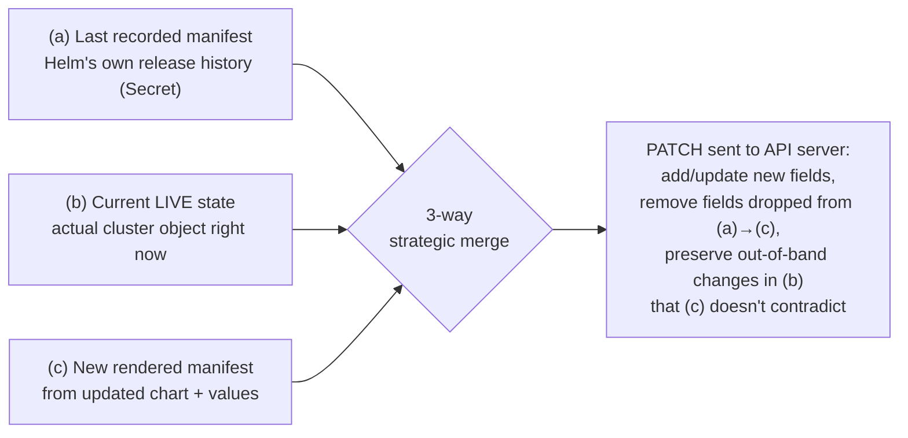
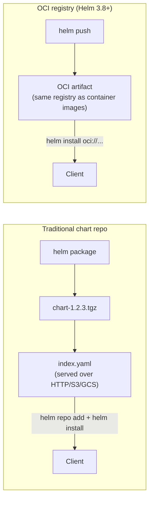

# Helm

> The package manager for Kubernetes: templates raw manifests with Go templates + Sprig, tracks releases as versioned, upgradeable units, and stores release history in-cluster (as Secrets) instead of leaving you to hand-diff YAML across environments.

## Chart Anatomy

```
api-server/
├── Chart.yaml              # metadata: name, version, appVersion, dependencies
├── values.yaml              # default configuration (lowest precedence)
├── values.schema.json        # (optional) JSON Schema to validate values at install/upgrade time
├── charts/                   # vendored subcharts (dependencies), each a full chart
│   └── redis/
│       ├── Chart.yaml
│       └── values.yaml
├── crds/                      # CRDs — installed once, NEVER templated, NEVER touched by upgrade
│   └── widgets.example.com.yaml
├── templates/
│   ├── _helpers.tpl           # named template snippets, no manifest of its own
│   ├── deployment.yaml
│   ├── configmap.yaml
│   ├── service.yaml
│   ├── migration-job.yaml     # pre-upgrade hook Job
│   ├── NOTES.txt              # printed after install/upgrade
│   └── tests/
│       └── test-connection.yaml   # `helm test` hook
└── files/
    └── app.conf                # non-template file, read via .Files
```

```yaml
# Chart.yaml
apiVersion: v2
name: api-server
description: A Helm chart for the api-server microservice
type: application
version: 1.4.2          # CHART (packaging) version — bump on any template/values change
appVersion: "2.1.0"      # APPLICATION version being deployed — the actual image/software version
dependencies:
  - name: redis
    version: "18.x.x"
    repository: "https://charts.bitnami.com/bitnami"
    condition: redis.enabled
```

`version` vs `appVersion` is the single most-confused field pair in Helm. `version` is the chart's own SemVer — bump it whenever you change a template, add a value, fix a bug in the chart itself, even if the underlying application binary didn't change at all. `appVersion` is purely informational metadata about which version of the actual application the chart currently points at by default — it does **not** have to be SemVer (it's a free-form string, e.g. `"2.1.0"` or a git SHA), and changing it alone does nothing unless a template actually references `.Chart.AppVersion` (commonly as the default image tag). The two are completely independent: you can ship chart `version: 3.0.0` that only fixes an indentation bug while `appVersion` stays pinned at `"2.1.0"`, or bump `appVersion` to a new release with zero chart changes at all.

## Templating Engine

Go's `text/template` engine plus the **Sprig** function library (string manipulation — `trunc`, `trimSuffix`, `nindent`, `quote`; math — `add`, `mul`; date — `now`, `date`; type conversion, list/dict helpers, etc). Key built-in objects available inside any template:

| Object | Purpose |
|--------|---------|
| `.Values` | Merged values (chart defaults + overrides), the primary input |
| `.Release.Name` / `.Release.Namespace` | Current release name / target namespace |
| `.Release.IsUpgrade` / `.Release.IsInstall` | Branch behavior differently between install and upgrade |
| `.Chart.Name` / `.Chart.Version` / `.Chart.AppVersion` | Metadata from Chart.yaml |
| `.Files` | Read non-template files shipped in the chart (`.Files.Get`, `.Files.Glob`) — useful for embedding whole config files verbatim instead of hand-templating every line |
| `.Capabilities` | Query the **live target cluster** — `.Capabilities.KubeVersion`, `.Capabilities.APIVersions.Has "batch/v1"` — to conditionally render manifests only when the cluster actually supports that API/feature |
| `.Template.BasePath` | Path to the current template's directory, used with `include` to checksum a *different* rendered template (the ConfigMap-checksum pattern) |

`.Capabilities` is worth calling out specifically: it's the reason `helm template` (pure client-side, no cluster contact) can diverge from what a real `helm install` would render — anything gated on `.Capabilities` renders using best-guess defaults offline and the real API-version check only happens against an actual cluster.

## Template Snippet (Go Template Syntax)

See `Kubernetes/Components/Helm/templates/deployment.yaml` and `_helpers.tpl` for the full working example. Key excerpt:

```yaml
metadata:
  name: {{ include "api-server.fullname" . }}    # calls a named template from _helpers.tpl, passing the whole context (.)
spec:
  template:
    metadata:
      annotations:
        # forces a rollout when the ConfigMap's rendered content changes —
        # Deployments don't watch ConfigMaps, only their own pod template
        checksum/config: {{ include (print $.Template.BasePath "/configmap.yaml") . | sha256sum }}
    spec:
      containers:
        - image: "{{ .Values.image.repository }}:{{ .Values.image.tag | default .Chart.AppVersion }}"
          # `default` falls back to .Chart.AppVersion only when .Values.image.tag is empty —
          # this single line is the practical link between the version/appVersion fields
```

`_helpers.tpl` defines `api-server.fullname`, `api-server.labels`, and `api-server.selectorLabels` as `{{- define "..." -}}` blocks — none of these render a manifest by themselves; they only materialize wherever another template calls `{{ include "api-server.xxx" . }}`. Note the deliberate split between full labels (includes chart version, safe to change every release) and selector labels (a strict subset, must stay stable — `spec.selector.matchLabels` on a Deployment/StatefulSet is immutable, so leaking a version label into the selector breaks upgrades).

## Values Layering & Precedence

Lowest to highest precedence — each layer overrides matching keys from the one before it, deep-merged (not replaced wholesale) for maps:

1. Chart's own `values.yaml` defaults.
2. Parent chart's values for a subchart, namespaced under the subchart's name (e.g. parent sets `redis.replicaCount: 3`, which lands in the `redis` subchart's own `.Values.replicaCount`).
3. `-f custom-values.yaml` — can be passed multiple times; later files win over earlier ones (`-f base.yaml -f prod.yaml` → prod.yaml wins on overlapping keys).
4. `--set key=value` (and `--set-string`, `--set-file`) — highest precedence, ideal for one-off overrides and CI pipelines (e.g. `--set image.tag=$CI_COMMIT_SHA`) without maintaining a values file per build.

```bash
helm upgrade api-server ./api-server \
  -f values.yaml \
  -f values-prod.yaml \
  --set image.tag=v2.1.1 \
  --set replicaCount=5
```

`global` values are the escape hatch for sharing config **down** into subcharts without each one needing its own copy — anything under `global:` in the top-level `values.yaml` is visible as `.Values.global.x` inside every subchart too, e.g. a shared `global.imageRegistry` or `global.environment` that both the parent chart and a `redis` subchart both read.

## Helm 2 → Helm 3: No More Tiller

Helm 2 ran **Tiller**, a server-side component living in-cluster that held the actual authority to create/update/delete resources on behalf of any client with access to it — in most real deployments that meant Tiller ran with cluster-admin-equivalent RBAC, making it a standing, high-value attack surface (compromise Tiller, compromise the cluster). Helm 3 removed Tiller entirely: Helm is purely a client-side binary that talks directly to the Kubernetes API server using **your** kubeconfig credentials and RBAC — no separate in-cluster privileged component at all.

Release state (the rendered manifest history, values used, chart metadata per revision) moved from ConfigMaps-in-`kube-system` (Helm 2) to **Secrets in the same namespace as the release itself** (Helm 3 default, `secret` storage driver). Two direct consequences:

- `helm list` is namespace-scoped by default (`helm list -A` for all namespaces) — releases genuinely live per-namespace now, not centrally.
- RBAC on `Secret` objects in a namespace **is** RBAC on Helm releases in that namespace. A role granting `get/list/watch` on secrets in `team-a` incidentally grants read access to every Helm release's manifest history and values (including any values that shouldn't have been there in the first place — see the anti-pattern section below).

```bash
# inspect release history/state directly
kubectl get secrets -n team-a -l owner=helm
helm history api-server -n team-a
helm get manifest api-server -n team-a     # rendered manifest for the current release
helm get values api-server -n team-a       # values actually used (merged) — including any secrets set via --set!
```

## `helm upgrade`: The 3-Way Strategic Merge

`helm upgrade` doesn't just apply the new chart's rendered output over the old one. It computes a diff across **three** inputs:



- **(a) last-applied**: what Helm itself recorded as the previous release's rendered manifest.
- **(b) live state**: what's actually running in the cluster right now — which may have drifted from (a) via `kubectl edit`, another controller (HPA changing `replicas`, a mutating webhook), or manual `kubectl patch`.
- **(c) new desired state**: freshly rendered from the updated chart/values for this upgrade.

The reason all three are needed (not just a 2-way diff of old-chart vs new-chart) is field **removal**. If a field existed in (a) but not in (c) — say a `resources.limits.cpu` line was deleted from the new chart version — Helm needs to know whether to actually clear that field on the live object. A plain 2-way diff of (a) vs (c) can't distinguish "we deliberately removed this from the chart, please unset it" from "this field was never Helm's to manage, don't touch it" — comparing against (b) lets Helm see it really was Helm-managed (present in its own history) and safely issue the removal, while genuinely out-of-band fields (never in (a)) are left alone.

```bash
# see exactly what would change before committing to it
helm diff upgrade api-server ./api-server -f values-prod.yaml   # requires helm-diff plugin
helm upgrade api-server ./api-server -f values-prod.yaml --dry-run --debug
```

## Hooks

Hooks are ordinary Job/Pod (or other) manifests annotated to run at specific points in the release lifecycle, instead of as part of the normal apply set:

| Hook | Fires |
|------|-------|
| `pre-install` | Before any templates are rendered/applied on first install |
| `post-install` | After all resources are installed |
| `pre-upgrade` | Before templates are applied on `helm upgrade` |
| `post-upgrade` | After all resources are upgraded |
| `pre-delete` | Before any resources are deleted on `helm uninstall` |
| `post-delete` | After all resources are deleted |

```yaml
metadata:
  annotations:
    helm.sh/hook: pre-upgrade,pre-install
    helm.sh/hook-weight: "0"                 # lower runs first among same-type hooks
    helm.sh/hook-delete-policy: before-hook-creation,hook-succeeded
```

- `helm.sh/hook-weight` (string-typed integer, can be negative) orders execution among multiple hooks of the same type — lower weight runs first.
- `helm.sh/hook-delete-policy` controls cleanup: `before-hook-creation` deletes the previous hook resource before creating the new one (required in practice, since a Job's `spec` is almost entirely immutable — a stale Job with the same name would make the new apply fail outright), `hook-succeeded` / `hook-failed` clean up after the fact based on outcome.

**Concrete use case:** a database migration Job as a `pre-upgrade` hook — it runs and must complete successfully before Helm proceeds to roll out the new application Deployment, guaranteeing the schema is compatible with the new app version before any new-version pod starts talking to the database. See `templates/migration-job.yaml` in this directory for the full annotated example.

```bash
# watch hook execution during an upgrade
kubectl get jobs -n production -l app.kubernetes.io/instance=api-server -w
helm upgrade api-server ./api-server --debug   # --debug shows hook execution order
```

## `helm template` vs `--dry-run --debug`

| | `helm template` | `helm install/upgrade --dry-run --debug` |
|--|-----------------|-------------------------------------------|
| Cluster contact | None — pure client-side rendering | Yes — renders **and** submits a dry-run to the live API server |
| Validates against live cluster schema/CRDs | No | Yes (server-side dry-run catches invalid fields, webhook rejections, CRD schema mismatches) |
| `.Capabilities` accuracy | Best-effort/default guesses (no real cluster to query) | Accurate — reflects the actual target cluster's API versions |
| Typical use | CI: lint output, diff against a previous render, feed into `kubeconform`/OPA | Pre-flight check immediately before a real apply, using real cluster context |
| Speed | Fast, no auth/context needed | Slower, requires valid kubeconfig + cluster access |

Reach for `helm template` in CI pipelines where you want deterministic, offline-renderable output to diff or lint without needing cluster credentials at all. Reach for `--dry-run --debug` right before an actual `helm upgrade` when you specifically want to catch things only the API server itself can validate — CRD schema violations, webhook admission rejections, or a stale `.Capabilities` assumption.

## Chart Distribution: Repositories vs OCI Registries



| | Chart repository | OCI registry |
|--|-------------------|---------------|
| Storage | `index.yaml` + packaged `.tgz` files over plain HTTP(S) | Any OCI-compliant registry (ECR, ACR, GCR, Docker Hub, Harbor) |
| Auth | Separate repo-specific auth (`helm repo add --username/--password`) | Reuses existing container-registry auth (docker login, IRSA, workload identity) |
| Infra needed | A dedicated static file host or chart-museum-style server | None extra — same registry already used for images |
| Commands | `helm repo add`, `helm repo update`, `helm install repo/chart` | `helm registry login`, `helm push`, `helm install oci://registry/chart` |

```bash
# OCI-based push/pull (Helm 3.8+)
helm registry login my-registry.azurecr.io
helm push api-server-1.4.2.tgz oci://my-registry.azurecr.io/helm
helm install api-server oci://my-registry.azurecr.io/helm/api-server --version 1.4.2
```

OCI distribution is increasingly the modern default — it collapses "where do container images live" and "where do charts live" into the same infrastructure and auth model, instead of standing up and separately securing a chart repository.

## CRDs: The Easily-Missed Limitation

Anything in a chart's `crds/` directory is applied **once, at install time only**. Helm intentionally does not template CRDs (no `.Values`/`.Release` access inside `crds/`) and, critically, **does not update or delete them on `helm upgrade` or `helm uninstall`** — this is deliberate, to avoid a chart accidentally deleting a CRD (and cascading-deleting every custom resource of that kind cluster-wide) on an uninstall. The practical consequence: if a new chart version ships a modified CRD schema (a new field, a new version in `versions:`), `helm upgrade` silently does **not** apply that change — you must `kubectl apply -f crds/xxx.yaml` (or equivalent) by hand, separately, before or as part of your upgrade process. Forgetting this is one of the most common Helm production surprises: the chart upgrades cleanly, pods roll out fine, and then the operator/controller relying on the new CRD field fails validation because the CRD in-cluster is still the old schema.

```bash
# CRDs are NOT touched by upgrade — verify/apply manually
kubectl get crd widgets.example.com -o yaml | grep -A2 versions
kubectl apply -f api-server/crds/widgets.example.com.yaml   # manual step, chart won't do this for you
```

## Secrets-in-Values Anti-Pattern

Committing plaintext secrets into `values.yaml` (or a `-f prod-values.yaml` that ends up in git) is one of the most common real-world Helm mistakes — and it's compounded by `helm get values` happily printing them back out to anyone with read access to the release Secret (see the Helm-3-storage section above: RBAC on Secrets doubles as RBAC on release history, which includes whatever values were used).

Standard mitigations, in increasing order of how thoroughly they remove the problem:

- **helm-secrets** (SOPS-encrypted values files): keeps secrets in a values file, but SOPS-encrypted at rest in git, decrypted just-in-time via a KMS key during `helm secrets upgrade`. Better than plaintext, but the secret still round-trips through Helm's rendering pipeline and ends up in the release Secret's recorded values.
- **Don't put secrets in Helm values at all**: inject via **External Secrets Operator** (syncs from AWS Secrets Manager/Vault/Parameter Store into a native `Secret` object that the chart references by name, never by value) or **Vault Agent Injector** (sidecar writes secrets straight to the pod filesystem, never a k8s object). This is the better default — see `Kubernetes/Components/ConfigMapSecret/ConfigMapSecret.md`'s External Secrets Management section for the full comparison of Sealed Secrets vs ESO vs Vault Agent Injector.

```bash
# audit: does this release's recorded values contain anything secret-shaped?
helm get values api-server -n production --all | grep -iE "password|secret|token|key"
```

## Common Interview Questions

**Q: What's the actual difference between chart `version` and `appVersion`, and why does it trip people up?**
`version` is the chart's own packaging SemVer — it must bump on any change to templates, `values.yaml`, or chart metadata, completely independent of whether the deployed application changed. `appVersion` is a free-form (not required to be SemVer) label describing which version of the application the chart is currently pointing at by default, typically consumed as `{{ .Values.image.tag | default .Chart.AppVersion }}`. The confusion comes from assuming they move together — they don't. You can release chart `2.0.0` that only reformats a template with `appVersion` unchanged, or bump `appVersion` for a new app release with the chart's own `version` unchanged if nothing chart-side needed to change. Treat them as two unrelated version counters that happen to live in the same file.

**Q: Why did Helm 3 remove Tiller, and what actually changed operationally?**
Tiller was a server-side, in-cluster component in Helm 2 that held delegated authority to create/update/delete any resource on behalf of whoever could reach it — in typical setups that meant cluster-admin-equivalent RBAC bound to a single shared component, so compromising or misusing Tiller compromised the whole cluster, and there was no way to scope "this team can only helm-install into this namespace" without extra RBAC-proxy tooling bolted on. Helm 3 made the client talk directly to the API server using the caller's own kubeconfig/RBAC — no privileged middleman. Operationally this means Helm's permissions are exactly your kubectl permissions, multi-tenancy is just normal Kubernetes RBAC instead of a Tiller-specific workaround, and there's one fewer standing service to patch/secure/monitor.

**Q: Where does Helm 3 store release state, and why does that matter for RBAC design?**
As Secrets, in the same namespace as the release, by default (the `secret` storage driver). This means `helm list` only shows one namespace at a time (`-A` for all), and — the part people miss — any RBAC granting broad read access to Secrets in a namespace (`get/list/watch` on `secrets`) incidentally grants read access to every Helm release's full manifest and values history in that namespace, not just "regular" application secrets. When designing least-privilege RBAC, remember that "read secrets" and "read Helm release history" are the same permission in Helm 3.

**Q: Explain what `helm upgrade`'s 3-way merge actually compares and why 2-way isn't enough.**
It diffs (a) the last release's recorded manifest from Helm's own history, (b) the object's actual live state in the cluster right now, and (c) the freshly rendered manifest from the new chart/values. The specific problem 2-way diffing (just old-chart vs new-chart) can't solve is field removal: if a field was in the old chart but isn't in the new one, Helm needs to decide whether to actually unset it on the live object — and it can only safely do that by confirming via (b) that the field is still exactly what Helm last set (i.e., nobody else adopted or depends on it out-of-band). Comparing against live state also protects fields that drifted via `kubectl edit` or another controller (e.g. an HPA-managed `replicas`) from being clobbered back to a stale chart default if the new chart doesn't explicitly set that field either.

**Q: How would you run a DB migration safely as part of a Helm upgrade?**
Model it as a `pre-upgrade` (and usually also `pre-install`, for first deploys) hook Job, annotated `helm.sh/hook: pre-upgrade,pre-install`. Give it a fixed, deterministic name (not templated with a random suffix) and set `helm.sh/hook-delete-policy: before-hook-creation,hook-succeeded` — `before-hook-creation` because Job specs are almost entirely immutable, so a leftover Job with the same name from the previous release would make the next hook's creation fail outright; `hook-succeeded` to keep the namespace clean once it passes. Helm blocks the rest of the upgrade (including the app Deployment update) until the hook Job completes successfully, which is exactly the ordering guarantee you want — new-version pods should never start before the schema they depend on is in place.

**Q: When would you use `helm template` versus `helm upgrade --dry-run --debug`?**
`helm template` never touches a cluster — it's pure client-side rendering, which makes it the right tool for CI: diffing rendered output between commits, feeding it into `kubeconform`/OPA/conftest for static policy checks, or generating manifests when you don't even have cluster credentials available. `--dry-run --debug` on `install`/`upgrade` actually submits the rendered manifests to the live API server as a server-side dry run, which catches things `helm template` structurally cannot — CRD schema violations against what's actually installed, admission webhook rejections, and accurate `.Capabilities` evaluation against the real target cluster's API versions. Use `template` for repeatable offline validation, `--dry-run --debug` as the last real pre-flight check right before you commit to an actual apply.

**Q: Why can't `helm upgrade` update a CRD shipped in `crds/`, and what breaks if you forget that?**
Helm deliberately applies `crds/` content once, at install time only — it's not templated (no access to `.Values`/`.Release` there) and is never touched again by subsequent `upgrade` or `uninstall`, specifically to prevent an uninstall from ever cascading into deleting a CRD and, with it, every custom resource of that kind cluster-wide. The gotcha: if a new chart version ships an updated CRD (new field, new served version), `helm upgrade` will happily roll out new application pods that assume the new schema exists, while the CRD in-cluster silently remains on the old schema — leading to validation failures or missing fields that look like an application bug but are actually a CRD that was never updated. The fix is always manual: `kubectl apply -f crds/...` as an explicit pre-upgrade step in your deployment process, not something the chart will ever do for you.
