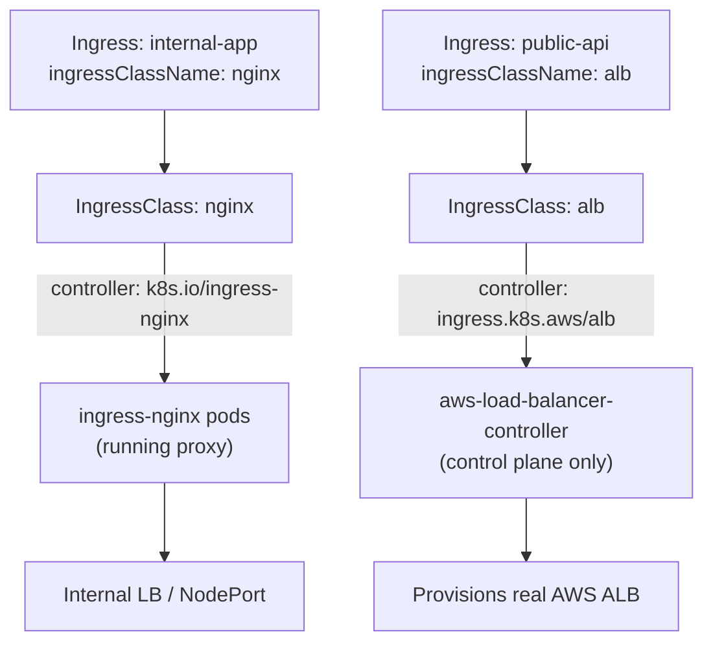
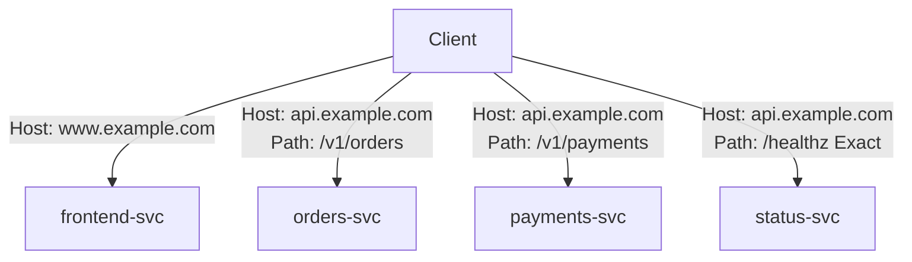
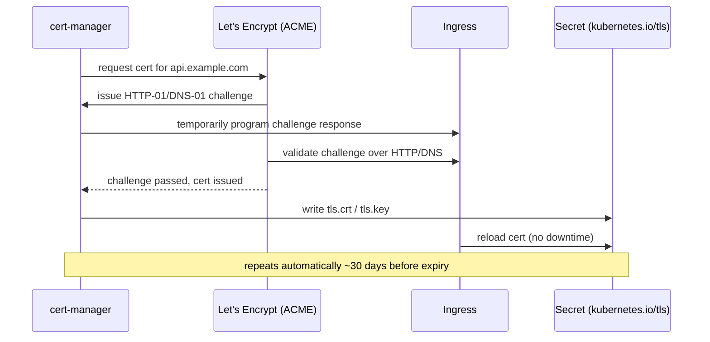
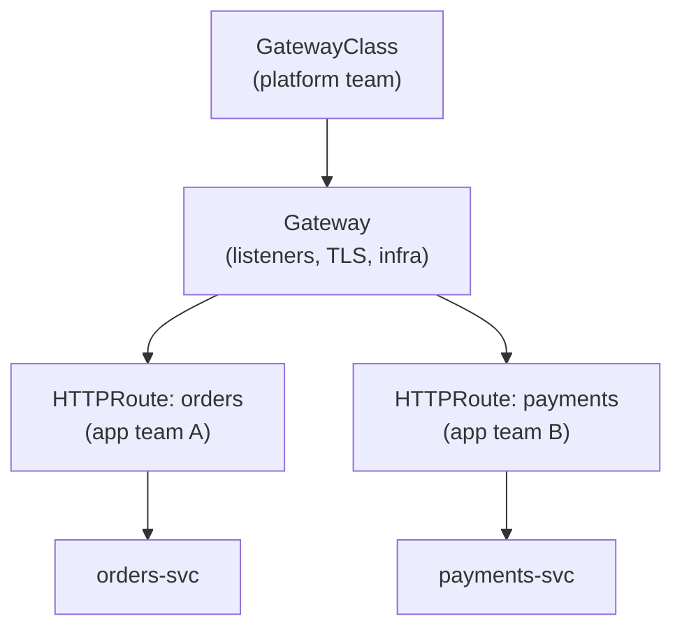

# Kubernetes Ingress

> Ingress is the L7 (HTTP/HTTPS) routing layer for a cluster — host/path rules, TLS termination, and traffic shaping — but Kubernetes ships only the API; you must install a controller for it to do anything. Getting the Ingress/IngressClass/Controller split wrong is the most common senior-level gap.

## Three Things People Conflate

| Concept | What it is | Analogy |
|---|---|---|
| `Ingress` (resource) | The routing rules — an API object (host, path, backend service, TLS secret) | The config file |
| `IngressClass` (resource) | Says *which controller implementation* should honor this Ingress, referenced via `spec.ingressClassName` | The label on the config file saying who reads it |
| Ingress Controller | The actual running proxy/software (nginx, ALB controller, Traefik, HAProxy) that watches Ingress objects and programs a real proxy/load balancer | The engine that executes the config |

Kubernetes defines the `Ingress` API but ships **no built-in implementation** — an Ingress object with no controller watching it just sits there, inert, forever `Pending`. This trips up almost everyone coming from a single-cloud background: on a fresh kubeadm cluster, creating an Ingress does literally nothing until you `helm install ingress-nginx`.

A cluster can run **multiple controllers simultaneously** — e.g., `ingress-nginx` for internal traffic and `aws-load-balancer-controller` (ALB) for internet-facing traffic. Each Ingress picks its controller via `ingressClassName`:

```yaml
apiVersion: networking.k8s.io/v1
kind: IngressClass
metadata:
  name: nginx
  annotations:
    ingressclass.kubernetes.io/is-default-class: "true"  # used when ingressClassName is omitted
spec:
  controller: k8s.io/ingress-nginx
---
apiVersion: networking.k8s.io/v1
kind: IngressClass
metadata:
  name: alb
spec:
  controller: ingress.k8s.aws/alb
```



Note the asymmetry: ingress-nginx runs proxy *pods in-cluster* that do the actual HTTP proxying, whereas the AWS ALB controller is a control-plane reconciler only — it never proxies traffic itself, it just calls the AWS API to configure a real ALB that lives outside the cluster.

## Path Types

| Type | Behavior | Example |
|---|---|---|
| `Exact` | Must match the URL path exactly (case sensitive, no trailing slash flexibility) | `/healthz` matches only `/healthz` |
| `Prefix` | Matches on `/`-separated path **elements** — `/foo` matches `/foo` and `/foo/bar` but **not** `/foobar` | `/v1/orders` matches `/v1/orders/123` |
| `ImplementationSpecific` | Controller decides how to interpret it — commonly paired with regex-capable annotations | nginx `rewrite-target` + capture groups |

The `Prefix` gotcha is a favorite interview trap: matching is element-wise, not string-prefix. `/foo` does **not** match `/foobar` even though the string `/foo` is a literal prefix of `/foobar` — Kubernetes splits on `/` first. When two rules could match the same request (an `Exact` and a `Prefix`, or two `Prefix` rules of different lengths), the most specific (longest matching prefix, `Exact` beats `Prefix`) wins — see `ingress.yaml` where `/healthz` (Exact) and `/v1/orders` (Prefix) coexist without conflict.

## Host-Based vs Path-Based Routing

- **Host-based**: multiple hostnames share one Ingress (and therefore one LB/IP) — `www.example.com` and `api.example.com` route to entirely different backend services based on the `Host` header.
- **Path-based**: one hostname, split by path prefix across multiple services — `api.example.com/v1/orders` vs `api.example.com/v1/payments`.
- **Combined** (the common production pattern): host picks the "app," path picks the "route within the app." See `ingress.yaml` — `www.example.com` is host-routed to the frontend, `api.example.com` is further path-routed across `orders-svc`, `payments-svc`, and a legacy service via regex rewrite.



## TLS Termination

TLS terminates **at the Ingress controller**, not at the pod — the controller decrypts HTTPS and forwards plain HTTP (or re-encrypts, for end-to-end TLS setups) to the backend Service. Configured via `spec.tls`, pointing at a Secret of type `kubernetes.io/tls` (containing `tls.crt` + `tls.key`).

Manually rotating that Secret before expiry doesn't scale past a handful of domains — **cert-manager** automates this:

- `Certificate` (CRD) declares desired cert (DNS names, secret name, issuer).
- `ClusterIssuer` / `Issuer` defines how to obtain it — typically ACME against Let's Encrypt.
- ACME challenge types: **HTTP-01** (proves domain ownership by serving a token at `http://<domain>/.well-known/acme-challenge/...` — cert-manager temporarily programs the Ingress to answer it; doesn't work for wildcard certs, requires port 80 reachable) vs **DNS-01** (proves ownership by creating a TXT record via a DNS provider API — works for wildcards and doesn't need the domain to be publicly reachable yet, useful for internal/private endpoints).
- cert-manager watches expiry and re-issues automatically, rewriting the Secret in place — the Ingress/controller picks up the new cert with no manual intervention.



Full worked example (Ingress + TLS Secret + cert-manager `Certificate`/`ClusterIssuer`, plus an ALB variant): `ingress.yaml`.

## Annotations Are NOT Portable — the #1 Real Gotcha

Annotations are how each controller exposes features the core `Ingress` spec doesn't have a field for — rewrites, canary weighting, auth, timeouts, WAF, target type. They are **entirely controller-specific**. `nginx.ingress.kubernetes.io/rewrite-target` does nothing on an ALB Ingress; `alb.ingress.kubernetes.io/target-type` does nothing on nginx. The controller simply ignores annotations it doesn't recognize — silently, no error, no warning — which makes this a nasty debugging trap: you migrate a workload from nginx to ALB, all objects apply cleanly, and routing behavior quietly changes because half the annotations are now dead weight.

| Feature | nginx-ingress | AWS ALB |
|---|---|---|
| Prefix | `nginx.ingress.kubernetes.io/*` | `alb.ingress.kubernetes.io/*` |
| Rewrite | `rewrite-target` | not applicable (ALB has no rewrite concept) |
| Target routing | always via ClusterIP → kube-proxy → pod | `target-type: instance` or `ip` |
| Scheme | separate internal LB annotation per cloud | `scheme: internal` / `internet-facing` |
| Canary | `canary`, `canary-weight`, `canary-by-header` | not natively supported |

Migrating controllers is **not** a drop-in swap — it means rewriting every annotation-driven behavior for the new controller's vocabulary, re-testing rewrites/redirects/auth, and re-validating TLS wiring. This exact pain (every controller reinventing its own annotation dialect for the same concepts) is the core motivation for the Gateway API (below).

## AWS ALB Ingress Controller Specifics

`aws-load-balancer-controller` watches Ingress objects with `ingressClassName: alb` and provisions **real AWS resources** — visible in the EC2 console as an actual Application Load Balancer plus one target group per backend Service.

| Annotation | Values | Effect |
|---|---|---|
| `alb.ingress.kubernetes.io/target-type` | `instance` (default) | Target group targets are **NodePorts on instances**; traffic still takes a kube-proxy hop to reach the actual pod |
| | `ip` | Target group targets are **pod IPs directly** (requires VPC CNI so pod IPs are routable in the VPC); bypasses kube-proxy entirely — lower latency, is the modern recommended default for most workloads |
| `alb.ingress.kubernetes.io/scheme` | `internal` | ALB gets a private IP, only reachable inside the VPC |
| | `internet-facing` | ALB gets a public IP/DNS name |
| `alb.ingress.kubernetes.io/group.name` | any string | Consolidates multiple Ingress objects onto **one physical ALB** (multiple listener rules) instead of one ALB per Ingress |

**Cost/lifecycle implication:** every distinct Ingress object without `group.name` provisions its own ALB — at scale (dozens of namespaces/teams each with their own Ingress) that's dozens of ALBs, each billed hourly plus LCU usage, each with its own DNS name to manage. Using `IngressGroup` (`group.name`) consolidates many Ingress objects into shared listener rules on a single ALB — fewer ALBs, lower cost, but now those teams share fate on one load balancer's capacity and failure domain. This is a real trade-off to raise unprompted in an interview: isolation vs cost.

```bash
# Confirm which controller is actually driving an Ingress
kubectl get ingress shop-ingress-alb -n production -o jsonpath='{.spec.ingressClassName}'

# ALB controller writes the provisioned LB hostname back onto the Ingress status
kubectl get ingress shop-ingress-alb -n production -o jsonpath='{.status.loadBalancer.ingress[0].hostname}'
```

## Gateway API — the Future Direction

Ingress is a single flat object that conflates infrastructure config (which LB, which TLS cert, which listener ports) with application routing (which path goes to which service) — fine for a small team, painful once platform and app teams need separate ownership and RBAC boundaries. **Gateway API** splits this into three resource kinds:

| Resource | Analogous to | Owned by |
|---|---|---|
| `GatewayClass` | `IngressClass` — which controller implementation | Platform/infra team |
| `Gateway` | The listener + infra (ports, TLS, which controller) | Platform/infra team |
| `HTTPRoute` / `TCPRoute` / `GRPCRoute` | The routing rules (host/path → service) | App teams |



This enables clean **role-based multi-tenancy**: platform team owns the `Gateway` (TLS certs, listener ports, which controller), app teams independently own `HTTPRoute` objects in their own namespaces attached to that shared Gateway — something a single flat Ingress object can't express safely (any team editing the Ingress can clobber another team's rules or the TLS config). Gateway API is also protocol-richer out of the box (native gRPC/TCP/UDP routes, weighted traffic splitting in the core spec instead of vendor annotations) and is where the ecosystem is investing going forward. That said, as of today **Ingress is still what's actually running in most existing clusters** — Gateway API adoption is real but gradual, and plenty of senior interviews still expect deep Ingress fluency first.

## Canary / Traffic Splitting

Two very different tools for the same-shaped problem:

- **Controller annotations (nginx)**: `nginx.ingress.kubernetes.io/canary: "true"` on a second Ingress object pointing at the canary service, plus `canary-weight: "10"` (percentage-based split) or `canary-by-header` (route based on a request header, e.g., for internal testers). Cheap, no extra infra, but it's L7-routing-only, controller-specific, and gets unwieldy once you need session affinity, mirroring, or fine-grained rollback.
- **Service mesh (Istio `VirtualService`)**: weighted routing across subsets defined by `DestinationRule`, e.g., 90/10 split by `subset` labels — plus mirroring, retries, circuit breaking, and mTLS between hops, all independent of which Ingress controller is in front. The mesh is the right call once you need traffic shaping *between services inside the cluster* (not just at the edge), or need it to be portable across controllers/clouds.

Rule of thumb: nginx canary annotations for simple edge-level canary on a single Ingress; a mesh when you need consistent traffic policy across many internal service-to-service hops, not just north-south traffic.

## Troubleshooting 502/504

A 502/504 from the ingress controller almost always means **the backend Service has no healthy endpoints**, not that the Ingress config itself is wrong. Work the chain from the edge inward:

```bash
# 1. Confirm the Ingress even resolved a backend and check controller-assigned address
kubectl describe ingress shop-ingress -n production

# 2. Does the Service actually have registered endpoints?
kubectl get endpoints orders-svc -n production
# empty ENDPOINTS list -> selector mismatch, or all pods failing readinessProbe

# 3. Check pod readiness directly
kubectl get pods -n production -l app=orders -o wide
kubectl describe pod <pod-name> -n production   # look at readiness probe failures in Events

# 4. Check the controller's own logs — nginx logs upstream connection errors per request
kubectl logs -n ingress-nginx deploy/ingress-nginx-controller --tail=100

# 5. For ALB: the LB never even sees a "down" service the same way — check target group
#    health directly in the AWS console (EC2 -> Target Groups -> Health checks),
#    since kube-proxy/ALB health is decoupled from the K8s pod readiness display
```

For ALB specifically, target group health checks are configured (and can drift) independently of the Kubernetes readinessProbe — a pod can show `Ready` in `kubectl get pods` while the ALB target group still shows it `unhealthy` if the health check path/port differs from what the app actually serves. Always cross-check both.

## Common Interview Questions

**Q: If I `kubectl apply` an Ingress on a brand-new cluster and nothing happens, what's wrong?**
Nothing is "wrong" — Kubernetes ships the Ingress API but zero implementation. Without an installed controller (ingress-nginx, ALB controller, Traefik, etc.) watching Ingress objects, the resource just sits in etcd with no `status.loadBalancer` populated and no traffic routed. First thing to check: `kubectl get pods -n ingress-nginx` (or wherever your controller lives) — if there's no controller deployment, that's the whole problem, not a YAML typo.

**Q: Can one cluster run both nginx and ALB controllers at the same time?**
Yes, and it's a common real pattern — internal traffic through ingress-nginx (cheap, no per-Ingress AWS LB), internet-facing through ALB (integrates with WAF, ACM certs, Shield). Each Ingress object declares `ingressClassName` to pick which controller handles it; controllers are configured to only watch Ingress objects referencing their own IngressClass (via `--controller-class` or similar flag), so they don't fight over the same objects.

**Q: Why doesn't `/foo` as a Prefix path match `/foobar`?**
Because `Prefix` matching is done on `/`-separated path elements, not on the raw string. `/foo` decomposes to the single element `foo`; `/foobar` decomposes to `foobar` — different elements, no match. This trips people who think of it as `str.startswith()`. It does match `/foo/bar` because that decomposes to `foo`, `bar` — `foo` is a full leading element.

**Q: Walk me through what happens when a Let's Encrypt cert is about to expire.**
cert-manager tracks the `Certificate` object's expiry (from the cert it wrote into the Secret) and starts renewal ~30 days before expiry by default. It creates a new `CertificateRequest` → `Order` → `Challenge`, re-runs the ACME flow (HTTP-01 or DNS-01) against Let's Encrypt, and on success overwrites `tls.crt`/`tls.key` in the existing Secret in place. The Ingress controller watches that Secret and hot-reloads the new cert with no restart and no downtime — the entire rotation is unattended as long as the ACME challenge can still be solved (e.g., don't let the HTTP-01 solving path get blocked by a WAF rule you added after initial setup).

**Q: You migrated from nginx-ingress to ALB and now redirects/rewrites broke. Why?**
Because annotations aren't portable. `nginx.ingress.kubernetes.io/rewrite-target` (and any other nginx-specific annotation) is meaningless to the ALB controller — it's silently ignored, not an error. Every behavior implemented via annotation on the old controller has to be re-implemented in the new controller's vocabulary (or restructured — ALB, for instance, has no native path-rewrite concept, so that logic may need to move into the app itself or an intermediate proxy). This is exactly the class of problem Gateway API's standardized route types are meant to reduce.

**Q: `target-type: instance` vs `ip` on the ALB controller — what's the actual difference and why does it matter?**
`instance` routes ALB target groups to each node's NodePort; the request then takes an extra hop through kube-proxy (iptables/IPVS) to reach the actual pod, and pods must tolerate being reached indirectly regardless of which node they're scheduled on. `ip` mode requires the VPC CNI (so pod IPs are natively routable within the VPC) and lets the ALB target the pod IP directly — no kube-proxy hop, lower latency, and target group health checks reflect actual pod health rather than node-level NodePort reachability. `ip` is the modern recommended default for that reason, but it does put more load on the VPC's IP address space (each pod consumes a routable ENI-backed IP) and ties you to the AWS VPC CNI specifically.

**Q: When would you reach for a service mesh instead of ingress-level canary annotations?**
When traffic shaping needs to happen east-west (service-to-service inside the cluster), not just north-south at the edge — e.g., splitting traffic between two versions of an internal `orders` service that other services call directly, not via the Ingress. Also when you need consistency across controllers (annotation-based canary is nginx-specific and won't survive an ALB migration), or when you need capabilities annotations don't give you at all — traffic mirroring, fault injection, mTLS, fine-grained retries/circuit-breaking alongside the split. The trade-off is operational: a mesh (Istio/Linkerd) adds sidecars, control-plane complexity, and a new failure domain — don't reach for it just to do a simple 90/10 edge canary if nginx annotations already cover the case.

**Q: Ingress vs Gateway API — do you need to migrate right now?**
Not urgently for most shops. Gateway API's real win is role separation — platform teams own `Gateway` (listeners, TLS, infra), app teams own `HTTPRoute` in their own namespaces — which matters once you have enough teams that a shared flat Ingress object becomes a governance problem (who can edit TLS config, who can accidentally break someone else's path rule). If you're a single team or small platform org, Ingress is simpler and still fully supported; if you're running many tenants across a big cluster, Gateway API's RBAC boundaries are worth planning a migration toward, but Ingress remains the dominant, battle-tested option in production today.
