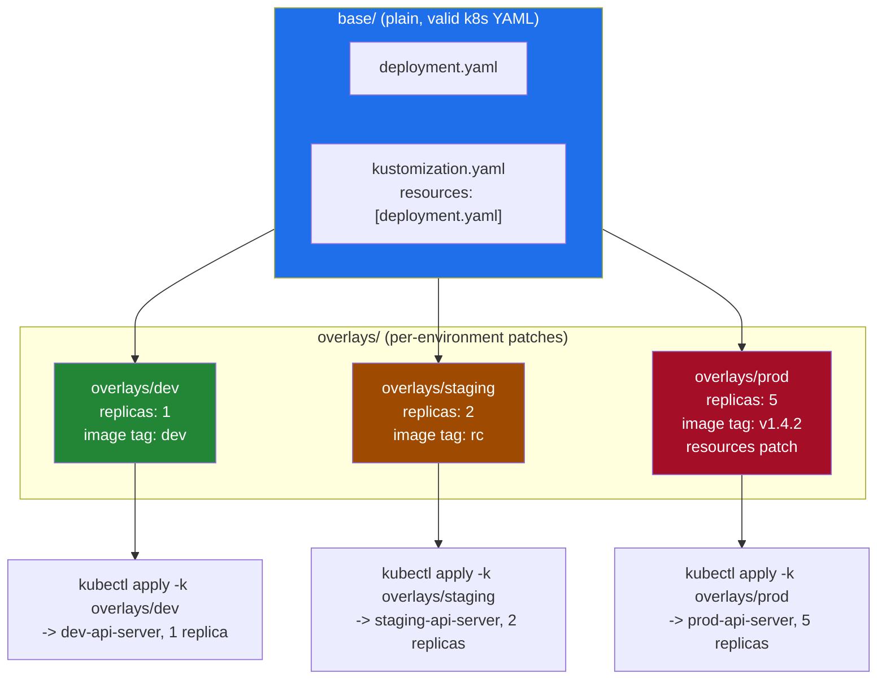
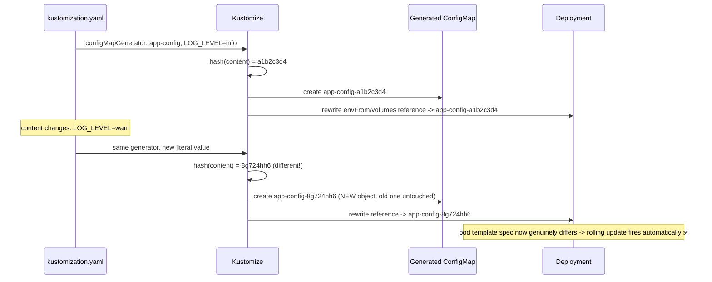

# Kustomize

> Kustomize manages per-environment variation without templates — you keep plain, valid Kubernetes YAML as a "base" and layer declarative patches ("overlays") on top per environment. It's built into `kubectl`, requires no extra language to learn, and is the mechanism ArgoCD/Flux use natively for GitOps-driven environment promotion.

## Core Philosophy: Patching, Not Templating

Kustomize has **no template syntax** — no `{{ }}` placeholders, no scripting language, nothing that isn't valid Kubernetes YAML on its own. Every file in a `base/` or `overlays/` directory can be applied directly with `kubectl apply -f` and would produce a working (if generic) object.

Helm takes the opposite approach: your chart's YAML is a **text template** — `{{ .Values.replicaCount }}` gets substituted at render time using Go's `text/template` engine plus the Sprig function library. The chart isn't valid YAML until it's rendered.

This one difference — **patch vs template** — is the root of almost every other trade-off between the two tools:

| Consequence of the difference | Kustomize (patch-based) | Helm (template-based) |
|---|---|---|
| Can you `kubectl apply -f` the source files directly? | ✅ Yes — base is real YAML | ❌ No — templates aren't valid YAML until rendered |
| Conditional logic (`if enabled`, loops) | Deliberately absent | Full Go template + Sprig (`if`, `range`, `with`) |
| Risk of "templating YAML" bugs (broken indentation, wrong quoting from string substitution) | None — you're editing/merging real objects | Common — a stray `{{ }}` can silently break YAML structure |
| Learning curve | Low — it's YAML + a small patch vocabulary | Higher — Go templates, Sprig functions, chart structure |



Same base, three different final manifests — no `{{ }}` anywhere in any of them.

---

## Directory Layout & `kustomization.yaml` Anatomy

Standard structure — one `base/` shared by every environment, one `overlays/<env>/` per environment containing only what differs:

```
Kustomize/
├── base/
│   ├── deployment.yaml
│   └── kustomization.yaml
└── overlays/
    └── prod/
        ├── kustomization.yaml
        └── patch.yaml
```

`base/kustomization.yaml`:

```yaml
apiVersion: kustomize.config.k8s.io/v1beta1
kind: Kustomization

resources:
  - deployment.yaml

commonLabels:
  app.kubernetes.io/part-of: api-platform

configMapGenerator:
  - name: app-config
    literals:
      - LOG_LEVEL=info
      - FEATURE_X=disabled
```

`overlays/prod/kustomization.yaml`:

```yaml
apiVersion: kustomize.config.k8s.io/v1beta1
kind: Kustomization

resources:
  - ../../base

namePrefix: prod-

commonLabels:
  environment: production

replicas:
  - name: api-server
    count: 5

images:
  - name: my-registry/api-server
    newTag: v1.4.2

patches:
  - path: patch.yaml
    target:
      kind: Deployment
      name: api-server

configMapGenerator:
  - name: app-config
    behavior: merge
    literals:
      - LOG_LEVEL=warn
      - FEATURE_X=enabled
```

Full working copies of both files (plus `base/deployment.yaml` and `overlays/prod/patch.yaml`) live alongside this note in the `base/` and `overlays/prod/` directories — verified with `kubectl kustomize overlays/prod`.

### Core Fields Reference

| Field | Purpose |
|---|---|
| `resources` | List of files/directories to include. Can point at another `kustomization.yaml` (composing bases), or a **remote git URL** (`github.com/org/repo/path?ref=v1.2.0`) — pulls a base straight from a repo, no local checkout needed |
| `patches` (strategic merge) | Partial-object merge patches — older syntax called this `patchesStrategicMerge`; current syntax unifies both merge and JSON 6902 patches under `patches` |
| `patches` (JSON 6902) | Same field, but entries using `target` + inline `patch: |-` with `op:`/`path:`/`value:` — surgical, path-addressed edits |
| `namePrefix` / `nameSuffix` | Prepend/append a string to every resource's `metadata.name` (e.g. `prod-api-server`) |
| `commonLabels` / `commonAnnotations` | Applied to every resource **and** automatically threaded through `spec.selector.matchLabels` and pod template labels, so selectors never drift out of sync with the labels they're supposed to match |
| `images` | Override image name/tag/digest without editing the base container spec at all — the entire reason CI pipelines can bump a tag per environment with a one-line overlay change |
| `replicas` | Override replica count for a named workload without writing a full patch just to change one integer |
| `configMapGenerator` / `secretGenerator` | Generate a ConfigMap/Secret from literals/files, with an automatic content-hash suffix on the name (see below) |

Note: newer Kustomize versions consolidate `commonLabels`/`commonAnnotations` into a single `labels`/`annotations` field with an `includeSelectors` toggle — functionally similar, `commonLabels` is what you'll still see in most existing repos and is what's used above.

---

## `configMapGenerator` / `secretGenerator`: Hash Suffixes Solve the Restart Problem

The [ConfigMap/Secret notes](../ConfigMapSecret/ConfigMapSecret.md) cover the classic problem: a Deployment doesn't automatically roll out pods when a referenced ConfigMap's *content* changes, because the pod template only changes if the object's **name** changes — content mutation in place is invisible to the Deployment controller.

`configMapGenerator` sidesteps this instead of working around it:



Every reference to the ConfigMap/Secret **anywhere else in the same kustomization** — `envFrom`, `env.valueFrom.configMapKeyRef`, `volumes.configMap.name` — gets rewritten to the new hashed name automatically. You never edit the Deployment. The rollout isn't triggered by a hook, a controller, or a checksum annotation baked into the pod template (the Helm idiom) — it's triggered by the plain, ordinary mechanism that already exists: **the pod template actually changed**, because the object it references actually changed name. Zero extra machinery.

```bash
# See the generated, hash-suffixed names and rewritten references
kubectl kustomize overlays/prod | grep -A2 "kind: ConfigMap"
kubectl kustomize overlays/prod | grep "configMapRef\|name: prod-app-config"
```

This also gives you immutability for free in practice: since a content change always produces a *new* object rather than mutating an existing one, you can safely set `immutable: true` on generated ConfigMaps — nothing ever needs to update one in place.

---

## Strategic Merge Patch vs JSON 6902 Patch

Two distinct patch mechanisms, both expressed under the `patches` field, with very different semantics.

| | Strategic Merge Patch | JSON 6902 Patch |
|---|---|---|
| Format | A partial Kubernetes object (same `apiVersion`/`kind`/`metadata.name`, only the fields you want to change) | A list of RFC 6902 operations: `op: add\|remove\|replace`, `path: /spec/...`, `value: ...` |
| Schema-aware? | ✅ Yes — understands Kubernetes list-merge semantics (e.g. merges a `containers` list entry by matching `name:`, rather than replacing the whole array) | ❌ No — purely structural, addresses fields by exact array index/path, no concept of "match by name" |
| Verbosity | Low — only specify what changes | Higher — every operation is its own explicit entry |
| Precision | Merges; can't easily express "delete just this one array element by identity" | Surgical — `remove` at an exact index/path, or `add` at an exact position |
| Good for | Overriding resources, env vars, replicas, adding a sidecar container (matched by name) | Deleting a specific list element, renaming a key, edits strategic merge's list-matching heuristics can't express cleanly |

**Strategic merge**, used in `overlays/prod/patch.yaml` in this repo — Kustomize merges `spec.template.spec.containers[name=api].resources` into the base container by matching on `name`, leaving every other field (`ports`, `readinessProbe`) from the base untouched:

```yaml
apiVersion: apps/v1
kind: Deployment
metadata:
  name: api-server
spec:
  template:
    spec:
      containers:
        - name: api
          resources:
            requests: { cpu: "250m", memory: "256Mi" }
            limits: { cpu: "1", memory: "1Gi" }
```

**JSON 6902**, when you need to reach into an exact path — e.g. delete the second toleration entirely, or replace a value the strategic-merge list-matcher can't disambiguate:

```yaml
patches:
  - target:
      kind: Deployment
      name: api-server
    patch: |-
      - op: replace
        path: /spec/template/spec/containers/0/image
        value: my-registry/api-server:v1.4.2-hotfix
      - op: remove
        path: /spec/template/spec/tolerations/1
```

**Reach for 6902 over strategic merge when:** you need to delete one specific element out of a list without touching the others (strategic merge has no "remove" verb — it only adds/merges), when the target field isn't part of the standard Kubernetes schema (a CRD without merge-key metadata Kustomize understands), or when you want a patch to fail loudly if the exact path it expects doesn't exist (6902 is path-exact; strategic merge will happily no-op merge into a slightly different shape).

---

## Rendering & Applying

Kustomize is **vendored directly into `kubectl`** — no separate install needed for standard use:

```bash
# Apply a kustomization directory directly (equivalent to: build, then apply)
kubectl apply -k overlays/prod

# Render only — no cluster mutation. Use for diffing, CI, code review of generated output
kubectl kustomize overlays/prod
kustomize build overlays/prod          # standalone binary — same output, newer feature set

# Diff what would change against the live cluster before applying
kubectl diff -k overlays/prod

# Delete everything defined by an overlay
kubectl delete -k overlays/prod
```

The standalone `kustomize` CLI is developed upstream and typically has newer features / a more current spec than the version vendored into a given `kubectl` release — if `kubectl apply -k` rejects a field that should be valid, check `kustomize version` vs the vendored version before assuming the YAML is wrong.

```bash
# Confirm what actually got created and which generated ConfigMap a Deployment is wired to
kubectl get deployment prod-api-server -o jsonpath='{.spec.template.spec.containers[0].envFrom}'
kubectl get configmap -l app.kubernetes.io/part-of=api-platform
```

---

## Kustomize vs Helm

The most commonly asked comparison question — answer it in terms of the underlying philosophy first, then the practical consequences.

| Dimension | Kustomize | Helm |
|---|---|---|
| Core mechanism | Patch plain YAML (strategic merge / JSON 6902) | Render Go templates (`{{ }}`) with values substituted in |
| Source files valid on their own? | ✅ Yes — base is real, applyable YAML | ❌ No — templates only become valid YAML after rendering |
| Packaging & distribution | ❌ None — just directories of YAML, typically pulled straight from a git repo (or a remote base URL) | ✅ First-class — chart repos, OCI registries (`helm push`/`helm pull`), semantic versioning of charts |
| Conditional logic / loops | Deliberately absent — no scripting language, stays declarative | Full Go template + Sprig — `if`, `range`, `with`, custom helper templates |
| Release tracking / rollback | ❌ None built in — a `kubectl apply -k` is just another apply; your rollback mechanism is git history or your GitOps tool | ✅ Server-side release history (`helm history`), one-command rollback (`helm rollback <release> <revision>`) |
| Parameterization model | Whole-object overlay/patch per environment | Named values (`values.yaml` + `-f`/`--set`), same template rendered differently |
| Learning curve | Low — YAML + a small patch vocabulary | Higher — Go template syntax, Sprig functions, chart directory conventions |
| Native `kubectl` support | ✅ Built in (`kubectl apply -k`) | ❌ Requires the `helm` binary |
| Best fit | In-house apps, environment-specific overlays on top of otherwise-identical manifests | Distributing reusable, configurable packages (your own or third-party/community charts) |
| Ecosystem software (e.g. installing Prometheus, cert-manager, ingress-nginx) | Rare to find as a pure Kustomize base for third-party software | The de facto standard — virtually every popular OSS project ships a Helm chart |

**Neither is strictly "better"** — they solve different problems. Helm solves *distributing configurable software*; Kustomize solves *taking one team's own manifests and adjusting them per environment without inventing a templating dialect*.

---

## Combining Both: Helm for the Chart, Kustomize for the Overlay

A common enterprise pattern when you need a vendor/community Helm chart (say, `ingress-nginx` or a vendor's chart for their product) but need organization-specific tweaks the chart's `values.yaml` doesn't expose:

```bash
# Render the chart to plain YAML, then post-process with Kustomize patches
helm template my-release ingress-nginx/ingress-nginx -f values-prod.yaml | kustomize build - 
```

This requires a `kustomization.yaml` with `resources: [-]` reading from stdin (or a small wrapper script that pipes `helm template` output to a temp file Kustomize then references) — the point is: **Helm handles what the chart author already parameterized**; **Kustomize patches the handful of things they didn't**, without forking the chart or waiting on an upstream PR to add a new `values.yaml` knob.

Both **ArgoCD** and **Flux** have first-class native support for Kustomize as a GitOps source type (ArgoCD `spec.source.kustomize`, Flux `Kustomization` CRD) — and both also support this exact chart-then-overlay combo directly (ArgoCD's `kustomize` post-renderer hook on a Helm source; Flux's `HelmRelease` + a downstream `Kustomization` patching its output). In practice: **Helm for the vendor/community chart, Kustomize overlay on top for env-specific tweaks** is one of the most common patterns you'll actually run into in a real platform team.

---

## Common Interview Questions

**Q: What's the fundamental difference between Kustomize and Helm, and why does it matter?**
Kustomize patches plain, valid Kubernetes YAML; Helm renders a text template into YAML. That's the whole difference, but it cascades into everything else: Kustomize's base files are always independently applyable and never suffer "broken YAML from a stray `{{ }}`" bugs, but it can't express real conditionals or loops because there's no scripting language at all — it stays declarative on purpose. Helm can express arbitrarily complex logic via Go templates + Sprig, and has first-class packaging (chart repos, OCI, versioning) and release/rollback tracking, but templates aren't valid YAML until rendered, so template bugs are a real category of failure Kustomize simply doesn't have. Pick Kustomize when you own the manifests and just need environment variation; pick Helm when you're distributing configurable software to others (or consuming someone else's chart).

**Q: How does `configMapGenerator` solve the "ConfigMap changed but pods didn't restart" problem without any extra tooling?**
A Deployment only rolls out pods when its pod template actually changes — referencing a ConfigMap by name doesn't count as a template change if only the ConfigMap's content mutates, since the name (the only thing the Deployment spec sees) is unchanged. `configMapGenerator` computes a content hash and appends it to the generated object's name, so any content change produces a genuinely new object name (e.g. `app-config-a1b2c3d4` → `app-config-8g724hh6`). Kustomize then rewrites every reference to that ConfigMap in the same kustomization — `envFrom`, `configMapKeyRef`, volume `configMap.name` — to point at the new name. That reference rewrite *is* a pod template change, so the ordinary Deployment rolling-update mechanism fires with zero extra hooks, checksum annotations, or a Reloader-style controller involved.

**Q: When would you reach for a JSON 6902 patch instead of a strategic merge patch?**
Strategic merge is schema-aware — it knows how to merge a `containers` list by matching on `name` rather than blindly overwriting the whole array — which makes it the right default for adding/overriding fields. But it has no way to *delete* a specific list element, and its list-matching heuristics can break down on non-standard schemas (e.g. a CRD without the merge-key metadata Kustomize understands). JSON 6902 addresses fields by exact path with explicit `add`/`remove`/`replace` operations, so it's the tool for surgical deletions or edits strategic merge literally cannot express — at the cost of being more verbose and not validating against the Kubernetes schema at all (a typo'd path silently does nothing, or errors depending on the op).

**Q: Does Kustomize have any packaging or release-tracking story like Helm does?**
No, and that's an honest, structural limitation, not an oversight. Kustomize has no chart repository equivalent, no versioned "release" concept, and no `helm rollback`-style history — it's just directories of YAML, usually pulled from a git repo (Kustomize does support referencing a remote base directly via a git URL in `resources`, which is as close as it gets to "distribution"). In practice, teams get their rollback and audit trail from git history and their GitOps tool (ArgoCD/Flux) rather than from Kustomize itself — reverting a commit and letting the GitOps controller reconcile is the de facto "rollback."

**Q: How do `namePrefix`, `commonLabels`, and `images` let you avoid ever touching the base manifest per environment?**
Each targets a narrow, common variation point without a full patch. `namePrefix`/`nameSuffix` renames every resource (`api-server` → `prod-api-server`) so environments can coexist in the same namespace without collision. `commonLabels` stamps a label onto every resource *and* automatically threads it through `spec.selector.matchLabels` and the pod template labels — so you never end up with a Deployment whose selector silently drifted out of sync with its own pod labels, which is a real footgun if you tried to do this by hand with a patch. `images` overrides just the name/tag/digest of a container image across all matching resources — the single most common CI need (bump the tag this pipeline just built) — without a full container-spec patch. All three exist because writing a strategic merge patch for a one-line change is disproportionate ceremony.

**Q: How does Kustomize fit into a GitOps pipeline with ArgoCD or Flux?**
Both tools treat Kustomize as a first-class source type, not an afterthought — ArgoCD's `Application.spec.source.kustomize` and Flux's `Kustomization` CRD both point at a directory and run the build themselves, watching the git repo for changes to either the base or the overlay. This is why Kustomize's lack of a packaging story doesn't hurt as much in practice as it might sound: the git repo *is* the distribution mechanism, and the GitOps controller's reconciliation loop *is* the "release" — every commit to an overlay is effectively a new release, and `git revert` is the rollback. It also composes with Helm: ArgoCD can run `helm template` then a Kustomize post-render step, and Flux's `HelmRelease` can feed into a downstream `Kustomization`, which is exactly the "Helm chart + Kustomize overlay" enterprise pattern.

**Q: If you're already using Helm for a chart, why would you ever add Kustomize on top instead of just adding a `values.yaml` field?**
Because you often don't control the chart. A vendor or community chart (ingress-nginx, cert-manager, a SaaS vendor's chart) only exposes what its authors chose to parameterize — if you need a tweak they didn't anticipate (an extra annotation, a sidecar container, a resource field not wired to any `values.yaml` key), your options are: fork the chart (maintenance burden, drifts from upstream), wait on an upstream PR (slow, may never land), or `helm template | kustomize build -` to patch the rendered output directly. The last option is fast, doesn't touch the chart source, and is easy to review as a diff against the chart's own rendered output — which is why it's a standard pattern rather than a workaround of last resort.
