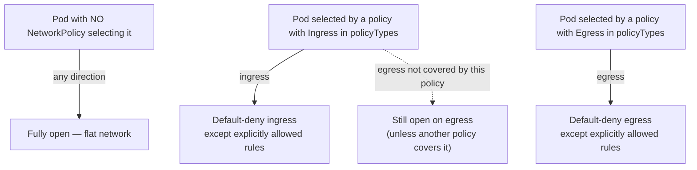
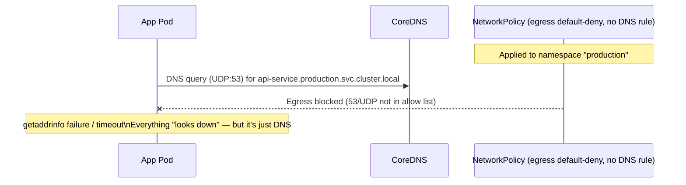

# Kubernetes NetworkPolicy

> Namespace-level firewall rules for pod traffic — but the object is inert unless your CNI actually enforces it. The single most important thing to know: with zero policies, the cluster network is flat (any pod can talk to any pod); the moment a policy *selects* a pod for a direction, that direction flips to default-deny for that pod.

## The "Opt-In Default Deny" Model

- **No NetworkPolicy in a namespace → all pod-to-pod traffic is allowed.** Flat network, no isolation, by design (simplicity for day-1 clusters).
- A NetworkPolicy doesn't "add a rule to an open system" — it **selects pods** (via `podSelector`) and, for whichever direction(s) it declares (`Ingress`/`Egress`), makes that direction default-deny for those pods, then allows only what's explicitly listed.
- This means a pod not selected by *any* policy is still fully open. A pod selected by an ingress-only policy is now default-deny on ingress but still fully open on egress (and vice versa).
- There is **no explicit deny rule**. You cannot write "deny traffic from X" — you can only allow narrower and narrower sets. Same allow-only model as RBAC.



## `policyTypes`: Ingress / Egress

`policyTypes` declares which traffic direction(s) a policy governs. If you omit it, Kubernetes infers it: if the policy has an `ingress` block, `Ingress` is inferred; if it has an `egress` block, `Egress` is inferred. If it has neither, `Ingress` alone is inferred (a no-op default-deny-ingress-nothing-allowed policy).

The trap: an **egress-only default-deny** policy is written as `policyTypes: [Egress]` with an **empty** `egress: []` array. If you leave `policyTypes` to be inferred and there's no `egress` block at all, Kubernetes won't infer `Egress` — you get an ingress-only policy instead, and egress stays wide open, silently defeating your intent. Always set `policyTypes` explicitly. It costs nothing and removes an entire class of "why is this not blocking egress" incidents.

| Scenario | `policyTypes` inferred | Gotcha |
|---|---|---|
| Only `ingress:` block present | `[Ingress]` | Egress untouched — still flat |
| Only `egress:` block present | `[Egress]` | Ingress untouched — still flat |
| Both blocks present | `[Ingress, Egress]` | Fine |
| Want default-deny-egress with nothing allowed | Must set `policyTypes: [Egress]` explicitly + empty `egress: []` | Easy to forget the explicit `policyTypes` when the block is empty |

## Selectors: the AND vs OR trap

| Construct | Meaning |
|---|---|
| `podSelector: {}` | Empty selector = **all pods** in the policy's own namespace |
| `podSelector: {matchLabels: ...}` | Pods matching the label, same namespace as the policy |
| `namespaceSelector: {matchLabels: ...}` | All pods in namespaces matching the label |
| `podSelector` **+** `namespaceSelector` in the **same** `from`/`to` entry | **AND** — traffic must match both (pod with that label, AND in a namespace with that label) |
| Two separate entries in the `from`/`to` **array** | **OR** — traffic matching either entry is allowed |
| `ipBlock: {cidr, except}` | CIDR-based rule for external (non-pod) traffic, with carve-outs |

This is the classic trick question. Compare:

```yaml
# AND — single entry, both selectors must match the SAME source
ingress:
  - from:
      - podSelector:
          matchLabels: {role: frontend}
        namespaceSelector:
          matchLabels: {kubernetes.io/metadata.name: staging}
        # → only pods labeled role=frontend that live in namespace "staging"
```

```yaml
# OR — two separate array entries
ingress:
  - from:
      - podSelector:
          matchLabels: {role: frontend}     # ANY frontend pod, in THIS namespace
      - namespaceSelector:
          matchLabels: {kubernetes.io/metadata.name: staging}   # OR any pod from "staging" ns
```

Note also that a bare `podSelector` (no `namespaceSelector` alongside it) only matches pods **in the same namespace as the NetworkPolicy itself** — it never reaches across namespaces on its own. To match pods in another namespace you need `namespaceSelector` (alone, or ANDed with `podSelector` to narrow further).

`ipBlock` is the only way to reference non-pod traffic — external clients, on-prem ranges, a SaaS provider's published CIDR. `except` carves out sub-ranges (e.g., allow the vendor's public range but exclude their internal management subnet).

## Multiple Policies on the Same Pod: Purely Additive

If pod `payments` is selected by three different NetworkPolicies, the pod's effective ruleset is the **union** of all matching ingress/egress rules across all three. There's no precedence, no override, no explicit deny — policies can only ever widen what's allowed, never narrow it further. This lets different teams own different policies (platform team owns the default-deny + DNS baseline, app team owns their service-specific allow rules) without stepping on each other, but it also means you can't use a "deny" policy to override a looser "allow" policy elsewhere — if anything allows it, it's allowed.

## The #1 Production Gotcha: CNI Enforcement

**A NetworkPolicy is just an API object stored in etcd. Nothing enforces it unless the CNI plugin implements the NetworkPolicy controller/dataplane.** `kubectl apply` will succeed even on a CNI that ignores policies entirely — there is no admission-time validation that enforcement is even possible. This produces a dangerous false sense of security: someone writes a "secure" default-deny-all policy, it applies cleanly, `kubectl get networkpolicy` shows it, and traffic flows completely unrestricted anyway.

| CNI | Enforces NetworkPolicy? |
|---|---|
| Flannel (vxlan/host-gw, basic) | ❌ No — pure overlay, no policy engine at all |
| Calico | ✅ Yes (native, industry standard for policy) |
| Cilium | ✅ Yes (eBPF-based, plus L7/FQDN extensions) |
| Weave Net | ✅ Yes |
| AWS VPC CNI | ⚠️ Only with the network policy agent enabled (`aws-network-policy-agent`, or Calico bundled on EKS) |
| kubenet (GKE legacy) | ❌ No |

**Verify before you trust any policy:**

```bash
# What CNI is actually running?
kubectl get pods -n kube-system -o wide | grep -Ei 'flannel|calico|cilium|weave|aws-node'

# For AWS VPC CNI specifically — is the policy agent on?
kubectl get daemonset aws-node -n kube-system -o jsonpath='{.spec.template.spec.containers[*].name}'
# look for "network-policy-agent" container

# Cilium
kubectl -n kube-system exec ds/cilium -- cilium status | grep Policy
```

If the CNI doesn't enforce policies, **the policy YAML is dead weight** — plan your isolation strategy (or your CNI migration) accordingly before relying on it for a compliance/security boundary.

## The Classic DNS-Breakage Gotcha

Applying a default-deny-egress policy without an explicit DNS allow rule takes down **DNS resolution for every pod in that namespace instantly** — it looks like a total outage (timeouts on every external and internal hostname), because CoreDNS lives in `kube-system`, a different namespace, and pods can no longer even open a UDP socket to it.

Every default-deny-egress policy **must** ship with a paired allow-DNS-egress policy (see `networkpolicy.yaml` example 2):

```yaml
egress:
  - to:
      - namespaceSelector:
          matchLabels:
            kubernetes.io/metadata.name: kube-system
        podSelector:
          matchLabels:
            k8s-app: kube-dns    # CoreDNS pod label — confirm with: kubectl get pods -n kube-system --show-labels
    ports:
      - protocol: UDP
        port: 53
      - protocol: TCP
        port: 53
```

Sequence of what breaks and why:



## Egress to External SaaS via `ipBlock`

Common real pattern: a `payments` pod must only reach the payment gateway's published CIDR, nothing else on the internet.

```yaml
egress:
  - to:
      - ipBlock:
          cidr: 203.0.113.0/24     # vendor's documented API CIDR range
          except:
            - 203.0.113.240/28     # vendor's internal/mgmt range — explicitly excluded
    ports:
      - protocol: TCP
        port: 443
```

Gotcha: `ipBlock` CIDRs are static. If the vendor rotates IPs (common with SaaS behind CDNs/load balancers), the policy silently starts blocking legitimate traffic — you find out when the app throws connection-refused errors, not before. This is the exact pain point Cilium's FQDN-based egress policies solve (see below).

## Direction of the Ecosystem: L7 and FQDN-Aware Policies (Cilium)

Core `networking.k8s.io/v1` NetworkPolicy is L3/L4 only — IP, port, protocol. It cannot say "allow only `POST /api/v1/charge`" or "allow egress to `api.stripe.com` regardless of its current IP." Cilium's `CiliumNetworkPolicy` CRD extends this with:

- **L7-aware rules** — filter HTTP by method/path/header, gRPC by service/method, Kafka by topic — real zero-trust at the application layer, not just the network layer.
- **DNS-aware (FQDN) egress** — `toFQDNs: matchName: api.stripe.com` resolves and tracks the IPs behind a hostname dynamically, instead of hardcoding a CIDR that goes stale.

This is the direction the ecosystem is moving: treat `networking.k8s.io/v1` NetworkPolicy as the portable baseline (works on any compliant CNI), and layer CNI-specific CRDs (CiliumNetworkPolicy, Calico's `GlobalNetworkPolicy`) on top when you need finer-grained control and are willing to be CNI-locked.

## Namespace Isolation Pattern (Multi-Tenancy Baseline)

Standard zero-trust starting point for a shared cluster: deny everything, then explicitly re-open same-namespace traffic and traffic from the ingress controller.

```yaml
# 1. Deny all ingress+egress by default (see networkpolicy.yaml #1)
# 2. Allow DNS egress (see networkpolicy.yaml #2) — otherwise nothing resolves
# 3. Allow ingress from same namespace + from ingress-controller namespace
apiVersion: networking.k8s.io/v1
kind: NetworkPolicy
metadata:
  name: allow-same-ns-and-ingress
  namespace: team-a
spec:
  podSelector: {}
  policyTypes:
    - Ingress
  ingress:
    - from:
        - namespaceSelector:
            matchLabels:
              kubernetes.io/metadata.name: team-a       # same-namespace traffic
        - namespaceSelector:
            matchLabels:
              kubernetes.io/metadata.name: ingress-nginx # LB/ingress-controller namespace
```

This gives each tenant namespace: no cross-tenant traffic, DNS still works, and anything the ingress controller fronts is still reachable from outside. Layer app-specific allow rules (e.g., `payments-allow-from-checkout`) on top as needed — remember, it's additive.

## Troubleshooting Flow

```bash
# 1. Confirm the CNI actually enforces policy (see CNI table above) — do this FIRST,
#    before debugging anything else, or you'll chase a ghost.

# 2. List all policies across the cluster
kubectl get networkpolicy -A

# 3. Inspect a specific policy's resolved rules
kubectl describe networkpolicy default-deny-all -n production

# 4. Confirm which pods a policy actually selects (label match is easy to get wrong)
kubectl get pods -n production --show-labels

# 5. Test connectivity from an ephemeral debug pod
kubectl run tmp-shell --rm -it --image=nicolaka/netshoot -n production -- /bin/bash
#   inside:
#   curl -v telnet://payments.production.svc.cluster.local:8443
#   dig api-service.production.svc.cluster.local
#   nc -zv 203.0.113.10 443

# 6. CNI-specific policy diagnostics
calicoctl get networkpolicy -n production          # Calico
calicoctl get workloadendpoint -n production        # confirm Calico sees the pod
cilium monitor --type drop                          # Cilium — live-stream dropped packets
cilium monitor -v --related-to <endpoint-id>         # Cilium — trace a specific endpoint

# 7. Check kube-proxy / CNI agent logs on the node if traffic still doesn't match expectations
kubectl logs -n kube-system <cni-pod-name>
```

## Common Interview Questions

**Q: If I create a NetworkPolicy that only has an `ingress` block and no `egress` block, what happens to egress traffic for the selected pods?**
Nothing changes for egress — it stays exactly as open (or as restricted by other policies) as before. `policyTypes` is inferred from which blocks are present when you don't set it explicitly, so a policy with only an `ingress` block gets `policyTypes: [Ingress]`, and egress for those pods is untouched. This is fine when that's your intent, but it's a common source of confusion when someone assumes "I wrote a NetworkPolicy for this pod" means all traffic is now locked down — it only locks down the direction(s) actually declared. Always set `policyTypes` explicitly so the YAML states intent instead of relying on an inference rule most engineers haven't memorized.

**Q: Two NetworkPolicies both select the same pod — one allows port 443 from namespace A, the other allows port 8080 from namespace B. What's the effective policy?**
Both rules apply — it's a union, not a conflict. The pod accepts 443 from A and 8080 from B, nothing else. There's no mechanism for one policy to deny what another allows; NetworkPolicy has no explicit-deny primitive, so the only way to "remove" access is to edit or delete the policy that grants it. This is identical in spirit to RBAC's allow-only model — you reason about the union of everything that applies, not about precedence between objects.

**Q: You wrote a default-deny-all NetworkPolicy on an EKS cluster and traffic is still flowing freely between pods. What's the first thing you check?**
Whether the CNI actually enforces NetworkPolicy at all — this is the single most common reason a "secure" policy silently does nothing. On EKS, the default AWS VPC CNI only enforces NetworkPolicy if the network policy agent is explicitly enabled (or you're running Calico for policy alongside VPC CNI for the dataplane); otherwise `kubectl apply` succeeds and the object sits in etcd doing nothing. Same failure mode on any cluster running plain Flannel — Flannel has no policy engine, full stop. Check `kubectl get daemonset aws-node -n kube-system -o yaml` for the network-policy-agent container, or check which CNI DaemonSet is actually running, before assuming the policy YAML itself is wrong.

**Q: Why did all my pods lose DNS resolution the moment I applied a default-deny egress policy?**
Because CoreDNS lives in `kube-system`, a separate namespace, and default-deny egress blocks all outbound traffic from the selected pods — including the UDP:53 query to CoreDNS — unless you've explicitly allowed it. It presents as a total outage (every hostname lookup times out, looks like the whole app is down) when it's really just DNS. The fix is mandatory, not optional: any default-deny-egress policy must ship paired with an allow rule for egress to `kube-system`/`k8s-app: kube-dns` on UDP and TCP port 53. Teams that get burned by this once usually template the DNS-allow policy alongside every default-deny policy going forward.

**Q: Explain the difference between putting `podSelector` and `namespaceSelector` in the same `from` entry versus separate entries in the `from` array.**
Within a single entry, multiple selector fields are ANDed — the source must satisfy all of them simultaneously (e.g., a pod with label `role=frontend` that is *also* running in a namespace labeled `env=staging`). Separate entries in the `from`/`to` array are ORed — traffic matching any one entry is allowed. This is a deliberately easy typo to make: writing two selectors as sibling keys under one list item narrows the match (AND, more restrictive than intended), while splitting them into two list items broadens it (OR, more permissive than intended). Always sanity-check the YAML indentation — a misplaced dash changes the security posture of the rule.

**Q: How would you allow a workload to call an external SaaS API without opening egress to the whole internet, and what's the weakness of that approach?**
Use an `ipBlock` rule scoped to the vendor's published CIDR range (with `except` to carve out sub-ranges you don't want, like their internal management network), restricted to the specific port (typically 443). The weakness is that `ipBlock` is static — if the vendor's IPs sit behind a CDN or rotate (very common), the policy either goes stale and blocks legitimate traffic, or you over-provision a huge CIDR range to compensate, weakening the isolation. Cilium's `CiliumNetworkPolicy` solves this properly with `toFQDNs`, which resolves and tracks the actual IPs behind a hostname dynamically — the trade-off is you're now locked into a CNI-specific CRD instead of the portable core API.

**Q: A NetworkPolicy YAML applies cleanly with `kubectl apply` and no errors. Does that guarantee it's being enforced?**
No — this is the crux of the whole topic. `kubectl apply` only validates the object against the Kubernetes API schema; it has no idea whether any CNI in the cluster will actually read and enforce that object. Flannel, kubenet, and unconfigured AWS VPC CNI will happily accept the object into etcd and do nothing with it. The only way to know enforcement is real is to check which CNI is running and whether its policy engine is enabled, then verify empirically with a test pod (`kubectl run tmp-shell --rm -it --image=nicolaka/netshoot -- /bin/bash` and attempt a blocked connection) rather than trusting the YAML's mere existence.

**Q: What's the simplest safe baseline for network isolation in a new multi-tenant namespace?**
Three policies, applied together: (1) default-deny-all for both ingress and egress (`podSelector: {}`, empty `ingress`/`egress` lists, explicit `policyTypes`), (2) allow-DNS-egress to `kube-system`/`kube-dns` on 53/UDP+TCP — non-negotiable, everything breaks without it, and (3) allow-ingress-from-same-namespace plus allow-ingress-from-the-ingress-controller-namespace, so intra-tenant traffic and externally-fronted services keep working. From there, layer narrower app-specific allow rules additively (e.g., only `checkout` can call `payments`) without touching the baseline. This mirrors the RBAC "least privilege by default, explicit grants on top" philosophy, and it's CNI-portable as long as the CNI enforces core NetworkPolicy at all.
