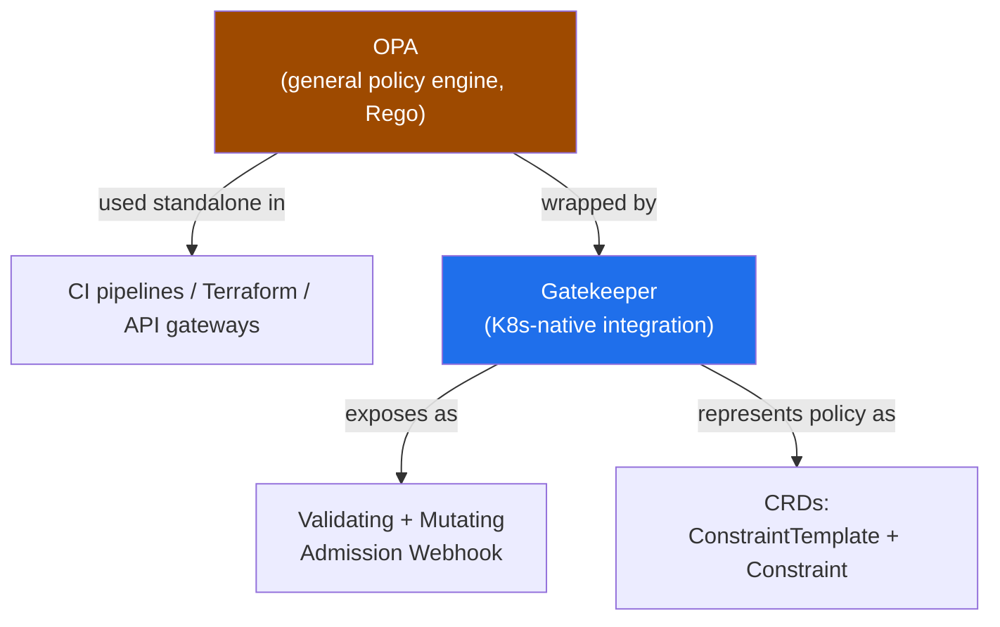
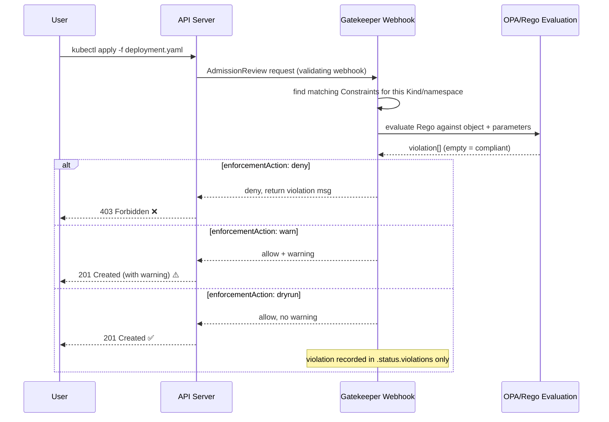
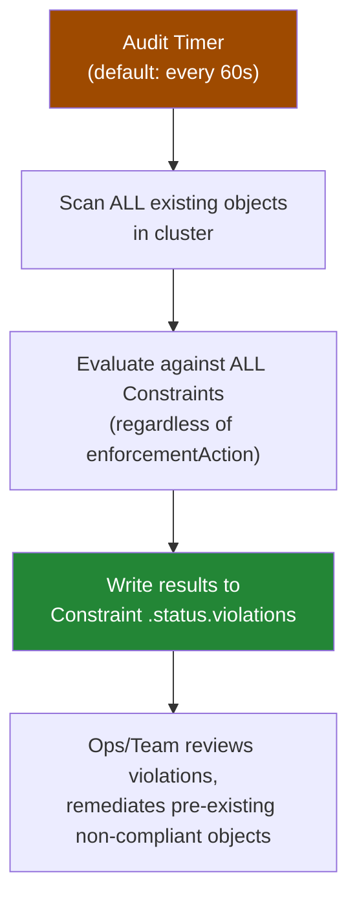

# OPA Gatekeeper

> Policy-as-code for Kubernetes: enforce arbitrary organizational rules ("all Deployments need a cost-center label," "no `:latest` tags") at admission time, as native CRDs instead of bolted-on config. Interviewers use this to probe whether you understand policy enforcement beyond RBAC/PSA.

## OPA vs Gatekeeper — Relationship

**OPA (Open Policy Agent)** is a general-purpose policy engine — it's not Kubernetes-specific. You can run it in front of API gateways, in CI pipelines, alongside Terraform (via `conftest`), or as a sidecar for microservice authorization. Policies are written in **Rego**, a declarative query language purpose-built for expressing "is this input allowed" logic over JSON documents.

**Gatekeeper** is the Kubernetes-native integration layer on top of OPA. It:
- Packages OPA as a **validating admission webhook** (and, since v3.x, an optional **mutating** webhook too).
- Represents policies as **CRDs** (`ConstraintTemplate`, `Constraint`) instead of raw `.rego` files loaded into a standalone OPA server — this is what makes it feel `kubectl`-native rather than an external system you have to babysit separately.
- Adds a periodic **audit** loop OPA itself doesn't provide out of the box.

Think of it as: OPA is the engine, Gatekeeper is the Kubernetes chassis, admission webhook wiring, and CRD API bolted around it.



---

## ConstraintTemplate vs Constraint — the Two-Object Model

This is the single most common point of confusion. Two separate objects, two separate jobs:

| | ConstraintTemplate | Constraint |
|--|---------------------|------------|
| Role | Defines **reusable Rego logic** + a schema for input parameters | An **instance** of a template with concrete parameter values |
| Analogy | A class / function definition | An object instantiated from that class |
| Contains | `rego` policy body, `openAPIV3Schema` for `parameters` | `parameters` values, `match` scope, `enforcementAction` |
| Cardinality | One template | **Many** constraints can reuse it |
| Example | `k8srequiredlabels` (generic "require these labels") | `require-cost-center-label` (labels: `[cost-center, team]`, scoped to `production`) |

One `k8srequiredlabels` template can back multiple constraints — e.g., `require-labels-production` demanding `cost-center` + `team`, and a separate `require-labels-ingress` demanding just `owner`, scoped only to `Ingress` objects. You write the Rego once; you stamp out cheap CRD instances for every scope/parameter combination after that.

The `match` field on a Constraint is what scopes it — `kinds` (which GroupVersionKind), `namespaces`/`excludedNamespaces`, `labelSelector`. Without a tight `match`, a Constraint applies cluster-wide to every matching kind, which is a common way teams accidentally lock themselves out.

---

## Admission-Time Enforcement Flow



This path only sees **new or updated** objects — anything already sitting in etcd before the Constraint existed is invisible to it. That gap is exactly what the audit controller exists to close.

---

## `enforcementAction` — Safe Rollout Pattern

| Value | Behavior | When to use |
|-------|----------|-------------|
| `deny` | Blocks the request outright at admission | Policy proven safe, ready to enforce |
| `dryrun` | Evaluates, records violations in `.status.violations`, does **not** block | Testing a new policy's blast radius against real traffic |
| `warn` | Allows the request, returns a warning message visible in `kubectl` client output | Softer nudge — visible to the user but non-blocking |

**Standard safe rollout sequence** (the answer interviewers are fishing for):
1. Write the ConstraintTemplate + Constraint.
2. Set `enforcementAction: dryrun`.
3. Let it run for a representative period (days, not minutes) — audit will also sweep existing objects during this window.
4. Inspect `.status.violations` on the Constraint to see exactly what would have been blocked.
5. Either fix the flagged resources or grant explicit exceptions (tighter `match`, exclude a namespace).
6. Flip to `deny` (or `warn` as an intermediate step if you want visibility without hard blocking indefinitely).

Skipping straight to `deny` on a new policy in a live cluster is the classic self-inflicted outage — you find out what's non-compliant when writes start failing, not before.

---

## Audit Controller — the Separate Evaluation Path

Admission enforcement only ever looks at objects being created or updated **right now**. It has zero visibility into the thousands of objects already sitting in the cluster from before the policy existed. The **audit controller** is Gatekeeper's answer to that gap:

- Runs on a periodic interval (`--audit-interval`, **default 60s**, tune for cluster size).
- Re-evaluates **every existing object in the cluster** against **every Constraint**, regardless of that Constraint's `enforcementAction` (audit always records, even under `dryrun`).
- Populates `.status.violations` on each Constraint — a point-in-time list of every non-compliant object currently in the cluster.
- Does **not** block or mutate anything — it's purely observational/reporting.



**Why this matters operationally:** if you roll out a "require cost-center label" policy today, admission enforcement stops *new* unlabeled Deployments from landing — but the 400 Deployments already running unlabeled from the last two years are only surfaced by the audit pass. Audit is your backlog-discovery mechanism; admission is your going-forward gate. Confusing the two is a common interview trip-up.

---

## Common Real-World Policies

- Require specific labels/annotations on all resources (`cost-center`, `owner`, `team`) for chargeback/ownership tracking.
- Disallow the `:latest` image tag — forces immutable, traceable, reproducible deploys (you can always tell exactly what's running).
- Restrict container images to an approved registry allowlist (block pulling from arbitrary public registries).
- Block privileged containers, `hostNetwork`, `hostPID` — though **Pod Security Admission (PSA)** now covers much of this natively via its `privileged`/`baseline`/`restricted` levels.
- Anything **more custom/business-specific** than PSA's three fixed levels — that's Gatekeeper's actual niche now: "all Ingress objects must carry annotation X," "all Deployments must set resource requests AND live in a namespace carrying an approved cost-center label," arbitrary org policy that has nothing to do with pod security per se.

Rule of thumb: PSA for baseline pod security posture (cheap, built-in, no CRDs to manage); Gatekeeper for anything organization-specific that PSA's fixed levels don't express.

---

## Gatekeeper vs Kyverno

| | Gatekeeper (OPA/Rego) | Kyverno |
|--|------------------------|---------|
| Policy language | Rego (purpose-built DSL) | Plain YAML |
| Learning curve | Steep — Rego has its own semantics (unification, sets) | Low — feels like writing another Kubernetes manifest |
| Mutation support | Added later (v3.x), less mature | First-class, built in from day one |
| Expressiveness | Very high — full logic engine, good for genuinely complex rules | Good for common cases; complex logic gets awkward in YAML |
| Ecosystem | Part of the broader OPA ecosystem (reusable outside K8s) | Kubernetes-only |
| Audit | Built-in audit controller | Built-in `PolicyReport`/`ClusterPolicyReport` |

**Honest take:** Kyverno wins on speed of adoption and day-to-day ergonomics — most teams can write and review Kyverno policies without a dedicated Rego learning investment, and mutation ("default this field if missing") is much more natural. Reach for Gatekeeper/Rego when policies need genuine logical complexity (multi-object cross-referencing, complex set operations) or when you want a policy engine that's reusable outside Kubernetes (same OPA investment covers CI gates, API gateway authz, Terraform plan checks).

---

## Operational Risk: Same as Any Admission Webhook

Gatekeeper's enforcement path *is* a validating (and possibly mutating) admission webhook — it inherits the exact same production risk profile as any other webhook (see `AdmissionWebhooks` notes): if the `ValidatingWebhookConfiguration` for Gatekeeper is set to `failurePolicy: Fail` and the `gatekeeper-controller-manager` pods are down, unreachable, or overloaded, **every matching write to the API server blocks** — including, in a bad enough scenario, the writes you'd need to fix or scale Gatekeeper itself.

Mitigations: run Gatekeeper with multiple replicas + PodDisruptionBudget, keep `failurePolicy: Ignore` for non-critical constraints (accept the policy gap over an outage), scope `namespaceSelector` to exclude `kube-system`/`gatekeeper-system` from Gatekeeper's own webhook so it can never lock itself out, and set a sane `timeoutSeconds` so a slow Rego evaluation doesn't hang the entire request.

---

## Debugging & Verification

```bash
# List installed policy definitions (the reusable Rego + schema)
kubectl get constrainttemplates

# List all constraint instances of a given kind
kubectl get k8srequiredlabels
kubectl get constraints                      # generic, lists all constraint kinds if supported

# Inspect a specific constraint — .status.violations comes from the audit pass
kubectl describe k8srequiredlabels require-cost-center-label

# Check audit timing / totals
kubectl get k8srequiredlabels require-cost-center-label -o jsonpath='{.status.totalViolations}'

# Gatekeeper controller logs — Rego evaluation errors, webhook errors
kubectl logs -n gatekeeper-system -l control-plane=controller-manager --tail=200

# Gatekeeper audit pod logs — separate from admission controller logs
kubectl logs -n gatekeeper-system -l control-plane=audit-controller --tail=200

# Confirm the webhook config itself (failurePolicy, scope)
kubectl get validatingwebhookconfigurations gatekeeper-validating-webhook-configuration -o yaml
```

---

## Common Interview Questions

**Q: What's the actual relationship between OPA and Gatekeeper?**
OPA is a standalone, general-purpose policy engine that evaluates Rego against any JSON input — it has no idea what Kubernetes is. Gatekeeper is the Kubernetes-native wrapper: it runs OPA internally but exposes policy as CRDs (`ConstraintTemplate`/`Constraint`) instead of raw Rego files, and wires OPA's decisions into the admission webhook chain automatically. You could run raw OPA as a sidecar and hand-wire it to a webhook yourself, but Gatekeeper gives you that integration plus the audit loop for free — that's the whole value-add over "just use OPA."

**Q: Explain ConstraintTemplate vs Constraint — why two objects instead of one?**
Separation of policy logic from policy application. The ConstraintTemplate holds the Rego and a parameter schema — it's the reusable "function." The Constraint is a cheap instantiation with concrete parameter values and a `match` scope. This lets platform teams own a small library of vetted templates (require-labels, disallow-tags, approved-registries) while individual teams or namespaces instantiate Constraints against their own parameters without touching Rego at all. It also means a bug fix to the Rego logic in one template instantly propagates to every Constraint built on it.

**Q: Why would you ever use `dryrun` instead of just testing in a lower environment first?**
Because "the policy is correct in staging" doesn't tell you the blast radius in production, where the actual object population, edge cases, and legacy resources live. `dryrun` lets you evaluate a brand-new policy against real production traffic and the real existing object inventory (via audit) without risking an outage from blocking legitimate requests you didn't anticipate. It's the difference between testing against a sanitized subset and testing against ground truth — you flip to `deny` only once `.status.violations` has stopped surprising you.

**Q: How does the audit controller differ from admission-time enforcement, and why do you need both?**
Admission enforcement only evaluates objects at the moment of a create/update API call — it's a gate on new writes, blind to anything already persisted in etcd. The audit controller runs on a timer (default 60s) and re-scans **every existing object** against **every Constraint**, regardless of `enforcementAction`, purely to populate `.status.violations` for visibility — it never blocks or mutates. You need both because a policy rolled out today has zero effect on the years of pre-existing objects already in the cluster; audit is how you discover and remediate that backlog, admission is how you stop the backlog from growing further.

**Q: When would you reach for Gatekeeper instead of just using Pod Security Admission?**
PSA gives you three fixed levels (`privileged`, `baseline`, `restricted`) covering pod-security-specific concerns — no privileged containers, no hostNetwork, etc. It's free, built into the API server, and requires zero extra components. Gatekeeper earns its keep the moment your policy is organization-specific rather than pod-security-specific: "every Ingress must have annotation X," "every Deployment in a regulated namespace must set resource requests and carry an approved cost-center label." PSA can't express arbitrary business rules; Gatekeeper (or Kyverno) can. If your entire policy set is "just enforce baseline pod security," adding Gatekeeper is unnecessary operational overhead.

**Q: Gatekeeper or Kyverno — which do you recommend?**
Depends on the team and the policy complexity, not a universal answer. Kyverno's plain-YAML policies and first-class mutation support mean most platform teams can be productive in days, and reviewers who already read Kubernetes manifests can review Kyverno policies without learning Rego. Gatekeeper's Rego is more expressive for genuinely complex cross-object logic and pays off if you're already invested in the broader OPA ecosystem (same policies reused in CI/CD gates, Terraform plan checks, API gateways). For a team optimizing for fast adoption and simpler policies, I'd default to Kyverno; for complex logic or a multi-system OPA strategy, Gatekeeper.

**Q: What's the operational risk of running Gatekeeper, and how do you mitigate it?**
Gatekeeper's enforcement path is a validating (and optionally mutating) admission webhook, so it inherits the same failure mode as any misconfigured webhook: if `failurePolicy: Fail` is set and the `gatekeeper-controller-manager` pods are unavailable, every matching API write blocks cluster-wide — potentially including the fix you need to apply to recover. Mitigate with multiple Gatekeeper replicas behind a PodDisruptionBudget, excluding `kube-system`/`gatekeeper-system` from Gatekeeper's own webhook scope so it can never lock itself out, a sane `timeoutSeconds`, and treating `failurePolicy: Ignore` as the safer default for non-critical constraints where availability trumps strict enforcement.

**Q: How do you debug a Constraint that isn't blocking what you expect?**
Start with `kubectl get constrainttemplates` to confirm the template loaded without Rego compile errors, then `kubectl get <constraint-kind>` and `kubectl describe <constraint-kind> <name>` to check `.status.violations` — if the object you expect isn't listed, the audit pass hasn't caught up yet (default 60s interval) or your `match` scope excludes it. Check `enforcementAction` isn't accidentally still `dryrun`. If nothing shows up at all, check the `gatekeeper-controller-manager` logs for Rego evaluation errors or webhook timeouts, and confirm the `ValidatingWebhookConfiguration` actually targets the resource kind and namespace in question.
