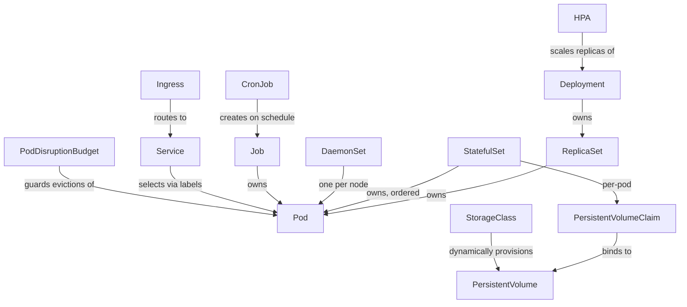

# Kubernetes Components — Overview

> An index of every core Kubernetes object, grouped by what problem it solves. Each subsection links to a full deep-dive doc with YAML, mermaid diagrams, and interview Q&A — this page is the map, not the territory.

## Object Relationship Map

How the major objects actually own/create one another — useful for answering "what creates what" style questions:



## Workloads

### Pod
- The smallest deployable unit.
- Contains one or more containers that share storage and **networking** (one IP, one network namespace — see [Networking.md](../Networking/Networking.md) for exactly why).
- Each pod gets its own IP & a new IP on recreation — pods are disposable, never treat a pod IP as stable.

### Deployment
Manages the rollout of new application versions and ensures a specified number of pod replicas run at all times. A Deployment manages a ReplicaSet, and the ReplicaSet manages the actual Pods — this two-layer indirection is what makes rolling updates possible (the old ReplicaSet scales down while a new one scales up, both alive briefly at once). Full deep dive, YAML, and rollout mechanics: [Deployment.md](Deployment/Deployment.md).

**Key features:** replica management, rolling updates (zero-downtime), rollback, scaling, self-healing.

**Deployment strategies**
- *Rolling Update (default)* — updates Pods one by one; new Pods created while old ones terminate; controlled by `maxSurge`/`maxUnavailable`.
- *Recreate* — deletes all existing Pods first, then creates new ones; causes downtime.

**Rollback commands:**
```bash
# Check deployment history
kubectl rollout history deployment my-app

# Roll back to the previous working version
kubectl rollout undo deployment my-app
```

**Affinity & Anti-affinity** (deep dive: [Scheduling.md](Scheduling/Scheduling.md))
- *Node Affinity* — schedules Pods based on node labels. `requiredDuringSchedulingIgnoredDuringExecution` (hard rule) vs `preferredDuringSchedulingIgnoredDuringExecution` (soft rule).
- *Pod Affinity* — schedules Pods together on the same node(s) as other labeled Pods.
- *Pod Anti-affinity* — prevents certain Pods from co-locating on the same node.

**Taints & Tolerations** (deep dive: [Scheduling.md](Scheduling/Scheduling.md)) — taints repel Pods from a node unless the Pod tolerates them:
```bash
kubectl taint nodes node1 key=value:NoSchedule
# NoSchedule → no Pod can land here unless it has a matching toleration
```

**Probes (health checks)**
- *Liveness* — restarts the container if it becomes unresponsive.
- *Readiness* — controls whether the Pod receives traffic; does not restart on failure.
- *Startup* — protects slow-starting apps from being killed by liveness before they're up.

**nodeSelector** — the simplest node-targeting mechanism: match Pods to nodes by exact key-value label. If no node carries that label, the Pod stays `Pending` forever (no fallback, unlike preferred affinity).

### StatefulSet
Used for stateful applications (databases, message queues) that need stable network identity and dedicated persistent storage per replica, with ordered start/stop. Full deep dive: [statefulset.md](StatefulSet/statefulset.md) · Multi-region DR strategies: [statefulset-dr.md](StatefulSet/statefulset-dr.md).

### DaemonSet
Runs one Pod copy per node (or a labeled subset) — the standard pattern for log/metrics agents like Fluent Bit or Prometheus Node Exporter, CNI plugins, and storage daemons. Full deep dive: [DaemonSet.md](DaemonSet/DaemonSet.md).

### Job & CronJob
- **Job** — runs a task to completion (e.g., a one-off data migration).
- **CronJob** — schedules a Job at a recurring interval; the CronJob creates a Job, and the Job creates Pods.

Full deep dive: [CronJob.md](Cronjobs/CronJob.md).

## Networking & Traffic

### Service
Exposes a stable virtual IP/DNS name in front of a changing set of Pods. Types: **ClusterIP** (default, internal-only), **NodePort** (static port on every node), **LoadBalancer** (cloud provider LB), **ExternalName** (CNAME alias to an external host). Full deep dive: [Service.md](Service/Service.md).

### Networking Internals
How pod-to-pod traffic actually moves at the packet level — network namespaces, veth pairs, CNI plugins, overlay (VXLAN) vs BGP native routing, the iptables/IPVS DNAT mechanism behind a ClusterIP, and CoreDNS. Deep dive: [Networking.md](../Networking/Networking.md).

### Ingress
Manages HTTP/HTTPS traffic, routing requests to different Services by host/path rules — one shared load balancer for many Services instead of one-per-Service. Full deep dive: [Ingress.md](Ingress/Ingress.md).

### Network Policy
Defines allow-list rules for pod-to-pod and pod-to-external communication — enforcement depends entirely on the CNI plugin supporting it. Full deep dive: [NetworkPolicy.md](NetworkPolicy/NetworkPolicy.md).

## Storage

### Persistent Volume (PV) & Persistent Volume Claim (PVC)
PV is the cluster-wide storage resource (the actual disk); PVC is a Pod's request for storage, matched/bound to a PV by Kubernetes.

### Storage Class
Abstracts the underlying storage provisioner (EBS, EFS, etc.) and enables dynamic provisioning of PVs so nobody has to hand-create disks.

Full deep dive on all three together: [Storage.md](Storage/Storage.md) · provisioning sequence: [volumeCreationFlow.md](../Flows/volumeCreationFlow.md).

## Configuration & Secrets

### ConfigMap & Secret
Externalize configuration and sensitive data from container images — ConfigMap for non-sensitive config, Secret for credentials/keys (base64-encoded, not encrypted, by default). Full deep dive: [ConfigMapSecret.md](ConfigMapSecret/ConfigMapSecret.md).

## Autoscaling

- **HPA** — adjusts pod replica count based on CPU/memory/custom metrics.
- **VPA** — adjusts a pod's CPU/memory *requests* dynamically instead of replica count.
- **Cluster Autoscaler** — scales the number of worker *nodes* based on unschedulable/underutilized capacity.

All three, plus how they conflict and when to combine them: [Autoscaling.md](Autoscaling/Autoscaling.md).

## Security, RBAC & Policy

- **RBAC** — authorization model controlling who can do what on which resources. [RBAC.md](RBAC/RBAC.md).
- **Security Context & Pod Security Admission** — container privilege, capabilities, user/group, and cluster-wide security baselines. [SecurityContext.md](SecurityContext/SecurityContext.md).
- **Admission Webhooks** — mutating/validating webhooks sitting in the request pipeline before persistence. [AdmissionWebhooks.md](AdmissionWebhooks/AdmissionWebhooks.md).
- **OPA Gatekeeper** — policy-as-code admission control via ConstraintTemplates + Constraints. [OPAGatekeeper.md](OPAGatekeeper/OPAGatekeeper.md).

## Reliability & Governance

- **Pod Disruption Budget** — limits voluntary disruptions (drains, scale-down) so a minimum number of pods stay available. [PodDisruptionBudget.md](PodDisruptionBudget/PodDisruptionBudget.md).
- **Resource Quota & LimitRange** — namespace-level caps on aggregate resource consumption plus per-container defaults. [ResourceQuotas.md](ResourceQuotas/ResourceQuotas.md).

## Extensibility

- **CRD & Operators** — extend the Kubernetes API with custom kinds and the controllers that reconcile them. [CustomResourcesCRD.md](CRD/CustomResourcesCRD.md).

## Packaging & GitOps

- **Helm** — package manager for Kubernetes: templated charts, releases, rollbacks. [Helm.md](Helm/Helm.md).
- **Kustomize** — template-free, patch-based configuration management (base + overlays). [Kustomize.md](Kustomize/Kustomize.md).

## Common Interview Questions

**Q: If you had to explain the whole Kubernetes object model in one mental model, what would it be?**
Almost everything is either a *workload* (something that produces Pods: Deployment, StatefulSet, DaemonSet, Job/CronJob — each encoding a different scheduling/identity/lifecycle guarantee), a *traffic* object (Service, Ingress, NetworkPolicy — how requests find and are allowed to reach those Pods), a *storage* object (PV/PVC/StorageClass — how state survives past a Pod's lifetime), or a *governance* object (RBAC, ResourceQuota, PodDisruptionBudget, admission webhooks/policy engines — the guardrails around all of the above). Everything else (Helm, Kustomize, CRDs/Operators) is tooling built on top of this same object model, not a separate concept.

**Q: Why are there so many different workload controllers (Deployment, StatefulSet, DaemonSet, Job) instead of one generic "run my Pod" object?**
Because each encodes a fundamentally different guarantee that can't be safely bolted onto the others: Deployment assumes Pods are interchangeable (any replica can serve any request, so rolling updates and random scheduling are safe); StatefulSet exists specifically because that assumption is *false* for databases/queues (each replica has a distinct identity and disk); DaemonSet exists because "exactly one per node" is a topology constraint, not a replica count; Job/CronJob exist because "run to completion" is a different lifecycle than "run forever." Trying to express all four with one API would mean every user has to opt out of guarantees they don't want rather than opting into the ones they do.

**Q: How do owner references tie this whole hierarchy together, and why does it matter operationally?**
Every object created by a controller (a ReplicaSet's Pods, a CronJob's Jobs, a Job's Pods) carries an `ownerReferences` field pointing back to its creator. This is what makes garbage collection cascade correctly — deleting a Deployment cascades through its ReplicaSet down to its Pods automatically — and it's also exactly what you inspect (`kubectl get pod <name> -o yaml | grep -A3 ownerReferences`) when you're trying to figure out *why* a Pod exists that nobody remembers creating directly: trace the owner chain up until you find the human-authored object at the top.
