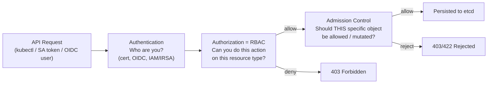
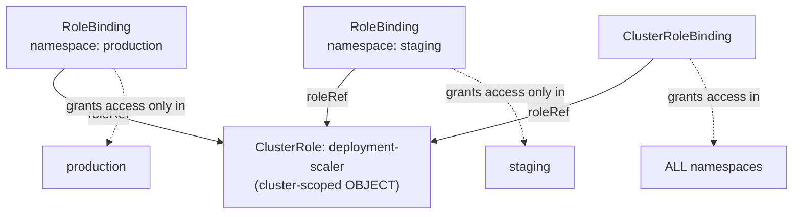
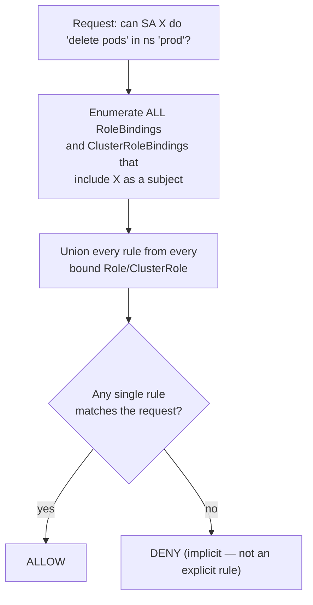
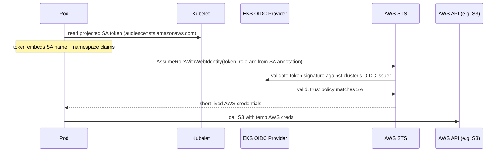

# RBAC (Role-Based Access Control)

> RBAC is the authorization layer that decides *what an already-authenticated identity is allowed to do* against the Kubernetes API. Get it wrong and you either lock out legit automation or hand out cluster-admin to a CI pipeline — most real-world k8s security incidents trace back to over-broad RBAC, not a broken auth mechanism.

## Where RBAC Sits in the Request Pipeline

Every API request goes through three independent stages. RBAC is only stage 2 — it has no idea what the object looks like, only what verb/resource is being requested.



RBAC answers "can you create Pods at all?". A Pod Security admission policy answers "can you create *this* Pod, given it requests `privileged: true`?". A request can sail through RBAC and still get rejected at admission — they are separate, sequential gates.

## Role vs ClusterRole, RoleBinding vs ClusterRoleBinding

| | Role | ClusterRole |
|---|------|-------------|
| Scope of the object | Namespaced (rules apply only within one namespace) | Cluster-scoped object, but rules can target namespaced OR cluster-scoped resources (nodes, PVs, namespaces themselves) |
| Can grant access to cluster-scoped resources (nodes, PVs) | No | Yes |
| Reusable across namespaces | No — one Role per namespace | Yes — same ClusterRole can be bound many times |

| | RoleBinding | ClusterRoleBinding |
|---|-------------|---------------------|
| Object scope | Namespaced | Cluster-scoped |
| Can reference a Role | Yes (same namespace only) | No |
| Can reference a ClusterRole | **Yes** — grants get scoped down to the binding's namespace | Yes — grants apply cluster-wide |
| Effective permission scope | Always limited to the binding's namespace | Always cluster-wide |

### The trick combo interviewers love

A **RoleBinding can reference a ClusterRole**. This does *not* grant cluster-wide access — the permissions from the ClusterRole get scoped down to whichever namespace the RoleBinding lives in. This is the standard pattern for reusing one canonical set of rules (e.g. the built-in `view` ClusterRole, or a custom `deployment-scaler` ClusterRole) across many namespaces without copy-pasting a Role into each one. See `rbac.yaml` — `ci-deployer-can-scale` binds the cluster-scoped `deployment-scaler` ClusterRole but only inside `production`.



Same ClusterRole object, three different effective scopes depending entirely on the binding type — the ClusterRole itself carries no opinion about scope.

## Rule Anatomy

```yaml
rules:
  - apiGroups: ["apps"]              # "" = core group; "apps", "batch", "rbac.authorization.k8s.io" etc for others
    resources: ["deployments/scale"] # subresource — separate permission from "deployments" itself
    verbs: ["update", "patch"]
    resourceNames: ["frontend"]      # optional: narrows to one named object (no wildcards allowed here)
```

| Field | Purpose |
|-------|---------|
| `apiGroups` | Which API group the resource belongs to. `""` is core (pods, services, secrets, configmaps). |
| `resources` | The resource type(s), e.g. `pods`, `deployments`, `secrets`. |
| `verbs` | Action(s): `get`, `list`, `watch`, `create`, `update`, `patch`, `delete`, `deletecollection`. |
| `resourceNames` | Optional allowlist of specific object names — cannot be combined with `create` (name doesn't exist yet). |
| Subresources | `pods/log`, `pods/exec`, `pods/portforward`, `deployments/scale`, `pods/status` — permissioned independently. |

**Why subresources exist as separate permissions:** `pods/exec` and `pods/log` are technically part of the `pods` resource's URL path, but they carry wildly different risk profiles than reading a Pod's spec. `get pods` just returns metadata/status. `create pods/exec` gives an interactive shell inside a running container — effectively code execution on the node's container runtime. Bundling that with generic `pods` read access would make every "read-only" viewer role a remote-shell primitive. Same logic for `deployments/scale`: it lets you change replica count without granting write access to the full Deployment spec (image, env vars, volumes) — useful for a limited "autoscaler" or on-call role that should scale but never redeploy.

## Subjects: User, Group, ServiceAccount

```yaml
subjects:
  - kind: User
    name: jane@company.com          # comes from client cert CN, OIDC "sub"/"email" claim, or IAM identity in EKS
  - kind: Group
    name: "oidc:platform-team"      # comes from OIDC group claims, or cert O= field
  - kind: ServiceAccount
    name: ci-deployer
    namespace: production           # the ONLY subject kind that is an actual API object
```

Kubernetes has **no built-in User or Group object**. There's nothing to `kubectl get users`. Identity for `User`/`Group` subjects is entirely delegated to whatever authentication method the cluster is configured with — client certificate CN/O fields, an OIDC identity provider (the standard for human users, e.g. via `aws eks get-token` + an OIDC-backed identity in EKS), or webhook token authentication. RBAC just trusts whatever string the authenticator hands it and matches it against `subjects`. `ServiceAccount` is the one exception — it's a real namespaced API object (`kubectl get sa`) with its own lifecycle, and Kubernetes mints/validates its tokens natively.

## Default Aggregated ClusterRoles

| ClusterRole | Grants |
|-------------|--------|
| `cluster-admin` | `*` verbs on `*` resources in `*` apiGroups, cluster-wide. Full control including RBAC objects themselves. |
| `admin` | Full read/write on most namespaced resources (including creating Roles/RoleBindings *within that namespace*), but not cluster-scoped resources, not quota/namespace itself. |
| `edit` | Read/write on most namespaced resources (pods, deployments, services, jobs...) but explicitly **excludes** viewing/editing Roles, RoleBindings, and Secrets' contents in some setups — cannot escalate own permissions. |
| `view` | Read-only on most namespaced resources. Explicitly **excludes reading Secrets** (to prevent read-only users from exfiltrating credentials). |

These four are built via **aggregation**, not by hand-listing every rule. `cluster-admin`, `admin`, `edit`, and `view` each carry an `aggregationRule` that unions the rules of every ClusterRole matching a label selector:

```yaml
# (this is what the built-in "edit" ClusterRole looks like, conceptually)
aggregationRule:
  clusterRoleSelectors:
    - matchLabels:
        rbac.authorization.k8s.io/aggregate-to-edit: "true"
rules: []   # populated automatically by the controller — never edit this list directly
```

**Extending `edit` with a custom CRD without touching the built-in role:** create a new ClusterRole with the resource rules you need, and label it `rbac.authorization.k8s.io/aggregate-to-edit: "true"`. The `kube-controller-manager`'s ClusterRole-aggregation controller watches for that label and automatically merges your rules into `edit`'s rule list within seconds — no editing of `edit` itself, no risk of a `kubectl apply` from an upgrade wiping your change. See `rbac.yaml` — `custom-resource-editor`.

## RBAC Evaluation Model: Additive Only, No Deny Rules



There is no `deny` verb, no negative rule, no way to carve out an exception. The final decision is the union of every matching rule across every binding that names that subject (directly, or via group membership) — if *any* rule anywhere grants it, it's allowed. This has a direct security consequence: **least privilege has to be enforced by never granting more than needed in the first place**, because nothing downstream can subtract a permission. Binding a user to `view` and separately to a sloppy custom role with `verbs: ["*"]` on `secrets` means that user has full secret access — the narrow `view` binding provides zero protection against the second grant.

## ServiceAccount Tokens: Legacy vs Modern (1.24+)

| | Legacy (pre-1.24 default) | Modern (TokenRequest API / projected volume) |
|---|---------------------------|-----------------------------------------------|
| Storage | Long-lived JWT stored as a `Secret` (`kubernetes.io/service-account-token`), auto-created per SA | Short-lived JWT generated on-demand, injected via a `projected` volume — never stored as a Secret |
| Lifetime | Effectively forever (until SA/Secret deleted) | Minutes to hours (`expirationSeconds`), auto-rotated by kubelet before expiry |
| Audience | Valid for the API server, unscoped | Bound to a specific `audience` (e.g. `vault`, `sts.amazonaws.com`) — unusable elsewhere even if leaked |
| Visible via `kubectl get secrets` | Yes — plaintext token sitting in etcd/Secret | No — token never persisted as a cluster object |
| Risk if leaked (e.g. via a compromised Pod's filesystem, log line, or backup) | High — usable indefinitely until manually revoked | Low — expires shortly, scoped to one audience |

**Why the change happened:** a long-lived token stored as a plain Secret is a standing credential — anyone who can read that Secret (or a etcd backup, or a leaked log) has API access indefinitely, and there was no built-in rotation or expiry. That's a textbook "secret sprawl" liability at scale. The `TokenRequest` API (stabilized 1.20, default-on since 1.24) generates tokens on demand, bound to an expiry and an audience, and the kubelet mounts them via a `projected` volume with a `serviceAccountToken` source (see `rbac.yaml`'s `api-client` Pod). The kubelet proactively refreshes the token file before `expirationSeconds` elapses — the app just re-reads the file, no restart needed. Clusters upgraded from old versions may still have legacy Secret-based tokens lying around for existing ServiceAccounts; audit and clean these up (`kubectl get secrets --field-selector type=kubernetes.io/service-account-token -A`).

## EKS: IRSA (IAM Roles for Service Accounts)



IRSA layers **AWS IAM authorization on top of a Kubernetes ServiceAccount**, using the EKS cluster's OIDC identity provider as the trust bridge. You annotate a ServiceAccount with `eks.amazonaws.com/role-arn: arn:aws:iam::...:role/xyz` (see `rbac.yaml`). The `pod-identity-webhook` (or Pod Identity agent in newer EKS) injects a projected, audience-scoped token (`sts.amazonaws.com`) and the AWS SDK in the app automatically exchanges it for temporary IAM credentials via `AssumeRoleWithWebIdentity`. The IAM role's trust policy restricts which OIDC subject (`system:serviceaccount:<ns>:<sa-name>`) can assume it.

**Critical point: this is a completely separate authorization plane from Kubernetes RBAC.** RBAC governs "can this identity call the Kubernetes API" (create Pods, read ConfigMaps, etc). IRSA/IAM governs "can this identity call AWS APIs" (read an S3 bucket, write to DynamoDB). A Pod's ServiceAccount can have full `cluster-admin` RBAC and zero attached IAM role — it can do anything inside the cluster but can't touch S3. Conversely a ServiceAccount can have an IRSA role granting full S3 access but no RBAC bindings at all — it can read every object in the bucket but can't even `kubectl get pods`. They are orthogonal and must both be audited independently; a "read-only view" RBAC role tells you nothing about what that Pod's AWS blast radius is.

## Debugging & Verification Commands

```bash
# Can I do X? (as myself)
kubectl auth can-i create pods --namespace production
kubectl auth can-i delete deployments --namespace production

# Can a specific ServiceAccount do X? (impersonation — doesn't require the SA's actual token)
kubectl auth can-i list secrets \
  --as=system:serviceaccount:production:ci-deployer \
  --namespace production

# Impersonate a user/group directly
kubectl auth can-i get nodes --as=jane@company.com --as-group=oidc:sre-oncall

# List every permission a role grants, in table form
kubectl describe clusterrole edit
kubectl describe role pod-reader -n production

# See what's actually bound to a subject across the cluster
kubectl get rolebindings,clusterrolebindings -A -o json | \
  jq '.items[] | select(.subjects[]?.name=="ci-deployer")'

# Reconcile RBAC objects to a desired manifest — repairs missing rules
# without clobbering additional rules that already exist (unless --remove-extra-permissions)
kubectl auth reconcile -f rbac.yaml
kubectl auth reconcile -f rbac.yaml --remove-extra-permissions --remove-extra-subjects

# Check whether a Secret-based legacy SA token still exists
kubectl get secrets -n production --field-selector type=kubernetes.io/service-account-token

# Decode/inspect a projected SA token's claims (audience, expiry, subject)
kubectl exec -it api-client -n production -- cat /var/run/secrets/tokens/api-token | \
  cut -d. -f2 | base64 -d | jq .
```

## Common Production Gotchas

| Gotcha | Why it bites |
|--------|---------------|
| `verbs: ["*"]` or `resources: ["*"]` in a "just get it working" role | Silently grants create/delete/exec on everything matched — nobody revisits these once the pipeline is green. |
| `list`/`watch` on `secrets` (thought of as "read-only") | Returns **every** Secret's full data in the namespace/cluster, not just one named Secret — far more dangerous than `get secretname`. A role meant for "read one config value" often accidentally grants exfiltration of every credential in the namespace. Scope with `resourceNames` if you truly only need one Secret, or avoid `secrets` in broad viewer roles entirely. |
| Default ServiceAccount per namespace | Has zero RBAC bindings by default (safe) — but its token is still **auto-mounted into every Pod** that doesn't set a ServiceAccount, unless `automountServiceAccountToken: false` is set at the SA or Pod level. A compromised container still gets a live token to probe the API server with, even if that token currently grants nothing — and nothing stops someone from binding a permissive Role to `default` later. |
| Copy-pasted `cluster-admin` ClusterRoleBinding for CI | Common shortcut ("just make the pipeline work") that never gets tightened afterward — audit `kubectl get clusterrolebindings -o json \| jq '.items[] \| select(.roleRef.name=="cluster-admin")'` periodically. |

## RBAC vs Admission Control

| | RBAC | Admission Control |
|---|------|---------------------|
| Question answered | "Is this identity allowed to perform this verb on this resource type at all?" | "Given this identity is authorized, is *this specific object* allowed / should it be mutated?" |
| Stage | Authorization (before the request body is even inspected in detail) | After authz, before persistence to etcd |
| Example | Can `jane` create Pods in `production`? | Even though `jane` can create Pods, can she create one with `privileged: true` (Pod Security admission), or is the image from an untrusted registry (ImagePolicyWebhook), or does it lack required labels (OPA/Kyverno policy)? |
| Can mutate the object | No — pure allow/deny | Yes — mutating webhooks can inject sidecars, defaults, labels before storage |

They're sequential, independent gates. Fixing "my Pod got rejected" by loosening RBAC is a common wrong move when the actual blocker is a Pod Security Standard or OPA/Kyverno policy at admission — check `kubectl describe` / the API server response message to see which stage actually rejected the request before touching RBAC.

## Common Interview Questions

**Q: Can a RoleBinding grant cluster-wide permissions if it references a ClusterRole?**
No — this is the most common trick question in RBAC interviews. A RoleBinding's effective scope is always limited to the namespace the RoleBinding object itself lives in, regardless of whether `roleRef` points to a Role or a ClusterRole. Referencing a ClusterRole from a RoleBinding is a *reuse* mechanism — it lets you define one canonical set of rules once (e.g. a custom `deployment-scaler` ClusterRole) and bind it into as many namespaces as needed without duplicating Role YAML, but each binding only grants access within its own namespace. Only a ClusterRoleBinding makes a ClusterRole's permissions apply cluster-wide.

**Q: Why does Kubernetes RBAC have no deny rules?**
The model is intentionally additive-only: authorization is the union of every rule from every binding that names the subject (directly or via group), and there's no way to carve out an exception once something is granted. This keeps the evaluation logic simple and fast (no rule-ordering or precedence to reason about), but it pushes all the responsibility onto the people writing bindings — you can't "mostly" grant edit access and then deny one dangerous verb with a follow-up rule. In practice this means least privilege has to be enforced at grant time, and periodic audits (`kubectl auth can-i --list`, checking for lingering `cluster-admin` bindings) are the only way to catch permission creep, since nothing in the model self-corrects.

**Q: What's actually different between the `edit` and `view` built-in ClusterRoles, beyond "read vs write"?**
`view` explicitly excludes reading `secrets` — a read-only cluster viewer shouldn't be able to exfiltrate every credential in a namespace just because it can `get` everything else. `edit` grants read/write on most namespaced workload resources but deliberately excludes managing RBAC objects themselves (Roles, RoleBindings) and viewing/modifying cluster-scoped resources like Nodes or the ResourceQuota for the namespace — this prevents an `edit`-bound user from self-escalating to broader permissions by just creating a new, more permissive RoleBinding. Both roles are built via `aggregationRule` label-selector composition, not a hardcoded rule list, which is also why you can extend either one by labeling a new ClusterRole rather than editing the built-in object.

**Q: A Pod's ServiceAccount has `cluster-admin` in Kubernetes RBAC but the app can't read from an S3 bucket. Why?**
Because Kubernetes RBAC and AWS IAM (via IRSA) are two completely orthogonal authorization planes. `cluster-admin` governs what the ServiceAccount can do against the Kubernetes API server — pods, secrets, deployments, RBAC objects, everything. It has zero bearing on AWS API calls. AWS access is granted separately by annotating the ServiceAccount with `eks.amazonaws.com/role-arn` and the IAM role's own trust policy and attached policies — if that annotation is missing, wrong, or the IAM role has no S3 permissions, the app gets `AccessDenied` from AWS regardless of how much Kubernetes RBAC it holds. Debugging this requires checking both planes independently: `kubectl auth can-i` never tells you anything about AWS permissions, and IAM policy simulator never tells you anything about Kubernetes RBAC.

**Q: Why does subresource RBAC exist as a separate permission from the parent resource?**
Because the risk profile of a subresource can be wildly different from reading/writing the parent object's spec, even though they share a URL prefix. `get pods` returns metadata and status — low risk. `create pods/exec` opens an interactive shell inside a running container on that node — effectively remote code execution scoped to that Pod's runtime. If subresources weren't independently permissioned, every role that needed basic Pod visibility (`get pods`) would implicitly also need to grant exec/log/portforward, or you'd have to avoid granting `pods` read access altogether to keep exec locked down — neither is workable. The same logic applies to `deployments/scale`: it lets an autoscaler or on-call responder change replica count without also handing them write access to change the container image or env vars via the Deployment spec.

**Q: How do you check the effective Kubernetes permissions of a ServiceAccount without having its token?**
Use impersonation with `kubectl auth can-i <verb> <resource> --as=system:serviceaccount:<namespace>:<name> -n <namespace>`. This requires your own identity to have `impersonate` permission on serviceaccounts, but doesn't require extracting or minting the target SA's actual token. For a broader picture, cross-reference `kubectl get rolebindings,clusterrolebindings -A -o json | jq` filtered by subject name, then `kubectl describe role/clusterrole <name>` for each bound role to see the actual rule set — there's no single built-in command that dumps "all effective permissions" in one shot, so in practice you reconstruct it from bindings + role definitions, or use a third-party tool like `rbac-lookup`/`rakkess`.

**Q: Why did Kubernetes move away from auto-mounted Secret-based ServiceAccount tokens?**
The legacy model created a long-lived, unscoped credential sitting in etcd as a plain Secret for every ServiceAccount, mounted into every Pod by default whether or not the app ever called the Kubernetes API. That's a standing liability: if a Pod's filesystem or logs leak (crash dump, misconfigured log shipper, etcd backup exposure), the leaked token works indefinitely until someone manually notices and rotates the Secret — there was no expiry and no built-in rotation. The TokenRequest API (default since 1.24) replaces this with tokens minted on-demand, bound to a short `expirationSeconds` and a specific `audience`, delivered via a `projected` volume that's never persisted as a cluster object and is auto-rotated by the kubelet before expiry. A leaked modern token is only useful briefly and only against the one audience it was issued for — the blast radius of a leak shrinks by orders of magnitude.

**Q: Why is granting `list` or `watch` on `secrets` more dangerous than granting `get`?**
`get` requires the caller to already know a specific Secret's name and only returns that one object. `list`/`watch`, by contrast, return **every** Secret in the scope of the rule (namespace or cluster), including ones the caller never knew existed — full contents, not just names. This is a very common oversight when someone scopes a "read-only monitoring" or "config viewer" role: they think they're allowing visibility into one app's config, but `list` on `secrets` at the namespace level exfiltrates every database password, API key, and TLS cert in that namespace to anyone holding that role. If you truly only need one Secret, scope with `resourceNames` and drop `list`/`watch`, or better, avoid granting `secrets` access in generic viewer roles at all and use a narrower, purpose-built Role instead.
