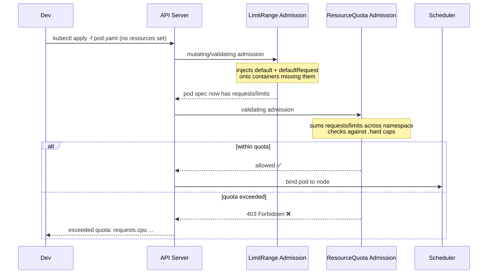
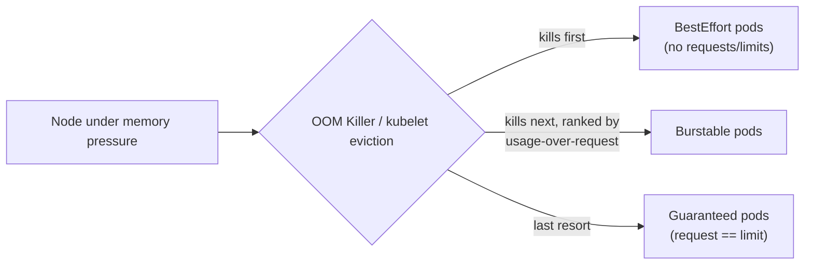

# ResourceQuota & LimitRange

> ResourceQuota caps what a namespace can consume in total; LimitRange fills in sane per-container defaults and bounds so that cap doesn't reject every pod that forgot to set requests/limits. In practice they're deployed as a pair — this is the core "soft multi-tenancy" mechanism for shared clusters, and the #1 source of "pods suddenly won't schedule" incidents when only one half is configured.

## Why They Exist Together

A shared cluster with multiple teams needs guardrails: no single namespace should be able to consume all cluster capacity, spin up unlimited objects, or starve other tenants. **ResourceQuota** enforces namespace-wide hard caps. But quotas on `requests.cpu`/`requests.memory` come with a strict side effect: once set, every pod in that namespace *must* declare those fields explicitly — omission is not "unlimited," it's a hard admission rejection. **LimitRange** is what makes that survivable: it injects defaults for containers that don't specify requests/limits, and enforces min/max/ratio bounds so no single container can blow past what's sane for that namespace. Deploy ResourceQuota without LimitRange in a namespace with legacy manifests, and you will break every deployment that doesn't set resources.

## Admission Flow



LimitRange runs before ResourceQuota in the admission chain — this ordering is precisely why it works as a fix: by the time ResourceQuota's admission plugin sums up resource usage, LimitRange has already filled in the blanks.

---

## ResourceQuota — Namespace-Level Hard Caps

A `ResourceQuota` is a namespaced object; its `.spec.hard` map is the enforced ceiling. Three families of limits:

### 1. Compute Resources

| Key | Meaning |
|-----|---------|
| `requests.cpu` | Sum of every container's `resources.requests.cpu` in the namespace |
| `requests.memory` | Sum of every container's `resources.requests.memory` |
| `limits.cpu` | Sum of every container's `resources.limits.cpu` |
| `limits.memory` | Sum of every container's `resources.limits.memory` |

Note these are **sums across all pods**, not per-pod caps — a namespace with `requests.cpu: "20"` can run 20 pods requesting 1 core each, or 2 pods requesting 10 cores each. Per-container bounds are LimitRange's job, not ResourceQuota's.

### 2. Object Counts

| Key | Caps |
|-----|------|
| `count/pods` or `pods` | Total pod objects |
| `count/services` | Total Services |
| `services.loadbalancers` | Services of type `LoadBalancer` (expensive, cloud-billed) |
| `services.nodeports` | Services of type `NodePort` |
| `count/persistentvolumeclaims` | Total PVCs |
| `count/secrets` | Total Secrets |
| `count/configmaps` | Total ConfigMaps |
| `count/<resource>.<group>` | Generic form for any resource, e.g. `count/deployments.apps`, `count/jobs.batch` |

Object-count quotas exist independent of compute quotas — you can cap "at most 20 Secrets" in a namespace purely to bound API-server/etcd object churn, with no relation to CPU/memory.

### 3. Storage

| Key | Meaning |
|-----|---------|
| `requests.storage` | Total storage requested across all PVCs, any StorageClass |
| `persistentvolumeclaims` | Total PVC object count |
| `<storageclass-name>.storageclass.storage.k8s.io/requests.storage` | Storage requested, scoped to **one** StorageClass |
| `<storageclass-name>.storageclass.storage.k8s.io/persistentvolumeclaims` | PVC count, scoped to one StorageClass |

Per-StorageClass quotas matter operationally: you might allow generous `standard` (HDD-backed, cheap) storage but tightly cap `gp3`/`io2` (fast, expensive) storage per tenant — see `resourcequota.yaml` (section 1) for both combined.

---

## Scopes and `scopeSelector`

Quotas can be narrowed to only count a subset of pods via `.spec.scopes` (legacy, fixed set) or `.spec.scopeSelector` (newer, supports `matchExpressions` — required for PriorityClass matching).

| Scope | Matches | Notes |
|-------|---------|-------|
| `BestEffort` | Pods with **no** requests/limits set on any container | Only `pods`/`count/pods` is valid with this scope — no compute resource to sum |
| `NotBestEffort` | Pods with **at least one** request/limit set (Burstable + Guaranteed) | Supports compute + object-count keys |
| `Terminating` | Pods with `spec.activeDeadlineSeconds` set | Typically batch/Job pods |
| `NotTerminating` | Pods without `activeDeadlineSeconds` | Typically long-running Deployments/StatefulSets |
| `PriorityClass` (via `scopeSelector` only) | Pods using a specific `priorityClassName`, matched with `In`/`NotIn`/`Exists`/`DoesNotExist` | Used to cap high-priority capacity separately from the rest |

**Why PriorityClass-scoped quota matters:** without it, a tenant can mark every pod `priorityClassName: business-critical` (or a cluster-critical class) to win preemption fights against other tenants' pods, consuming more than their "fair share" during contention. A `scopeSelector` quota scoped to that PriorityClass puts a hard, separate ceiling on how much of that privileged capacity any one namespace can hold — see `resourcequota.yaml` sections 5–6.

```yaml
scopeSelector:
  matchExpressions:
    - operator: In
      scopeName: PriorityClass
      values:
        - business-critical
```

Scopes intersect (AND), not union — a quota with `scopes: [Terminating, BestEffort]` only counts pods that are *both*.

---

## The Critical Enforcement Rule (the incident you will see)

**If a namespace has a ResourceQuota covering `requests.cpu`, `requests.memory`, `limits.cpu`, or `limits.memory`, every container in every pod created in that namespace must explicitly set the corresponding field(s) — or the pod is rejected outright at admission time.** This is not "unmetered" or "best-effort allowed" — it is a hard `403 Forbidden` from the API server. This is the single most common cause of a "why did my Deployment just stop creating new pods" incident right after someone adds a quota to a namespace with pre-existing manifests that never set resources.

```bash
kubectl apply -f deployment.yaml
# Error from server (Forbidden): error when creating "deployment.yaml":
# pods "api-server-7f9c8d-abcde" is forbidden: failed quota: team-checkout-quota:
# must specify limits.cpu,limits.memory,requests.cpu,requests.memory
```

The fix is not "remove the quota" — it's "add a LimitRange" so the admission-time defaulting fills in the missing fields before ResourceQuota evaluates the pod.

---

## LimitRange — Defaults, Bounds, and Burst Ratios

A `LimitRange` operates per-object-type (`Container`, `Pod`, `PersistentVolumeClaim`) inside a namespace.

| Field | Effect |
|-------|--------|
| `default` | Injected as `resources.limits` for any container that omits limits |
| `defaultRequest` | Injected as `resources.requests` for any container that omits requests |
| `min` | Pod is **rejected** if any container's request/limit is below this |
| `max` | Pod is **rejected** if any container's request/limit is above this |
| `maxLimitRequestRatio` | Caps `limit / request`. E.g. ratio `4` on CPU means a container requesting `250m` can have a limit of at most `1` core — bounds how "bursty" a container is allowed to be |

`maxLimitRequestRatio` is the knob most people forget: it doesn't set an absolute ceiling, it constrains the *spread* between request and limit. A tight ratio (`1`) forces `request == limit`, i.e. every container in that namespace is effectively pinned to Guaranteed QoS by policy — used for batch/latency-critical namespaces where CPU throttling is unacceptable (see `limitrange.yaml`, second example).

LimitRange also supports `type: Pod` (aggregate min/max across all containers in a pod — catches sidecar-heavy pods that individually pass container limits but blow the pod total) and `type: PersistentVolumeClaim` (min/max on `storage`, prevents both PVC sprawl at 1Mi and a single claim eating the whole namespace storage quota).

```yaml
apiVersion: v1
kind: LimitRange
metadata:
  name: team-checkout-limits
  namespace: team-checkout
spec:
  limits:
    - type: Container
      default:
        cpu: "500m"
        memory: 512Mi
      defaultRequest:
        cpu: "100m"
        memory: 128Mi
      min:
        cpu: "50m"
        memory: 64Mi
      max:
        cpu: "2"
        memory: 4Gi
      maxLimitRequestRatio:
        cpu: "4"        # limit can be at most 4x the request
        memory: "2"      # tighter for memory — OOM risk on overcommit
```

Order of operations for a container that specifies neither requests nor limits: LimitRange injects `defaultRequest` and `default` → the resulting pod spec is what ResourceQuota sums against `.hard` → if it still exceeds quota, the pod is rejected (defaulting doesn't bypass quota, it just prevents the "missing field" rejection).

---

## QoS Classes — Why Unset Requests Are Dangerous Even Without a Quota

Every pod is assigned a QoS class at admission, purely from its requests/limits — visible in `kubectl describe pod`:

| QoS Class | Condition | Eviction/OOM priority |
|-----------|-----------|------------------------|
| `Guaranteed` | Every container sets **both** requests and limits, for **both** CPU and memory, and requests == limits | Last to be OOM-killed / evicted |
| `Burstable` | At least one container sets a request or limit, but doesn't meet the Guaranteed bar | Killed after BestEffort, ranked by how far usage exceeds request |
| `BestEffort` | No container sets any request or limit | **First** to be OOM-killed under node memory pressure |



A pod with no resource requests isn't "unconstrained" in a good way — it's scheduled with **zero CPU scheduling guarantee** (CFS gives it the leftover shares after everyone else's requests are satisfied) and marked **BestEffort**, making it the kubelet's first target when a node runs low on memory, quota or no quota. This is why "just don't set requests, it's simpler" is a real production risk, not just an incomplete manifest: under contention, BestEffort pods die first regardless of how important the workload actually is.

```bash
# Check the QoS class actually assigned
kubectl describe pod api-server-7f9c8d-abcde | grep "QoS Class"
# QoS Class:  Burstable
```

---

## Multi-Tenancy Pattern

On a shared cluster, four primitives combine into "soft multi-tenancy" — namespace-level isolation without separate clusters:

| Primitive | Role |
|-----------|------|
| **ResourceQuota** | Caps total compute/objects/storage a namespace (tenant) can consume |
| **LimitRange** | Ensures sane per-container defaults so quota enforcement doesn't break naive manifests; bounds min/max/burst-ratio |
| **PriorityClass** | Controls preemption order; PriorityClass-scoped quotas stop a tenant from over-claiming "critical" capacity |
| **RBAC** | Controls *who* can create/modify objects in the namespace, including who can edit the quota/limitrange themselves |

Together: RBAC stops team A from touching team B's namespace or the quota objects that constrain them; ResourceQuota stops team A's namespace from consuming more than its budgeted share of cluster capacity; LimitRange keeps that enforcement from being a landmine for every under-specified pod spec; PriorityClass + PriorityClass-scoped quota stop team A from gaming preemption to grab more than its share during contention.

**The limitation — this is still one cluster, one control plane, one kernel:** ResourceQuota/LimitRange are API-server-level admission controls. They do not provide kernel-level isolation. A noisy-neighbor problem at the node level (e.g., disk I/O contention, network bandwidth, page cache thrashing) is not stopped by any of these — `requests.cpu`/`requests.memory` don't cap disk IOPS or network throughput unless you're also using cgroup-level I/O limits or a CNI with bandwidth shaping. A container escape or kernel-level exploit affects every tenant sharing that node/control-plane, because there is no hypervisor or separate kernel boundary between tenants. If a security/compliance requirement demands *hard* isolation, the answer is separate clusters (or at minimum separate node pools with taints, or gVisor/Kata Containers for sandboxed runtimes) — not tighter quotas.

---

## Debugging & Verification

```bash
# See used vs hard, per resource — the single most useful quota command
kubectl describe resourcequota -n team-checkout

# Example output:
# Name:                       team-checkout-quota
# Resource                    Used   Hard
# --------                    ----   ----
# requests.cpu                18     20
# requests.memory             38Gi   40Gi
# count/pods                  94     100
# requests.storage            480Gi  500Gi

# List all quotas in a namespace (there can be several, scoped differently)
kubectl get resourcequota -n team-checkout

# Inspect the LimitRange's configured defaults/min/max/ratio
kubectl describe limitrange -n team-checkout

# Confirm what a pod actually ended up with after LimitRange defaulting
kubectl get pod api-server-7f9c8d-abcde -o jsonpath='{.spec.containers[0].resources}'

# Confirm assigned QoS class
kubectl get pod api-server-7f9c8d-abcde -o jsonpath='{.status.qosClass}'
```

**Admission error signatures to recognize instantly during an incident:**

```
# Missing requests/limits when a quota requires them:
Error from server (Forbidden): error when creating "pod.yaml":
pods "api-server-xyz" is forbidden: failed quota: team-checkout-quota:
must specify limits.cpu,limits.memory,requests.cpu,requests.memory

# Quota exceeded:
Error from server (Forbidden): error when creating "pod.yaml":
pods "api-server-xyz" is forbidden: exceeded quota: team-checkout-quota,
requested: requests.memory=4Gi, used: requests.memory=38Gi, limited: requests.memory=40Gi

# LimitRange min/max violation:
Error from server (Forbidden): error when creating "pod.yaml":
pods "api-server-xyz" is forbidden: maximum cpu usage per Container is 2,
but limit is 4

# maxLimitRequestRatio violation:
Error from server (Forbidden): error when creating "pod.yaml":
pods "api-server-xyz" is forbidden: memory max limit to request ratio per
Container is 2, but provided ratio is 8.000000
```

The first two come from the ResourceQuota admission plugin, the last two from LimitRange — different plugin, different wording, but both surface as the same HTTP 403 to `kubectl apply`. Knowing the exact phrasing lets you triage "which of the two objects is blocking this" without reading YAML first.

---

## Common Interview Questions

**Q: A team says their Deployment stopped creating new pods right after a platform team added a ResourceQuota to their namespace — nothing else changed. What's your first hypothesis?**
The quota almost certainly covers `requests.cpu`/`requests.memory` (or the limits equivalents), and the team's pod template never set `resources.requests`/`resources.limits`. The moment such a quota exists in a namespace, the API server requires every container to declare those fields explicitly — a pod without them is rejected at admission with `failed quota: ... must specify ...`, not silently admitted as unbounded. `kubectl describe replicaset` or checking events on the Deployment will show the exact quota-rejection message. The durable fix is a LimitRange in that namespace with `default`/`defaultRequest` so future pods get sane values injected automatically, plus updating the deployment manifest to set resources explicitly rather than relying on defaulting long-term.

**Q: What's the difference between ResourceQuota and LimitRange — why do you need both?**
ResourceQuota is a namespace-wide aggregate ceiling — sum of requests/limits/object counts across everything in the namespace must stay under `.hard`. LimitRange is per-object (per-container/per-pod/per-PVC) — it sets defaults for missing fields and enforces min/max/ratio bounds on each individual object. They operate at different levels and solve different problems: ResourceQuota answers "how much can this tenant use in total," LimitRange answers "what does an individual container look like if nobody said, and what's a sane bound on one container." Using ResourceQuota alone on a namespace with manifests that omit resources causes mass pod-creation failures; LimitRange without ResourceQuota gives you sane defaults but no aggregate ceiling — a tenant can still create unlimited pods, each individually within bounds.

**Q: Explain `maxLimitRequestRatio` and why you'd set it to something other than the default (unset/unlimited).**
It caps `limit / request` per container — e.g., a ratio of `4` on CPU means a container requesting `250m` can have a limit of at most `1` core. It's how you bound "burstiness": how much more a container can consume above its guaranteed baseline before being throttled (CPU) or OOM-killed (memory). You'd tighten it (or set it to `1`, forcing `request == limit`) for latency-sensitive or batch workloads where unpredictable throttling/OOM is worse than slightly lower baseline throughput — it effectively forces Guaranteed QoS namespace-wide by policy. You'd leave it loose or unset for bursty web workloads where occasional traffic spikes should be absorbed without throttling, at the cost of less predictable node-level bin-packing.

**Q: Walk me through the QoS classes and how they interact with node memory pressure.**
Guaranteed requires every container to set both requests and limits for both CPU and memory, with requests == limits — these pods are last to be OOM-killed. Burstable is anything with at least one request/limit set that doesn't qualify as Guaranteed — killed after BestEffort, and among Burstable pods the kubelet ranks by how far actual usage exceeds the requested amount (the worst offender relative to its own request dies first). BestEffort has no requests/limits at all on any container — these are always the first candidates when the node is under memory pressure, regardless of how "important" the workload is, because the kubelet has no signal that it needs any guaranteed resources. The QoS class is computed once at admission from the pod spec and visible via `kubectl describe pod` or `.status.qosClass` — it's not something you set directly, it falls out of how requests/limits are structured.

**Q: How do you cap how much "high-priority" capacity one tenant can consume, separate from their normal workloads?**
Use a ResourceQuota with `scopeSelector` matching `scopeName: PriorityClass`, `operator: In`, `values: [<priority-class-name>]`. This creates a quota bucket that only counts pods using that specific PriorityClass, entirely separate from the tenant's general quota. Without this, nothing stops a tenant from labeling every pod with a high/critical PriorityClass to win preemption contests against other tenants during resource pressure — PriorityClass alone controls ordering, not consumption. The scoped quota is the consumption cap on top of it. Note the legacy `scopes` field (`BestEffort`/`NotBestEffort`/`Terminating`/`NotTerminating`) can't express PriorityClass matching — you need `scopeSelector` with `matchExpressions` for that.

**Q: Is ResourceQuota + LimitRange sufficient for true multi-tenant isolation on a shared cluster?**
No — it's "soft" multi-tenancy, sufficient for cooperating internal teams but not a security boundary. Everything still shares one control plane, one etcd, one set of nodes, and — critically — one kernel per node. Quotas cap what the API server will admit, but they don't prevent kernel-level noisy-neighbor effects (disk I/O contention, network bandwidth, shared page cache) unless paired with cgroup-level I/O/network shaping, and they do nothing against a container escape or kernel exploit, which would expose every tenant scheduled on that node. If the requirement is hard isolation (regulatory tenants, untrusted code, adversarial workloads), the real answers are separate clusters, dedicated node pools with taints/tolerations plus node-level hardening, or sandboxed runtimes like gVisor/Kata Containers — not a tighter quota.

**Q: How do you debug "namespace X can't create any more pods" when quota is involved?**
Start with `kubectl describe resourcequota -n X` — it shows Used vs Hard per resource in one table, so you immediately see which specific key (often `count/pods`, `requests.cpu`, or a per-StorageClass storage key) is maxed out. Cross-check with `kubectl get resourcequota -n X` since a namespace can have multiple quotas with different scopes (e.g., a BestEffort-scoped quota and a general one) — the failure could be scope-specific even if the general quota has headroom. If the error instead mentions "must specify" fields rather than "exceeded quota," the problem is the enforcement rule, not capacity — check `kubectl describe limitrange -n X` to see whether defaults are configured, and confirm they actually match the field names the quota requires (a LimitRange with only `default` for `cpu` won't stop a memory rejection if `defaultRequest.memory` isn't also set).
