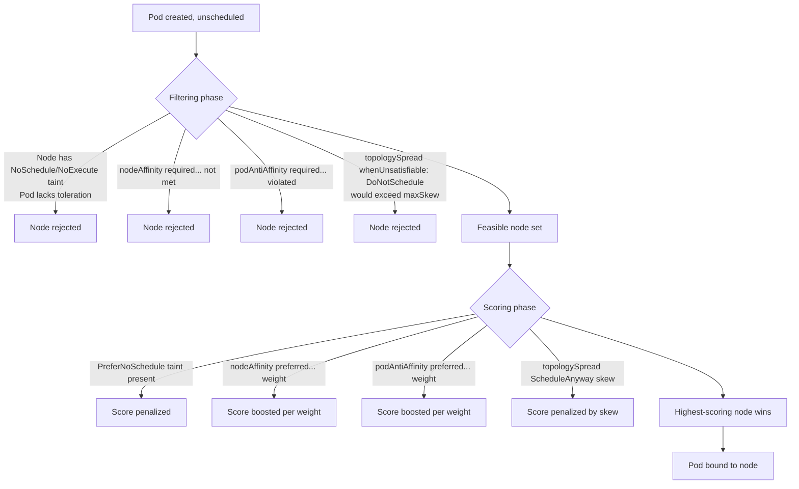
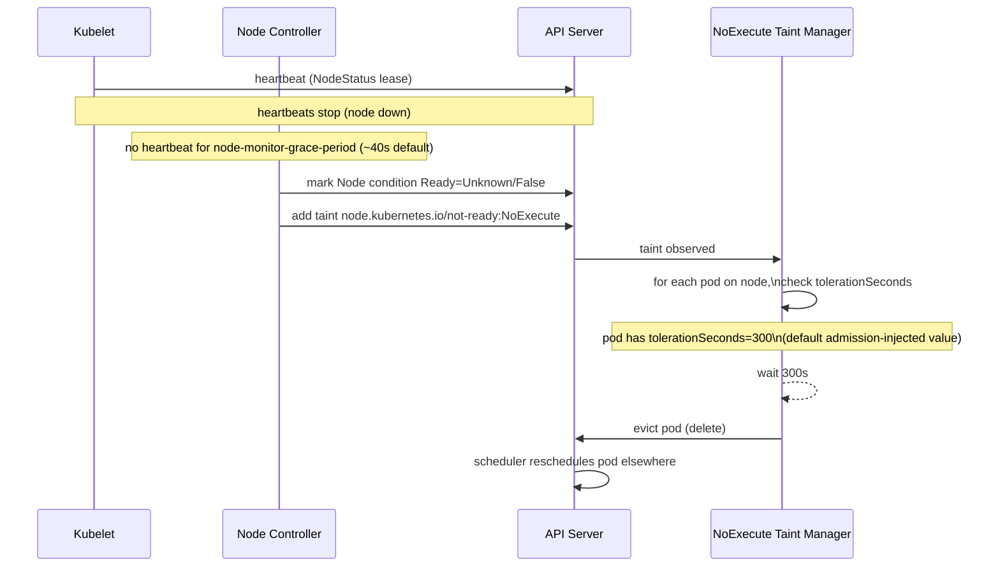

# Advanced Pod Scheduling — Taints, Tolerations, Affinity & Topology Spread

> Deep-dive companion to the basic Taints/Tolerations and Node Affinity notes in `Deployment.md`. Covers full taint effects, built-in system taints and their tie to node heartbeats, the complete affinity operator set, pod affinity/anti-affinity scoring, Topology Spread Constraints, and how all of this interacts with Cluster Autoscaler/Karpenter and the Descheduler — the depth a senior/lead interview actually probes.

## Mental Model: Filtering vs Scoring

The scheduler works in two phases for every pending pod: **Filtering** (predicates) throws out nodes that can't possibly work; **Scoring** ranks the survivors and picks the best one. Hard rules (`required...`, taints without tolerations, `DoNotSchedule`) live in the filter phase — violate them and the pod stays `Pending`. Soft rules (`preferred...`, `PreferNoSchedule`, `ScheduleAnyway`) live in the scoring phase — they bias the choice but never block it.



If the feasible set (C) is empty, the pod stays `Pending` and the scheduler emits an event — see the Cluster Autoscaler section below for how to read it.

## Taint Effects — Full Semantics

| Effect | New pods (no toleration) | Already-running pods |
|---|---|---|
| `NoSchedule` | Blocked from scheduling | Unaffected — keep running |
| `PreferNoSchedule` | Scheduler tries to avoid the node, but will place if no better option | Unaffected |
| `NoExecute` | Blocked from scheduling | **Evicted** if they don't tolerate it |

`NoExecute` is the only effect that acts on running pods — it's the mechanism behind automatic eviction when a node goes bad. Applying `NoExecute` to a node doesn't just stop future scheduling, it actively kicks out anything already there that doesn't tolerate it.

### `tolerationSeconds` — grace period before eviction

A toleration for a `NoExecute` taint can specify `tolerationSeconds` — how long the pod is allowed to keep running on the tainted node before it's actually evicted, instead of being evicted immediately on taint application.

```yaml
tolerations:
  - key: "node.kubernetes.io/not-ready"
    operator: "Exists"
    effect: "NoExecute"
    tolerationSeconds: 300   # ride out up to 5 min of NotReady before eviction
```

Without `tolerationSeconds`, tolerating `NoExecute` means the pod tolerates it *forever* — it never gets evicted for that taint, even if the node stays down permanently. With it, the pod tolerates the condition only temporarily — useful for absorbing a flaky network blip without triggering a mass reschedule.



## Built-In / Automatic Taints

The control plane applies these automatically — you don't hand-taint for them:

| Taint | Effect | Applied by | Trigger |
|---|---|---|---|
| `node.kubernetes.io/not-ready` | `NoExecute` | node controller | kubelet misses heartbeats (node condition `Ready=False`) |
| `node.kubernetes.io/unreachable` | `NoExecute` | node controller | kubelet heartbeats unknown (node condition `Ready=Unknown`) |
| `node.kubernetes.io/memory-pressure` | `NoSchedule` | kubelet | node under memory pressure |
| `node.kubernetes.io/disk-pressure` | `NoSchedule` | kubelet | node under disk pressure |
| `node.kubernetes.io/pid-pressure` | `NoSchedule` | kubelet | node running out of PIDs |
| `node.kubernetes.io/network-unavailable` | `NoSchedule` | kubelet/cloud-controller | node network not configured yet |
| `node.kubernetes.io/unschedulable` | `NoSchedule` | `kubectl cordon` | manual cordon (maintenance) |
| `node-role.kubernetes.io/control-plane` | `NoSchedule` | kubeadm at init | keep workloads off control-plane nodes in self-managed clusters |

`not-ready` and `unreachable` are the two that matter most operationally: they are **literally** the mechanism that reschedules your workload after a node dies. The node controller doesn't "decide to reschedule pods" as a separate concept — it just taints the node `NoExecute`, and every pod without a matching toleration gets evicted, which is what triggers the ReplicaSet/StatefulSet controller to create replacements elsewhere.

## Why Eviction Isn't Instant — Default Grace Period

A node going `NotReady` doesn't evict pods immediately — that would turn a 2-second network blip into a cluster-wide reschedule storm. The path:

1. Kubelet stops reporting heartbeats (via the Lease object, checked every `node-monitor-period`, default 5s).
2. After `node-monitor-grace-period` (default 40s) with no heartbeat, node controller flips the node condition to `NotReady`/`Unknown` and applies the `NoExecute` taint.
3. Pods on that node get evicted based on their **effective tolerationSeconds** for that taint — and here's the key detail: if a pod spec doesn't explicitly tolerate `not-ready`/`unreachable`, the `DefaultTolerationSeconds` admission controller automatically injects a toleration with `tolerationSeconds: 300` (5 minutes) at pod creation time. That historical ~5-minute default is what most engineers mean by "pod-eviction-timeout" — it isn't a single global timer, it's the default toleration grace period applied per-pod.

Net effect: a node dying doesn't reschedule your pods for ~40s (detection) + 300s (default grace) ≈ 5m40s unless you've explicitly shortened `tolerationSeconds` (as done in the `scheduling.yaml` companion example for a latency-sensitive service).

```bash
# Watch how long a node stays NotReady before pods actually move
kubectl get nodes -w
kubectl get pods -o wide --field-selector spec.nodeName=<dead-node>
kubectl describe node <dead-node> | grep -A5 Taints
```

## Node Affinity Operators — Full Set

| Operator | Meaning | Example use |
|---|---|---|
| `In` | label value is one of the listed values | `env In [prod, staging]` |
| `NotIn` | label value is not one of the listed values | `zone NotIn [us-west-1a]` |
| `Exists` | label key present (value ignored) | `gpu Exists` |
| `DoesNotExist` | label key absent | `spot-instance DoesNotExist` (avoid spot nodes) |
| `Gt` | label value (string, parsed as integer) greater than given value | `instance-type-generation Gt "5"` |
| `Lt` | label value less than given value | `kernel-version Lt "6"` |

`Gt`/`Lt` are obscure but real — they only work on labels whose values are integers as strings, and they're the go-to for generation/version gating (e.g., only schedule on 6th-gen-or-newer instance types) without hand-enumerating every valid value with `In`.

```yaml
nodeAffinity:
  requiredDuringSchedulingIgnoredDuringExecution:
    nodeSelectorTerms:
      - matchExpressions:
          - key: instance-type-generation
            operator: Gt
            values: ["5"]     # values must still be given as a list of strings
```

## `requiredDuringSchedulingIgnoredDuringExecution` vs `preferredDuringSchedulingIgnoredDuringExecution`

| | `required...` | `preferred...` |
|---|---|---|
| Type | Hard constraint | Soft constraint (scoring only) |
| Unsatisfiable outcome | Pod stays `Pending` | Pod schedules anyway on best available node |
| Config shape | `nodeSelectorTerms` (ORed), `matchExpressions` within a term (ANDed) | list of `{weight, preference}`, weights summed per node |

The `...IgnoredDuringExecution` suffix on **both** is the subtle part: it means the rule is evaluated only at scheduling time. If node labels change after the pod is already running — e.g., someone removes the label the pod's `required` rule depended on — **the pod is not evicted**. It keeps running on a node that technically no longer satisfies its own affinity rule. Kubernetes has no live re-validation loop for affinity (that's a job for the Descheduler, covered below).

This is the direct contrast with taint `NoExecute`: taints have an execution-time enforcement mode (`NoExecute` actively evicts running pods when a taint is added), affinity does not. Two mechanisms that look similar on paper (a pod "no longer belongs" on its node) behave completely differently in practice — one evicts, the other doesn't.

## Pod Affinity / Anti-Affinity

Same `required.../preferred...` structure as node affinity, but the rule is evaluated against **labels of other pods already on candidate nodes**, not node labels.

- **`topologyKey`** defines the granularity of "together" or "apart." It's a node label key — the scheduler groups nodes into topology domains by the value of that label.
  - `kubernetes.io/hostname` → domain = single node (co-locate/spread per-node)
  - `topology.kubernetes.io/zone` → domain = AZ (co-locate/spread per-zone)
  - `topology.kubernetes.io/region` → domain = region

- **`weight`** (1–100) applies only to `preferred...` rules. When multiple soft affinity/anti-affinity rules are in play (possibly from different pods/policies), the scheduler sums the weights of all satisfied preferences per candidate node during scoring — higher total wins. It's a relative knob, not an absolute threshold: a `weight: 100` rule only matters if it's actually competing against lower-weighted alternatives on the same nodes.

```yaml
podAntiAffinity:
  requiredDuringSchedulingIgnoredDuringExecution:
    - labelSelector:
        matchExpressions:
          - key: app
            operator: In
            values: ["payments-api"]
      topologyKey: kubernetes.io/hostname   # hard: never 2 replicas, 1 node
```

Pod anti-affinity is O(N²)-ish over pods matching the selector and is a known scalability sink on large clusters (thousands of pods) — the scheduler docs explicitly warn against overusing `required` pod (anti-)affinity in high-churn, high-pod-count clusters.

## Topology Spread Constraints

The modern, purpose-built replacement for "spread evenly," where anti-affinity only gives you "don't stack."

| Field | Meaning |
|---|---|
| `maxSkew` | Max allowed difference between the pod count of the most-loaded and least-loaded matching topology domain |
| `topologyKey` | Node label defining a domain (zone, hostname, node pool, etc.) |
| `whenUnsatisfiable` | `DoNotSchedule` (hard — pod stays Pending rather than break the skew bound) or `ScheduleAnyway` (soft — schedule on the least-bad option, deprioritized in scoring) |
| `minDomains` | (1.25+) Minimum number of topology domains the scheduler should assume exist, even if fewer currently have nodes — prevents `maxSkew` math from being satisfied trivially by only counting the 1 zone that currently has capacity |
| `matchLabelKeys` | (newer, beta in 1.27+) Label keys — usually a pod-template-hash-style key — whose values get auto-added to the `labelSelector` so the *current* rollout's pods are only compared against each other, not against the outgoing ReplicaSet's pods |
| `labelSelector` | Which pods count toward the skew calculation |

### Why `minDomains` matters with autoscaling

If a cluster is scaling from 1 zone to 3, and `maxSkew: 1` only counts domains that currently have at least one node, an autoscaler-driven scale-out can look "satisfied" with everything crammed into the one existing zone (skew=0 relative to itself). `minDomains: 3` forces the scheduler to treat the calculation as if 3 domains exist, so a pod requesting spread will sit `Pending` — correctly — until nodes actually show up in the other zones, rather than silently over-concentrating.

### Why `matchLabelKeys` matters during rollouts

During a rolling update, old and new ReplicaSet pods share the same `app` label but have different `pod-template-hash` values. Without `matchLabelKeys`, the topology spread calculation counts both revisions together, so mid-rollout the "spread" looks temporarily broken (skew inflated by transient double-counting) and can block scheduling of new-revision pods. Adding `matchLabelKeys: [pod-template-hash]` makes the scheduler auto-scope the skew calculation to just the incoming revision's pods, avoiding rollout-induced false imbalance signals.

### Topology Spread vs Pod Anti-Affinity

| | Pod Anti-Affinity | Topology Spread Constraints |
|---|---|---|
| Guarantees | No co-location (binary) | Bounded, even distribution (`maxSkew`) |
| Scales to N domains cleanly | No — pairwise semantics get awkward past "same/different" | Yes — designed for N-way spread |
| Performance at scale | Poor with `required` + large pod counts | Better — built for this use case |
| Rollout-aware | No | Yes, via `matchLabelKeys` |
| Typical use | "Never 2 replicas on 1 node" | "Spread 12 replicas evenly across 3 zones" |

Anti-affinity answers "can these two pods be neighbors?" — it says nothing about whether 5 pods end up 5/0/0 across 3 zones as long as no two of them share a node with hostname-level anti-affinity. Topology Spread directly bounds the imbalance, which is what "even distribution" actually requires. This is why most teams use anti-affinity only for hard hostname-level dedup and topology spread for zone/pool-level balance.

## Scheduling Mechanism Comparison

| Mechanism | Controls | Direction | Hard or soft | Acts on running pods? |
|---|---|---|---|---|
| Taints/Tolerations | Which pods a node *repels/accepts* | Node-centric (repel) | Both (`NoSchedule`/`NoExecute` hard, `PreferNoSchedule` soft) | Yes — `NoExecute` evicts |
| Node Affinity | Which nodes a pod *wants* | Pod-centric (attract) | Both (`required`/`preferred`) | No — `IgnoredDuringExecution` |
| Pod Affinity/Anti-Affinity | Placement relative to *other pods* | Pod-centric (attract/repel) | Both | No — `IgnoredDuringExecution` |
| Topology Spread Constraints | Even distribution across domains | Pod-centric (balance) | Both (`DoNotSchedule`/`ScheduleAnyway`) | No |

## Interaction With Cluster Autoscaler / Karpenter

Scheduling constraints don't just pick among existing nodes — they drive *which node group gets scaled*. Cluster Autoscaler and Karpenter both simulate whether a pending pod would fit on a hypothetical new node from each node group/NodePool; a pod with a `required` node affinity for a label that only one node group's template carries forces scale-out of specifically that group. Same logic applies to taints: a pod's toleration for `workload=critical:NoSchedule` only makes it a scaling candidate for the node group whose launch template applies that taint.

The failure mode to recognize immediately: a pod requesting a topology domain or label that **no node group can ever produce** (e.g., a zone the cluster doesn't operate in, or a typo'd label) sits `Pending` forever — autoscalers can't scale out to satisfy an impossible constraint, and there's no error, just silence. Always check events first.

```bash
# Diagnose a stuck Pending pod
kubectl get pod <pod> -o wide
kubectl describe pod <pod>
# Events:
#   Warning  FailedScheduling  0/5 nodes are available: 2 node(s) had taint
#   {workload: critical}, that the pod didn't tolerate, 3 node(s) didn't match
#   Pod's node affinity/selector.

# Check what the autoscaler/Karpenter thinks about a pending pod
kubectl -n kube-system logs deployment/cluster-autoscaler | grep <pod-name>
# or, for Karpenter:
kubectl -n kube-system logs deployment/karpenter | grep <pod-name>

# Inspect current taints on all nodes
kubectl get nodes -o custom-columns=NAME:.metadata.name,TAINTS:.spec.taints

# Cordon/drain for maintenance (applies node.kubernetes.io/unschedulable:NoSchedule)
kubectl cordon <node>
kubectl drain <node> --ignore-daemonsets --delete-emptydir-data
kubectl uncordon <node>
```

## The Descheduler — Filling the Re-Optimization Gap

Kubernetes scheduling is a **one-shot decision at pod-creation time**. There is no built-in controller that continuously re-optimizes placement — if a node is added to a previously-imbalanced zone, or labels/taints change after pods are already running, nothing moves those pods automatically (this is exactly what `IgnoredDuringExecution` guarantees). The community [Descheduler](https://github.com/kubernetes-sigs/descheduler) project fills that gap: it runs periodically (as a CronJob or Deployment) and evicts pods that have drifted out of compliance with affinity, anti-affinity, taints, or topology-spread preferences, relying on the normal controller (Deployment/StatefulSet) to reschedule them correctly on the next pass. Common strategies: `RemovePodsViolatingTopologySpreadConstraint`, `RemovePodsViolatingNodeAffinity`, `LowNodeUtilization`. It's an eviction-only tool — it never schedules pods itself, it just deletes the misplaced ones and lets the scheduler redo its job.

```bash
# Typical Descheduler invocation (as a one-off Job) via its Helm chart
helm repo add descheduler https://kubernetes-sigs.github.io/descheduler/
helm install descheduler descheduler/descheduler --set kind=CronJob
```

## Common Interview Questions

**Q: Walk through exactly what happens when a node goes down — from the pod's perspective, minute by minute.**
Kubelet stops sending heartbeats. After `node-monitor-grace-period` (default 40s) with no heartbeat, the node controller marks the node `NotReady`/`Unknown` and applies the `node.kubernetes.io/not-ready` (or `unreachable`) taint with effect `NoExecute`. Every pod on that node is checked against its tolerations for that taint; pods without an explicit toleration get one injected automatically by the `DefaultTolerationSeconds` admission controller at `tolerationSeconds: 300`. The NoExecute taint manager waits out that grace period, then evicts (deletes) the pod. The owning controller (ReplicaSet, StatefulSet) notices the pod is gone and creates a replacement, which the scheduler places on a healthy node. Total time-to-reschedule is roughly 40s detection + 300s default grace ≈ 5.5 minutes unless the pod spec overrides `tolerationSeconds` to something shorter — which is exactly what you'd do for a latency-sensitive service that can't afford to wait that long.

**Q: What's the practical difference between `NoSchedule` and `NoExecute`, and why does it matter operationally?**
`NoSchedule` is purely forward-looking — it blocks new pods from landing but leaves anything already running untouched, even if you taint the node after pods are already there. `NoExecute` is retroactive — it also evicts existing pods that don't tolerate it. The gotcha: if you taint a node with `NoSchedule` expecting to "drain" workloads off it, nothing happens to existing pods; you still need `kubectl drain` (which cordon + evicts) or a `NoExecute` taint to actually move them. Conflating the two effects is one of the most common taint mistakes in production incident response.

**Q: Why doesn't Kubernetes evict a pod when the node label its `nodeAffinity` depended on changes after scheduling?**
Because both `required` and `preferred` node/pod affinity rules carry the `...IgnoredDuringExecution` suffix by design — they're evaluated once, at scheduling time, and never re-checked for pods already bound to a node. This is a deliberate stability trade-off: constantly re-validating affinity against live label churn would cause pods to be evicted for reasons unrelated to their actual health, creating instability. The trade-off is that a pod can end up running somewhere that technically violates its own declared affinity, and Kubernetes will never notice or fix it on its own — that's the gap the Descheduler exists to close.

**Q: When would you reach for `Gt`/`Lt` node affinity operators instead of `In`?**
When the discriminator is a numeric progression rather than a fixed enum — e.g., "only schedule on instance-type-generation greater than 5" or "kernel version less than 6." Using `In` for this would require enumerating every valid generation number and maintaining that list as new hardware generations ship; `Gt "5"` self-extends to future generations without a manifest change. The catch: the label's value must be a string that parses as an integer, and there's no support for floats or semantic version comparison — it's strictly integer-only.

**Q: How is `weight` used in `preferredDuringSchedulingIgnoredDuringExecution`, and can it force a placement?**
No — `weight` (1–100) only affects the scoring phase, never filtering. For each candidate node that already survived the hard filters, the scheduler sums the weights of every satisfied `preferred` rule (from node affinity and pod affinity/anti-affinity alike) into that node's overall score, alongside other scoring plugins (resource balance, image locality, etc.). A `weight: 100` preference is not a guarantee; if every feasible node fails to satisfy it, or another node wins on other scoring dimensions, the pod schedules elsewhere anyway. Treat weights as tie-breaking hints, not constraints — if you need a guarantee, that's what `required...` is for.

**Q: Why are Topology Spread Constraints generally preferred over `podAntiAffinity` for spreading pods across zones?**
Anti-affinity only expresses a pairwise relationship — "don't put me on the same node/zone as another matching pod" — which caps co-location but says nothing about overall balance. With hostname-level anti-affinity, 5 replicas could still land 5/0/0 across 3 zones as long as no two share a node. Topology Spread Constraints directly model the distribution goal via `maxSkew`, bounding the difference between the busiest and least-busy domain regardless of pod count or domain count. It's also cheaper at scale — pod anti-affinity with `required` rules is a known scheduler performance sink on clusters with many pods sharing a selector, while topology spread's skew calculation is designed for this exact workload.

**Q: A pod has been `Pending` for 20 minutes with a required node affinity — how do you debug it, and what's the worst-case root cause?**
Start with `kubectl describe pod <name>` and read the Events section — the scheduler logs exactly why each node was rejected, e.g. `0/8 nodes are available: 5 node(s) didn't match Pod's node affinity/selector, 3 node(s) had taint {workload: critical}, that the pod didn't tolerate`. Cross-check the actual node labels with `kubectl get nodes --show-labels` against what the pod requires. The worst case is a constraint that's structurally unsatisfiable in this cluster — e.g., requesting `topology.kubernetes.io/zone: us-west-2d` when the cluster only operates in `a/b/c`, or a typo'd label key. In that case Cluster Autoscaler/Karpenter can't help either: they can only scale out node groups that satisfy the constraint, and if none of your node group templates carry the requested label, no amount of scaling produces a matching node — the pod is Pending indefinitely with no error beyond the scheduling event.

**Q: What does `minDomains` on a Topology Spread Constraint actually protect against?**
It guards against the skew calculation being satisfied "by accident" when not all intended topology domains currently have nodes — commonly during a scale-up from 1 AZ to N, or right after adding a new region before the autoscaler has provisioned capacity there. Without `minDomains`, `maxSkew` is computed only over domains that currently exist, so a cluster with nodes in a single zone can look "perfectly balanced" (skew 0) while accumulating all replicas in that one zone. `minDomains: 3` tells the scheduler to assume 3 domains are the target even if only 1 has nodes right now, which makes the constraint correctly fail closed — the pod stays `Pending` until real capacity shows up in the other zones, rather than silently over-concentrating and creating a zone-outage blast radius later.
