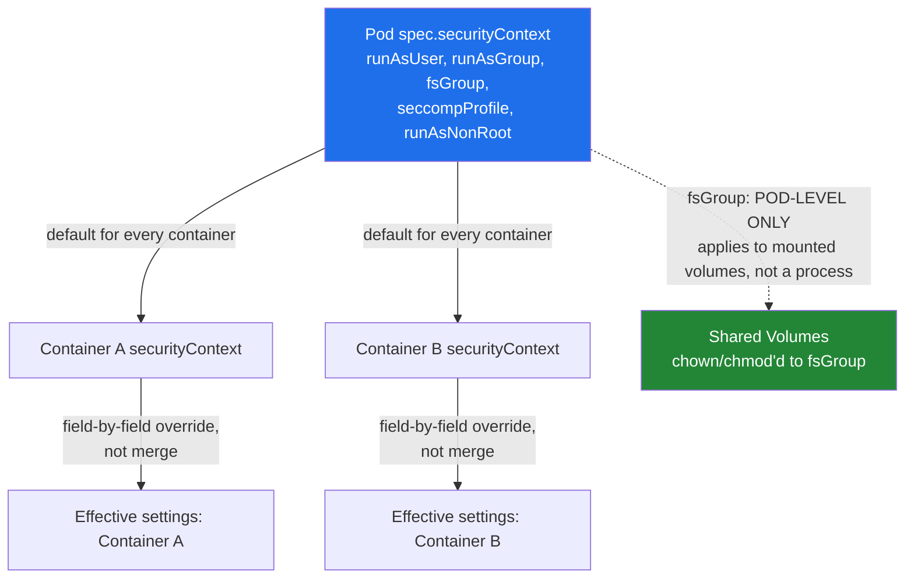
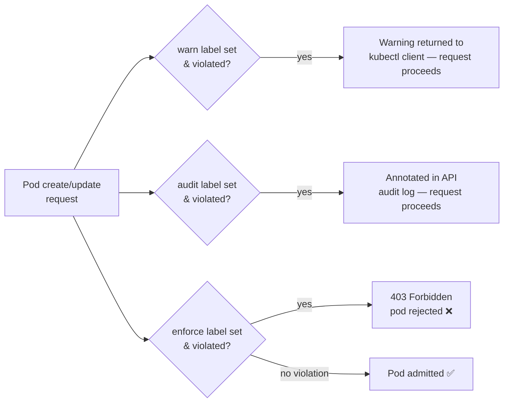

# Pod/Container securityContext & Pod Security Admission

> `securityContext` controls the Linux security posture of a pod/container (UID, capabilities, filesystem writability, syscall filtering); Pod Security Admission enforces a minimum posture cluster-wide via namespace labels. Together they're the primary defense-in-depth layer against container breakout — get this wrong and a compromised container has a straight path to the node.

## Pod-Level vs Container-Level

`securityContext` exists at both `spec.securityContext` (pod-level, applies as the default to every container) and `spec.containers[].securityContext` (container-level, overrides the pod-level value **for that container only**). Some fields only make sense at the pod level and have no container-level equivalent — `fsGroup` is the main one, because it governs ownership of *shared* volumes mounted across potentially multiple containers in the pod, not a single container's process.



Overrides are per-field, not all-or-nothing: if the pod sets `runAsUser: 1000` and one container sets only `capabilities`, that container still inherits `runAsUser: 1000` from the pod — it didn't override it, it just added an additional field. This lets you set safe pod-wide defaults and tighten (or, less desirably, loosen) specific containers, e.g. a sidecar that legitimately needs a different UID than the main app container.

## runAsUser/runAsGroup vs runAsNonRoot

| Field | What it does | Enforced how |
|-------|---------------|---------------|
| `runAsUser` | Sets the explicit UID the container process runs as | Kubelet/runtime starts the process with this UID |
| `runAsGroup` | Sets the explicit primary GID | Same — set at process start |
| `runAsNonRoot: true` | **Validation gate only** — does not set a UID | Admission-time check: rejects the pod if the *effective* UID would resolve to 0 |

The critical distinction: `runAsNonRoot` sets nothing by itself. It's a check that runs against whatever UID the container *would* end up with — whether that's from an explicit `runAsUser: 0` in the spec or simply the image's own `USER root` (or no `USER` at all, which defaults to root) in its Dockerfile. If that resolved UID is 0, the pod is rejected at admission with a clear error, rather than silently starting as root.

This is why both are set together in practice: `runAsUser: 10001` pins the actual UID explicitly, and `runAsNonRoot: true` is the safety net that catches the case where someone forgets `runAsUser`, or a base image gets swapped for one that defaults to root, or a new Dockerfile layer accidentally removes the `USER` directive upstream. Without `runAsNonRoot`, an omitted `runAsUser` silently falls through to whatever the image does — including root. With it, that same mistake gets rejected loudly at deploy time instead of discovered later during an incident.

## fsGroup and Volume Ownership

Mounted volumes (EBS, most CSI block storage) are typically owned by `root:root` at the storage layer. A container process running as a non-root UID can't write to them by default — this is one of the most common "works locally, CrashLoopBackOff in the cluster" issues once `runAsNonRoot` hardening goes in. `fsGroup` fixes this: the kubelet recursively `chown`/`chmod`s the volume's contents to the specified GID (and sets the setgid bit on directories) before the container starts, so any process in that group can read/write regardless of its own UID.

The cost is that a full recursive chown across a large volume (millions of small files, multi-hundred-GB PVCs) is slow — it happens on every pod (re)start by default, which can noticeably delay startup or restart storms. `fsGroupChangePolicy: OnRootMismatch` (stable since 1.23) fixes this: if the volume's root directory already has the correct group ownership, kubelet skips the recursive walk entirely. Meaningful win for StatefulSets on large PVCs that restart frequently — the default (`Always`) re-chowns every time regardless.

```bash
# Confirm effective fsGroup ownership inside a running pod
kubectl exec -it hardened-app -- id
kubectl exec -it hardened-app -- ls -ld /app/cache
```

## readOnlyRootFilesystem

`readOnlyRootFilesystem: true` makes the container's root filesystem (its writable layer) immutable at runtime. This is a strong hardening control: it blocks an entire class of attacks that rely on writing/persisting something into the container — dropping a webshell, modifying a binary in place, installing a backdoor package — because there's simply nowhere on the root fs to write it.

The practical gotcha: most real applications need to write *somewhere* — temp files, a local cache, a Unix socket, log buffering before shipping. The correct fix is **not** to disable the setting; it's to mount explicit `emptyDir` volumes at exactly the paths that need write access (`/tmp`, `/app/cache`, etc.), keeping everything else immutable. This preserves the hardening while giving the app the narrow writable surface it actually needs — see `/tmp` and `/app/cache` mounts in the companion YAML.

```bash
# Verify the root fs is actually read-only
kubectl exec -it hardened-app -- touch /etc/test    # expect: Read-only file system
kubectl exec -it hardened-app -- touch /tmp/test    # expect: succeeds (emptyDir mounted here)
```

## allowPrivilegeEscalation vs privileged

| Setting | Scope | Effect | Default posture |
|---------|-------|--------|-------------------|
| `privileged: true` | Whole container | Disables nearly all container isolation — full device access, can load kernel modules, bypasses most seccomp/capability restrictions | Never, except specific infra DaemonSets |
| `allowPrivilegeEscalation: false` | Process execution | Prevents a process from gaining more privileges than its parent (e.g. via setuid binaries, `sudo`, file capabilities) | Always `false` unless there's a specific documented need |

`privileged: true` is effectively "give this container root on the host." It's legitimate for a narrow set of infrastructure workloads that genuinely need host-level access — CNI plugins configuring host networking, CSI node drivers formatting/mounting block devices, node-monitoring agents reading host `/proc`. Outside of those DaemonSet-style cases, `privileged: true` on an application pod is a critical finding in any security review — it collapses container isolation almost entirely, and combined with `hostPID`/`hostNetwork` gives near-total node compromise if the container is popped.

`allowPrivilegeEscalation` is subtler and easy to overlook: even a non-privileged, non-root container can escalate at runtime if it can exec a setuid binary (`ping`, some `sudo` builds) — the kernel's `no_new_privs` flag is what this setting toggles. Setting it `false` closes that path regardless of what binaries happen to ship in the image. Note it's forced to `false` automatically whenever `privileged: true`... except `privileged: true` already grants far more than escalation prevention would matter for, so the two aren't really substitutes for each other.

## Linux Capabilities

Default container capability sets (even without `privileged`) grant a surprisingly broad set (`CHOWN`, `NET_RAW`, `SETUID`, `SETGID`, `FOWNER`, etc.) — far more than most applications ever use. The correct posture is `drop: ["ALL"]` and then `add` back only the specific capabilities the workload genuinely requires, rather than trusting the runtime's default set and trying to subtract from it.

```yaml
securityContext:
  capabilities:
    drop:
      - ALL                 # start from zero capabilities
    add:
      - NET_BIND_SERVICE     # only needed if binding to a privileged port (<1024) as non-root
```

A common concrete case: an app listening on port 80/443 as UID 10001 (non-root) needs `NET_BIND_SERVICE` specifically, because binding to ports below 1024 is normally root-only. Rather than running the whole container as root to get that one privilege, drop everything and add back exactly that one capability. Most stateless HTTP services need zero added capabilities at all if they listen on a port ≥1024 behind a Service — `drop: ["ALL"]` with nothing added back is achievable more often than teams expect once ports are shifted out of the privileged range.

## seccompProfile: Syscall Filtering

`seccompProfile` restricts which syscalls a container's processes can make — it's a kernel-level filter, independent of capabilities (capabilities gate *what* a permitted syscall can do; seccomp gates *whether the syscall can be made at all*).

| Type | Behavior | When to use |
|------|----------|-------------|
| `RuntimeDefault` ✅ | Uses the container runtime's built-in default filter (blocks ~44 rarely-needed/dangerous syscalls like `keyctl`, `mount`, `reboot`) | Baseline for virtually every workload |
| `Localhost` | Custom profile file (JSON allowlist/denylist) referenced by name, distributed to node kubelets | Tightly scoped syscall allowlisting for specific hardened workloads |
| `Unconfined` | No syscall filtering at all | Avoid — effectively opts out of this entire control |

`RuntimeDefault` should be the default for nearly everything; it blocks a well-curated list of dangerous syscalls with negligible compatibility risk. `Localhost` profiles are for cases needing an even narrower allowlist than the runtime default (e.g. a security team hand-crafting a profile via `strace` for one specific high-value workload) — higher effort, higher payoff, and it requires getting the exact profile JSON onto every node that can schedule the pod.

Orthogonal to seccomp: **AppArmor** (annotation-based, or `securityContext.appArmorProfile` as a native field since 1.30) and **SELinux** (`seLinuxOptions`) are OS-level mandatory access control — they govern file, network, and resource access ("can this process read `/etc/shadow`," "can it open a socket"), not which syscalls it can invoke. Seccomp = syscall filtering; AppArmor/SELinux = access control on top of allowed syscalls. They stack — a hardened pod typically layers `RuntimeDefault` seccomp with an AppArmor profile, not either/or.

## Pod Security Admission (PSA)

PSA is the built-in, namespace-label-driven admission controller that replaced PodSecurityPolicy (removed in 1.25). It defines three fixed levels, applied per-namespace via labels:

| Level | Posture | What it blocks |
|-------|---------|------------------|
| `privileged` | No restrictions | Nothing — full API surface, used for system/infra namespaces |
| `baseline` | Blocks known privilege escalations | `privileged: true`, host namespaces (`hostPID`/`hostIPC`/`hostNetwork`), most `hostPath` volumes, dangerous capabilities — but stays broadly compatible with existing workloads |
| `restricted` ✅ | Heavily hardened | Everything `baseline` blocks, **plus** requires `runAsNonRoot: true`, drops all capabilities except `NET_BIND_SERVICE`, requires `seccompProfile` set, requires `allowPrivilegeEscalation: false` — the practical target for the hardened example in this doc |

Each level is applied per-**mode**, and namespaces can set all three independently:

```bash
# Enforce restricted — pods violating this are actually rejected
kubectl label ns production pod-security.kubernetes.io/enforce=restricted --overwrite

# Warn only — client gets a warning, pod is still admitted (useful for rollout)
kubectl label ns production pod-security.kubernetes.io/warn=restricted --overwrite

# Audit only — violation recorded in the audit log, no warning, no block
kubectl label ns production pod-security.kubernetes.io/audit=restricted --overwrite
```



The standard rollout pattern: set `warn` + `audit` to `restricted` first, watch `kubectl` warnings and audit logs across real traffic for a deploy cycle or two to find what would break, fix those workloads, then flip `enforce` to `restricted` once the namespace is actually clean. Jumping straight to `enforce` on an existing namespace is how you find out at 2am which pods didn't have a `runAsNonRoot` set.

```bash
# See labels currently applied to a namespace
kubectl get ns production --show-labels

# See exactly why a pod was rejected at admission (PSA puts the reason in the API response / events)
kubectl describe pod my-pod -n production
kubectl get events -n production --field-selector reason=FailedCreate
```

## Why PSP Was Removed, and Why PSA Trades Flexibility for Predictability

PodSecurityPolicy was removed in 1.25 largely because it was notoriously hard to reason about in practice: a PSP wasn't attached to a namespace directly — it was authorized via RBAC (`use` verb on the `policy` resource), meaning the policy that actually applied to a given pod depended on which PSPs the *creating* service account/user was bound to, which could differ per-caller in the same namespace. Two pods in the same namespace created by two different pipelines could legally end up under two different PSPs. Debugging "why was my pod rejected" often meant untangling RBAC bindings, not reading an obvious policy object.

PSA intentionally gives up that flexibility: it has exactly three fixed levels, applied uniformly per namespace via a plain label — no RBAC indirection, no custom policy authoring. Anyone can look at a namespace's labels and know immediately what posture is enforced. The trade-off is expressiveness: PSA can't express "block images not from `my-registry.io`" or "require a specific label on every pod" — it only understands its three built-in levels' fixed rule sets. For anything beyond that — custom, org-specific policy — the answer is an external policy engine like **OPA Gatekeeper** or **Kyverno**, which run as validating/mutating admission webhooks alongside PSA rather than instead of it (see `Components/RBAC/RBAC.md` for how admission control layers with RBAC authorization more generally).

## Full Hardened Pod Example

See companion file: `Components/SecurityContext/securitycontext.yaml` — pod-level `runAsNonRoot`/`fsGroup`/`seccompProfile`, container-level `readOnlyRootFilesystem`/`allowPrivilegeEscalation: false`/`capabilities.drop: [ALL]`, with `emptyDir` volumes for the `/tmp` and cache paths the app actually needs to write to. This spec passes PSA `restricted`.

```bash
# Validate a manifest against the restricted PSA level without applying it
kubectl apply --dry-run=server -f securitycontext.yaml -n production

# Confirm effective UID/GID and capabilities once running
kubectl exec -it hardened-app -- id
kubectl exec -it hardened-app -- cat /proc/1/status | grep -i cap
```

## Common Interview Questions

**Q: Does `runAsNonRoot: true` set the UID the container runs as?**
No, and this trips people up constantly. `runAsNonRoot` is purely a validation gate evaluated at admission — it inspects the *effective* UID the container would run as (from an explicit `runAsUser`, or failing that, the image's own `USER` directive) and rejects the pod outright if that resolves to 0. It never sets a UID itself. If you set `runAsNonRoot: true` with no `runAsUser` and the image happens to declare `USER 1000` in its Dockerfile, the pod runs fine as 1000. If the image has no `USER` directive at all (defaults to root), the same pod gets rejected at admission. That's exactly the point — it's a safety net that fails loud instead of failing silently into root.

**Q: Why does `fsGroup` only exist at the pod level, not per-container?**
Because it governs ownership of a *volume*, and volumes in a pod are a shared resource — the same PVC or `emptyDir` can be mounted into multiple containers in the same pod (main container + sidecar), each potentially running as a different UID. `fsGroup` sets the GID that the kubelet chowns the volume's contents to, so any process — regardless of its own UID — can access it as long as it's a member of that group. A per-container `fsGroup` wouldn't make sense because the ownership change happens once, on the underlying storage, before any container in the pod starts — it's a property of the mount, not of a single process.

**Q: Your app needs to write cache files but you also want `readOnlyRootFilesystem: true`. How do you reconcile that?**
You don't disable the setting — you scope the write access. Mount an `emptyDir` (or another volume type) at exactly the path the app needs to write to, e.g. `/tmp` or `/app/cache`, leaving the rest of the root filesystem immutable. This is strictly better than a writable root fs because the writable surface is now explicit, bounded, and — critically — ephemeral: an `emptyDir` is wiped on pod restart, so nothing an attacker drops there survives a redeploy. The only real cost is that anything the app expects to persist across restarts needs a real PVC instead, which is usually the correct architecture anyway.

**Q: What's the actual difference between `privileged: true` and a missing `allowPrivilegeEscalation: false`?**
`privileged: true` grants the container almost everything the host kernel can offer — full device access under `/dev`, the ability to load kernel modules, and it bypasses most of the isolation that capabilities and seccomp would otherwise provide. It's the nuclear option, appropriate only for infra components (CNI, CSI node plugins) that need genuine host-level control. `allowPrivilegeEscalation` is much narrower: it only controls whether a *process inside the container* can gain more privileges than it started with, e.g. via a setuid binary or file capability. A non-privileged, non-root container without `allowPrivilegeEscalation: false` can still, in principle, escalate at runtime if a setuid binary happens to be present in the image — closing that path costs nothing and should be a default, not a case-by-case decision.

**Q: Why `drop: ["ALL"]` and add back specific capabilities instead of just using the runtime defaults?**
Container runtimes ship a default capability set that's broader than almost any application actually needs — it includes things like `NET_RAW` (raw sockets, useful for `ping` but also for crafting spoofed packets) and `SETUID`/`SETGID` (arbitrary UID/GID switching). Trusting that default means every container carries capabilities it never uses, each one a potential escalation primitive if the app is compromised. Dropping everything and adding back only what's demonstrably needed — commonly just `NET_BIND_SERVICE` for services binding to ports below 1024 as non-root — shrinks the attack surface to exactly what the workload requires, and makes a security review trivial: the `add` list *is* the justification.

**Q: How is Pod Security Admission different from the PodSecurityPolicy it replaced, and what are its limits?**
PSP attached policy to *identity* via RBAC — which PSP applied to a pod depended on which PSPs the creating principal was bound to `use`, which made "what policy governs this namespace" genuinely hard to answer without tracing RBAC bindings. PSA attaches policy to the *namespace* directly via a plain label (`pod-security.kubernetes.io/enforce=restricted`), with exactly three fixed levels (`privileged`, `baseline`, `restricted`) and no custom rule authoring. That's a deliberate trade: full predictability and much lower operational complexity, at the cost of expressiveness — PSA can't enforce org-specific rules like "images must come from this registry" or "every pod needs a `cost-center` label." For that, you layer OPA Gatekeeper or Kyverno as additional admission webhooks alongside PSA, not as a replacement for it.

**Q: A pod that worked fine last week now gets rejected in production. How do you figure out whether it's RBAC, PSA, or an external policy engine?**
Read the actual rejection message before touching anything — `kubectl describe pod` or the direct `kubectl apply` output will show which layer rejected it: an RBAC 403 names the missing verb/resource on the identity; a PSA rejection explicitly names the violated policy (e.g. `violates PodSecurity "restricted:latest": allowPrivilegeEscalation != false`); a Gatekeeper/Kyverno rejection carries its own webhook error message and policy name. These are independent, sequential gates — fixing one doesn't touch the others, and loosening RBAC when the real blocker is a namespace's `enforce=restricted` label (perhaps changed by someone else, or newly rolled out cluster-wide) is a common wrong turn that wastes an incident's worth of time. Check `kubectl get ns <ns> --show-labels` for PSA level and recent audit log entries before assuming it's a permissions issue.
