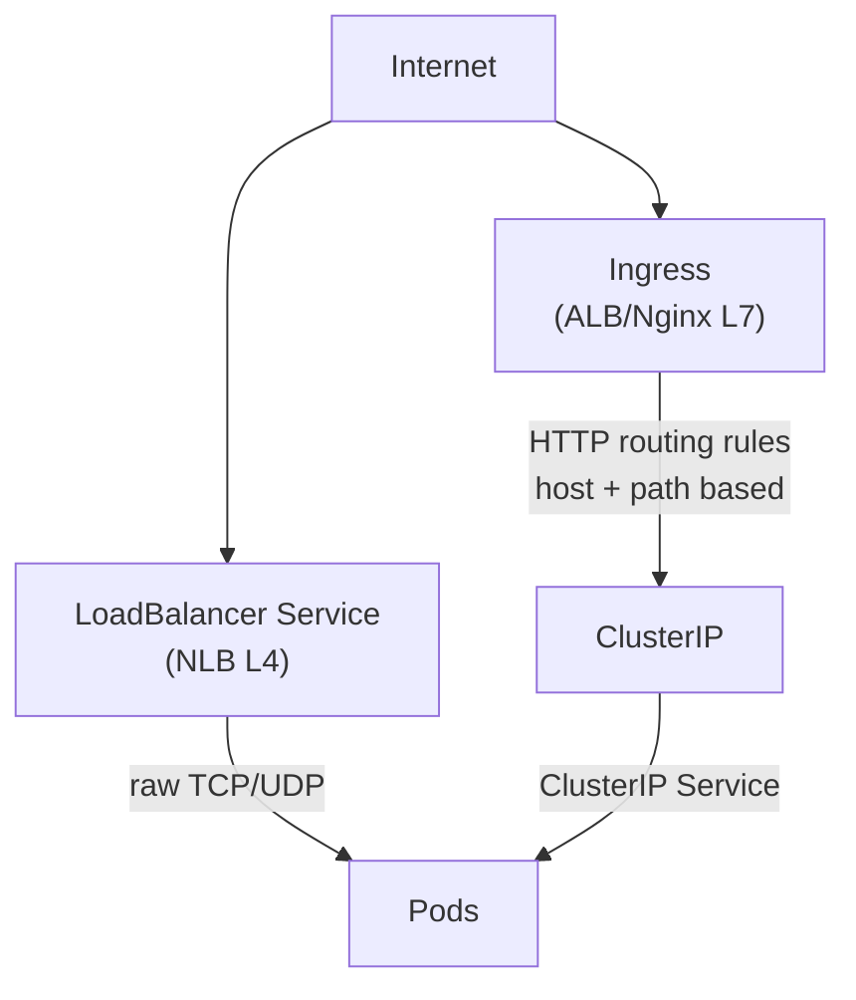

- In Kubernetes, a Service is an abstraction that defines a logical set of Pods and a policy by which to access them. It enables network communication to Pods in a consistent and reliable way — even if the underlying Pods change (due to rescheduling, scaling, etc.).

- Expose an application running in your cluster behind a single outward-facing endpoint, even when the workload is split across multiple backends.

- Group Pods by a label selector.

- Pods can discover and talk to Services using these DNS names.    
  Ex. `http://my-service.my-namespace.svc.cluster.local`

- For ClusterIP and NodePort, kube-proxy sets up iptables or IPVS rules to route traffic to the correct Pod IPs.

- For loadbalncer service, the traffic comes to loadbalncer according to that traffic goes to the target group nodes on particular nodeport according to the policy defined at lb level, from where the kube-proxy take over and distributes the traffic on pods on that particular node.

- externalTrafficPolicy: Cluster
  - Any Kubernetes node can accept traffic on the NodePort and then forward it internally to a Pod running anywhere in the cluster.

  - So even if the Pod isn’t on that node, the traffic is still forwarded internally using Kubernetes networking.

  - Thats what exactly happens in the case of ingress controller, nlb/alb will have all the nodes as target group but the nodeport is the port where ingress controller is exposed, so if the request lands on any node works and all the target groups visibly healthy

**Types of Service**

*1. ClusterIP*

- Exposes the Service on a cluster-internal IP. 
  
- Choosing this value makes the Service only reachable from within the cluster. 
  
- This is the default that is used if you don't explicitly specify a type for a Service.

-  You can expose the Service to the public internet using an Ingress or a Gateway.
   

*2. NodePort*

- Exposes the Service on each Node's IP at a static port (the NodePort). 
  
- To make the node port available, Kubernetes sets up a cluster IP address, the same as if you had requested a Service of type: ClusterIP.

- Allocates a port on each Node (between 30000–32767) and forwards traffic to the Service.

*3. LoadBalancer*

- Exposes the Service externally using an external load balancer. 
  
- Kubernetes does not directly offer a load balancing component; you must provide one, or you can integrate your Kubernetes cluster with a cloud provider.

*4. ExternalName*

- Maps the Service to the contents of the externalName field (for example, to the hostname api.foo.bar.example). 
  
- The mapping configures your cluster's DNS server to return a CNAME record with that external hostname value. No proxying of any kind is set up.

- Inside your cluster, a DNS request for: external-db.my-namespace.svc.cluster.local Will resolve to: db.example.com and traffic will go directly to db.example.com (bypassing Kubernetes proxying, kube-proxy, etc.)

- Usecases:
  
  - Unified DNS for Apps:
  
    - No app-level awareness that this is external.
  
    -  If later you migrate the DB into the cluster  you just change the Service type. No code changes.
  
 -  Central Configuration:
  
    -  Imagine you have 10 microservices accessing an external payment gateway (payments.acme.com).
  
    -  Without ExternalName: all services must be configured with that external hostname.
  
    -  With ExternalName: services just use payments-service.default.svc.cluster.local
  
    -  If the vendor changes DNS name, you only change one YAML.
  
    -   Better separation of infra and app logic.

*5. Headless*

- A Headless Service is a service without a cluster IP.

- Instead of load-balancing, it directly returns the IPs of the matching pods, allowing the client to connect to them directly.

- We can use it for StatefulSets (like databases, Kafka, etc.) and to do DNS-based service discovery

```
kind: StatefulSet
metadata:
  name: redis
spec:
  serviceName: redis-headless
  replicas: 3
```

The DNS names become:

```
redis-0.redis-headless.default.svc.cluster.local
redis-1.redis-headless.default.svc.cluster.local
redis-2.redis-headless.default.svc.cluster.local
```

---

## Service YAML Examples

```yaml
# ClusterIP — internal only
apiVersion: v1
kind: Service
metadata:
  name: api-service
  namespace: production
spec:
  type: ClusterIP
  selector:
    app: api-server    # must match pod labels
  ports:
    - name: http
      port: 80         # Service port (what clients call)
      targetPort: 8080  # Container port (what pods listen on)
---
# NodePort — exposes on every node's IP:30080
apiVersion: v1
kind: Service
metadata:
  name: web-nodeport
spec:
  type: NodePort
  selector:
    app: web
  ports:
    - port: 80
      targetPort: 8080
      nodePort: 30080    # optional: auto-assigned if omitted (30000-32767)
---
# LoadBalancer — creates AWS NLB/ALB
apiVersion: v1
kind: Service
metadata:
  name: api-lb
  annotations:
    service.beta.kubernetes.io/aws-load-balancer-type: "nlb"
    service.beta.kubernetes.io/aws-load-balancer-scheme: "internet-facing"
spec:
  type: LoadBalancer
  selector:
    app: api-server
  ports:
    - port: 443
      targetPort: 8080
---
# ExternalName — DNS alias to external service
apiVersion: v1
kind: Service
metadata:
  name: external-db
spec:
  type: ExternalName
  externalName: prod-rds.abc123.us-east-1.rds.amazonaws.com
```

## Service Discovery

```bash
# DNS-based (recommended)
# From pod in same namespace:
curl http://api-service/api/v1/users
# From pod in different namespace:
curl http://api-service.production.svc.cluster.local/api/v1/users

# Environment variables (legacy — injected at pod startup)
# KUBERNETES_SERVICE_HOST, KUBERNETES_SERVICE_PORT etc.
# Limitation: variables only for services that existed when pod started

# Check service endpoints (which pods are registered)
kubectl get endpoints api-service
# ENDPOINTS: 10.0.1.5:8080,10.0.1.6:8080,10.0.1.7:8080
```

## Service vs Ingress vs LoadBalancer



| | ClusterIP | NodePort | LoadBalancer | Ingress |
|--|-----------|---------|-------------|---------|
| External access | No | Yes (via node IP) | Yes (cloud LB) | Yes (L7 routing) |
| Layer | L4 | L4 | L4 | L7 (HTTP) |
| Cost | Free | Free | $$$ per LB | One LB for all |
| Use case | Internal comms | Dev/testing | Single service | Multi-service routing |

## Common Interview Questions

**Q: ClusterIP vs LoadBalancer — when to use each?**
ClusterIP for inter-service communication within the cluster (no external access needed, e.g., backend DB connection). LoadBalancer when you need to expose a service externally without HTTP routing complexity (e.g., TCP services, game servers, WebSocket servers). For HTTP/HTTPS services, prefer Ingress — it uses one cloud load balancer for all services (much cheaper than one LB per service).

**Q: How does a Service route to pods if pods are constantly restarting with new IPs?**
Kubernetes maintains Endpoints objects that track current pod IPs. When a pod starts with a matching label, the Endpoints controller adds its IP. When a pod dies, it's removed. kube-proxy watches Endpoints changes and updates iptables/IPVS rules. Services always point to currently-running pods — latency of endpoint update is ~seconds.

**Q: externalTrafficPolicy: Local vs Cluster?**
`Cluster` (default): any node accepts NodePort traffic → forwards to any pod on any node via overlay. Preserves load balancing. Drawbacks: extra hop, source IP is SNAT'd. `Local`: only nodes with matching pods accept traffic. Preserves client source IP (no SNAT). Drawback: uneven load distribution (if pod is on 2 of 5 nodes, those 2 nodes get all traffic). Use `Local` when you need the real client IP in your application.

