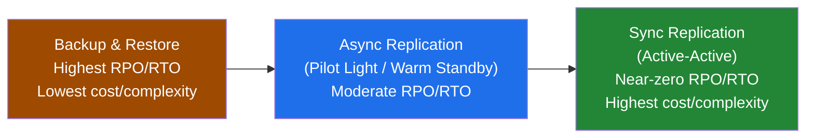

# Multi-Region Disaster Recovery for StatefulSets

> Multi-region DR for stateful applications on Kubernetes is hard because you're dealing with data consistency and state synchronization across geographically distant clusters — Kubernetes gives you the platform (StatefulSets, PVCs, Services), but it has no opinion at all on data replication; that's entirely the application's problem. The goal in every approach below is the same: minimize RPO (data loss) and RTO (downtime), and pick the strategy whose cost and complexity match how much of each you can actually tolerate.

## The Three Strategies, at a Glance



| Strategy | RPO | RTO | Cost | When to use |
|---|---|---|---|---|
| Backup & Restore | High (since last backup) | High (provision + restore + restart) | Lowest — pay only for storage | Simpler workloads, DR is a compliance checkbox, budget-constrained |
| Async Replication (Pilot Light / Warm Standby) | Low (replication lag only) | Moderate (minutes–hours to promote + scale up) | Moderate — DR region runs a scaled-down standby | Most production databases — the common middle ground |
| Sync/Active-Active | Near-zero | Near-zero | Highest — full duplicate capacity, always-on | Only for applications explicitly designed for multi-master conflict resolution |

## Strategy 1: Backup & Restore

**Concept:** periodically back up Kubernetes resources (StatefulSet definitions, PVCs, ConfigMaps, Secrets) plus the actual PV data, then restore everything into a fresh cluster in the DR region during a disaster.

**Tools:**
- **Velero** — the standard open-source tool for Kubernetes backup/restore; backs up API objects and triggers volume snapshots/restores via CSI drivers.
- **Cloud-native snapshots** — EBS/Azure Disk/GCP Persistent Disk snapshots, replicated cross-region; you coordinate these separately alongside your Kubernetes resource backups.
- **Application-level backups** — for databases specifically, native tools (`pg_dump`, `mongodump`) writing into cross-region replicated object storage (S3/Blob/GCS) are often more restorable than a raw volume snapshot.

```bash
# Primary region: schedule a Velero backup of the StatefulSet's namespace,
# including VolumeSnapshots, into a cross-region-replicated bucket
velero backup create prod-db-daily \
  --include-namespaces production \
  --snapshot-volumes=true \
  --storage-location aws-us-east-1 \
  --ttl 720h

# DR region: on an actual disaster, restore into a pre-provisioned (or IaC-deployed) cluster
velero restore create --from-backup prod-db-daily

# Then: restore data volumes from cross-region replicated snapshots/application backups,
# repoint the application at the restored data, and update DNS.
```

**RPO/RTO:** high on both — you lose everything since the last backup, and RTO includes cluster provisioning, restore, and cold-start time.

## Strategy 2: Asynchronous Replication (Pilot Light / Warm Standby)

**Concept:** keep a minimal, scaled-down copy of the StatefulSet running in the DR region, continuously receiving asynchronously replicated data from primary.

**Replication methods:**
- **Application-level replication** (usually the most robust) — PostgreSQL streaming replication, Kafka MirrorMaker, Cassandra multi-DC replication. The application itself owns keeping the secondary in sync.
- **Storage-level replication** — some CSI drivers/storage platforms (Portworx, Ceph, NetApp Trident) offer cross-region async volume replication independent of the application.

**Two flavors of standby:**
- *Pilot Light* — only the minimal "standby/replica" role is running in DR, connected to replicated data; almost everything else must be scaled up during failover.
- *Warm Standby* — a scaled-down but fully functional StatefulSet is already running and continuously receiving replicated data; failover mostly means promoting + scaling, not building from scratch.

**Failover sequence:**
```bash
# 1. Stop writes to primary (if the disaster allows a controlled cutover)
# 2. Promote the DR StatefulSet's replica role to primary — application-specific
#    (e.g., a PostgreSQL replica promotion is a database-level command, not a kubectl one)
kubectl exec -it postgres-dr-0 -n production -- pg_ctl promote

# 3. Scale the DR StatefulSet up to full production capacity
kubectl scale statefulset postgres-dr --replicas=3 -n production

# 4. Cut traffic over via DNS (see Route 53 failover example below)
```

**RPO/RTO:** low RPO (bounded by replication lag), moderate RTO (minutes to hours to promote and scale).

## Strategy 3: Synchronous Replication / Active-Active

**Concept:** the StatefulSet runs simultaneously in multiple regions, serving read and/or write traffic from all of them, with data synchronized synchronously or near-synchronously.

- **Application-level multi-region clusters** — some distributed databases are explicitly designed for this (multi-master with quorum + conflict resolution). This is a property the application must have; Kubernetes cannot bolt it on.
- **Shared cross-region storage** — generally impractical: synchronous block-level or filesystem replication across real-world inter-region latency imposes a heavy performance penalty, so this path is rarely chosen over application-native multi-master.

```bash
# Global traffic steering example: Route 53 latency-based routing sends
# each user to whichever active region is closest/healthiest
aws route53 change-resource-record-sets --hosted-zone-id Z123 \
  --change-batch file://latency-routing-policy.json
# ← routes to us-east-1 or eu-west-1 based on measured latency + health checks,
#   not a static failover — both regions are "live" simultaneously
```

**Key risks:** synchronous replication over long distances adds real write latency; network partitions risk split-brain (both regions accepting writes that later conflict); this is only viable for applications explicitly built for global active-active consistency — retrofitting it onto an ordinary database is not a realistic option.

**RPO/RTO:** near-zero on both, at the highest cost and complexity.

## Key Considerations for Any StatefulSet DR Strategy

- **Application-specific DR is unavoidable** — the most effective DR almost always leans on the application's own replication/recovery features (database clustering, Kafka MirrorMaker); Kubernetes provides the platform, the application owns data consistency.
- **Networking** — secure, low-latency connectivity between primary and DR clusters (VPC Peering, Transit Gateway) is a prerequisite for any replication-based strategy, not an afterthought.
- **DNS strategy** — plan exactly how traffic gets redirected (e.g., Route 53 failover routing policies) before a disaster, not during one.
- **Monitoring & alerting** — replication lag, health, and data consistency across regions all need dedicated alerts that trigger the DR procedure automatically or near-automatically.
- **Testing** — a DR plan that has never been failed over (and failed *back*) is a theory, not a plan. Failback is usually harder than failover and deserves equal rehearsal time.
- **IaC** — define both regions' clusters and StatefulSets via Terraform/CloudFormation so the DR environment isn't a stale, manually-maintained snowflake.
- **Secrets management** — how credentials/API keys get replicated securely across regions needs an explicit answer, not an assumption.
- **Cost** — active-active means paying for always-on duplicate capacity; backup/restore means paying mostly for storage — know which trade-off your SLA actually requires before defaulting to the fanciest option.

## Common Interview Questions

**Q: How do you choose between backup/restore, warm standby, and active-active for a given stateful workload?**
Start from the business's actual RPO/RTO requirement, not from what sounds most impressive. If losing a day of data and being down for hours during a true disaster is genuinely acceptable (and disasters are rare), backup/restore is the right amount of complexity — active-active for a workload like that is pure overengineering and ongoing cost for no real benefit. If the workload is revenue-critical and minutes of data loss is unacceptable, warm standby with async replication is usually the sweet spot. Active-active should be reserved for the rare case where the application is *already* built for multi-master conflict resolution — trying to bolt active-active onto an ordinary single-primary database is a much bigger and riskier project than the DR problem it's solving.

**Q: Why is failback usually harder than failover?**
During failover, the direction of data flow is simple: primary is down or being abandoned, DR becomes the new source of truth, and you don't have to reconcile anything from the old primary. Failback means the opposite: the original primary is back online, but the DR region has since accepted writes the old primary never saw — so you have to replicate DR's newer data *back* to primary before cutting traffic back, without losing or double-applying anything, all while the DR region is still potentially serving live production traffic. This reconciliation step has no clean automatic solution for most databases and is exactly the part teams skip when they don't rehearse full DR drills end-to-end.

**Q: Kubernetes gives you StatefulSets with persistent, per-pod storage — why isn't that enough for DR by itself?**
Because a StatefulSet's storage guarantee is scoped to a *single* cluster/region — it guarantees `postgres-0`'s PVC survives pod rescheduling within that cluster, but does nothing to replicate that PV's actual bytes to a different region, and does nothing to keep a second cluster's StatefulSet in sync with the first. Cross-region data consistency is fundamentally a data-layer problem (streaming replication, MirrorMaker, storage-level async replication) that sits below what the Kubernetes API even models — Kubernetes doesn't know or care that two StatefulSets in two clusters are supposed to represent the same logical dataset.

**Q: What's the practical difference between Pilot Light and Warm Standby, and why would you pick one over the other?**
Both keep the DR region continuously receiving replicated data, but Pilot Light keeps DR scaled down to close to nothing (often just enough to keep replication alive), while Warm Standby keeps DR running as a smaller-but-fully-functional copy of production, ready to absorb real traffic with just a scale-up. Pilot Light is cheaper to run day-to-day but has a longer RTO (you're provisioning/scaling most of the stack during the actual incident, under pressure); Warm Standby costs more continuously but fails over faster and with less last-minute uncertainty, since most of the stack is already proven to be running correctly before disaster ever strikes.
