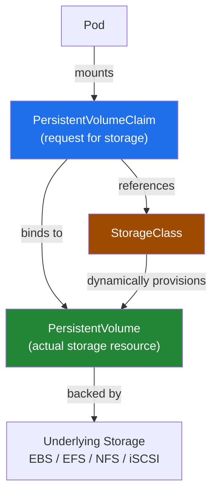
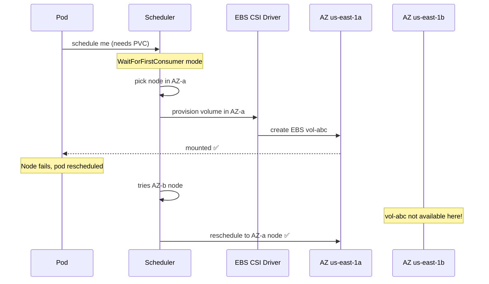
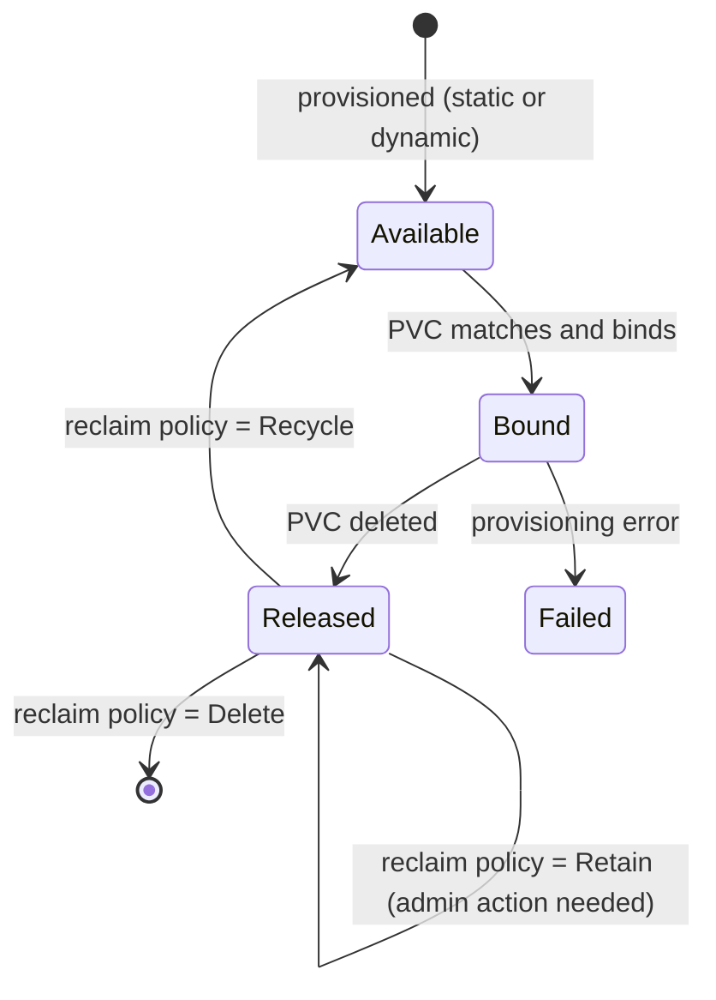

# Kubernetes Persistent Storage

> Kubernetes pods are ephemeral — data dies with the pod. PV/PVC/StorageClass solve this by decoupling **storage lifecycle** from **pod lifecycle**.

## Architecture Overview



## Block Storage vs File Storage

| Feature | Block Storage (EBS) | File Storage (EFS/NFS) |
|---------|---------------------|------------------------|
| Access Mode | ReadWriteOnce (RWO) | ReadWriteMany (RWX) |
| Protocol | iSCSI / Fibre Channel | NFS / SMB |
| Performance | Very high, low latency | Moderate |
| Use case | Databases, single-pod apps | Shared data, ML datasets |
| AWS service | EBS | EFS |
| Multi-AZ | ❌ (zone-locked) | ✅ (regional) |
| Analogy | USB drive (one device at a time) | Shared network drive |

**Block Storage:** Raw, fixed-size chunks. OS applies filesystem on top. Direct I/O, high performance. No inherent structure — just addresses. Ideal for databases (MySQL, PostgreSQL, MongoDB).

**File Storage:** Hierarchical directory structure built-in. Multiple clients can mount simultaneously (NFS). Lower performance than block but enables shared access.

---

## PersistentVolume (PV)

A **PV** is a piece of network-attached storage provisioned by an admin or dynamically by a StorageClass. It has a lifecycle independent of any Pod.

### Access Modes

| Mode | Short | Description |
|------|-------|-------------|
| ReadWriteOnce | RWO | Read-write by a **single node** (EBS) |
| ReadOnlyMany | ROX | Read-only by **many nodes** |
| ReadWriteMany | RWX | Read-write by **many nodes** (EFS, NFS) |
| ReadWriteOncePod | RWOP | Read-write by a **single Pod** (strict) |

### Reclaim Policy

| Policy | Behavior | Default for |
|--------|----------|-------------|
| `Retain` | PV kept, marked *Released*. Admin must reclaim manually | Static PVs |
| `Delete` | Underlying storage auto-deleted | Dynamic PVs (StorageClass) |
| `Recycle` | Wipe data, make available again | **Deprecated** |

```yaml
apiVersion: v1
kind: PersistentVolume
metadata:
  name: my-ebs-pv
spec:
  capacity:
    storage: 20Gi
  accessModes:
    - ReadWriteOnce
  reclaimPolicy: Retain
  storageClassName: gp3
  csi:
    driver: ebs.csi.aws.com
    volumeHandle: vol-0abc123def456
```

---

## PersistentVolumeClaim (PVC)

A **PVC** is a *request* for storage by a pod/user. It decouples the app from storage details — developers specify size and access mode without caring if it's EBS, EFS, or NFS.

**Binding:** Kubernetes matches a PVC to a PV based on capacity, access modes, and `storageClassName`. Once bound, the PV is exclusive to that PVC.

**Dynamic provisioning:** If no suitable PV exists but a StorageClass is referenced, Kubernetes dynamically provisions a new PV.

```yaml
apiVersion: v1
kind: PersistentVolumeClaim
metadata:
  name: my-db-pvc
spec:
  accessModes:
    - ReadWriteOnce
  storageClassName: gp3
  resources:
    requests:
      storage: 20Gi
```

```yaml
# Using PVC in a Pod
spec:
  volumes:
    - name: data
      persistentVolumeClaim:
        claimName: my-db-pvc
  containers:
    - name: app
      volumeMounts:
        - mountPath: /data
          name: data
```

---

## StorageClass (SC)

A **StorageClass** abstracts the underlying storage and enables **dynamic provisioning** — no manual PV creation needed.

### Key Fields

| Field | Purpose |
|-------|---------|
| `provisioner` | Which CSI driver to use (e.g., `ebs.csi.aws.com`) |
| `parameters` | Driver-specific config (volume type, IOPS) |
| `reclaimPolicy` | Default reclaim policy for dynamically provisioned PVs |
| `volumeBindingMode` | When to provision the PV |

### `volumeBindingMode` — Critical for Multi-AZ

| Mode | Behavior | Use When |
|------|----------|----------|
| `Immediate` | Provision PV when PVC is created | Single-AZ, don't care about topology |
| `WaitForFirstConsumer` ✅ | Provision ONLY when Pod is scheduled | **Production multi-AZ clusters** |

`WaitForFirstConsumer` tells the EBS CSI driver to create the volume in the **same AZ as the scheduled pod** — prevents the dreaded `volume node affinity conflict` error.

```yaml
apiVersion: storage.k8s.io/v1
kind: StorageClass
metadata:
  name: gp3
  annotations:
    storageclass.kubernetes.io/is-default-class: "true"
provisioner: ebs.csi.aws.com
parameters:
  type: gp3
  iops: "3000"
  throughput: "125"
  encrypted: "true"
reclaimPolicy: Delete
volumeBindingMode: WaitForFirstConsumer  # Critical for multi-AZ!
allowVolumeExpansion: true
```

---

## EBS + Multi-AZ: The Problem & Solution



**Problem:** EBS volumes are zone-locked. Pod rescheduled to a different AZ → `volume node affinity conflict` → pod stuck `Pending`.

**Solutions:**
1. **`WaitForFirstConsumer`** — ensures PV is provisioned in the same AZ as the pod. On rescheduling, K8s prefers the same AZ.
2. **EFS** — regional, supports RWX, works across AZs. Use for shared storage.
3. **Distributed storage** (Rook-Ceph, Portworx) — spans AZs at the storage layer.

---

## PV Lifecycle



---

## Common Interview Questions

**Q: What's the difference between PV and PVC?**
PV is the actual storage resource (like an EBS volume). PVC is a request for storage by a pod. The binding between them is Kubernetes' job — it matches PVCs to PVs based on access modes, capacity, and storageClassName.

**Q: When would you use EFS over EBS?**
EFS when you need: (1) ReadWriteMany (multiple pods writing simultaneously), (2) cross-AZ access, (3) auto-scaling storage. EBS for databases needing high IOPS, single-writer scenarios.

**Q: What happens to data when a PVC is deleted?**
Depends on the `reclaimPolicy`. With `Delete` (default for dynamic provisioning), the underlying EBS volume is also deleted. With `Retain`, the PV and data are kept — an admin must manually clean up.

**Q: Why use `WaitForFirstConsumer`?**
Prevents EBS volumes from being provisioned in the wrong AZ. With `Immediate` mode, the PV is created before pod scheduling — if the pod ends up on a node in a different AZ, it can't mount the volume.

**Q: How do you resize a PVC?**
Set `allowVolumeExpansion: true` in the StorageClass, then increase the `resources.requests.storage` in the PVC. For EBS, this works online with gp3/io1 volumes. The filesystem is expanded automatically on next pod restart.

**Q: What is CSI?**
Container Storage Interface — a standard API between container orchestrators and storage providers. The `ebs.csi.aws.com` driver is the AWS-maintained CSI driver for EBS, preferred over the deprecated in-tree `kubernetes.io/aws-ebs` provisioner.
