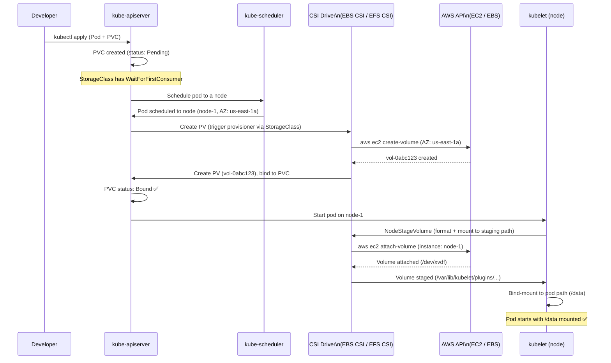
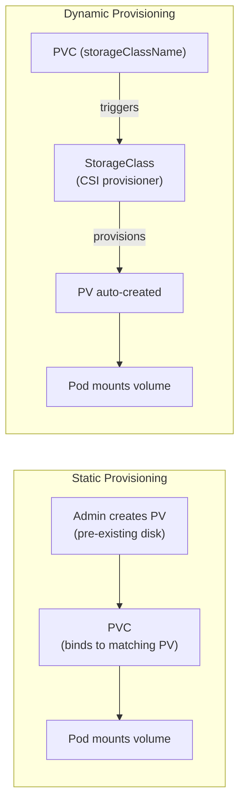
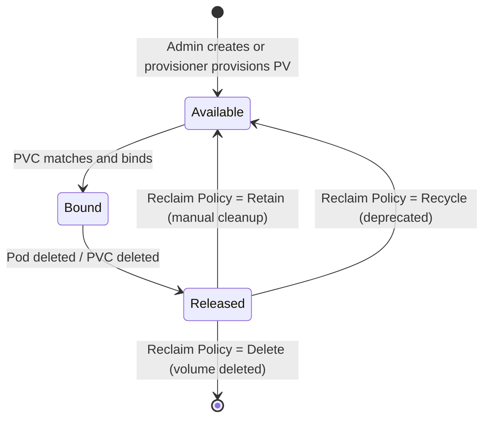

# Kubernetes Volume Creation Flow

> How a PersistentVolume (PV) is provisioned and bound to a PersistentVolumeClaim (PVC) — from pod scheduling to disk attachment.

## End-to-End Flow (Dynamic Provisioning)



## Component Roles

| Component | Role in volume flow |
|-----------|-------------------|
| **kube-apiserver** | Stores PVC/PV objects, triggers provisioner via StorageClass annotation |
| **kube-scheduler** | Places pod on a node — with `WaitForFirstConsumer`, node choice drives volume AZ |
| **external-provisioner** | CSI sidecar that watches for unbound PVCs and calls `CreateVolume` |
| **CSI Driver** | Calls cloud API to create disk, implements `NodeStageVolume`/`NodePublishVolume` |
| **kubelet** | Calls CSI `NodeStageVolume` to attach/format, then bind-mounts into pod |

## Static vs Dynamic Provisioning



## WaitForFirstConsumer — AZ Alignment

Without this, the volume is provisioned before the pod is scheduled → volume might end up in a different AZ than the pod:

```yaml
apiVersion: storage.k8s.io/v1
kind: StorageClass
metadata:
  name: ebs-gp3
provisioner: ebs.csi.aws.com
volumeBindingMode: WaitForFirstConsumer   # wait for pod scheduling before provisioning
reclaimPolicy: Delete
parameters:
  type: gp3
  encrypted: "true"
```

**Without WaitForFirstConsumer:** PVC bound to a volume in `us-east-1a`, but scheduler places pod on `us-east-1b` node → pod stuck in `Pending` (EBS volumes are AZ-local).

**With WaitForFirstConsumer:** Scheduler picks a node first, then provisioner creates the EBS volume in the same AZ as the node.

## PV Lifecycle



## PVC/PV YAML Examples

```yaml
# PVC — developer creates this
apiVersion: v1
kind: PersistentVolumeClaim
metadata:
  name: app-data
  namespace: production
spec:
  accessModes:
    - ReadWriteOnce      # EBS: only one node can mount at a time
  storageClassName: ebs-gp3
  resources:
    requests:
      storage: 20Gi
---
# Pod using the PVC
apiVersion: v1
kind: Pod
spec:
  containers:
    - name: app
      volumeMounts:
        - name: data
          mountPath: /var/lib/app/data
  volumes:
    - name: data
      persistentVolumeClaim:
        claimName: app-data
```

## Access Modes by Storage Type

| Access Mode | EBS (Block) | EFS (File) | Meaning |
|-------------|------------|-----------|---------|
| `ReadWriteOnce` (RWO) | ✅ | ✅ | One node, read+write |
| `ReadOnlyMany` (ROX) | ❌ | ✅ | Many nodes, read only |
| `ReadWriteMany` (RWX) | ❌ | ✅ | Many nodes, read+write |
| `ReadWriteOncePod` (RWOP) | ✅ | ✅ | One pod only (K8s 1.22+) |

**EBS → RWO only** (block device can only attach to one EC2 instance)

**EFS → RWX** (NFS-based, many pods across many nodes can mount simultaneously)

## Troubleshooting Volume Issues

```bash
# PVC stuck in Pending
kubectl describe pvc app-data -n production
# Look for: "no persistent volumes available", "no matching volume", topology errors

# Pod stuck in ContainerCreating with volume issue
kubectl describe pod my-pod -n production
# Look for: "Multi-Attach error", "node has no CSI driver", AZ mismatch

# Check CSI driver pods are running
kubectl get pods -n kube-system | grep ebs-csi

# Check if volume is attached to node
aws ec2 describe-volumes \
  --filters "Name=tag:kubernetes.io/created-for/pvc/name,Values=app-data" \
  --query 'Volumes[*].{ID:VolumeId,State:State,AZ:AvailabilityZone,Attachments:Attachments}'

# Force detach a stuck volume (last resort)
aws ec2 detach-volume --volume-id vol-0abc123 --force
```

## Common Interview Questions

**Q: Why do EBS-backed PVCs get stuck in Pending?**
Usually an AZ mismatch: the EBS volume was provisioned in `us-east-1a` but the pod was scheduled to a node in `us-east-1b`. EBS volumes are AZ-local and can only attach to EC2 instances in the same AZ. Fix: use `volumeBindingMode: WaitForFirstConsumer` in the StorageClass so the volume is provisioned in the same AZ as the scheduled node.

**Q: RWX access mode — EBS vs EFS?**
EBS (block storage) only supports `ReadWriteOnce` — it's a block device that can only be attached to one EC2 instance at a time. EFS supports `ReadWriteMany` — it's NFS-based, allowing concurrent mounts across multiple pods on multiple nodes. For workloads needing shared storage (uploads, shared config), use EFS with `ReadWriteMany`.

**Q: What happens to data when a PVC is deleted?**
Depends on the StorageClass `reclaimPolicy`: **Delete** (default for dynamic provisioning) — the PV and underlying EBS volume are deleted immediately. **Retain** — the PV becomes `Released` status, the EBS volume is kept; an admin must manually delete the PV and decide what to do with the volume. Use `Retain` for important data; use `Delete` for ephemeral workloads.
