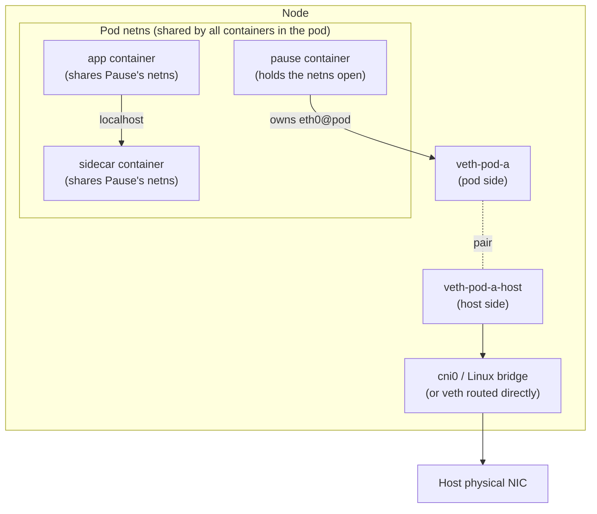
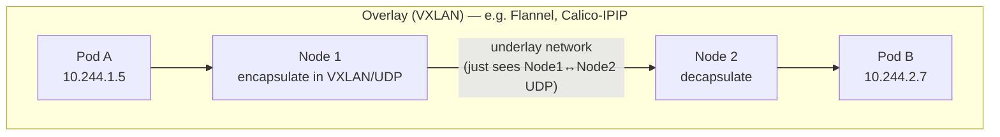
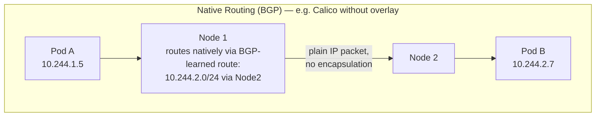
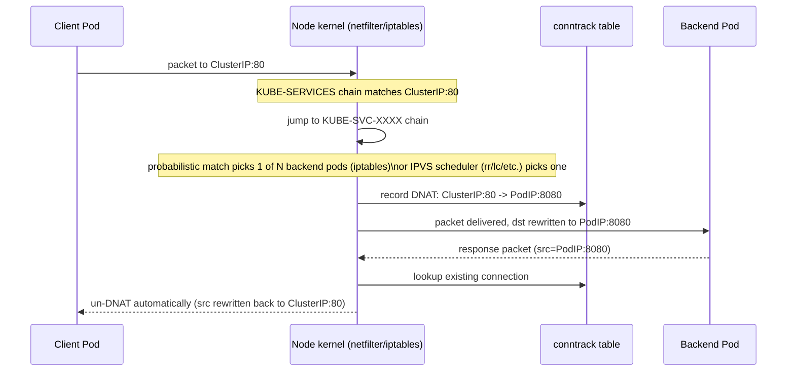

# Kubernetes Networking Internals

> How a packet actually gets from one Pod to another — network namespaces, veth pairs, CNI, overlay vs native routing, iptables/IPVS DNAT, and CoreDNS. This is the plumbing underneath [Service.md](../Components/Service/Service.md), [NetworkPolicy.md](../Components/NetworkPolicy/NetworkPolicy.md), and [Ingress.md](../Components/Ingress/Ingress.md) — those docs cover the API objects; this one covers what actually moves the bytes.

## The Kubernetes Networking Model (the 4 non-negotiable rules)

Kubernetes networking is defined by a small set of invariants every CNI plugin must uphold, from the original design doc:

1. **Every Pod gets its own IP address** — no port-mapping, no NAT between containers in different pods.
2. **Pods can reach all other Pods' IPs across the entire cluster, on every node, without NAT.**
3. **Nodes can reach all Pods without NAT** (and vice versa).
4. **The IP a Pod sees itself as is the same IP everyone else sees it as** — no per-pod NAT rewriting anything in-cluster.

This is a deliberate, fundamental departure from Docker's default bridge networking, where containers get private IPs behind NAT and you publish ports (`-p 8080:80`) to reach them from outside. Kubernetes instead treats every Pod as a first-class citizen of a flat network — closer in spirit to giving every pod its own VM than to classic container port-mapping. This is *why* two containers in a Service never need `hostPort` gymnastics, and why the pain of "which port did I map this to" simply doesn't exist in Kubernetes the way it does in plain Docker.

## Building Blocks: Network Namespaces, veth Pairs, and the Pause Container



- **Network namespace (netns):** a Linux kernel primitive that gives a process its own isolated view of network interfaces, routing tables, and iptables rules. Every Pod gets exactly one netns, **shared by every container in that pod** — this is the actual mechanism behind "containers in a pod share `localhost`" and a single IP address. Containers within a pod are just different cgroups/namespaces for CPU/filesystem/PID, but they share the *network* namespace.
- **The pause container:** the first container kubelet starts for any pod (`k8s.gcr.io/pause` or similar, sometimes called the "infra container"). Its only job is to hold the network namespace open for the pod's entire lifetime — it does effectively nothing (blocks forever), but if it died, the netns (and thus the pod's IP) would disappear even if your app container were still running. Real app containers join this same netns rather than creating their own — this is why individual containers in a pod can crash/restart without the pod's IP changing.
- **veth pair:** a virtual Ethernet cable with two ends — one end is placed inside the pod's netns (appears as `eth0` to the pod), the other end stays in the host's root netns and gets attached to a bridge or routed directly. Every packet leaving the pod's `eth0` appears on the host-side veth end, and vice versa.
- **Bridge (e.g., `cni0`, `cbr0`, or a plugin-specific bridge):** a virtual Layer 2 switch on the node connecting all the host-side veth ends together, so pods on the same node can reach each other directly at the kernel level with a single hop.

## CNI: Just a Spec, Not an Implementation

kubelet does **not** implement pod networking itself. When a pod is scheduled to a node, kubelet calls out to whatever CNI (Container Network Interface) binary is configured on that node with an `ADD` command (and `DEL` on pod teardown) — the CNI plugin is responsible for actually creating the veth pair, assigning an IP, wiring up routes, and (depending on the plugin) programming any encapsulation or BGP state. This plugin architecture is *why* "which CNI are you running" is one of the first questions in any Kubernetes networking incident — the actual data-path behavior (and whether NetworkPolicy is even enforced, see [NetworkPolicy.md](../Components/NetworkPolicy/NetworkPolicy.md)) is entirely delegated to this swappable component.

```
# What kubelet actually reads: /etc/cni/net.d/10-calico.conflist
{
  "name": "k8s-pod-network",
  "cniVersion": "0.3.1",
  "plugins": [
    {
      "type": "calico",                 # ← the actual binary kubelet execs: /opt/cni/bin/calico
      "log_level": "info",
      "datastore_type": "kubernetes",
      "mtu": 1440,                       # ← reduced from 1500 to leave room for IPIP/VXLAN headers
      "ipam": { "type": "calico-ipam" }, # ← IP Address Management plugin — hands out pod IPs from the node's CIDR block
      "policy": { "type": "k8s" }        # ← this is what makes NetworkPolicy actually get enforced
    },
    { "type": "portmap", "capabilities": {"portMappings": true} }
  ]
}
```

| CNI Plugin | Data path | NetworkPolicy enforcement | Notable trait |
|---|---|---|---|
| Flannel (vxlan backend) | VXLAN overlay | ❌ No (by itself) | Simplest to run, minimal features |
| Calico | BGP (native routing) or IPIP/VXLAN overlay | ✅ Yes | Most common general-purpose choice; can run with or without overlay |
| Cilium | eBPF (bypasses iptables entirely) | ✅ Yes, plus L7/FQDN-aware policies | Lowest overhead at scale, richest policy model, growing default choice |
| AWS VPC CNI | No overlay — real VPC IPs via ENI secondary IPs | Only with the add-on Network Policy agent | Pods are routable VPC citizens; IP-per-node limits apply |
| Weave Net | VXLAN-ish overlay (own encapsulation) | ✅ Yes | Simple gossip-based control plane, less common now |

## Cross-Node Pod-to-Pod: Overlay vs Native Routing vs Real VPC IPs

Same-node traffic is easy — bridge + veth, all in-kernel, no encapsulation needed. Cross-node is where the three real architectures diverge:





| Approach | Mechanism | Overhead | Requirement | Gotcha |
|---|---|---|---|---|
| **Overlay (VXLAN/IPIP)** | Encapsulate the pod packet inside a UDP (VXLAN) or IP-in-IP packet addressed node-to-node; destination node decapsulates | Extra ~50-byte header per packet, some CPU cost for encap/decap | Works on ANY underlying network — no special routing needed | **MTU**: must lower pod-facing MTU (e.g. 1500 → 1450/1440) to leave room for the outer header, or large packets silently fragment/drop |
| **Native routing (BGP)** | Each node advertises its pod CIDR block to peer nodes/routers via BGP; packets are routed as plain IP, no wrapping | Near-zero — just normal IP routing | Underlying network/routers must support BGP peering (or the cloud's routing tables must route pod CIDRs directly) | Doesn't work across networks that can't carry the pod CIDR routes (e.g., strict cloud VPC routing without custom route table entries) |
| **Real VPC IPs (AWS VPC CNI)** | Pods get **actual secondary IPs** from the VPC subnet, attached to the node's ENI(s) — no overlay, no encapsulation at all | None — pods are just more IPs on the VPC | Enough free IPs in the subnet + enough ENI/IP slots on the instance type | **IP exhaustion per node**: each instance type has a hard limit on ENIs × IPs-per-ENI (e.g., a `t3.medium` supports far fewer pod IPs than a `m5.4xlarge`) — pods stuck `Pending` with a scheduling event citing insufficient IPs is a classic EKS-specific capacity bug. Mitigated by **IPv4 prefix delegation** (assigns a /28 prefix instead of one IP per ENI slot, multiplying available pod IPs per node). |

## Service Networking: How a ClusterIP Actually Routes a Packet

A ClusterIP is **not** assigned to any real network interface anywhere — it exists purely as a set of iptables (or IPVS) rules programmed identically on every node by kube-proxy. `Architecture.md` covers kube-proxy's modes at a high level; here's the actual packet path:



kube-proxy's actual job is just: **watch EndpointSlices, rewrite iptables/IPVS rules on every node whenever the pod set behind a Service changes.** It never touches traffic in the data path itself — the kernel (netfilter or IPVS) does 100% of the real packet forwarding. This is why kube-proxy crashing doesn't immediately break existing connections (the rules are already programmed into the kernel), but does mean the cluster stops reacting to pod churn (new/dying pods won't update routing) until it recovers.

**EndpointSlices** (the modern successor to the monolithic `Endpoints` object): a Service with many backend pods used to produce one giant `Endpoints` object that every node's kube-proxy had to re-fetch in full on every single pod change — at high pod-churn/scale this became a control-plane bottleneck. EndpointSlices shard the same information into multiple objects (~100 endpoints per slice by default), so a single pod restart only triggers a small, targeted update instead of a full-object rewrite fan-out to every node.

## Egress: How Pod-to-Internet Traffic Actually Looks

Pods almost never have a publicly routable IP directly. Outbound (egress) traffic to the internet is typically **SNAT'd (masqueraded) to the node's IP** as it leaves the node — from the external service's point of view, every pod on that node looks like the same node IP. This is the mirror image of the `externalTrafficPolicy: Cluster` SNAT behavior discussed in [Service.md](../Components/Service/Service.md) for *inbound* traffic — outbound, it's the CNI's iptables MASQUERADE rule (or, on AWS VPC CNI, an actual NAT via the node's ENI) doing the same job. This is why IP-allowlisting an external API by "the pod's IP" doesn't work by default — you allowlist the node's IP (or a NAT gateway's IP, in cloud setups routing egress through a shared NAT Gateway for a stable, small set of egress IPs).

## DNS Internals: CoreDNS

- CoreDNS runs as a normal Deployment (typically 2+ replicas for HA) in `kube-system`, exposed through its own ClusterIP Service (conventionally named `kube-dns` for historical compatibility even though the pods run CoreDNS, not the old kube-dns).
- kubelet writes `/etc/resolv.conf` **inside every pod** pointing `nameserver` at that ClusterIP, plus a `search` list: `<namespace>.svc.cluster.local svc.cluster.local cluster.local`, followed by whatever upstream search domains the node itself has.
- CoreDNS resolves `*.cluster.local` names by querying the kube-apiserver directly (via its built-in `kubernetes` plugin, which watches Services/Endpoints) — no separate database, the apiserver IS the source of truth for cluster DNS. Anything outside `cluster.local` is forwarded upstream to whatever resolver the node itself uses (often the cloud provider's DNS, e.g. AmazonProvidedDNS on EKS).

**The `ndots:5` gotcha:** the default injected `resolv.conf` sets `options ndots:5` — meaning any name with fewer than 5 dots is first tried against **every entry in the search list** before being tried as an absolute name. A lookup for `api.example.com` (2 dots) triggers up to 4 wasted internal DNS queries (`api.example.com.<ns>.svc.cluster.local`, `api.example.com.svc.cluster.local`, `api.example.com.cluster.local`) that are guaranteed to fail, before finally trying `api.example.com.` directly. At high QPS this measurably inflates CoreDNS load and adds tail latency to every external call. Fixes: add a trailing dot to fully-qualified external hostnames in code (`api.example.com.`), or set a pod-level `dnsConfig` with a lower `ndots` value for services making heavy external calls.

## Troubleshooting Toolkit

```bash
# Confirm which CNI is actually running
kubectl get pods -n kube-system -o wide | grep -iE "calico|cilium|flannel|aws-node"

# Check a pod's actual netns/interfaces from the node (requires node access)
crictl inspect <container-id> | grep -i netns
ip netns exec <netns-id> ip addr

# Spin up a throwaway debug pod with real network tools
kubectl run tmp-shell --rm -it --image=nicolaka/netshoot -- /bin/bash
#   inside: dig, curl, tcpdump, mtr, ss, iptables (if privileged) all available

# Confirm Service -> Endpoints mapping is populated
kubectl get endpointslices -l kubernetes.io/service-name=<svc>

# Watch actual DNAT rules kube-proxy programmed (iptables mode)
iptables -t nat -L KUBE-SERVICES -n | grep <service-ip>

# IPVS mode equivalent
ipvsadm -Ln | grep -A3 <service-ip>

# Trace whether packets are being dropped/fragmented (MTU issues on overlay networks)
kubectl exec -it <pod> -- ping -M do -s 1472 <destination>   # ← tests exact MTU boundary (1500 - 28 byte ICMP/IP header)

# Check CoreDNS is actually healthy and resolving
kubectl exec -it <pod> -- nslookup kubernetes.default
kubectl logs -n kube-system -l k8s-app=kube-dns --tail=50
```

## Common Interview Questions

**Q: Walk me through exactly what happens when Pod A on Node 1 sends a packet to Pod B on Node 2.**
Pod A's packet leaves via its `eth0`, which is really the pod-side end of a veth pair — it lands on the host-side veth end on Node 1, hits the node's bridge/routing table, and gets forwarded toward Node 2 according to whatever the CNI plugin decided: encapsulated in a VXLAN/UDP packet if running an overlay, or routed as a plain IP packet if using BGP native routing, or delivered as a normal VPC packet if pods have real routable IPs (AWS VPC CNI). On arrival at Node 2, it's decapsulated if needed, hits Node 2's bridge, crosses the veth pair into Pod B's network namespace, and arrives at Pod B's `eth0`. At no point does either pod see any NAT rewriting — this end-to-end no-NAT guarantee is the core Kubernetes networking invariant, and the CNI plugin is entirely responsible for making it true regardless of which underlying mechanism it uses.

**Q: Overlay networking vs BGP/native routing — what's the real trade-off?**
Overlay (VXLAN/IPIP) works on literally any underlying network because it just tunnels packets as ordinary UDP/IP traffic between nodes — zero requirements on the physical/cloud network, which is why it's the default for on-prem or arbitrary cloud setups. The cost is per-packet encapsulation overhead and, critically, reduced usable MTU — get this wrong and you get silent fragmentation or drops on larger payloads that "mysteriously" only affects big requests. Native routing (Calico BGP mode) eliminates that overhead entirely by advertising each node's pod CIDR as a real route, so packets travel as plain IP with no wrapping — but it requires the underlying network to actually support carrying those routes (BGP peering with real routers, or cloud-specific routing table integration), which isn't always available or allowed in tightly locked-down network environments.

**Q: Why does AWS VPC CNI run out of pod IPs on small instance types, and how do you fix it?**
AWS VPC CNI gives every pod a *real* secondary IP address on the node's ENI(s), directly from the VPC subnet — there's no overlay, so pod IPs are genuinely routable VPC citizens. But each EC2 instance type has a hard cap on both the number of ENIs it can have and the number of secondary IPs per ENI, and that cap scales with instance size — a small instance type might only support a couple dozen pod IPs total, which is easy to blow through with modest pod density. Symptoms are pods stuck `Pending` with a scheduling event about insufficient IPs even though CPU/memory look fine. The standard fix is enabling **IPv4 prefix delegation** on the VPC CNI, which assigns a `/28` prefix (16 IPs) per ENI slot instead of one IP at a time — multiplying the pod-IP budget per node without changing instance type.

**Q: Why do containers within the same Pod share `localhost`, but two Pods never do?**
Because every container in a pod is started to join the SAME network namespace — specifically, the one held open by the pod's pause/infra container — so from a networking point of view they're not actually separate hosts at all, just separate processes sharing one IP stack, one loopback interface, and one set of listening ports. Two different Pods each get their OWN network namespace (with its own veth pair into the CNI's networking fabric), so they're genuinely separate network endpoints — reaching each other requires going out through the CNI data path like any other two hosts, not through shared loopback.

**Q: What does the "pause" container actually do, and why does deleting it matter?**
Almost nothing at the process level — it just blocks forever, consuming near-zero resources. Its entire purpose is to be the first container created for a pod so it can hold the network namespace (and IPC/PID namespace, depending on pod spec) open for the pod's whole lifetime; every other container in that pod then joins its namespaces rather than creating their own. This is precisely why an application container can crash and be restarted by kubelet without the pod's IP address changing — the IP lives with the namespace the pause container owns, not with any particular app container's lifecycle. If the pause container itself were ever killed, the whole pod's network identity would be torn down regardless of whether the app container was still healthy.

**Q: A pod can't reach another pod. What's your triage order?**
Start narrow and widen: (1) can it reach itself / localhost — rules out total netns breakage; (2) can it reach a pod on the SAME node — isolates whether the problem is CNI cross-node routing/overlay specifically, vs something broader; (3) can it resolve DNS at all (`nslookup kubernetes.default`) — separates "can't resolve" from "resolves but can't connect"; (4) is there a NetworkPolicy in play, and does the CNI even enforce NetworkPolicy (see [NetworkPolicy.md](../Components/NetworkPolicy/NetworkPolicy.md)) — rules out policy vs plumbing; (5) check `kubectl get endpointslices` if going through a Service — confirms the Service actually has healthy backends before blaming the network layer at all. Only after all of that would I reach for `tcpdump`/`mtr` inside a `netshoot` debug pod to look at actual packet loss or MTU-driven fragmentation.

**Q: What's the MTU gotcha with overlay networks, and how does it actually manifest?**
VXLAN/IPIP encapsulation adds roughly 50 bytes of overhead per packet (outer IP + UDP + VXLAN headers) on top of the original packet. If the CNI doesn't correspondingly lower the pod-facing MTU (e.g., from the standard 1500 down to ~1450), then a full-size 1500-byte packet from a pod plus the encapsulation overhead exceeds the underlying network's real MTU — causing silent fragmentation, or outright drops if the path has "don't fragment" set anywhere (common with some cloud network paths and PMTUD blackholes). It manifests as small requests working perfectly fine while large payloads (big API responses, TLS handshakes with big certs, large gRPC messages) mysteriously hang or time out — a classic "works with curl -X GET, breaks with the real payload" bug. Diagnose with an MTU-boundary ping test (`ping -M do -s <size>`) to find exactly where packets stop getting through.
