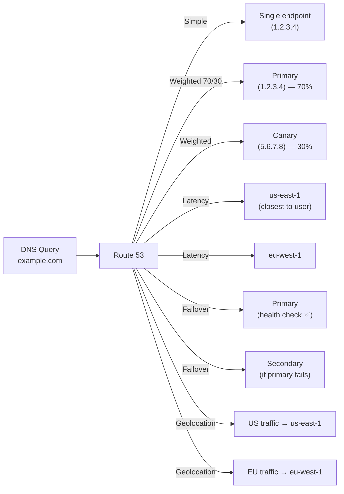

- AWS Route 53 is a scalable and highly available Domain Name System (DNS) web service provided by Amazon Web Services.
- Hosted Zone:
  - Container for DNS records for a domain
- Record Set:
  - A DNS record (A, AAAA, CNAME, MX, TXT, etc.)
- TTL (Time to Live):
  - How long DNS servers cache the record
- Alias Record:
  - AWS-specific feature to map domain to AWS resources (e.g., CloudFront, ELB)

# Main Functions of Route 53:

- You can buy a domain like example.com directly from Route 53.
- It translates friendly domain names (e.g., www.example.com) into IP addresses (e.g., 192.0.2.1), so browsers can locate your server.
- You can configure Route 53 to monitor your application and automatically fail over to a healthy endpoint if one becomes unhealthy.
- You can route traffic using:
  - Simple routing
  - Weighted routing
  - Latency-based routing
  - Failover routing
  - Geolocation/geoproximity routing
  - Multi-value answer routing
- Route 53 works well with EC2, S3, CloudFront, API Gateway, and more.

#  Buy Domain from Route 53

- Steps:
  - Go to AWS Console > Route 53 > Domains > Registered Domains
  - Click Register Domain
  - Search for your desired domain (e.g., mycoolproject.com)
  - Choose a domain and continue
  - Fill out your contact info
  - Complete the purchase
-  AWS will automatically create a hosted zone for DNS management when the domain is registered.

# Buy Domain from Another Registrar (e.g., GoDaddy, Namecheap)

- Configure it to use Route 53 for DNS:
  - Create a hosted zone in Route 53 for your domain (e.g., example.com)
  - AWS will give you 4 NS (Name Server) records
  - Go to your domain registrar's dashboard
  - Update your domain's Name Server records to use Route 53's NS records
- Now Route 53 manages DNS, even though the domain was purchased elsewhere.

---

## Routing Policies



| Policy | Use Case |
|--------|---------|
| **Simple** | Single resource, no health checks |
| **Weighted** | A/B testing, canary deployments (70/30 split) |
| **Latency** | Route to lowest-latency region for the user |
| **Failover** | Active-passive DR: primary + failover endpoint |
| **Geolocation** | Route by user's country/continent |
| **Geoproximity** | Route by distance (with bias) — requires Traffic Flow |
| **Multi-value** | Up to 8 healthy records returned (basic load distribution) |
| **IP-based** | Route by CIDR range (e.g., corporate IP → internal endpoint) |

## Health Checks

Route 53 health checks enable automatic failover:

```bash
# Create health check for primary endpoint
aws route53 create-health-check \
  --caller-reference $(date +%s) \
  --health-check-config '{
    "IPAddress": "1.2.3.4",
    "Port": 443,
    "Type": "HTTPS",
    "ResourcePath": "/health",
    "FullyQualifiedDomainName": "app.company.com",
    "RequestInterval": 30,
    "FailureThreshold": 3
  }'
```

**Health check types:**
- **Endpoint** — HTTP/HTTPS/TCP check against a specific IP or domain
- **CloudWatch Alarm** — health = alarm in OK state (great for complex conditions)
- **Calculated** — AND/OR logic combining multiple health checks

## Alias Records

AWS-specific — map domain names to AWS resources without CNAME restrictions:

```bash
# A alias record pointing to ALB (free — no TTL charge)
aws route53 change-resource-record-sets \
  --hosted-zone-id ZONE_ID \
  --change-batch '{
    "Changes": [{
      "Action": "CREATE",
      "ResourceRecordSet": {
        "Name": "app.company.com",
        "Type": "A",
        "AliasTarget": {
          "HostedZoneId": "Z35SXDOTRQ7X7K",
          "DNSName": "my-alb-123.us-east-1.elb.amazonaws.com",
          "EvaluateTargetHealth": true
        }
      }
    }]
  }'
```

**Alias vs CNAME:**
- Alias: works at zone apex (`company.com`) — CNAME can't
- Alias: free queries (no charge per query for alias to AWS resources)
- Alias: automatically updates if ALB/CloudFront IP changes

## Failover Routing — DR Pattern

```yaml
# Primary record (Active region)
Name: api.company.com
Type: A
Routing: Failover (PRIMARY)
HealthCheck: check-id-primary   # fails → switch to secondary
TTL: 60

# Secondary record (DR region)
Name: api.company.com
Type: A
Routing: Failover (SECONDARY)
Value: 5.6.7.8                  # DR ALB IP
# No health check on secondary — always serves if primary fails
```

## Private Hosted Zones

For internal DNS resolution within VPCs:

```bash
# Create private hosted zone (internal only)
aws route53 create-hosted-zone \
  --name internal.company.com \
  --caller-reference $(date +%s) \
  --hosted-zone-config '{
    "Comment": "Internal DNS",
    "PrivateZone": true
  }'

# Associate with VPC
aws route53 associate-vpc-with-hosted-zone \
  --hosted-zone-id ZONE_ID \
  --vpc '{"VPCRegion": "us-east-1", "VPCId": "vpc-abc123"}'
```

## Common Interview Questions

**Q: Route 53 routing policies — latency vs geolocation?**
Latency: routes to the AWS region with lowest measured latency for that user's location — dynamic, based on network performance. Geolocation: routes based on where the user is geographically (country/continent) — static, based on DNS resolver location. Use latency for performance optimization; use geolocation for data sovereignty (EU users must hit EU endpoints) or content localization.

**Q: Alias record vs CNAME — when to use each?**
Alias when: pointing to AWS resources (ALB, CloudFront, S3 website, API Gateway, Global Accelerator), zone apex records (`company.com` — CNAME can't be at apex), or you want free queries. CNAME when: pointing to non-AWS external endpoints. Alias is almost always the right choice for AWS services.

**Q: How does Route 53 health check + failover work for DR?**
Configure your primary record with a health check (HTTP check on `/health`). If the health check fails 3 consecutive times (configurable), Route 53 automatically starts returning the secondary record's IP instead. DNS TTL (set to 60s) controls how quickly clients switch. With active-passive failover, users transparently failover to the DR region within 1-3 minutes. Pair with low TTL (30-60s) for fastest failover.
