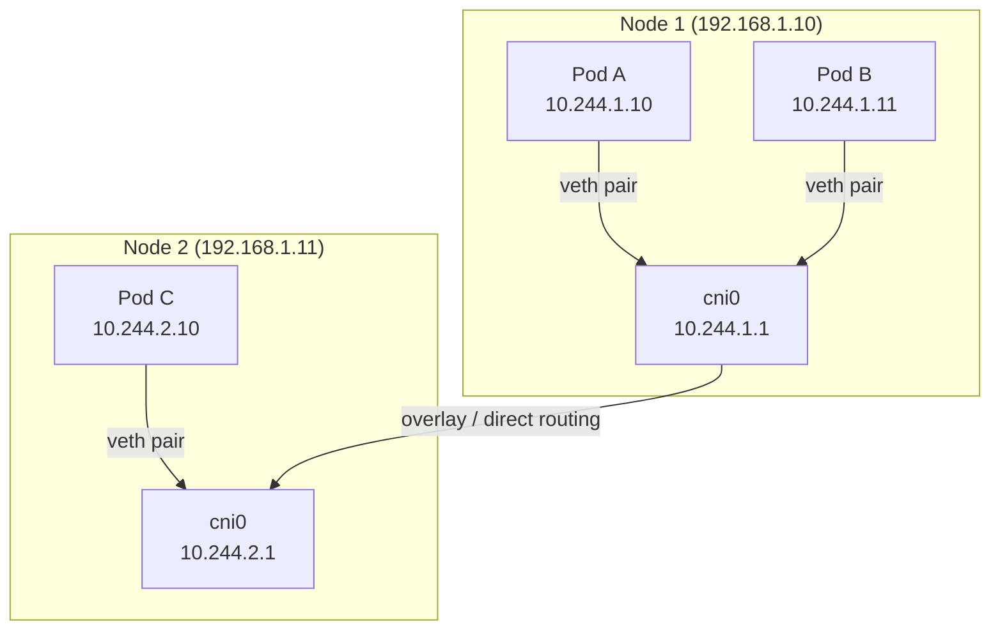

🔹 Pod IPs

- Each Pod gets a unique IP

- IP is assigned by the CNI plugin

- Pod IP is:

    - Ephemeral

    - Changes when Pod restarts

    - NOT stable

🔹 How Pods Communicate

```
Pod A (10.244.1.12)
  ↓
Node A
  ↓
Cluster Network
  ↓
Node B
  ↓
Pod B (10.244.2.34)
```

➡️ No NAT   
➡️ No port mapping      
➡️ Flat network

- This is very different from Docker bridge networking.

---

## Kubernetes Networking Model — The 3 Rules

Kubernetes mandates a flat networking model:
1. **Every pod can communicate with every other pod without NAT**
2. **Every node can communicate with every pod without NAT**
3. **The pod IP that a pod sees is the same IP others use to reach it**

This is implemented by CNI plugins (Flannel, Calico, Cilium, WeaveNet).

## Pod Communication Paths



**Same-node communication:** Pod A → veth → bridge (cni0) → veth → Pod B. No routing needed.

**Cross-node communication:** Pod A → cni0 → VXLAN tunnel (Flannel) or BGP routes (Calico) → Node 2's bridge → Pod C.

## Service Networking (kube-proxy)

```
Client Pod → Service IP (ClusterIP: 10.96.0.1)
                ↓
           kube-proxy (iptables / IPVS rules)
                ↓
         One of the Pod IPs (10.244.x.y)
```

Services have virtual IPs (ClusterIP) that exist only as iptables/IPVS rules. kube-proxy on each node maintains these rules. When a packet hits the ClusterIP, DNAT rewrites the destination to a real Pod IP.

## DNS in Kubernetes

```bash
# Every pod gets a resolv.conf pointing to CoreDNS
cat /etc/resolv.conf
# nameserver 10.96.0.10       ← CoreDNS Service IP
# search default.svc.cluster.local svc.cluster.local cluster.local

# Pod-to-Service DNS
# Full: my-service.my-namespace.svc.cluster.local
# Short (same namespace): my-service

# StatefulSet Pod DNS:
# pod-name.service.namespace.svc.cluster.local
```

## Network Policies

Without network policies, all pods can talk to all pods. Network policies restrict this:

```yaml
apiVersion: networking.k8s.io/v1
kind: NetworkPolicy
metadata:
  name: api-allow-frontend
  namespace: production
spec:
  podSelector:
    matchLabels:
      app: api             # apply to API pods
  policyTypes:
    - Ingress
    - Egress
  ingress:
    - from:
        - podSelector:
            matchLabels:
              app: frontend    # only allow from frontend pods
      ports:
        - port: 8080
  egress:
    - to:
        - podSelector:
            matchLabels:
              app: postgres    # API can only reach postgres
      ports:
        - port: 5432
```

**Important:** NetworkPolicy requires a CNI that supports it — Calico, Cilium, WeaveNet. Flannel does NOT enforce NetworkPolicy.

## Common Interview Questions

**Q: How does a pod on Node A reach a pod on Node B?**
(1) Pod A sends packet to Pod B's IP (e.g., 10.244.2.10). (2) Kernel routing on Node A: no local route → send to default gateway or overlay. (3) With Flannel VXLAN: packet is encapsulated in UDP, sent to Node B's IP. Node B's Flannel decapsulates and delivers to Pod C via the local bridge. (4) With Calico: BGP routes are distributed — each node knows subnet-to-node mapping, sends IP packet directly (no encapsulation in L3 mode). Calico is more efficient but requires L3 routing between nodes.

**Q: What is kube-proxy and what does it do?**
kube-proxy runs on every node and programs iptables (or IPVS) rules to implement Service routing. When a Service is created, kube-proxy adds DNAT rules: packets to ClusterIP are rewritten to one of the Pod IPs via round-robin (or IPVS load balancing). It watches the kube-apiserver for Endpoint changes and keeps rules up to date. Modern clusters use IPVS mode (faster, kernel hash tables vs iptables linear scan).

**Q: Why do pods need CoreDNS?**
Kubernetes doesn't give pods stable IPs — pod IPs change on restart. Services have stable DNS names that resolve to current pod IPs via CoreDNS → Service → Endpoints chain. CoreDNS watches kube-apiserver for Service/Endpoint changes and keeps DNS records updated. Every pod has `nameserver CoreDNS-IP` injected via kubelet at startup.
