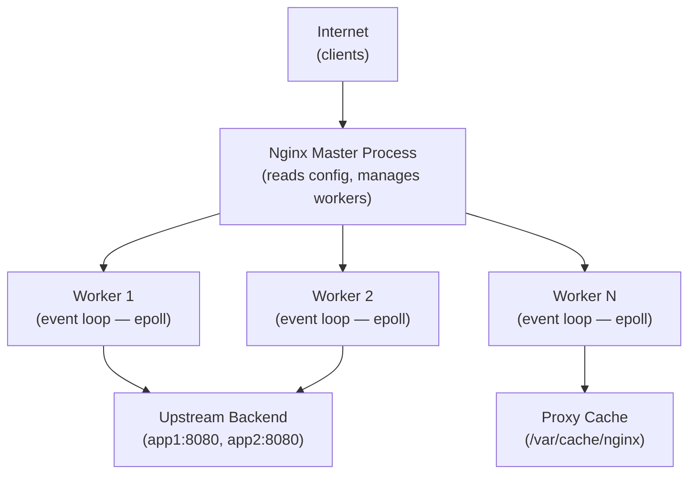

# Nginx as Webserver

- Serve static content (HTML, CSS, JS, images, etc.) and forward dynamic requests to backend apps (like PHP, Python, or Node.js apps).
- Listens on HTTP ports (usually 80 or 443 for HTTPS).
- When a request comes in (e.g., GET /index.html), Nginx serves the static file directly from disk.
- For dynamic requests, Nginx passes the request to an application server via FastCGI, uWSGI, or proxy_pass.

Example use case: Hosting a static website or acting as a frontend for a WordPress/PHP application.

# Reverse Proxy

- Nginx receives client requests and forwards them to backend servers, then returns the response to the client.
- Load balancing across multiple app servers.
- SSL termination (Nginx handles HTTPS, app servers get plain HTTP).
- Caching responses for performance.
- Hiding internal architecture from users.


- Nginx uses the proxy_pass directive to forward traffic.
```
server {
    listen 80;

    location / {
        proxy_pass http://backend_servers;
    }
}

upstream backend_servers {
    server app1.internal:8080;
    server app2.internal:8080;
}
```


#  Ingress Controller in Kubernetes

- Manage external access to services inside a Kubernetes cluster, using rules defined in Ingress
- The Nginx Ingress Controller is a Kubernetes Deployment running Nginx.
- It watches for changes to Ingress objects and configures Nginx accordingly.
- It routes HTTP/HTTPS traffic to services based on hostnames or paths.
- Central entry point to your services.
- TLS termination.
- Path-based and host-based routing.
- Rate limiting, rewrites, redirects, etc.


# Difference between a Reverse & Forward Proxies

**Reverse Proxy**
- Sits in front of web servers.
- Clients don’t know the backend servers; they only talk to the reverse proxy.
- Used by servers to serve clients better.
- Manages incoming traffic to a group of internal servers.

```
Client --> Reverse Proxy (Nginx) --> Backend Servers (e.g., app1, app2)
```

**Forward Proxy**
- Sits in front of clients.
- Servers don’t know the real client; they only see the proxy.
- Used by clients to access the internet or restricted servers.
- Manages outgoing traffic from users.
- Bypassing geo-blocks or censorship (VPN-style), Content filtering (corporate firewalls), Hiding client identity (anonymity)

```
Client --> Forward Proxy(VPN) --> Internet (websites)
```

---

## Nginx Architecture



Nginx uses **event-driven, non-blocking** I/O. One worker handles thousands of connections via epoll. Contrast: Apache prefork creates one process per connection (~1MB each).

## Full Reverse Proxy Configuration

```nginx
worker_processes auto;                  # = number of CPU cores
events { worker_connections 1024; }

http {
    upstream app_backend {
        least_conn;                     # route to server with fewest connections
        server app1.internal:8080 weight=3;
        server app2.internal:8080 weight=1;
        server app3.internal:8080 backup;
        keepalive 32;                   # persistent connections to backend
    }

    proxy_cache_path /var/cache/nginx levels=1:2 keys_zone=api_cache:10m
                     max_size=1g inactive=60m;

    server {
        listen 443 ssl http2;
        server_name api.company.com;

        ssl_certificate     /etc/ssl/certs/cert.pem;
        ssl_certificate_key /etc/ssl/private/key.pem;
        ssl_protocols       TLSv1.2 TLSv1.3;

        add_header Strict-Transport-Security "max-age=31536000" always;
        add_header X-Frame-Options DENY;
        add_header X-Content-Type-Options nosniff;

        location / {
            proxy_pass         http://app_backend;
            proxy_http_version 1.1;
            proxy_set_header   Upgrade $http_upgrade;
            proxy_set_header   Connection keep-alive;
            proxy_set_header   Host $host;
            proxy_set_header   X-Real-IP $remote_addr;
            proxy_set_header   X-Forwarded-For $proxy_add_x_forwarded_for;
            proxy_set_header   X-Forwarded-Proto $scheme;
            proxy_connect_timeout 5s;
            proxy_read_timeout    60s;
        }

        # Static files — serve directly
        location /static/ {
            root /var/www;
            expires 1y;
            add_header Cache-Control "public, immutable";
        }

        # API responses — with caching
        location /api/products {
            proxy_pass        http://app_backend;
            proxy_cache       api_cache;
            proxy_cache_valid 200 5m;
            add_header        X-Cache-Status $upstream_cache_status;
        }
    }

    server {
        listen 80;
        server_name api.company.com;
        return 301 https://$host$request_uri;
    }
}
```

## Rate Limiting

```nginx
http {
    # 10MB zone holds ~160,000 IP states
    limit_req_zone $binary_remote_addr zone=api_limit:10m rate=10r/s;
    limit_req_zone $binary_remote_addr zone=login_limit:10m rate=1r/s;

    server {
        location /api/ {
            limit_req zone=api_limit burst=20 nodelay;
            limit_req_status 429;
            proxy_pass http://app_backend;
        }

        location /auth/login {
            limit_req zone=login_limit burst=5;
            proxy_pass http://app_backend;
        }
    }
}
```

## Load Balancing Algorithms

| Algorithm | Config | Use case |
|-----------|--------|---------|
| Round Robin (default) | (none) | Equal servers |
| Least Connections | `least_conn;` | Variable request duration |
| IP Hash | `ip_hash;` | Session stickiness |
| Weighted | `weight=3;` on server | Different-capacity servers |
| Random | `random two least_conn;` | Very large upstream pools |

## Upstream Health Checks

```nginx
upstream app_backend {
    # Passive: mark server down after 3 failures in 30s
    server app1.internal:8080 max_fails=3 fail_timeout=30s;
    server app2.internal:8080 max_fails=3 fail_timeout=30s;
}

location / {
    proxy_pass http://app_backend;
    # Retry on errors — try next upstream server
    proxy_next_upstream error timeout http_500 http_502 http_503;
    proxy_next_upstream_tries 3;
}
```

## Nginx as Kubernetes Ingress Controller

```bash
# Install via Helm
helm repo add ingress-nginx https://kubernetes.github.io/ingress-nginx
helm install ingress-nginx ingress-nginx/ingress-nginx \
  --set controller.replicaCount=2
```

```yaml
apiVersion: networking.k8s.io/v1
kind: Ingress
metadata:
  name: my-app-ingress
  annotations:
    nginx.ingress.kubernetes.io/proxy-body-size: "10m"
    nginx.ingress.kubernetes.io/rate-limit: "100"
    nginx.ingress.kubernetes.io/ssl-redirect: "true"
    cert-manager.io/cluster-issuer: "letsencrypt-prod"
spec:
  ingressClassName: nginx
  tls:
    - hosts: [api.company.com]
      secretName: api-tls
  rules:
    - host: api.company.com
      http:
        paths:
          - path: /api
            pathType: Prefix
            backend:
              service:
                name: api-service
                port:
                  number: 8080
          - path: /
            pathType: Prefix
            backend:
              service:
                name: frontend-service
                port:
                  number: 80
```

## Common Interview Questions

**Q: How does Nginx handle 10,000 concurrent connections efficiently?**
Nginx uses event-driven, asynchronous I/O with epoll (Linux). A single worker process handles thousands of connections via a non-blocking event loop — it registers I/O events and handles them when ready, never blocking. Apache's prefork model creates one process per connection (~1MB each). Nginx: ~2MB RAM per 10k connections vs Apache ~1GB.

**Q: Nginx load balancing — `least_conn` vs `ip_hash`?**
`least_conn`: routes each request to the server with fewest active connections — best for variable-duration requests (API calls ranging from 1ms to 30s). `ip_hash`: routes same client IP to same server — sticky sessions without a session store. Problem: clients behind NAT share one server (uneven distribution). Prefer explicit session management (Redis) over ip_hash.

**Q: Nginx rate limiting — how does `burst` work?**
`rate=10r/s burst=20 nodelay`: average rate of 10 req/s. `burst=20` allows up to 20 extra requests to be served immediately before the rate limit kicks in. `nodelay` serves burst requests immediately (no queuing delay). Requests beyond rate + burst get 429. Rule of thumb: rate = normal traffic/s, burst = 2x peak spike.
