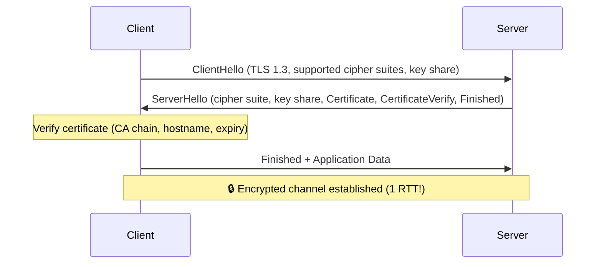
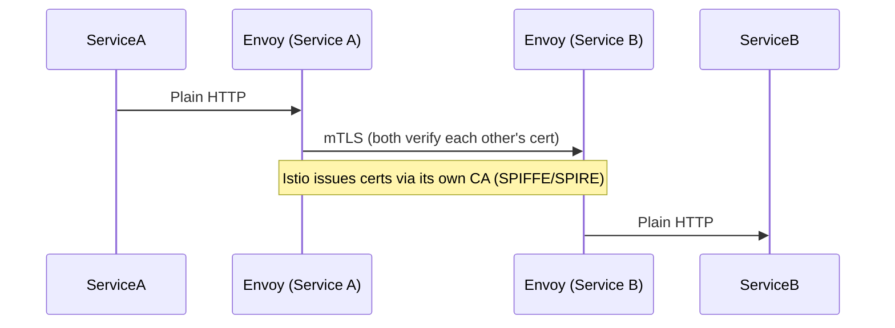

- SSL/TLS are cryptographic protocols that secure communication over a network
- They provide:
    - 🔐 Encryption – data cannot be read
    - 🧾 Authentication – you know who you’re talking to
    - 🛡 Integrity – data cannot be modified


# SSL (Secure Sockets Layer)

- What it is
    - Invented by Netscape (1990s)
    - Versions: SSL 2.0, SSL 3.0

- Status

❌ Deprecated
❌ Insecure
❌ Must NOT be used

- If you hear “SSL” today, people usually mean TLS.

# TLS (Transport Layer Security)

- What it is

    - Successor to SSL
    - Secure, modern protocol

| Version | Status           |
| ------- | ---------------- |
| TLS 1.0 | Deprecated       |
| TLS 1.1 | Deprecated       |
| TLS 1.2 | Widely used      |
| TLS 1.3 | Latest & fastest |


# SSL vs TLS (Clear Difference)

| Aspect    | SSL        | TLS    |
| --------- | ---------- | ------ |
| Security  | Weak       | Strong |
| Status    | Deprecated | Active |
| Handshake | Vulnerable | Secure |
| Use today | ❌          | ✅      |


# How TLS Works (Simplified Handshake)

1️⃣ Client → Server: Hello (supported ciphers)
2️⃣ Server → Client: Certificate (public key)
3️⃣ Client verifies certificate (CA trust)
4️⃣ Client generates session key
5️⃣ Session key encrypted with server public key
6️⃣ Secure communication starts


# Certificates

- A digital identity document containing:
    - Public key
    - Owner (domain / service)
    - Issuer (CA)
    - Expiry date

# Where Do We Use TLS? (Real World)

| Usage     | Example             |
| --------- | ------------------- |
| HTTPS     | Browsers ↔ Websites |
| APIs      | Client ↔ Backend    |
| Email     | SMTP over TLS       |
| Databases | App ↔ DB            |


☁ Cloud & Kubernetes

| Area           | Usage                |
| -------------- | -------------------- |
| kube-apiserver | kubectl ↔ API        |
| kubelet        | Node ↔ Control plane |
| etcd           | mTLS                 |
| Ingress        | HTTPS                |
| Service mesh   | mTLS                 |


# mTLS (2-way authentication)

```
Client ─────► Server
  ▲            ▲
  │ verifies    │ verifies
  │ server cert │ client cert

```

**MTLS Usecase**
- kube-apiserver ↔ etcd     - > mTLS
    - etcd contains ALL secrets
    - Must block unauthorized access

- Service Mesh

---

## TLS Handshake (TLS 1.3 — 1-RTT)



TLS 1.3: 1 round-trip vs TLS 1.2's 2 round-trips. TLS 1.3 also removes weak algorithms (RSA key exchange, SHA-1, DES).

## Certificate Chain

```
Root CA (trusted by OS/browser)
  └── Intermediate CA (reduces risk — root stays offline)
        └── Your Certificate (for your domain)
```

```bash
# Verify certificate chain
openssl s_client -connect api.company.com:443 -showcerts

# Check cert expiry
echo | openssl s_client -connect api.company.com:443 2>/dev/null \
  | openssl x509 -noout -dates

# Inspect cert details
openssl x509 -in cert.pem -noout -text | grep -E "(Subject|Issuer|Not Before|Not After|DNS)"
```

## cert-manager in Kubernetes

Automatically provisions and rotates TLS certificates:

```yaml
# Install cert-manager
kubectl apply -f https://github.com/cert-manager/cert-manager/releases/download/v1.14.0/cert-manager.yaml

# ClusterIssuer using Let's Encrypt
apiVersion: cert-manager.io/v1
kind: ClusterIssuer
metadata:
  name: letsencrypt-prod
spec:
  acme:
    server: https://acme-v02.api.letsencrypt.org/directory
    email: admin@company.com
    privateKeySecretRef:
      name: letsencrypt-prod-key
    solvers:
      - http01:
          ingress:
            class: nginx
---
# Certificate for a service
apiVersion: cert-manager.io/v1
kind: Certificate
metadata:
  name: api-tls
  namespace: production
spec:
  secretName: api-tls-secret     # stores cert in this Secret
  issuerRef:
    name: letsencrypt-prod
    kind: ClusterIssuer
  dnsNames:
    - api.company.com
    - api-v2.company.com
  renewBefore: 720h              # renew 30 days before expiry
---
# Ingress using cert-manager
apiVersion: networking.k8s.io/v1
kind: Ingress
metadata:
  annotations:
    cert-manager.io/cluster-issuer: "letsencrypt-prod"   # auto-provision cert
spec:
  tls:
    - hosts: [api.company.com]
      secretName: api-tls-secret
  rules:
    - host: api.company.com
      http:
        paths:
          - path: /
            pathType: Prefix
            backend:
              service:
                name: api-svc
                port:
                  number: 80
```

## mTLS in Practice — Service Mesh



```yaml
# Enable strict mTLS (Istio PeerAuthentication)
apiVersion: security.istio.io/v1beta1
kind: PeerAuthentication
metadata:
  name: default
  namespace: production
spec:
  mtls:
    mode: STRICT   # reject any non-mTLS traffic between pods
```

## TLS Termination Patterns

| Where | Pattern | Use case |
|-------|---------|---------|
| **Load Balancer** | Terminate at ALB/NLB | Simple, centralized cert management |
| **Nginx/Ingress** | Terminate at reverse proxy | Certificate per service |
| **Pod (passthrough)** | End-to-end TLS | Compliance, DB connections |
| **Service mesh** | Terminate + re-encrypt (mTLS) | Zero-trust microservices |

## Common Interview Questions

**Q: What is certificate pinning and when is it risky?**
Certificate pinning: the client hardcodes the expected server certificate (or CA) and rejects any other cert. Prevents MITM attacks (even with compromised CAs). Risk: if the certificate rotates (renewal, incident response), all pinned clients break until updated — a maintenance nightmare. Use HPKP (HTTP Public Key Pinning) is deprecated. For mobile apps: use backup pins and a short max-age. For microservices: rely on service mesh mTLS instead.

**Q: TLS 1.2 vs TLS 1.3 — key improvements?**
TLS 1.3: (1) 1-RTT handshake vs 1.2's 2-RTT — faster connections. (2) 0-RTT for session resumption (at risk of replay attacks for non-idempotent requests). (3) Removed weak cipher suites (RSA key exchange, SHA-1, RC4, DES, 3DES). (4) Forward secrecy is mandatory (ephemeral Diffie-Hellman — past sessions can't be decrypted if private key is compromised). Enforce TLS 1.3 minimum in production; disable 1.0 and 1.1.

**Q: cert-manager workflow — how does auto-renewal work?**
cert-manager watches Certificate objects. When a cert is within `renewBefore` of expiry (default 2/3 of lifetime), it triggers the ACME challenge process: creates an HTTP01 or DNS01 challenge, Let's Encrypt validates, issues a new certificate. cert-manager stores it in the referenced Kubernetes Secret. Ingress controllers and pods watching the Secret pick up the new cert without restart (secret volume mounts are updated by kubelet). This gives fully automated, zero-touch certificate rotation.


