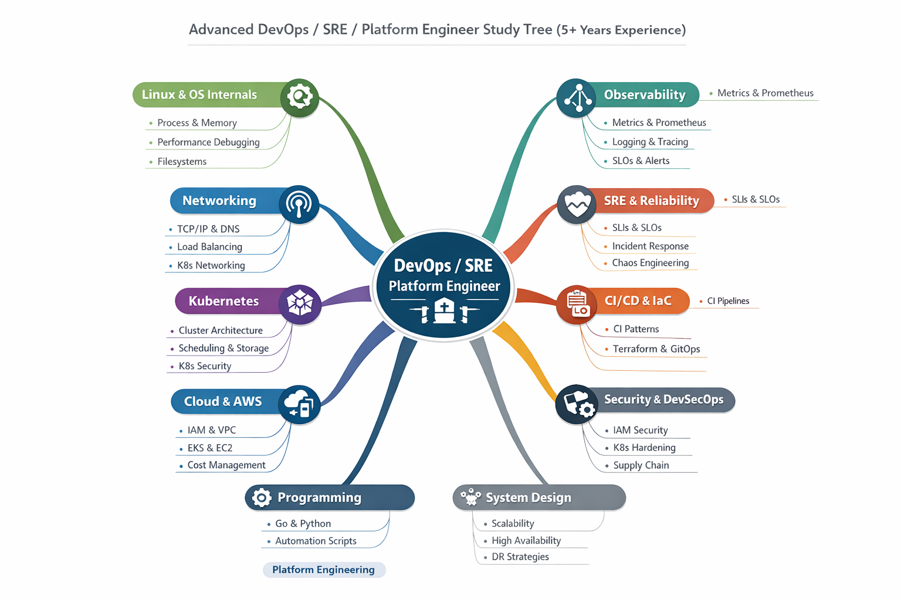

# Switch Prep — DevOps / SRE / Platform Engineering Notes

Interview preparation notes for DevOps, SRE, and Platform Engineering roles, with a
local web UI for browsing, searching, editing, and tracking coverage gaps.



---

## Contents

- [What's in here](#whats-in-here)
- [Quick start](#quick-start)
- [Using the UI](#using-the-ui)
- [Tech stack](#tech-stack)
- [Writing notes](#writing-notes)
- [How notes are scored](#how-notes-are-scored)
- [HTTP API](#http-api)
- [Repo workflow](#repo-workflow)
- [Full topic map](#full-topic-map)

---

## What's in here

147 Markdown notes plus runnable examples (YAML manifests, Go programs, shell scripts),
organised by topic:

| Directory | Notes | Covers |
|---|---:|---|
| [Programming/](Programming/) | 36 | Go, Python, Bash, DSA problems and language concepts |
| [Kubernetes/](Kubernetes/) | 34 | Architecture, workloads, components, manifests |
| [Linux & OS/](Linux%20%26%20OS/) | 14 | Commands, processes, filesystem, systemd, scenarios |
| [Networking/](Networking/) | 13 | Core protocols, load balancing, VPC, CNI |
| [Tools/](Tools/) | 12 | Observability and supporting tooling |
| [Terraform/](Terraform/) | 11 | Syntax, state, modules, providers |
| [Techs/](Techs/) | 9 | SRE practices and general technologies |
| [Docker/](Docker/) | 8 | Images, builds, per-language Dockerfiles |
| [AWS/](AWS/) | 5 | EC2, S3, CloudFront, CloudTrail, autoscaling |
| [ArgoCD/](ArgoCD/) | 1 | GitOps and continuous delivery |
| [InterView Questions/](InterView%20Questions/) | 1 | Company-specific question logs |

Supporting files: [AboutMe.md](AboutMe.md), [SwitchReasons.md](SwitchReasons.md), and
[HiringManagerln.txt](HiringManagerln.txt) hold personal interview material. The
[ui/](ui/) directory holds the notes browser and is excluded from the notes tree.

---

## Quick start

Read the notes straight from GitHub or your editor — they are plain Markdown, no build
step required.

```bash
git clone git@github.com:Devops-Interview-Prep/switch-prep.git
cd switch-prep
```

To get search, coverage stats, and in-browser editing, start the UI:

```bash
./ui/start.sh
```

Then open <http://localhost:5001>.

`start.sh` installs Flask if it is missing, then runs the server. To run it yourself
instead:

```bash
pip3 install -r ui/requirements.txt
python3 ui/app.py
```

**Requirements:** Python 3 and a modern browser. The frontend pulls `marked`,
`highlight.js`, and `mermaid` from a CDN, so first load needs network access.

> **Note:** the server binds `0.0.0.0:5001` and allows cross-origin requests, and
> `PUT /api/file` writes to your notes. Anyone on your network can edit notes while it
> runs. Change `host` in [ui/app.py](ui/app.py) to `127.0.0.1` to keep it local-only.

---

## Using the UI

Four views, switchable with `Cmd`/`Ctrl` + `1`–`4`:

| View | What it does |
|---|---|
| **Dashboard** | Completion percentage, average grade, and per-category progress |
| **Browse** | File tree with live Markdown preview, syntax highlighting, and Mermaid diagrams |
| **Analysis** | Weakest and strongest notes, empty files, and missing-topic gaps |
| **Roadmap** | A 10-phase study plan with checkboxes; progress is saved in your browser |

### Keyboard shortcuts

| Shortcut | Action |
|---|---|
| `Cmd/Ctrl` + `K` | Focus search |
| `Cmd/Ctrl` + `E` | Toggle edit mode on the open note |
| `Cmd/Ctrl` + `S` | Save the open note to disk |
| `Cmd/Ctrl` + `D` | Toggle the diagram panel |
| `Cmd/Ctrl` + `1`–`4` | Dashboard / Browse / Analysis / Roadmap |
| `Esc` | Close search results |

Edits save directly to the Markdown files on disk, so commit them like any other change.

### Gap analysis

The dashboard compares your notes against an expected-topics list per category —
`EXPECTED_TOPICS` in [ui/app.py](ui/app.py). Anything not mentioned anywhere in that
category's notes is reported as a gap. Edit that dictionary to change what counts as
complete coverage.

---

## Tech stack

**Notes**

- Markdown, with Mermaid diagrams in ` ```mermaid ` fences
- Runnable examples: YAML (Kubernetes/Terraform), Go, Python, Bash

**UI backend** — [ui/app.py](ui/app.py), a single ~420-line file

- Python 3 + Flask 3
- Reads the repo directly from disk; no database and no build step
- Path traversal is blocked by resolving every request against the repo root

**UI frontend** — [ui/static/index.html](ui/static/index.html), a single file, no bundler

- Vanilla HTML/CSS/JavaScript
- `marked` for Markdown, `highlight.js` for code, `mermaid` for diagrams (all via CDN)
- Roadmap progress persists in `localStorage`

**Topics documented in the notes:** Kubernetes, Docker, Terraform, AWS, ArgoCD,
Prometheus/Grafana, Linux, and Go/Python/Bash.

---

## Writing notes

Notes live in a topic directory, one file per subject — `Kubernetes/Components/Node/Node.md`,
with runnable manifests beside them (`node.yaml`). Keep the filename descriptive; it is
what shows up in the UI tree and search.

To score well and be genuinely useful in an interview, a note should have:

1. A short intro saying what the thing is and why it matters
2. `##` sections — four or more
3. Three or more code blocks with real commands, configs, or manifests
4. Concrete examples or scenarios
5. Interview questions actually asked on the topic
6. Trade-offs — comparisons, pros and cons, when *not* to use it
7. Optionally a ` ```mermaid ` diagram

Every note is also classified as **complete**, **incomplete** (under 200 characters or
fewer than 3 content lines), or **empty**.

---

## How notes are scored

The Analysis view grades each note out of 10 and lists what is missing. The rubric lives
in `score_note()` in [ui/app.py](ui/app.py):

| Criterion | Points | Full marks at |
|---|---:|---|
| Word count | 0–2 | 500+ words (1 pt at 200+) |
| Structure | 0–2 | 4+ `##` sections (1 pt at 2+) |
| Code examples | 0–2 | 3+ code blocks (1 pt at 1+) |
| Real-world examples | 0–1 | Mentions an example, scenario, or use case |
| Interview coverage | 0–1 | Mentions interviews or has 3+ questions |
| Trade-offs | 0–1 | Comparisons, pros/cons, or alternatives |
| Diagrams | 0–1 | Contains a Mermaid diagram |

Grades run `A+` at 10 down to `F` at 1 or below. The score is capped at 10, so the
diagram point is a bonus that can cover a miss elsewhere.

---

## HTTP API

The UI is a thin client over these endpoints, useful for scripting your own reports:

| Method | Endpoint | Purpose |
|---|---|---|
| `GET` | `/api/tree` | Full note tree with per-file status |
| `GET` | `/api/file?path=<rel>` | Note `content`, `status`, and its `quality` score |
| `PUT` | `/api/file?path=<rel>` | Write a note — `path` in the query string, JSON body `{"content": ...}` |
| `GET` | `/api/search?q=<term>` | Full-text search; needs 2+ characters, caps at 30 hits |
| `GET` | `/api/dashboard` | Stats, category breakdown, gaps, best and worst notes |

```bash
# Overall completion percentage
curl -s localhost:5001/api/dashboard | python3 -c 'import json,sys; print(json.load(sys.stdin)["stats"])'

# Find every note mentioning etcd
curl -s "localhost:5001/api/search?q=etcd" | python3 -m json.tool
```

Only `.md`, `.txt`, `.go`, `.py`, `.sh`, `.yaml`, `.yml`, and `.json` files are viewable.

---

## Repo workflow

Work happens directly on `main`.

```bash
git add -A
git commit -m "Add notes on <topic>"
git push origin main
```

Notes edited in the UI are written to disk immediately but are **not** committed for you —
run the above once you are done writing.

---

## Full topic map

The target curriculum. The UI's Roadmap view tracks a condensed 10-phase version of this:
Linux, Docker, Kubernetes, Terraform, AWS, CI/CD & GitOps, Observability & SRE,
Networking, Security, and Programming.

<details>
<summary>Expand the full tree</summary>

```text

DevOps / SRE / Platform Engineer
│
├── Linux & OS Internals
│   ├── Process Management
│   │   ├── fork / exec / threads
│   │   ├── Zombie & orphan processes
│   │   └── CPU scheduling (CFS, nice)
│   ├── Memory Management
│   │   ├── Virtual memory & paging
│   │   ├── NUMA
│   │   └── OOM killer
│   ├── Filesystems
│   │   ├── ext4 vs xfs
│   │   └── inode exhaustion
│   └── Performance Debugging
│       ├── top, htop, vmstat, iostat
│       ├── strace / ltrace
│       └── perf / eBPF basics
│
├── Networking
│   ├── Core Networking
|   |   |-- Models
│   │   ├── Protocols
│   │   ├── DNS (recursive, authoritative)
│   │   └── HTTP/1.1 vs HTTP/2 vs HTTP/3
│   ├── Load Balancing
│   │   ├── L4 vs L7
│   │   └── Algorithms (RR, least conn, hash)
│   ├── Cloud Networking
│   │   ├── VPC, Subnets
│   │   ├── Security Groups vs NACLs
│   │   └── NAT, IGW, TGW
│   └── Kubernetes Networking
│       ├── CNI (VPC CNI, Calico, Cilium)
│       ├── Service types
│       └── kube-proxy (iptables / IPVS)
│
├── Kubernetes
│   ├── Core Architecture
│   │   ├── API Server
│   │   ├── etcd (quorum, snapshots)
│   │   ├── Scheduler
│   │   └── Controller Manager
│   ├── Workloads
│   │   ├── Deployments
│   │   ├── StatefulSets
│   │   ├── DaemonSets
│   │   └── Jobs / CronJobs
│   ├── Scheduling & Autoscaling
│   │   ├── Requests & Limits
│   │   ├── QoS Classes
│   │   ├── HPA / VPA
│   │   └── Cluster Autoscaler / Karpenter
│   ├── Storage
│   │   ├── PV / PVC lifecycle
│   │   ├── CSI drivers
│   │   └── EBS / EFS / local volumes
│   ├── Security
│   │   ├── RBAC
│   │   ├── Service Accounts
│   │   ├── Pod Security Standards
│   │   └── Network Policies
│   └── Debugging
│       ├── CrashLoopBackOff
│       ├── Pending pods
│       └── Node NotReady
│
├── Observability
│   ├── Metrics
│   │   ├── Golden Signals
│   │   ├── RED / USE
│   │   ├── Prometheus internals (WAL, TSDB)
│   │   └── Cardinality management
│   ├── Logging
│   │   ├── Structured logging
│   │   ├── Fluent Bit / Promtail
│   │   └── Loki architecture
│   ├── Tracing
│   │   ├── OpenTelemetry
│   │   ├── Context propagation
│   │   └── Sampling strategies
│   └── Alerting
│       ├── Recording rules
│       ├── Burn rate alerts
│       └── Noise reduction
│
├── SRE & Reliability
│   ├── SRE Fundamentals
│   │   ├── SLIs / SLOs / SLAs
│   │   ├── Error budgets
│   │   └── Toil reduction
│   ├── Incident Management
│   │   ├── On-call practices
│   │   ├── Incident severity
│   │   └── Blameless postmortems
│   └── Failure Engineering
│       ├── Chaos engineering
│       ├── Game days
│       └── Cascading failure analysis
│
├── Cloud & AWS
│   ├── Identity & Security
│   │   ├── IAM deep dive
│   │   └── IRSA
│   ├── Compute
│   │   ├── EC2 lifecycle
│   │   ├── Auto Scaling Groups
│   │   └── Spot vs On-Demand
│   ├── Containers
│   │   ├── EKS internals
│   │   ├── ALB / NLB
│   │   └── Load Balancer Controller
│   ├── Storage & Data
│   │   ├── S3, EBS, EFS
│   │   ├── RDS vs DynamoDB
│   │   └── Backups & DR
│   └── Cost & Reliability
│       ├── Cost optimization
│       ├── Multi-AZ vs Multi-region
│       └── RTO / RPO
│
├── CI/CD & Infrastructure as Code
│   ├── CI Pipelines
│   │   ├── GitHub Actions / GitLab CI
│   │   ├── Secure builds
│   │   └── Artifact management
│   ├── CD Strategies
│   │   ├── Blue-Green
│   │   ├── Canary
│   │   └── Rolling updates
│   ├── GitOps
│   │   ├── ArgoCD / Flux
│   │   └── Drift detection
│   └── Terraform
│       ├── State management
│       ├── Modules
│       └── Policy as Code
│
├── Security & DevSecOps
│   ├── Cloud Security
│   │   ├── Least privilege IAM
│   │   └── Network segmentation
│   ├── Kubernetes Security
│   │   ├── Pod hardening
│   │   └── Admission controllers
│   └── Supply Chain Security
│       ├── Image scanning
│       ├── SBOM
│       └── Image signing
│
├── Programming & Automation
│   ├── Go
│   │   ├── Controllers & operators
│   │   └── Exporters & CLIs
│   ├── Python
│   │   └── Automation & tooling
│   └── Bash
│       └── Advanced scripting
│
├── System Design (SRE Focus)
│   ├── Scalability
│   │   ├── Horizontal vs Vertical
│   │   └── Backpressure
│   ├── High Availability
│   │   ├── Redundancy
│   │   └── Failover
│   └── Disaster Recovery
│       ├── Backup strategies
│       └── Multi-region design
│
└── Platform Engineering
    ├── Platform Concepts
    │   ├── Internal developer platforms
    │   ├── Golden paths
    │   └── Self-service infra
    ├── Tooling
    │   ├── Backstage
    │   ├── Crossplane
    │   └── Internal APIs
    └── Governance
        ├── Guardrails
        └── Developer experience (DX)
```

</details>
