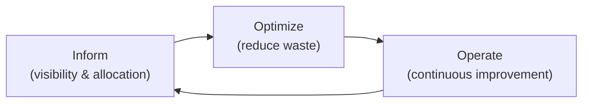
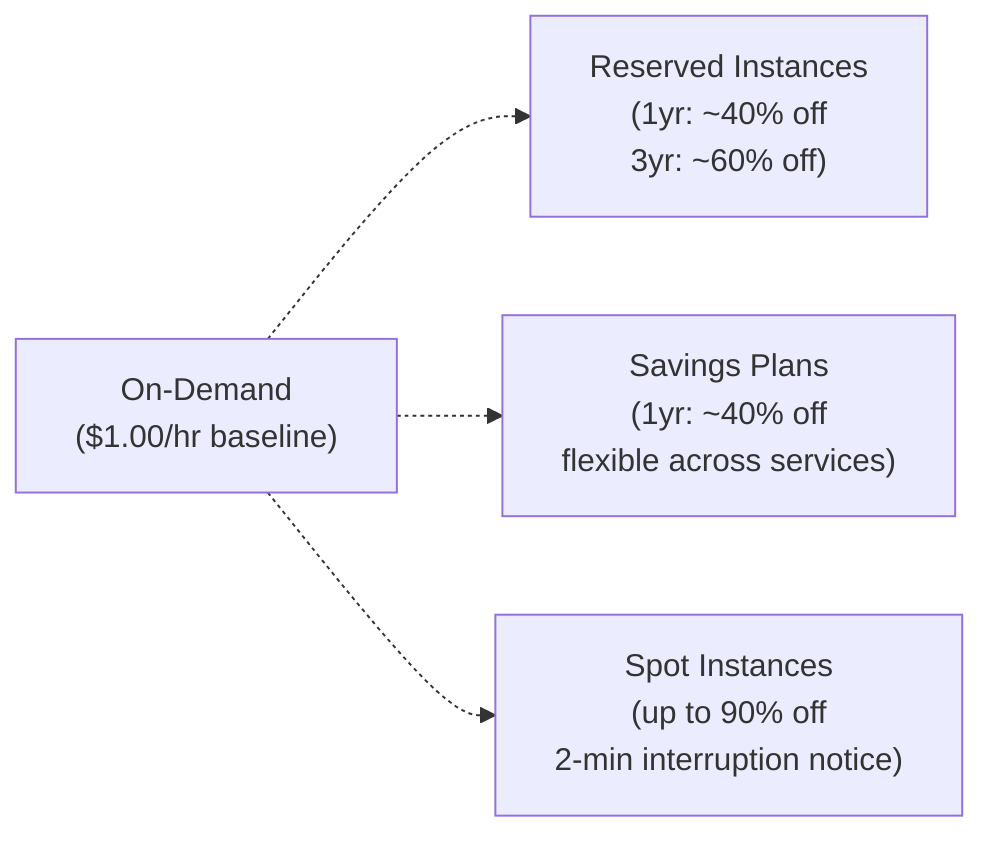

# Cloud Cost Optimization

> The discipline of reducing cloud spend without sacrificing reliability, performance, or developer velocity. FinOps: Cloud Financial Management — shared responsibility between engineering, finance, and leadership.

## FinOps Framework



**Three phases:**
- **Inform**: Tagging, cost allocation, dashboards — know where money goes
- **Optimize**: Right-sizing, reservations, spot instances, architecture changes
- **Operate**: Budgets, anomaly detection, showback/chargeback to teams

## AWS Cost Levers

### 1. Compute Pricing Models



| Model | Discount | Commitment | Interruption risk | Use case |
|-------|----------|-----------|-------------------|---------|
| **On-Demand** | 0% | None | None | Dev/test, short bursts |
| **Reserved Instances** | 40-60% | 1-3 years | None | Steady-state baseline |
| **Savings Plans** | ~40% | 1-3 years ($/hr) | None | EC2 + Fargate + Lambda |
| **Spot Instances** | Up to 90% | None | Yes (2-min notice) | Batch, stateless, K8s |

### 2. Spot Instances — Kubernetes

```yaml
# Karpenter — intelligent spot provisioner for EKS
apiVersion: karpenter.sh/v1beta1
kind: NodePool
metadata:
  name: spot-pool
spec:
  template:
    spec:
      requirements:
        - key: karpenter.sh/capacity-type
          operator: In
          values: [spot, on-demand]   # prefer spot, fallback to on-demand
        - key: node.kubernetes.io/instance-type
          operator: In
          values: [m5.large, m5a.large, m4.large, m6i.large]  # diversify instance types
      nodeClassRef:
        apiVersion: karpenter.k8s.aws/v1beta1
        kind: EC2NodeClass
        name: default
  disruption:
    consolidationPolicy: WhenUnderutilized   # bin-pack and scale down
    consolidateAfter: 30s
```

**Spot best practices:**
- Use multiple instance types (diversification reduces interruption rate)
- Use Karpenter instead of Cluster Autoscaler for spot (faster, smarter)
- Design stateless pods with graceful shutdown (60s termination grace period)
- Use `Disruption Budgets (PDB)` to control how many pods can be interrupted

### 3. Right-Sizing

```bash
# AWS Compute Optimizer — AI-powered right-sizing recommendations
aws compute-optimizer get-ec2-instance-recommendations \
  --instance-arns arn:aws:ec2:us-east-1:123:instance/i-abc

# Goldilocks — K8s VPA recommendations in a nice UI
helm install goldilocks fairwinds-stable/goldilocks -n goldilocks
kubectl label namespace production goldilocks.fairwinds.com/enabled=true
# Visit Goldilocks UI to see VPA recommendations
```

**Right-sizing rule of thumb:**
- CPU < 30% average utilization → downsize
- Memory < 50% average utilization → downsize  
- Use VPA for K8s workloads (right-size requests automatically)

### 4. Storage Cost Reduction

```bash
# S3 Intelligent-Tiering (auto-moves objects between tiers)
aws s3api put-bucket-intelligent-tiering-configuration \
  --bucket my-bucket \
  --id archive-old-objects \
  --intelligent-tiering-configuration '{
    "Id": "archive-old-objects",
    "Status": "Enabled",
    "Tierings": [
      {"Days": 90, "AccessTier": "ARCHIVE_ACCESS"},
      {"Days": 180, "AccessTier": "DEEP_ARCHIVE_ACCESS"}
    ]
  }'

# EBS: gp2 → gp3 migration (same IOPS, 20% cheaper)
aws ec2 modify-volume --volume-id vol-abc123 --volume-type gp3

# Delete unattached EBS volumes
aws ec2 describe-volumes \
  --filters Name=status,Values=available \
  --query 'Volumes[*].VolumeId' \
  --output text
```

**S3 Storage Classes:**
| Tier | Use | Monthly cost |
|------|-----|-------------|
| Standard | Frequent access | $0.023/GB |
| Intelligent-Tiering | Unknown patterns | $0.023/GB + $0.0025/1000 obj |
| Standard-IA | Infrequent, retrieval < 1/mo | $0.0125/GB |
| Glacier Instant | Archive, millisec retrieval | $0.004/GB |
| Glacier Deep Archive | Cold archive, 12hr retrieval | $0.00099/GB |

### 5. Kubernetes Cost — Kubecost

```bash
# Install Kubecost
helm repo add kubecost https://kubecost.github.io/cost-analyzer/
helm install kubecost kubecost/cost-analyzer \
  -n kubecost --create-namespace \
  --set kubecostToken="your-token"

# Access UI at :9090
# Shows: cost by namespace, deployment, label, team
```

**Kubecost key views:**
- Cost by namespace (team chargeback)
- Cost allocation by label (`team=platform`, `env=prod`)
- Savings recommendations (idle capacity, right-sizing)
- Network egress costs (inter-AZ, cross-region)

### 6. Eliminate Waste

```bash
# Find idle/underutilized Load Balancers
aws elbv2 describe-load-balancers --query 'LoadBalancers[*].{Name:LoadBalancerName,DNS:DNSName}'

# Find unattached Elastic IPs (billed when not attached)
aws ec2 describe-addresses --query 'Addresses[?InstanceId==null]'

# Find snapshots older than 90 days
aws ec2 describe-snapshots --owner-ids self \
  --query 'Snapshots[?StartTime<=`2026-03-01`].[SnapshotId,StartTime,VolumeSize]'

# RDS stopped instances (still billed for storage)
aws rds describe-db-instances \
  --query 'DBInstances[?DBInstanceStatus==`stopped`].[DBInstanceIdentifier]'
```

**Waste categories:**
- Unattached EBS volumes (deleted instances left volumes behind)
- Idle Elastic IPs ($0.005/hr when not associated)
- Orphaned snapshots (no corresponding volume)
- Unused Load Balancers
- Stopped RDS instances (still paying for storage + standby)
- Old ECR images (storage costs add up)

## Tagging Strategy — Cost Allocation

```bash
# Enforce tagging with AWS Config rule
aws configservice put-config-rule \
  --config-rule '{
    "ConfigRuleName": "required-tags",
    "Source": {
      "Owner": "AWS",
      "SourceIdentifier": "REQUIRED_TAGS"
    },
    "InputParameters": "{\"tag1Key\":\"team\",\"tag2Key\":\"env\",\"tag3Key\":\"project\"}"
  }'
```

**Required tags for cost allocation:**
- `team` — which team owns this resource
- `env` — production / staging / dev
- `project` — which product/feature
- `cost-center` — finance department code

## Budgets and Anomaly Detection

```bash
# AWS Budget with alert
aws budgets create-budget \
  --account-id 123456789 \
  --budget '{
    "BudgetName": "production-monthly",
    "BudgetLimit": {"Amount": "5000", "Unit": "USD"},
    "TimeUnit": "MONTHLY",
    "BudgetType": "COST",
    "CostFilters": {"TagKeyValue": ["team$platform"]}
  }' \
  --notifications-with-subscribers '[{
    "Notification": {
      "NotificationType": "ACTUAL",
      "ComparisonOperator": "GREATER_THAN",
      "Threshold": 80
    },
    "Subscribers": [{"SubscriptionType": "EMAIL", "Address": "team@company.com"}]
  }]'

# Enable anomaly detection
aws ce create-anomaly-detector \
  --anomaly-detector '{
    "Name": "service-anomaly-detector",
    "AnomalyDetectorType": "DIMENSIONAL",
    "DimensionalValue": "SERVICE"
  }'
```

## Cost Optimization Checklist

| Area | Action | Potential saving |
|------|--------|-----------------|
| **EC2** | Reserved Instances or Savings Plans for baseline | 40-60% |
| **EC2** | Spot for batch/K8s workers | Up to 90% |
| **RDS** | Reserved Instances | 40-50% |
| **RDS** | Aurora Serverless v2 for dev/test | 70-90% |
| **S3** | Intelligent-Tiering or lifecycle policies | 40-80% on old objects |
| **EBS** | gp2 → gp3 migration | 20% |
| **EBS** | Delete unattached volumes | 100% of that cost |
| **K8s** | Right-size pods with VPA | 20-40% |
| **K8s** | Karpenter consolidation | 10-30% |
| **Network** | Same-AZ traffic (use AZ-local endpoints) | $0.01/GB saved |
| **CloudFront** | Cache API responses at edge | Reduce origin compute |
| **Lambda** | Compute Optimizer right-sizing | 20-40% |

## Common Interview Questions

**Q: Reserved Instances vs Savings Plans — which to choose?**
Savings Plans are more flexible: they apply to EC2 any region/size/OS, plus Fargate and Lambda (Compute Savings Plans). Reserved Instances lock to specific region, instance family, OS. Choose Savings Plans for most workloads — they give similar discounts with much more flexibility. Only choose RIs when you have very specific instance requirements or need RDS/ElastiCache reservations (only available as RIs).

**Q: How do you use Spot instances safely in Kubernetes?**
Three rules: (1) Diversify — specify multiple instance types in Karpenter/ASG so interruptions in one type don't take all nodes. (2) Stateless pods — store state in S3/Redis/RDS, not on the pod. (3) Graceful shutdown — configure `terminationGracePeriodSeconds: 60`, listen for SIGTERM, drain in-flight requests. Use PodDisruptionBudgets so interruptions don't take more pods than your availability budget allows.

**Q: What is showback vs chargeback in FinOps?**
Showback: show teams what they're spending but don't transfer money (reporting only). Chargeback: actual cost transfers in internal accounting — teams get charged for their cloud usage. Most companies start with showback (visibility → behavior change), then move to chargeback once allocation is accurate. Kubecost and AWS Cost Allocation Tags enable both.

**Q: How do you find and eliminate cloud waste?**
Four categories: (1) Idle resources — Compute Optimizer flags instances < 5% CPU utilization, unattached EBS volumes, unused EIPs. (2) Over-provisioned — right-size with Compute Optimizer recommendations. (3) Wrong pricing model — long-running on-demand should be Reserved/Savings Plans. (4) Forgotten resources — orphaned snapshots, stopped RDS instances, old AMIs. Automate with Lambda + CloudWatch Events + Config Rules to tag and notify teams.
