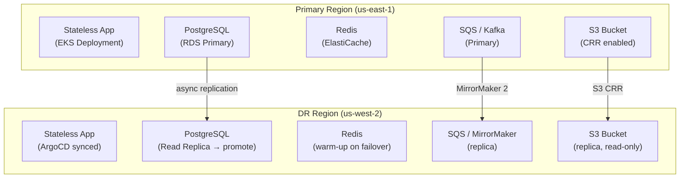

- Application DR focuses on ensuring your specific applications can recover from a disaster.

- Stateless Applications: 
  - These are the easiest. 
  - Simply redeploy them in the recovery region using your CI/CD pipelines and IaC.

- Stateful Applications:
  - Database Replication: 
    - The primary mechanism. 
    - Ensure your database (internal or external) has a robust cross-region replication strategy.

- Shared Storage: 
  - If your application relies on shared storage (e.g., NFS, S3), ensure that data is replicated or accessible from the recovery region.

- Caching: 
  - Consider how caches are rebuilt or warm-up in the recovery region.

- Messaging Queues: 
  - Replicate or ensure durability of message queues (e.g., Kafka MirrorMaker, SQS Cross-Region Replication).

- Configuration Management: 
  - Store application configurations in a centralized, replicated system (e.g., AWS Systems Manager Parameter Store, HashiCorp Consul).

- Dependencies: 
  - Identify and ensure all external dependencies (APIs, third-party services) are either available in the recovery region or have their own DR plans.

---

## Application DR Architecture



## Stateless App DR — Redeploy via GitOps

Stateless apps have no local state — recovery is just redeployment:

```yaml
# ArgoCD ApplicationSet — deploy to both regions
apiVersion: argoproj.io/v1alpha1
kind: ApplicationSet
metadata:
  name: my-app
spec:
  generators:
    - list:
        elements:
          - cluster: primary-us-east-1
            url: https://primary-eks-api
          - cluster: dr-us-west-2
            url: https://dr-eks-api
  template:
    metadata:
      name: 'my-app-{{cluster}}'
    spec:
      source:
        repoURL: https://github.com/org/infra
        path: apps/my-app
      destination:
        server: '{{url}}'
        namespace: production
      syncPolicy:
        automated:
          prune: true
          selfHeal: true
```

**RTO for stateless:** 5-15 minutes (GitOps sync + pod startup). **RPO: 0** (no state to lose).

## Database DR — RDS / PostgreSQL

```bash
# Create read replica in DR region
aws rds create-db-instance-read-replica \
  --db-instance-identifier mydb-dr \
  --source-db-instance-identifier mydb-primary \
  --db-instance-class db.r6g.xlarge \
  --source-region us-east-1 \
  --region us-west-2

# Promote read replica to standalone (during failover)
aws rds promote-read-replica \
  --db-instance-identifier mydb-dr \
  --region us-west-2

# Update app connection string to DR endpoint
aws ssm put-parameter \
  --name "/app/db_url" \
  --value "postgresql://mydb-dr.us-west-2.rds.amazonaws.com:5432/mydb" \
  --overwrite --region us-west-2
```

## Kafka DR — MirrorMaker 2

```yaml
# MirrorMaker 2 — mirrors primary Kafka to DR Kafka
apiVersion: kafka.strimzi.io/v1beta2
kind: KafkaMirrorMaker2
metadata:
  name: mm2-primary-to-dr
spec:
  replicas: 3
  connectCluster: "dr-cluster"
  clusters:
    - alias: "primary"
      bootstrapServers: primary-kafka.us-east-1.example.com:9092
    - alias: "dr"
      bootstrapServers: dr-kafka.us-west-2.example.com:9092
  mirrors:
    - sourceCluster: "primary"
      targetCluster: "dr"
      sourceConnector:
        config:
          replication.factor: 3
          replication.policy.class: "io.strimzi.kafka.crd.mirror.IdentityReplicationPolicy"
      topicsPattern: ".*"
      groupsPattern: ".*"   # mirrors consumer group offsets
```

On failover: consumers switch to DR Kafka. Consumer group offsets are mirrored — no full replay needed.

## S3 — Cross-Region Replication (CRR)

```bash
aws s3api put-bucket-replication \
  --bucket my-bucket-primary \
  --replication-configuration '{
    "Role": "arn:aws:iam::123:role/s3-replication-role",
    "Rules": [{
      "Status": "Enabled",
      "Filter": {},
      "Destination": {
        "Bucket": "arn:aws:s3:::my-bucket-dr",
        "ReplicationTime": {"Status": "Enabled", "Time": {"Minutes": 15}},
        "Metrics": {"Status": "Enabled", "EventThreshold": {"Minutes": 15}}
      }
    }]
  }'
# S3 RTC: 99.99% of objects replicated within 15 min → RPO ≤ 15 min
```

## ElastiCache — Global Datastore

```bash
# Create global Redis replication group
aws elasticache create-global-replication-group \
  --global-replication-group-id-suffix my-global-cache \
  --primary-replication-group-id my-cache-primary

# Add DR region as secondary
aws elasticache create-replication-group \
  --replication-group-id my-cache-dr \
  --global-replication-group-id global:my-global-cache-xxxx \
  --region us-west-2
```

Cache warm-up strategy on cold start: accept 10-20% performance degradation, pre-warm from DB, use CDN as outer cache layer.

## Application DR RTO/RPO Summary

| Component | RPO | RTO | Strategy |
|-----------|-----|-----|---------|
| Stateless app | 0 | 5-15 min | GitOps redeploy |
| RDS (read replica) | 1-30 sec | 10-20 min | Promote replica |
| Aurora Global | < 1 sec | < 1 min | Managed failover |
| S3 (CRR + RTC) | ≤ 15 min | Immediate | Pre-exist DR bucket |
| Kafka (MM2) | seconds | 5 min | Consumer switch |
| Redis (Global DS) | seconds | 2 min | Global failover |
| Config (SSM) | Real-time | < 1 min | Regional SSM |

## Common Interview Questions

**Q: How do you handle stateful app DR differently from stateless?**
Stateless: just redeploy via GitOps + IaC — RTO 5-15 min, RPO 0. Stateful: plan each layer separately. DB: read replica promotion (RPO = replication lag, ~1-30s). Cache: accept cold cache + warm from DB. Kafka: MirrorMaker 2 mirrors topics + consumer offsets. S3: CRR with RTC for 15-min RPO. The key is testing each layer in GameDays.

**Q: What's the RPO for Kafka cross-region replication?**
With MirrorMaker 2: RPO = consumer offset lag at failure time. MM2 mirrors offsets asynchronously — some in-flight messages may be lost. Mitigation: use idempotent consumers (at-least-once delivery, handle replays). For strict RPO=0: use synchronous replication (kills throughput). Most orgs accept RPO of seconds with idempotent consumers.

**Q: SQS doesn't support cross-region replication natively — how do you handle it?**
Options: (1) Lambda fan-out: trigger Lambda on SQS message → forward to DR region SQS queue. (2) SNS + cross-region SQS subscriptions: publish to SNS → SNS delivers to SQS queues in both regions. (3) EventBridge global endpoints: route events to multiple regions. Best pattern for DR: use EventBridge global endpoint as the message bus — it handles multi-region delivery with automatic failover.
