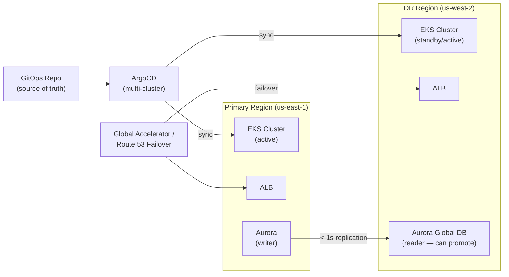

# EKS DR (Amazon Elastic Kubernetes Service Disaster Recovery)

- DR for EKS involves several layers:
  - Cluster Configuration:
    - IaC: 
      - Define your EKS cluster, node groups, and Kubernetes resources (deployments, services, configmaps, secrets) using IaC (e.g., Terraform, Helm charts). 
      - This allows you to quickly provision a new cluster in another region.

  - Backup etcd: 
    - While AWS manages the EKS control plane etcd, backing up your Kubernetes resource definitions (YAML files) is crucial. 
    - Tools like Velero can back up and restore Kubernetes objects and persistent volumes.

  - Application Data:
    - Persistent Volumes (PVs): 
      - If your applications use Persistent Volumes, you need a strategy to replicate or restore that data.

    - CSI Drivers: 
      - Use CSI (Container Storage Interface) drivers that support cross-region snapshots and replication (e.g., for EBS, EFS).

  - Database DR: 
    - For stateful applications, external databases (RDS, DynamoDB) should have their own DR strategy (see RDS DR below).

  - Stateless Applications: 
    - Much easier to recover; simply redeploy them from your IaC.

  - Networking:
    - Ensure your recovery EKS cluster can connect to necessary services (databases, external APIs).
    - Update DNS records to point to the new load balancer/Ingress controller in the recovery region.

  - Strategies:

    - Pilot Light: 
      - Stand up a minimal EKS cluster in the DR region with core services, and scale up/deploy additional applications during an incident.

    - Warm Standby: 
      - Maintain a scaled-down but functional EKS cluster with all applications deployed.

    - Active-Active: 
      - Run two EKS clusters in different regions, potentially using a global load balancer (e.g., AWS Global Accelerator) and multi-cluster Ingress solutions. 
      - This is complex for stateful applications.

---

## EKS DR Architecture



## Velero — K8s Backup & Restore

```bash
# Install Velero with AWS S3 backend
velero install \
  --provider aws \
  --plugins velero/velero-plugin-for-aws:v1.8.0 \
  --bucket velero-backups-us-east-1 \
  --secret-file ./credentials-velero \
  --backup-location-config region=us-east-1 \
  --snapshot-location-config region=us-east-1

# Backup entire namespace
velero backup create production-backup \
  --include-namespaces production \
  --ttl 720h    # 30 days retention

# Backup with PVC snapshots
velero backup create with-pvcs \
  --include-namespaces production \
  --snapshot-volumes=true

# Scheduled backup (daily at midnight)
velero schedule create daily-backup \
  --schedule="0 0 * * *" \
  --include-namespaces production,monitoring \
  --ttl 168h    # 7 days

# Restore into DR cluster
velero restore create --from-backup production-backup \
  --include-namespaces production

# Check status
velero backup describe production-backup
velero restore describe production-backup-20260616000000
```

## Multi-Cluster GitOps with ArgoCD

```yaml
# ArgoCD ApplicationSet — deploy to both clusters
apiVersion: argoproj.io/v1alpha1
kind: ApplicationSet
metadata:
  name: my-app-multicluster
spec:
  generators:
    - list:
        elements:
          - cluster: primary
            url: https://primary-eks.example.com
          - cluster: dr
            url: https://dr-eks.example.com
  template:
    metadata:
      name: "my-app-{{cluster}}"
    spec:
      project: default
      source:
        repoURL: https://github.com/org/gitops
        targetRevision: HEAD
        path: apps/my-app
      destination:
        server: "{{url}}"
        namespace: production
      syncPolicy:
        automated:
          prune: true
          selfHeal: true
```

## EKS DR Runbook — Failover Steps

```bash
# 1. Confirm primary cluster is unreachable
kubectl cluster-info --kubeconfig primary-kubeconfig.yaml

# 2. Promote Aurora Global DB secondary to writer
aws rds failover-global-cluster \
  --global-cluster-identifier my-global-cluster \
  --target-db-cluster-identifier arn:aws:rds:us-west-2:123:cluster:my-aurora-dr

# 3. Update application config to point to DR DB endpoint
kubectl set env deployment/my-app \
  DB_HOST=my-aurora-dr.cluster-xyz.us-west-2.rds.amazonaws.com \
  --kubeconfig dr-kubeconfig.yaml

# 4. Verify DR cluster is serving traffic
kubectl get pods -n production --kubeconfig dr-kubeconfig.yaml
kubectl run test --rm -it --image=curlimages/curl -- \
  curl http://my-svc.production.svc.cluster.local/health

# 5. Update Route 53 / Global Accelerator to route to DR
aws globalaccelerator update-endpoint-group \
  --endpoint-group-arn arn:aws:globalaccelerator::123:accelerator/xxx/listener/xxx/endpoint-group/xxx \
  --traffic-dial-percentage 0   # disable primary

# 6. Monitor error rates (should normalize within minutes)
```

## Common Interview Questions

**Q: How do you backup and restore Kubernetes workloads for DR?**
Velero is the standard tool. It backs up: all K8s API objects (Deployments, Services, ConfigMaps, Secrets via snapshot) and optionally PVC snapshots via CSI. Store backups in S3 with cross-region replication. For DR restore: install Velero in the DR cluster pointing to the same S3 bucket, run `velero restore create`. The key gap: application state in databases must be replicated separately (Aurora Global Database, DynamoDB Global Tables).

**Q: What's your EKS active-active multi-region strategy?**
Both clusters run the same workloads via GitOps (ArgoCD ApplicationSet targeting both cluster contexts). Traffic distributed by Global Accelerator or Route 53 latency routing. Stateless workloads: trivial — both clusters serve independently. Stateful workloads: Aurora Global Database with a single writer in primary (all writes go to primary, reads can be local). If primary fails: promote secondary Aurora cluster, update app config, Global Accelerator continues serving from DR cluster.

**Q: RTO/RPO for EKS warm standby?**
RPO: depends on database replication lag — Aurora Global Database gives < 1 second, RDS cross-region read replicas give 1-5 minutes. RTO: EKS warm standby keeps all pods running at reduced capacity — failover is updating DNS/Global Accelerator (minutes) + scaling up pod replicas + promoting the database (< 1 minute for Aurora Global). Total RTO: 5-15 minutes. Cold standby (only infra via IaC): 30-60 minutes.


