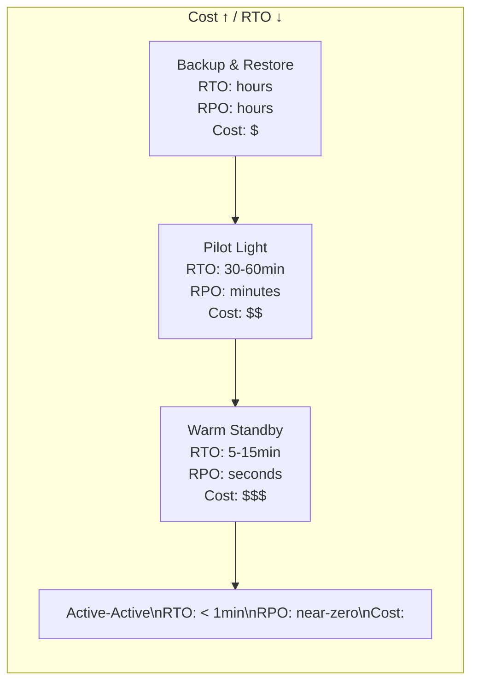

# Introduction
- Multiregion DR is a critical strategy for ensuring business continuity and high availability by distributing your applications and data across multiple geographical regions.
- This protects against region-wide outages caused by natural disasters, major network failures, or other catastrophic events.

# Approaches to Multiregion DR

- The choice of DR approach depends on your Recovery Time Objective (RTO - how quickly you need to recover)
- Recovery Point Objective (RPO - how much data loss you can tolerate)
- cost considerations.

**1. Backup and Restore:**

- Description: 
  - This is the simplest and most cost-effective approach. 
  - Data is regularly backed up to a different region. 
  - In case of a disaster, a new environment is provisioned in the recovery region, and data is restored from the backups.

- RTO/RPO: High RTO (hours to days), High RPO (last backup point).

- Pros: Low cost, relatively simple to implement for non-critical systems.

- Cons: Significant downtime, potential for data loss since the last backup.

**2. Pilot Light:**

- Description: 
  - A minimal, scaled-down version of your environment (the "pilot light") is continuously running in the DR region. 
  - This typically includes core databases and essential services. 
  - In a disaster, the pilot light environment is scaled up to full production capacity, and traffic is redirected.

- RTO/RPO: Moderate RTO (minutes to hours), Low RPO (depending on data replication).

- Pros: Lower cost than active-active, faster recovery than backup/restore.

- Cons: Requires some infrastructure to be continuously running, involves a failover process.

**3. Warm Standby:**

- Description: 
  - A fully functional but scaled-down version of your production environment is running in the DR region. 
  - This includes all necessary application components and databases, but with fewer instances or smaller instance types.

- RTO/RPO: Low RTO (minutes), Low RPO (minimal data loss).

- Pros: Faster recovery than pilot light, less data loss.

- Cons: Higher cost than pilot light due to more running resources.

**4. Multi-Active (Active-Active / Hot Standby):**

- Description: 
  - Your application is fully deployed and active in multiple regions simultaneously, serving traffic. 
  - Data replication is continuous and bidirectional. 
  - Users are typically routed to the closest healthy region.

- RTO/RPO: Near-zero RTO, Near-zero RPO.

- Pros: Highest availability, virtually no downtime, excellent for global applications.

- Cons: Most complex and expensive to implement, requires sophisticated data synchronization and conflict resolution.

# Implementations of Multiregion DR

- Implementation details vary based on the cloud provider (AWS, Azure, GCP) and specific services. Here's a general overview:
  - Network Connectivity: 
    - Establishing secure and high-bandwidth connectivity between regions (e.g., VPC Peering, Transit Gateway in AWS).

  - Data Replication: 
    - Crucial for all approaches except basic backup/restore. This could involve:
      - Database Replication: 
        - Native database replication features (e.g., AWS RDS Multi-AZ, Cross-Region Read Replicas, Aurora Global Database).
      - Storage Replication: 
        - Object storage replication (e.g., S3 Cross-Region Replication), block storage snapshots and replication.

  - Application Deployment: 
    - Using Infrastructure as Code (IaC) tools like Terraform or CloudFormation to ensure consistent deployments across regions.

  - DNS Failover: 
    - Using services like AWS Route 53, Azure DNS, or Google Cloud DNS to automatically or manually redirect traffic to the healthy region during an outage. 
    - This often involves health checks.

  - Monitoring and Alerting: 
    - Setting up robust monitoring to detect outages and trigger DR procedures.

  - Automated Failover/Failback: 
    - Scripting or using cloud-native services to automate the failover process to minimize human intervention and error. 
    - Failback (returning to the primary region) is also important to consider.

---

## DR Strategy Comparison



| Strategy | RTO | RPO | Cost | Implementation |
|----------|-----|-----|------|----------------|
| **Backup & Restore** | Hours-Days | Hours | $ | S3 backups, restore from scratch |
| **Pilot Light** | 30-60 min | Minutes | $$ | DB replicated, app off, infra as code |
| **Warm Standby** | 5-15 min | Seconds | $$$ | DB replicated, scaled-down app running |
| **Active-Active** | < 1 min | Near-zero | $$$$ | Full capacity in both regions, live traffic |

## RTO & RPO — Definitions

```
RPO (Recovery Point Objective):
  "How much data can we afford to lose?"
  → Maximum acceptable age of recovery point
  → Drives backup/replication frequency
  → RPO = 1 hour means: worst case, we lose 1 hour of data

RTO (Recovery Time Objective):
  "How long can we be down?"
  → Maximum acceptable downtime
  → Drives infrastructure pre-provisioning
  → RTO = 30 min means: must be serving traffic within 30 min of outage
```

**Set RTO/RPO per service tier:**

| Tier | Services | RPO | RTO |
|------|---------|-----|-----|
| **Critical** | Payment, Auth | < 1 min | < 5 min |
| **High** | Core product features | < 5 min | < 30 min |
| **Medium** | Analytics, reporting | < 1 hour | < 4 hours |
| **Low** | Internal tools, batch | < 24 hours | < 24 hours |

## AWS DR Mechanisms by Service

| Service | Mechanism | RPO achieved |
|---------|----------|-------------|
| **Aurora** | Global Database | < 1 second |
| **RDS** | Cross-region Read Replica | 1-5 minutes |
| **DynamoDB** | Global Tables | < 1 second |
| **S3** | Cross-Region Replication | Minutes |
| **EKS** | Multi-cluster + ArgoCD | Minutes (re-deploy) |
| **EC2** | AMI snapshots + IaC | Hours |

## DR Testing — Chaos Engineering

DR plans are useless if untested:

```bash
# Quarterly DR test — simulate region failure
# 1. Disable traffic to primary region (Route 53 manual failover)
aws route53 change-resource-record-sets \
  --hosted-zone-id ZONE_ID \
  --change-batch '{
    "Changes": [{
      "Action": "UPSERT",
      "ResourceRecordSet": {
        "Name": "api.company.com",
        "Type": "A",
        "Failover": "PRIMARY",
        "HealthCheckId": "disable-this-check"
      }
    }]
  }'

# 2. Verify DR region handles traffic (run smoke tests)
curl https://api.company.com/health | jq .region

# 3. Measure actual RTO vs target
# 4. Document gaps and remediation
# 5. Failback to primary
```

**GameDay checklist:**
- [ ] Runbook reviewed and up to date
- [ ] All team members briefed on roles
- [ ] Monitoring dashboards ready (DR region metrics)
- [ ] Business stakeholders notified of test window
- [ ] Success criteria defined (RTO/RPO targets)
- [ ] Rollback plan if test goes wrong

## Common Interview Questions

**Q: Pilot Light vs Warm Standby — key difference?**
Pilot Light: only the database is running in the DR region (the "pilot light"). Application servers are off — must be provisioned when DR activates (from AMI or IaC), which takes 15-60 min. Warm Standby: the application is also running in DR region but at reduced capacity (fewer/smaller instances). When disaster strikes, scale up existing instances — faster RTO (5-15 min). Choose based on RTO tolerance vs cost.

**Q: How do you achieve near-zero RPO across regions?**
Use services with synchronous or near-synchronous cross-region replication: Aurora Global Database (< 1 second replication lag), DynamoDB Global Tables (< 1 second), S3 Cross-Region Replication with Same-Region Replication disabled. For compute, use Active-Active with Route 53 latency routing — both regions serve live traffic, so no failover needed.

**Q: RTO vs RPO — if you could only optimize one, which?**
Depends on the service. For data-heavy services (financial transactions, user data), RPO is more critical — data loss is often unrecoverable and legally significant. For user-facing services (e-commerce, content), RTO matters more — downtime directly impacts revenue. Typical priority: financial services → RPO first; consumer-facing → RTO first.


