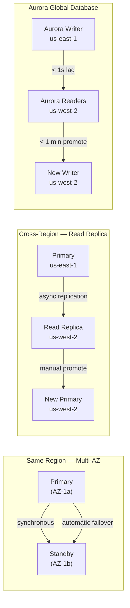

# RDS DR (Amazon Relational Database Service Disaster Recovery)

- AWS RDS offers several powerful features for DR:

- **Multi-AZ Deployments:**
  - Description: 
    - Synchronous replication of your database to a standby instance in a different Availability Zone (AZ) within the same region.

  - Purpose: Primarily for High Availability (HA) within a region, not cross-region DR.

  - Failover: Automatic failover in case of an AZ outage or primary instance failure.

  - RPO/RTO: Near-zero RPO, very low RTO (seconds to minutes).

- **Cross-Region Read Replicas:**

  - Description: 
    - Asynchronous replication of your database to one or more read replica instances in a different AWS region.

  - Purpose: DR and read scaling.

  - Failover: Manual promotion of a read replica to a standalone DB instance in the DR region. 
  - This becomes your new primary.

  - RPO/RTO: Low RPO (data loss depends on replication lag), moderate RTO (manual promotion and DNS updates).

- **Aurora Global Database:**

  - Description: 
    - A single Aurora database that spans multiple AWS regions. 
    - It uses dedicated replication infrastructure for extremely fast and low-latency replication.

  - Purpose: High availability and disaster recovery for Aurora.

  - Failover: Very fast (often less than a minute) RTO with minimal data loss for planned or unplanned failovers to a secondary region.

  - RPO/RTO: Near-zero RPO, very low RTO (typically less than a minute).

  - Pros: Best-in-class for RTO/RPO for Aurora, simplified management.

  - Cons: Only for Aurora, higher cost.

- **Snapshots and Backups:**

- Description: 
  - RDS automatically takes daily snapshots. 
  - You can also manually create snapshots. 
  - These can be copied to other regions.

- Purpose: Basic DR and point-in-time recovery.

- Failover: Restore a snapshot in the DR region, then apply transaction logs (if point-in-time recovery is needed).

- RPO/RTO: High RPO (last snapshot or point-in-time recovery limit), High RTO (time to restore and apply logs).

---

## RDS DR Comparison



| Feature | Multi-AZ | Cross-Region Replica | Aurora Global DB |
|---------|---------|---------------------|-----------------|
| Scope | Same region | Cross-region | Cross-region |
| Replication | Synchronous | Asynchronous | Dedicated hardware |
| Failover | Automatic (< 2 min) | Manual | Managed (< 1 min) |
| RPO | Zero | 1-5 minutes | < 1 second |
| RTO | 1-2 minutes | 10-30 minutes | < 1 minute |
| Read scaling | ❌ | ✅ | ✅ (up to 5 regions) |
| Engines | RDS (all), Aurora | RDS (all), Aurora | Aurora only |
| Cost | +50% (standby) | Replica instance | Premium |

## Aurora Global Database — Failover

```bash
# Promote secondary region to writer (DR failover)
aws rds failover-global-cluster \
  --global-cluster-identifier my-global-cluster \
  --target-db-cluster-identifier arn:aws:rds:us-west-2:123:cluster:my-aurora-secondary

# Check promotion status
aws rds describe-global-clusters \
  --global-cluster-identifier my-global-cluster \
  --query 'GlobalClusters[0].GlobalClusterMembers[*].{Cluster:DBClusterArn,Writer:IsWriter}'

# After promotion: update application connection string
# New endpoint: my-aurora-secondary.cluster-xyz.us-west-2.rds.amazonaws.com
```

## RDS Cross-Region Read Replica — Manual Failover

```bash
# Promote read replica to standalone DB (for DR)
aws rds promote-read-replica \
  --db-instance-identifier my-replica-us-west-2 \
  --backup-retention-period 7

# After promotion: reconfigure application to use new primary
# Note: read replica is now a standalone instance — create new replica in us-east-1 for failback
```

**Post-promotion tasks:**
1. Enable Multi-AZ on the promoted instance
2. Update application connection string to new endpoint
3. Create new replica back to primary region for failback
4. Update Route 53 to point to new DB endpoint

## Automated DB Failover Testing

```bash
# Test Aurora failover (simulates AZ failure)
aws rds failover-db-cluster \
  --db-cluster-identifier my-aurora-cluster

# Test RDS Multi-AZ failover
aws rds reboot-db-instance \
  --db-instance-identifier my-rds-instance \
  --force-failover

# Monitor failover event
aws rds describe-events \
  --source-identifier my-aurora-cluster \
  --source-type db-cluster \
  --duration 60
```

## Common Interview Questions

**Q: Multi-AZ vs Read Replica — what's the key difference?**
Multi-AZ: for High Availability within a region — synchronous replication to a hot standby, automatic failover in 1-2 minutes. Standby is not readable. Read Replica: for read scaling AND cross-region DR — asynchronous replication, readable endpoint, but requires manual promotion to become a primary during DR. Multi-AZ = HA; Read Replica = DR + read scaling.

**Q: Aurora Global Database vs RDS cross-region replica — why pay the premium?**
Aurora Global Database uses dedicated replication infrastructure (not the network path), achieving < 1 second replication lag vs 1-5 minutes for RDS replicas. Failover is managed and fast (< 1 minute vs 10-30 minutes manually). For services with strict RPO/RTO (payments, financial), Aurora Global is justified. For services that can tolerate 5+ minutes of data loss, RDS read replica is sufficient and cheaper.

**Q: When does Multi-AZ failover happen automatically?**
AWS triggers automatic Multi-AZ failover when: the primary instance fails hardware, the AZ experiences an outage, the OS or DB process crashes, network connectivity to the primary is lost, or during maintenance patching. DNS updates automatically to point to the standby. Applications with proper retry logic will reconnect within 1-2 minutes (the time for DNS propagation + standby promotion).
