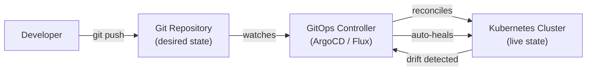
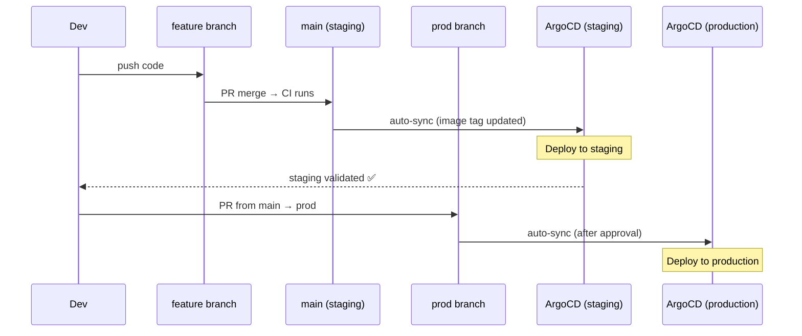

# GitOps

> Git is the single source of truth for infrastructure and application state. A controller (ArgoCD, Flux) continuously reconciles the live system to match what's in Git — automatically.

## Core Principles



1. **Declarative** — desired state described declaratively (YAML, Helm, Kustomize)
2. **Versioned** — Git is the single source of truth; every change has a commit hash
3. **Pulled automatically** — the controller pulls from Git (not pushed to by CI)
4. **Continuously reconciled** — the controller detects and corrects drift

## Pull vs Push Deployment

| | Push (traditional CI/CD) | Pull (GitOps) |
|--|--------------------------|---------------|
| Who deploys? | CI pipeline (external) | Controller inside cluster |
| Credentials | CI needs cluster access | Cluster needs Git access only |
| Drift correction | Manual | Automatic |
| Audit trail | CI logs (external) | Git history (immutable) |
| Rollback | Re-run pipeline | `git revert` |
| Air-gapped | No (CI reaches cluster) | Yes (cluster pulls Git) |

## ArgoCD vs Flux

| | ArgoCD | Flux v2 |
|--|--------|---------|
| UI | ✅ Rich visual UI | ❌ CLI / Grafana dashboard |
| Multi-tenant | ✅ AppProject, RBAC | ✅ Tenants via namespaces |
| Sync strategy | Manual / Auto | Auto reconcile always |
| Drift detection | ✅ Real-time | ✅ Every 10 min by default |
| Secrets | ESO, Sealed Secrets, Vault | Same |
| Progressive delivery | Argo Rollouts | Flagger |
| GitOps model | Application CRD | Kustomization + HelmRelease CRDs |
| Multi-cluster | ✅ Hub-and-spoke | ✅ Native multi-cluster |
| CNCF graduated | ✅ | ✅ |

## GitOps Repository Structure

### Mono-repo Pattern

```
gitops-repo/
├── apps/
│   ├── production/
│   │   ├── orders/
│   │   │   ├── deployment.yaml
│   │   │   └── service.yaml
│   │   └── payments/
│   │       └── kustomization.yaml
│   └── staging/
│       └── orders/
│           └── kustomization.yaml
├── infrastructure/
│   ├── cert-manager/
│   ├── ingress-nginx/
│   └── monitoring/
└── clusters/
    ├── production/
    │   └── kustomization.yaml   # points to apps/production + infra
    └── staging/
        └── kustomization.yaml
```

### Environment Promotion Flow



## Kustomize — Environment Overlays

```
kustomize/
├── base/
│   ├── deployment.yaml
│   ├── service.yaml
│   └── kustomization.yaml
└── overlays/
    ├── staging/
    │   ├── kustomization.yaml    # patches: replica=1, image=:latest
    │   └── replica-patch.yaml
    └── production/
        ├── kustomization.yaml    # patches: replica=5, image=:v1.2.3
        └── hpa.yaml
```

```yaml
# overlays/production/kustomization.yaml
apiVersion: kustomize.config.k8s.io/v1beta1
kind: Kustomization
resources:
  - ../../base
namePrefix: prod-
namespace: production
images:
  - name: my-app
    newTag: v1.2.3    # image update automation changes this line
patchesStrategicMerge:
  - replica-patch.yaml
```

## Image Update Automation (Flux)

```yaml
# ImageRepository — watch DockerHub/ECR for new tags
apiVersion: image.toolkit.fluxcd.io/v1beta2
kind: ImageRepository
metadata:
  name: my-app
  namespace: flux-system
spec:
  image: 123456789.dkr.ecr.us-east-1.amazonaws.com/my-app
  interval: 5m
---
# ImagePolicy — which tag to use
apiVersion: image.toolkit.fluxcd.io/v1beta2
kind: ImagePolicy
metadata:
  name: my-app
  namespace: flux-system
spec:
  imageRepositoryRef:
    name: my-app
  policy:
    semver:
      range: ">=1.0.0"     # latest stable semver
---
# ImageUpdateAutomation — commit new tag to Git
apiVersion: image.toolkit.fluxcd.io/v1beta1
kind: ImageUpdateAutomation
metadata:
  name: flux-system
  namespace: flux-system
spec:
  interval: 5m
  sourceRef:
    kind: GitRepository
    name: flux-system
  git:
    checkout:
      ref:
        branch: main
    commit:
      author:
        email: fluxcdbot@company.com
        name: Flux
      messageTemplate: "chore: update {{.AutomationObject.Name}} to {{.NewValue}}"
    push:
      branch: main
  update:
    path: ./clusters/production
    strategy: Setters
```

## Secrets in GitOps

| Approach | How | Trade-offs |
|----------|-----|-----------|
| **Sealed Secrets** | Encrypt with cluster key, commit encrypted | Cluster-specific, key rotation complex |
| **External Secrets Operator** | Reference AWS SM / SSM / Vault in Git | External dependency, auto-rotates |
| **SOPS + age/KMS** | Encrypt with GPG/KMS, decrypt at deploy time | Works with any secret store |
| **Vault Agent** | Vault sidecar injects secrets at pod start | Vault dependency, most powerful |

## GitOps Anti-Patterns

| Anti-pattern | Problem | Fix |
|--------------|---------|-----|
| Committing secrets to Git | Security breach | Use ESO or Sealed Secrets |
| Skipping Git for "urgent" fixes | Drift, no audit trail | All changes via PR |
| One giant repo with no structure | Blast radius too large | Split by team/env |
| Disabling auto-sync | Drift accumulates silently | Keep auto-sync, add approval for prod |
| Using `:latest` tag | No rollback possible | Immutable image tags (SHA or semver) |

## Common Interview Questions

**Q: Why GitOps over traditional CI/CD push deployments?**
Security: clusters don't need inbound access from CI (pull model). Auditability: every change is a Git commit — who, what, when, why. Drift correction: controller continuously reconciles — if someone manually changes a deployment, it gets auto-reverted. Rollback: `git revert` to any previous state. Developer experience: deployment state is readable in Git, no need to check cluster directly.

**Q: How do you promote images across environments in GitOps?**
Two common patterns: (1) Separate branches per environment (`staging`/`main`/`prod`) — merge triggers sync. (2) Kustomize overlays in one branch — update the image tag in `overlays/production/kustomization.yaml` via a PR. Image update automation (Flux) can automate tag updates for staging; production requires manual PR approval.

**Q: How do you handle secrets that can't be in Git?**
External Secrets Operator is the best production pattern: store `ExternalSecret` CRDs in Git (which reference AWS Secrets Manager paths, not values), ESO pulls actual values from AWS SM and creates K8s Secrets. Commit the ESO config (no secrets) and let ESO handle the actual secret material. Alternatively, SOPS encrypts files with KMS/GPG — encrypted values are safe to commit.

**Q: ArgoCD drift detection — what happens when someone manually edits a deployment?**
ArgoCD compares live cluster state against Git every 3 minutes (configurable). If drift is detected, the app shows `OutOfSync`. With auto-sync enabled, ArgoCD immediately reverts the manual change. With manual sync, it alerts and waits for operator action. This is the key GitOps property: Git always wins.
