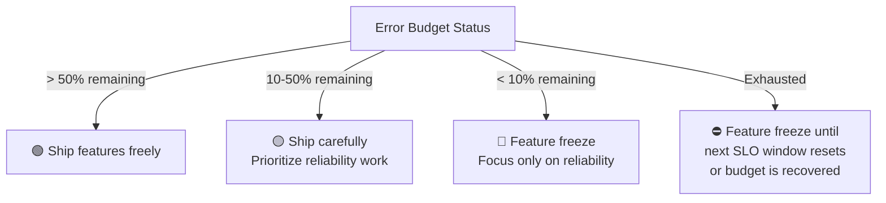

- The Error Budget is the maximum allowable deviation from an SLO over a defined period. It's essentially the inverse of your availability or performance target. 
- If your SLO is 99.9% availability, your error budget is 0.1% unavailability.

- DevOps Engineer Perspective:

  - Calculation:

    - If your Availability SLO is 99.9% over a 30-day period, then:

    - Total time in 30 days = 30 days×24 hours/day×60 minutes/hour×60 seconds/minute=2,592,000 seconds

    - Allowed downtime = (1−0.999)×2,592,000 seconds=0.001×2,592,000 seconds=2,592 seconds

    - So, your error budget for availability is 2592 seconds (approximately 43 minutes and 12 seconds) of downtime over 30 days.

  - Your Role:

    - Risk Management: The error budget is your "permission to fail" (within limits). It's a tool for managing risk and making trade-offs.

    - Feature Velocity vs. Stability: When you have error budget remaining, you can push new features and take calculated risks. If you're burning through your error budget, it's a signal to slow down on new features and prioritize stability, reliability work, and addressing the root causes of the issues. This is a critical discussion point you'll be involved in.

    - Blameless Postmortems: When the error budget is consumed, it triggers discussions and investigations (postmortems) to understand why and how to prevent it from happening again. This isn't about pointing fingers but learning and improving.

    - Justification for Tech Debt: If you need to refactor a flaky service, fix a performance bottleneck, or invest in better monitoring, the fact that you're nearing or exceeding your error budget provides a strong business justification for allocating engineering resources to these reliability efforts.

    - Communication: You'll be instrumental in communicating the state of the error budget to development teams, product managers, and leadership.

- Key takeaway: The error budget is the tolerance for imperfection. It aligns product development with reliability goals and helps prioritize work.

---

## Error Budget Calculations

| SLO | Error Budget | Monthly minutes allowed | Minutes per day |
|-----|-------------|------------------------|----------------|
| 99% | 1% | 432 min (7.2 hrs) | 14.4 min |
| 99.5% | 0.5% | 216 min (3.6 hrs) | 7.2 min |
| 99.9% | 0.1% | 43.2 min | 1.44 min |
| 99.95% | 0.05% | 21.6 min | 43 seconds |
| 99.99% | 0.01% | 4.32 min | 8.6 seconds |

```
Error Budget (seconds/month) = (1 - SLO_target) × 30 × 24 × 3600
```

## Error Budget Policy

When the error budget is exhausted (or nearly so):



**Error budget policy should be written down** — not ad-hoc. Example:

```yaml
# Error Budget Policy Document
service: payment-api
slo: 99.95% availability (28-day rolling)
error_budget_minutes: 21.6

policy:
  - condition: budget_remaining > 50%
    action: Normal feature development, experimental work allowed

  - condition: 10% < budget_remaining <= 50%
    action: |
      - Prioritize reliability improvements
      - Require reliability review for major feature releases
      - Daily error budget review in stand-up

  - condition: budget_remaining <= 10%
    action: |
      - Feature freeze: no new features until budget recovers
      - Mandatory postmortem for any additional incidents
      - SRE embedded in team for reliability sprint

  - condition: budget_exhausted
    action: |
      - Formal incident review with VPs
      - No releases until 50% budget recovered
      - Root cause analysis required before resuming
```

## Error Budget Burn Rate Alert

```yaml
# Alert: burning budget 14x faster than expected
# At this rate, monthly budget exhausted in 1 hour
- alert: ErrorBudgetFastBurn
  expr: |
    (1 - sli:availability:ratio_rate1h) / (1 - 0.9995) > 14.4
  for: 5m
  annotations:
    summary: >
      Budget burn rate: {{ $value }}x.
      At this rate, monthly error budget exhausted in
      {{ printf "%.0f" (1 / $value * 720) }} hours.
```

## Postmortems — When Budget is Consumed

**Blameless postmortem structure:**
1. **Impact** — duration, users affected, revenue impact
2. **Timeline** — when did we detect, who responded, what actions taken
3. **Root Cause** — the actual technical or process failure (5 Whys)
4. **Contributing factors** — not the root cause but made it worse
5. **Action items** — specific, owned, time-bound fixes
6. **Error budget impact** — how much budget was consumed

```markdown
## Postmortem: Payment API Outage — 2026-06-15

**Duration:** 14 minutes (13:42 - 13:56 UTC)
**Impact:** 100% of payment requests failed, ~$45k lost transactions
**SLO Impact:** Consumed 65% of monthly error budget

### Root Cause
DynamoDB throttling due to hot partition — order_id was sequential, 
all writes hit the same shard.

### Action Items
- [ ] @pawan: Migrate order_id to UUID (by June 22)
- [ ] @team: Add DynamoDB adaptive capacity monitoring alert (by June 19)  
- [ ] @sre: Review partition key design in DR test (by June 30)
```

## Common Interview Questions

**Q: What do you do when the error budget is exhausted?**
Immediately implement a feature freeze — no new feature releases until the budget recovers or we fix the reliability issues. Trigger a postmortem to understand root causes. Brief leadership on the situation and the remediation plan. The feature freeze is critical because new features always carry some deployment risk — we can't afford more incidents when we're already out of budget.

**Q: How does error budget align engineering and product?**
It replaces subjective arguments about "stability vs features" with objective data. When budget remains, product can move fast. When budget is low, reliability work is automatically prioritized — engineers don't have to fight for it. Both product and engineering agree upfront on the policy (what happens when budget hits X%). This removes the "we need to fix tech debt" vs "we need to ship features" conflict.

**Q: Can you increase an SLO target mid-quarter?**
Technically yes, but it's a major commitment. Increasing from 99.9% to 99.99% reduces your error budget from 43 min/month to 4 min/month — a 10x reduction. This requires architectural changes (multi-region active-active, chaos testing, elimination of all single points of failure). Set realistic SLOs based on what users actually need, not aspirational targets — violating SLOs that are too tight trains teams to ignore alerts.
