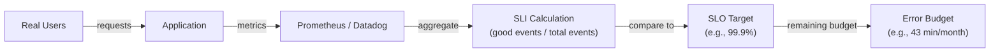

# Service Level Indicators (SLIs)

- An SLI is a quantifiable measure of some aspect of the service you provide. Think of it as a raw metric that tells you how your system is performing.

- **DevOps Engineer Perspective:**

  - Examples:

    - Latency: The time it takes for a request to be served (e.g., "99% of API requests complete in under 200ms").

    - Throughput/QPS (Queries Per Second): The number of requests a system can handle per unit of time.

    - Error Rate: The percentage of requests that result in an error (e.g., HTTP 5xx responses).

    - Availability: The percentage of time a service is operational and accessible.

    - Durability: For storage systems, the likelihood that data will be preserved (e.g., "99.999% of objects stored will be available over a year").

  - Your Role: You'll be instrumental in instrumenting your applications and infrastructure to collect these metrics.
  - This means setting up monitoring tools (Prometheus, Grafana, Datadog, ELK stack, etc.), configuring logs, and ensuring that the data you're collecting is accurate and representative of the user experience.

- Key takeaway: SLIs are the what you measure. They should directly relate to user experience or business objectives.

---

## SLI Architecture



## SLI Categories & Examples

| Category | SLI Metric | Good measurement |
|----------|-----------|-----------------|
| **Availability** | % of requests returning non-5xx | `(total_requests - error_requests) / total_requests` |
| **Latency** | % of requests completing within threshold | `requests_under_200ms / total_requests` |
| **Throughput** | Requests per second | `rate(http_requests_total[5m])` |
| **Freshness** | Data updated within expected interval | `time_since_last_update < threshold` |
| **Durability** | Objects stored without corruption | `successful_reads / total_reads` |
| **Saturation** | Queue depth / CPU below threshold | `queue_depth < 1000` |

## SLI Implementation — Prometheus

```yaml
# Recording rule: availability SLI (good requests ratio)
groups:
  - name: sli_rules
    rules:
      - record: sli:request_availability:ratio_rate5m
        expr: |
          sum(rate(http_requests_total{status!~"5.."}[5m]))
          /
          sum(rate(http_requests_total[5m]))

      # Latency SLI: % of requests < 200ms
      - record: sli:latency_p99:ratio_rate5m
        expr: |
          sum(rate(http_request_duration_seconds_bucket{le="0.2"}[5m]))
          /
          sum(rate(http_request_duration_seconds_count[5m]))
```

## SLI Design Principles

- **Measure from the user's perspective** — not infrastructure metrics. CPU at 80% doesn't mean users are unhappy; slow responses do.
- **Ratio metrics** (good events / total events) are more meaningful than raw counts
- **Choose SLIs that have clear thresholds** — latency under X ms, error rate under Y%
- **Avoid vanity metrics** — internal queue depth is an SLI only if it directly impacts user experience
- **Too many SLIs** → alert fatigue. Focus on 2-4 per service (availability + latency + freshness)

## Common Interview Questions

**Q: SLI vs metric — what's the difference?**
All SLIs are metrics, but not all metrics are SLIs. An SLI is a specific metric chosen because it measures user-facing service quality. CPU utilization is a metric — it's an SLI only if you can show it directly correlates with user experience degradation. Prefer SLIs that directly measure what users experience: request success rate, response latency, data freshness.

**Q: How do you define a good SLI for an asynchronous job?**
For async systems, use freshness (how long since the last successful run) and success rate (percentage of jobs completing without errors). Example: "95% of batch jobs complete within 5 minutes of their scheduled time, and 99.9% complete without errors." Measure actual job outcomes, not queue lengths (which are internal).
