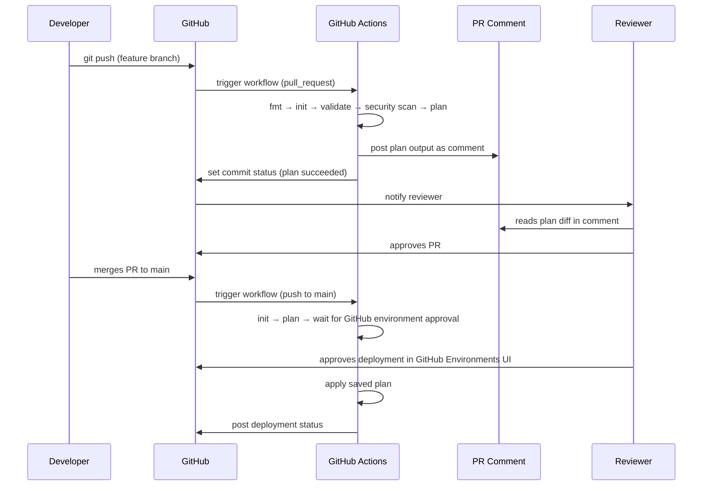

# 🔄 Terraform CI/CD Pipelines
**22 Slides · GitHub Actions · Jenkins · Stages · Why Each Exists · Security · Multi-Env**

---

# 🎯 Why Terraform Needs a CI/CD Pipeline

Running `terraform apply` from a developer's laptop is the number-one source of infra incidents.

**Problems with manual apply:**

| Problem | What goes wrong |
|---|---|
| No peer review | One engineer's mistake hits production |
| No formatting gate | HCL style diverges across the team |
| No plan visibility | Everyone flies blind — no one sees the diff |
| No locking coordination | Two devs apply simultaneously → state corruption |
| No audit trail | Who applied what and when? Unknown |
| Credentials on laptops | Access keys stored in `~/.aws/credentials` everywhere |
| No approval gate | Junior engineer accidentally destroys prod |

**What a CI/CD pipeline gives you:**

- Every change goes through `fmt` → `validate` → `plan` → **human approval** → `apply`
- Plans are posted as PR comments — reviewable before any apply
- OIDC authentication — no static credentials anywhere
- Full audit log in GitHub/Jenkins — every apply is traceable
- Consistent environment — every run uses the same Terraform version

> 💡 **Takeaway:** The pipeline is the enforcement layer. Code review catches logic bugs; the pipeline catches infra bugs. You need both.

---

# 🏗️ The Canonical Pipeline — All Stages

```mermaid
graph LR
    PR["PR Opened"] --> Checkout
    Checkout --> Fmt["fmt check\n(fail fast on style)"]
    Fmt --> Init["terraform init\n(download providers)"]
    Init --> Validate["terraform validate\n(syntax check)"]
    Validate --> Sec["Security scan\ntfSec / Checkov"]
    Sec --> Plan["terraform plan\n(post diff to PR)"]
    Plan --> Review["Human Review\n(approve/reject)"]
    Review --> Apply["terraform apply\n(on merge to main)"]
    Apply --> Verify["Post-apply verify\n(smoke test)"]
    Verify --> Notify["Notify\n(Slack / email)"]
```



**Why each stage exists:**

| Stage | Why it's needed | What it catches |
|---|---|---|
| `fmt` | Enforce consistent style | Tabs vs spaces, alignment drift |
| `init` | Download providers | Version conflicts, backend misconfig |
| `validate` | Syntax check (no API calls) | Type errors, missing required fields |
| Security scan | Shift security left | Open S3 buckets, unencrypted volumes |
| `plan` | Show the diff before apply | Unexpected destroys, resource drift |
| Human review | Gate before production change | Business logic errors, scope creep |
| `apply` | Execute the plan | Creates/updates/destroys resources |
| Post-verify | Confirm infra is reachable | Catches apply success but broken infra |
| Notify | Inform stakeholders | On-call knows what changed and when |

> 💡 **Takeaway:** Every stage exists to catch a different class of failure earlier and cheaper. `fmt` is free to run; a bad `apply` to production is expensive to fix.

---

# 📝 Stage Deep Dive — fmt, init, validate

**`terraform fmt -check -recursive`**
```bash
# What it does: checks formatting, returns exit code 1 if any file is not formatted
# Why -check: don't auto-fix in CI; fail so the developer fixes locally
# Why -recursive: check all subdirectories (modules too)

terraform fmt -check -recursive
# Exit 0 = all formatted correctly
# Exit 1 = found files needing formatting → fail the pipeline
```

**`terraform init`**
```bash
# What it does: downloads providers, configures backend, downloads modules
# Critical CI flags:
terraform init \
  -backend-config="bucket=$STATE_BUCKET" \     # ← inject from env, not hardcoded
  -backend-config="key=$STATE_KEY" \
  -backend-config="region=$AWS_REGION" \
  -input=false \                                # ← never prompt for input in CI
  -no-color                                     # ← clean logs without ANSI codes
```

**`terraform validate`**
```bash
# What it does: validates configuration syntax and internal consistency
# Does NOT make any API calls — runs without credentials
# Catches: reference to undefined variables, wrong types, missing required args

terraform validate -no-color
# Returns exit 0 (valid) or 1 (invalid + detailed error message)
```

> ✅ **Rule:** `validate` does not talk to AWS. Run it even on PRs where you don't want to authenticate to cloud — it catches 80% of bugs for free.

---

# 🔍 Stage Deep Dive — Plan (The Most Important Stage)

```bash
# The plan stage is the centrepiece of Terraform CI/CD
terraform plan \
  -out=plan.tfplan \          # ← save plan to file; apply uses this exact plan
  -input=false \              # ← non-interactive
  -no-color \                 # ← clean CI logs
  -var-file=environments/$ENV.tfvars   # ← inject env-specific values

# Convert plan to JSON for machine parsing / PR comment generation
terraform show -json plan.tfplan > plan.json

# Human-readable summary for PR comment:
terraform show -no-color plan.tfplan
```

**What to look for in plan output:**

```
# aws_s3_bucket.logs will be created          ← green: expected new resource
# aws_instance.web will be updated in-place   ← yellow: safe change
# aws_db_instance.postgres must be replaced   ← RED: data loss risk!
# aws_vpc.main will be destroyed              ← RED: check if intentional!

Plan: 3 to add, 1 to change, 0 to destroy.  ← always read this line
```

**Posting the plan as a PR comment (GitHub Actions):**
```bash
# Use the 'github-script' action to post plan output as a PR comment
# The plan becomes the reviewable artifact — reviewers click "approve"
# after reading the actual diff, not the code change alone
```

> ⚠️ **Watch out:** If `plan` shows destroys you didn't expect → stop, investigate, do NOT approve. A surprise destroy in prod is a major incident.

---

# 🔒 Stage Deep Dive — Security Scanning

Run **before** plan — catch insecure patterns at static analysis time.

**tfsec:**
```bash
tfsec . --no-color --format=json > tfsec-output.json
# Checks: unencrypted S3 buckets, public RDS, weak KMS policies, etc.
# Exit 0 = clean, Exit 1 = findings (configure severity threshold)

tfsec . --minimum-severity HIGH   # ← only fail on HIGH or CRITICAL
```

**Checkov:**
```bash
checkov -d . --framework terraform --output json > checkov-output.json
# Similar checks with broader policy library
# Supports custom policies as Python files
```

**What they catch:**

| Check | Why it matters |
|---|---|
| S3 bucket public access not blocked | Data breach risk |
| Security group allows `0.0.0.0/0` on port 22 | SSH exposed to internet |
| RDS not encrypted at rest | Compliance failure |
| EBS volumes not encrypted | Same |
| No MFA delete on S3 | State file deletion risk |
| Lambda has `*` resource in IAM | Over-privileged function |

> ✅ **Rule:** Run security scans on every PR — shift security left. A finding caught in PR review costs nothing; a finding in a prod audit costs a lot.

---

# 🟣 GitHub Actions — Complete Terraform Pipeline

```yaml
# .github/workflows/terraform.yml
name: Terraform

on:
  push:
    branches: [main]
  pull_request:
    branches: [main]

env:
  TF_VERSION: "1.6.4"
  AWS_REGION: "us-east-1"
  TF_WORKING_DIR: "./infrastructure"

permissions:
  id-token: write      # ← OIDC: GitHub issues JWT token
  contents: read
  pull-requests: write # ← post plan as PR comment
```

---

# 🟣 GitHub Actions — Jobs: Validate & Plan

```yaml
jobs:
  validate:
    name: Validate
    runs-on: ubuntu-latest
    defaults:
      run:
        working-directory: ${{ env.TF_WORKING_DIR }}
    steps:
      - uses: actions/checkout@v4

      - uses: hashicorp/setup-terraform@v3
        with:
          terraform_version: ${{ env.TF_VERSION }}  # ← pin exact version

      - name: Configure AWS via OIDC
        uses: aws-actions/configure-aws-credentials@v4
        with:
          role-to-assume: ${{ secrets.AWS_ROLE_ARN }}  # ← no static keys!
          aws-region: ${{ env.AWS_REGION }}

      - name: Terraform Format Check
        id: fmt
        run: terraform fmt -check -recursive
        continue-on-error: false  # ← fail pipeline on bad formatting

      - name: Terraform Init
        id: init
        run: terraform init -input=false -no-color
        env:
          TF_VAR_environment: ${{ github.ref == 'refs/heads/main' && 'prod' || 'staging' }}

      - name: Terraform Validate
        id: validate
        run: terraform validate -no-color

      - name: Run tfsec Security Scan
        uses: aquasecurity/tfsec-action@v1.0.0
        with:
          working_directory: ${{ env.TF_WORKING_DIR }}
          minimum_severity: HIGH

  plan:
    name: Plan
    needs: validate          # ← only runs if validate passes
    runs-on: ubuntu-latest
    outputs:
      exitcode: ${{ steps.plan.outputs.exitcode }}
    defaults:
      run:
        working-directory: ${{ env.TF_WORKING_DIR }}
    steps:
      - uses: actions/checkout@v4
      - uses: hashicorp/setup-terraform@v3
        with:
          terraform_version: ${{ env.TF_VERSION }}

      - uses: aws-actions/configure-aws-credentials@v4
        with:
          role-to-assume: ${{ secrets.AWS_ROLE_ARN }}
          aws-region: ${{ env.AWS_REGION }}

      - run: terraform init -input=false -no-color

      - name: Terraform Plan
        id: plan
        run: |
          terraform plan \
            -out=plan.tfplan \
            -input=false \
            -no-color \
            -detailed-exitcode \
            -var-file=environments/${{ env.ENVIRONMENT }}.tfvars \
          2>&1 | tee plan-output.txt
          echo "exitcode=${PIPESTATUS[0]}" >> $GITHUB_OUTPUT
        env:
          ENVIRONMENT: ${{ github.ref == 'refs/heads/main' && 'prod' || 'staging' }}
        continue-on-error: true  # ← we handle exit codes manually

      - name: Post Plan as PR Comment
        uses: actions/github-script@v7
        if: github.event_name == 'pull_request'
        with:
          script: |
            const fs = require('fs');
            const plan = fs.readFileSync('${{ env.TF_WORKING_DIR }}/plan-output.txt', 'utf8');
            const maxLen = 65000;
            const truncated = plan.length > maxLen ? plan.slice(0, maxLen) + '\n... (truncated)' : plan;
            const body = `## 🏗️ Terraform Plan\n\`\`\`\n${truncated}\n\`\`\``;
            github.rest.issues.createComment({
              issue_number: context.issue.number,
              owner: context.repo.owner,
              repo: context.repo.repo,
              body
            });

      - name: Fail if plan errored
        if: steps.plan.outputs.exitcode == '1'
        run: exit 1

      - name: Upload Plan
        uses: actions/upload-artifact@v4
        with:
          name: tfplan
          path: ${{ env.TF_WORKING_DIR }}/plan.tfplan
          retention-days: 1   # ← plan files contain credentials; short TTL
```

---

# 🟣 GitHub Actions — Apply Job (Merge Only)

```yaml
  apply:
    name: Apply
    needs: plan
    runs-on: ubuntu-latest
    # Only apply on push to main (merge) AND if plan found changes (exitcode=2)
    if: |
      github.ref == 'refs/heads/main' &&
      github.event_name == 'push' &&
      needs.plan.outputs.exitcode == '2'
    environment:
      name: production        # ← GitHub environment with required reviewers
      url: https://console.aws.amazon.com
    defaults:
      run:
        working-directory: ${{ env.TF_WORKING_DIR }}
    steps:
      - uses: actions/checkout@v4
      - uses: hashicorp/setup-terraform@v3
        with:
          terraform_version: ${{ env.TF_VERSION }}

      - uses: aws-actions/configure-aws-credentials@v4
        with:
          role-to-assume: ${{ secrets.AWS_ROLE_ARN }}
          aws-region: ${{ env.AWS_REGION }}

      - run: terraform init -input=false -no-color

      - name: Download Plan
        uses: actions/download-artifact@v4
        with:
          name: tfplan
          path: ${{ env.TF_WORKING_DIR }}

      - name: Terraform Apply
        run: terraform apply -auto-approve -input=false plan.tfplan

      - name: Post Apply Result
        if: always()
        uses: slackapi/slack-github-action@v1
        with:
          payload: |
            {
              "text": "Terraform apply ${{ job.status }} on ${{ github.repository }} by ${{ github.actor }}"
            }
        env:
          SLACK_WEBHOOK_URL: ${{ secrets.SLACK_WEBHOOK }}
```

**Why `environment: production`?**
- Creates a GitHub deployment environment with **Required Reviewers**
- Apply job pauses and waits for a human to approve in the GitHub UI
- This is your approval gate — no code needed, just GitHub settings

> ✅ **Rule:** Never use `-auto-approve` on a fresh `terraform plan` in CI. Always apply a **saved plan file** — this guarantees apply executes exactly what was reviewed.

---

# 🔵 Jenkins — Declarative Jenkinsfile

```groovy
// Jenkinsfile — Declarative Pipeline
pipeline {
  agent { label 'terraform' }     // ← runs on an agent with terraform installed

  environment {
    TF_VERSION    = '1.6.4'
    AWS_REGION    = 'us-east-1'
    TF_DIR        = 'infrastructure'
    ENVIRONMENT   = "${env.BRANCH_NAME == 'main' ? 'prod' : 'staging'}"
  }

  options {
    timeout(time: 30, unit: 'MINUTES')   // ← fail if pipeline hangs
    disableConcurrentBuilds()            // ← only one pipeline run at a time
    ansiColor('xterm')                   // ← coloured output
  }

  stages {
    stage('Checkout') {
      steps {
        checkout scm
      }
    }

    stage('Setup Terraform') {
      steps {
        sh """
          terraform version || {
            wget -q https://releases.hashicorp.com/terraform/${TF_VERSION}/terraform_${TF_VERSION}_linux_amd64.zip
            unzip -o terraform_${TF_VERSION}_linux_amd64.zip -d /usr/local/bin/
          }
          terraform version
        """
      }
    }

    stage('Format Check') {
      steps {
        dir(env.TF_DIR) {
          sh 'terraform fmt -check -recursive -no-color'
        }
      }
    }

    stage('Init') {
      steps {
        dir(env.TF_DIR) {
          withCredentials([[$class: 'AmazonWebServicesCredentialsBinding',
                           credentialsId: 'aws-terraform-role']]) {  // Jenkins credentials store
            sh """
              terraform init \
                -backend-config="bucket=${params.STATE_BUCKET}" \
                -backend-config="key=${ENVIRONMENT}/terraform.tfstate" \
                -input=false -no-color
            """
          }
        }
      }
    }

    stage('Validate') {
      steps {
        dir(env.TF_DIR) {
          sh 'terraform validate -no-color'
        }
      }
    }

    stage('Security Scan') {
      steps {
        sh "tfsec ${TF_DIR} --no-color --minimum-severity HIGH"
      }
    }

    stage('Plan') {
      steps {
        dir(env.TF_DIR) {
          withCredentials([[$class: 'AmazonWebServicesCredentialsBinding',
                           credentialsId: 'aws-terraform-role']]) {
            sh """
              terraform plan \
                -out=plan.tfplan \
                -var-file=environments/${ENVIRONMENT}.tfvars \
                -input=false -no-color \
              2>&1 | tee plan-output.txt
            """
          }
        }
      }
      post {
        always {
          archiveArtifacts artifacts: "${TF_DIR}/plan-output.txt"
        }
      }
    }

    stage('Approval') {
      when {
        branch 'main'   // ← only for main branch; PR builds skip this
      }
      steps {
        timeout(time: 24, unit: 'HOURS') {  // ← auto-abort if not approved in 24h
          input message: "Apply plan to ${ENVIRONMENT}?",
                ok: 'Apply',
                submitter: 'sre-team,platform-team'  // ← restrict who can approve
        }
      }
    }

    stage('Apply') {
      when {
        branch 'main'
      }
      steps {
        dir(env.TF_DIR) {
          withCredentials([[$class: 'AmazonWebServicesCredentialsBinding',
                           credentialsId: 'aws-terraform-role']]) {
            sh 'terraform apply -auto-approve -input=false plan.tfplan'
          }
        }
      }
    }
  }

  post {
    success {
      slackSend channel: '#infra-deploys',
                color: 'good',
                message: "✅ Terraform apply succeeded: ${env.JOB_NAME} #${env.BUILD_NUMBER}"
    }
    failure {
      slackSend channel: '#infra-alerts',
                color: 'danger',
                message: "❌ Terraform pipeline failed: ${env.JOB_NAME} #${env.BUILD_NUMBER} — ${env.BUILD_URL}"
    }
    always {
      cleanWs()  // ← clean workspace after every run
    }
  }
}
```

---

# 🔵 Jenkins — Why Each Stage Exists

| Stage | Jenkins implementation | Why it exists |
|---|---|---|
| **Checkout** | `checkout scm` | Gets the code; Jenkins tracks the commit SHA |
| **Setup Terraform** | `wget` + `unzip` or Docker agent | Ensures exact Terraform version; no drift across agents |
| **Format Check** | `terraform fmt -check` | Style gate — fails PR before wasting init time |
| **Init** | `terraform init` with backend-config | Downloads providers; reads remote state |
| **Validate** | `terraform validate` | Catches config errors without cloud credentials |
| **Security Scan** | `tfsec` | Finds security misconfigs before they hit AWS |
| **Plan** | `terraform plan -out=plan.tfplan` | Produces the reviewable diff; saved for apply |
| **Approval** | `input` step | Human gate — waits for a named group to approve |
| **Apply** | `terraform apply plan.tfplan` | Executes exactly what was reviewed in plan |
| **Notify** | `slackSend` | On-call team knows what changed |
| **Clean** | `cleanWs()` | Removes plan file (contains credentials) from disk |

**`disableConcurrentBuilds()` — why this matters:**
- Without it: two PRs merge simultaneously → two applies run in parallel → DynamoDB lock contention + state corruption
- With it: Jenkins queues the second run until the first finishes
- This is a **second layer** of protection on top of DynamoDB locking

---

# 🔐 Security Patterns — OIDC vs IAM Keys in CI

**GitHub Actions — OIDC (preferred):**
```yaml
permissions:
  id-token: write   # GitHub issues a short-lived JWT

- uses: aws-actions/configure-aws-credentials@v4
  with:
    role-to-assume: arn:aws:iam::123456789:role/GitHubTerraformRole
    aws-region: us-east-1
# No AWS_ACCESS_KEY_ID anywhere — GitHub's JWT is exchanged for temporary creds
```

**Jenkins — IAM role on the agent (preferred for EC2 agents):**
```groovy
// If Jenkins agents run on EC2 with an IAM instance profile:
// No credentials needed at all — AWS SDK picks up the instance role
sh 'terraform plan'  // ← uses instance profile automatically
```

**Jenkins — Credentials Store (fallback):**
```groovy
withCredentials([[$class: 'AmazonWebServicesCredentialsBinding',
                 credentialsId: 'aws-terraform-role']]) {
  sh 'terraform apply plan.tfplan'
}
// Credentials injected as env vars into the block only
// Never logged, never written to disk
```

**IAM policy for the CI role — least privilege:**
```json
{
  "Version": "2012-10-17",
  "Statement": [
    {
      "Effect": "Allow",
      "Action": [
        "s3:GetObject", "s3:PutObject", "s3:ListBucket",    // ← state bucket
        "dynamodb:GetItem", "dynamodb:PutItem", "dynamodb:DeleteItem", // ← lock table
        "ec2:*", "rds:*", "iam:*"                           // ← only what Terraform manages
      ],
      "Resource": "*"
    }
  ]
}
```

> ⚠️ **Watch out:** The CI role needs IAM permissions for everything Terraform manages. Teams often grant `AdministratorAccess` as a shortcut — this is a major security risk. Scope it to only the services your Terraform config actually touches.

---

# 🌍 Multi-Environment Pipeline Strategy

**Pattern 1: Branch-based environments**
```
PR branch  → plan only (no apply)
main       → apply to staging
tag v*     → apply to production (with approval gate)
```

**Pattern 2: Directory-based (Terragrunt)**
```
infrastructure/
  staging/  → triggered by merge to main
  prod/     → triggered by manual approval or separate pipeline
```

**GitHub Actions — multi-env matrix:**
```yaml
strategy:
  matrix:
    environment: [staging, prod]
    exclude:
      - environment: prod    # ← only PR triggers staging; prod needs manual
        condition: ${{ github.event_name == 'pull_request' }}

jobs:
  plan:
    environment: ${{ matrix.environment }}
    steps:
      - run: terraform plan -var-file=envs/${{ matrix.environment }}.tfvars
```

**Jenkins — parameterised build:**
```groovy
parameters {
  choice(name: 'ENVIRONMENT', choices: ['staging', 'prod'], description: 'Target environment')
  booleanParam(name: 'DESTROY', defaultValue: false, description: 'Run terraform destroy?')
}
stages {
  stage('Guard destroy') {
    when { expression { params.DESTROY && params.ENVIRONMENT == 'prod' } }
    steps { error('Destroy on prod requires a separate runbook — aborting.') }
  }
}
```

> ✅ **Rule:** Never trigger prod applies from the same event that triggers staging. Use an explicit promotion step — a tag, a manual approval, or a separate pipeline trigger.

---

# 📋 PR-based Plan Workflow — The Full Loop



**Why plan on PR and plan again on merge?**
- PR plan: lets reviewers see what will change — code review + infra review together
- Pre-apply plan: re-runs after merge because main may have changed since the PR was raised
- Apply uses the **post-merge plan** — guarantees it applies exactly what was planned against current state

> ✅ **Rule:** Always re-plan after merge. Never apply a plan that was generated from an older commit — state may have changed in between.

---

# 🚨 Handling Failures in CI

**Common failure scenarios and fixes:**

| Failure | Error message | Root cause | Fix |
|---|---|---|---|
| Format check fails | `Files not formatted` | Developer ran `terraform fmt` manually with different settings | Run `terraform fmt -recursive` locally before pushing |
| Init fails | `Backend configuration changed` | S3 bucket/key changed without `-reconfigure` | Add `-reconfigure` flag or run `terraform init -reconfigure` locally |
| Plan fails | `Error acquiring the state lock` | Previous pipeline run crashed holding the lock | `terraform force-unlock <LOCK_ID>` after confirming process is dead |
| Plan shows destroy | `will be destroyed` | Resource rename without `moved` block | Add `moved` block or investigate if destroy is intentional |
| Apply fails mid-run | `Error: timeout waiting for...` | Resource took too long | Re-run apply — Terraform is idempotent, already-created resources are skipped |
| Security scan fails | `HIGH severity finding` | Open security group, unencrypted bucket | Fix the resource config; add `#tfsec:ignore` only if false positive |

**Detecting unexpected destroys in the plan:**
```bash
# Fail the pipeline if plan includes any destroys
DESTROYS=$(terraform show -json plan.tfplan | jq '[.resource_changes[] | select(.change.actions[] == "delete")] | length')
if [ "$DESTROYS" -gt 0 ]; then
  echo "❌ Plan includes $DESTROYS resource deletions — manual review required"
  exit 1
fi
```

> ⚠️ **Watch out:** A plan that destroys and recreates a database (`must be replaced`) is not the same as a soft update. Always read the plan reason: `# (forces replacement)` means data loss risk.

---

# ⚙️ Terraform Version Pinning in CI

**Why pin the exact version:**
- `terraform plan` output format can change between versions
- A new version might plan differently for the same config
- Mix of versions across devs + CI = inconsistent behavior

**How to pin:**

```yaml
# GitHub Actions — setup-terraform action
- uses: hashicorp/setup-terraform@v3
  with:
    terraform_version: "1.6.4"   # ← exact, not "~> 1.6"
```

```groovy
// Jenkins — tfenv (Terraform version manager)
sh 'tfenv install 1.6.4 && tfenv use 1.6.4'
```

```hcl
# Also enforce in your terraform block — belt AND suspenders
terraform {
  required_version = "= 1.6.4"   # ← exact match; fails if wrong version runs
}
```

**`.terraform-version` file (tfenv):**
```
1.6.4
```
Place this in the root of your repo — `tfenv` and `setup-terraform` both read it automatically.

> ✅ **Rule:** Pin exact versions (`= 1.6.4` not `>= 1.6`) in CI. Upgrade deliberately — test in staging first, then promote the version bump to prod.

---

# 🧪 Post-Apply Verification

Don't trust that `apply` succeeded = infra works. Verify it.

**Smoke tests after apply:**
```bash
# 1. Check outputs are non-empty
VPC_ID=$(terraform output -raw vpc_id)
[ -z "$VPC_ID" ] && echo "❌ vpc_id output is empty" && exit 1

# 2. AWS CLI health check
aws ec2 describe-instances \
  --filters "Name=tag:Environment,Values=prod" \
  --query 'Reservations[].Instances[].State.Name' \
  --output text | grep -q "running" || exit 1

# 3. HTTP health check on a load balancer
LB_DNS=$(terraform output -raw lb_dns_name)
curl --fail --retry 5 --retry-delay 5 "https://$LB_DNS/health" || exit 1

echo "✅ Post-apply verification passed"
```

**In GitHub Actions:**
```yaml
- name: Post-Apply Verification
  run: |
    cd ${{ env.TF_WORKING_DIR }}
    LB_DNS=$(terraform output -raw lb_dns_name)
    for i in {1..10}; do
      curl -sf "https://$LB_DNS/health" && echo "Health check passed" && exit 0
      echo "Attempt $i failed, retrying in 10s..."
      sleep 10
    done
    echo "Health check failed after 10 attempts"
    exit 1
```

> 💡 **Takeaway:** `terraform apply` returning exit 0 means Terraform made the API calls successfully — it does not mean your application is healthy. Verify independently.

---

# 📊 GitHub Actions vs Jenkins — Comparison

| Dimension | GitHub Actions | Jenkins |
|---|---|---|
| **Setup** | Zero infra — GitHub-hosted | Requires Jenkins server + agents |
| **OIDC auth** | Native — `id-token: write` | Manual — OIDC plugin required |
| **Approval gate** | GitHub Environments (UI button) | `input` step in Jenkinsfile |
| **PR integration** | First-class — `github-script` comments | Plugin-based — GitHub PR plugin |
| **Secrets** | GitHub Secrets (encrypted) | Jenkins Credentials Store |
| **Audit log** | GitHub Actions history | Jenkins build log |
| **Parallel jobs** | `matrix` / `needs` | `parallel` stages |
| **Cost** | Free for public repos; minutes-based for private | Your infra + maintenance |
| **Learning curve** | Low — YAML | Medium — Groovy + Jenkins quirks |
| **Self-hosted runners** | Supported | Native (agents) |
| **Best for** | GitHub-hosted repos, cloud-native teams | Existing Jenkins investment, complex workflows |

**When to use Jenkins:**
- Your org already has a Jenkins instance and established pipelines
- You need complex scripted logic that GitHub Actions YAML can't express
- You need air-gapped / on-premises CI (no internet access)

**When to use GitHub Actions:**
- New project, GitHub is your code host
- You want OIDC without extra configuration
- Small to medium team, no CI infra to maintain

---

# 🎤 Interview Q&A

**Q: Walk me through a production Terraform CI/CD pipeline.**
- PR opened → GitHub Actions triggers: `fmt` check → `terraform init` → `terraform validate` → `tfsec` security scan → `terraform plan` (plan output posted as PR comment)
- PR merged to main → pipeline re-plans against current state → saves `plan.tfplan`
- GitHub Environment approval gate triggers — SRE team member approves in the UI
- `terraform apply plan.tfplan` runs — applies exactly what was reviewed
- Post-apply: smoke tests verify infra is reachable; Slack notification sent to on-call channel

> 💬 **Say:** "The key is that apply uses a saved plan file — so the reviewers approved exactly what gets executed, not a re-computed plan."

**Q: Why do you plan on the PR AND re-plan after merge?**
- The PR plan is for review — it shows what would change if this PR merged
- Between PR approval and merge, someone else might merge another PR that changes state
- The pre-apply plan runs against current state (after merge) — it may be different from the PR plan
- We apply the post-merge plan to guarantee consistency

> 💬 **Say:** "PR plan is for human review. Apply plan is for correctness. They must be separate — state can change between the two."

**Q: How do you prevent two pipeline runs from running `terraform apply` simultaneously?**
- GitHub Actions: use `concurrency` group with `cancel-in-progress: false` — queues instead of cancels
- Jenkins: `disableConcurrentBuilds()` in the options block
- DynamoDB lock: the state lock is the final backstop — one will fail if the other holds the lock
- Best practice: all three together — pipeline serialization + DynamoDB lock + serial field in state

> 💬 **Say:** "disableConcurrentBuilds at the pipeline level prevents the race. DynamoDB locking is the safety net if that fails."

**Q: What happens if `terraform apply` fails halfway through?**
- Resources created before the failure exist in state (Terraform tracked them)
- Resources that failed may be in a partial state — some attributes written, others not
- Re-running `terraform apply` picks up where it left off — Terraform only acts on resources that don't match desired state
- If a resource is tainted (provisioner failure), Terraform destroys and recreates it on the next apply

> 💬 **Say:** "Terraform apply is idempotent — re-run it after fixing the root cause. Already-created resources are no-ops. The partial resource gets re-attempted."

**Q: How do you handle Terraform plan showing unexpected destroys?**
- Stop immediately — never approve a plan with destroys you didn't expect
- Investigate: did someone rename a resource without a `moved` block? Did a `for_each` key change?
- Add `moved` blocks if it's a rename; add `lifecycle { prevent_destroy = true }` for critical resources
- In CI: add a destroy-detection step that fails the pipeline if destroy count > 0 (except for planned teardowns)

> 💬 **Say:** "Unexpected destroys are a red flag — stop the pipeline, investigate the root cause. A destroy in plan means data loss in apply."

---
