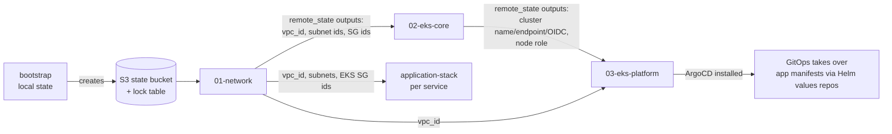

# Repository layout and apply flow

> How the platform repo is organised into modules, stacks and environments; the order things are applied; how state flows between stacks; and how the Kubernetes providers are wired. Read this before the block-by-block walkthrough.

---

## The three layers

```text
terraform/
├── bootstrap/                      # run once per account: S3 state bucket + DynamoDB lock table (local state)
├── modules/                        # resource modules: one concern each, no provider blocks (mostly)
│   ├── network/{vpc,subnets,routing}
│   ├── security/{kms,security-groups}
│   ├── iam/{eks-roles,irsa-role,karpenter,aws-load-balancer-controller}
│   ├── eks/{cluster,managed-node-group,addons,karpenter,aws-load-balancer-controller,argocd}
│   ├── rds-postgres, rds-mysql, elasticache-redis, s3-bucket, sqs-queue, ecr, alb, route53
│   ├── emr-cluster, solr, ra, hybrid-vpc     # product-specific or legacy
│   └── eks/main.tf                           # older monolithic EKS module, superseded by eks/cluster + friends
├── stacks/                         # composition modules: how the platform is assembled
│   ├── new-environment/01-network
│   ├── new-environment/02-eks-core
│   ├── new-environment/03-eks-platform
│   └── application-stack           # per-service RDS / S3 / SQS / ElastiCache / ALB / DNS behind feature flags
└── environments/                   # root modules: one directory per client per env per stack; this is where state lives
    ├── clienta/dev/{01-network,02-eks-core,03-eks-platform}
    ├── example/prod/{01-network,02-eks-core,03-eks-platform}
    ├── shared/apps/<product>/<service>/<env>      # application-stack wrappers
    └── clienta/import-existing                    # import blocks to adopt a hand-built VPC
```

**Why three layers.** Modules are reusable and opinionated (encryption on, IMDSv2 required, tags merged). Stacks encode *this company's* platform shape (three subnet tiers, a system node group plus Karpenter, ArgoCD on every cluster). Environments are thin: variables, a backend, a provider, and a single `module` call into a stack. That keeps `terraform plan` in an environment directory small and the blast radius obvious: `environments/example/prod/01-network` can only touch prod networking.

**Where the thinking shows.** `01-network` owns things that change rarely and break everything (VPC, subnets, NAT, security groups). `02-eks-core` owns the cluster and its identity (IAM roles, KMS, access entries, system node group, core add-ons). `03-eks-platform` owns things that change weekly (Karpenter, LB controller, CSI drivers, ArgoCD). Splitting by *rate of change and blast radius* is the module-boundary rule in action.

## Apply order and state dependencies



1. **bootstrap** (`bootstrap/main.tf`): creates the state bucket (versioned, SSE, public access blocked, 90-day noncurrent expiry) and a DynamoDB lock table. It deliberately has no backend: it is the one root that must use local state because the remote backend does not exist yet. Its outputs are copied into the Launchpad `config.yaml`.
2. **01-network**: `module "network"` → stack `01-network` → modules `vpc`, `subnets`, `routing`, `security-groups`. Outputs are consumed by everything downstream.
3. **02-eks-core**: reads `01-network` via `terraform_remote_state`; creates IAM roles, KMS key, the cluster, access entries, the system managed node group and the core add-ons (`vpc-cni`, `kube-proxy`, `coredns`, `eks-pod-identity-agent`).
4. **03-eks-platform**: reads `02-eks-core` and `01-network`; installs Karpenter (IAM + Helm + NodePool/EC2NodeClass manifests), the AWS Load Balancer Controller (IAM + Helm), EBS/EFS CSI add-ons with IRSA roles, and ArgoCD. Optionally registers the Helm-values Git repo as an ArgoCD repository secret.
5. **application-stack** (per service): reads `01-network`; creates whichever of RDS Postgres, RDS MySQL, ElastiCache, S3, SQS, ALB, Route 53 the service asks for with `create_*` flags.
6. After step 4 the cluster is handed to **ArgoCD**: application Deployments, Services, Ingresses and KEDA objects live in Helm-values repos, not in Terraform.

Each box above is its own state file under one key prefix:

```text
s3://example-tf-state-123456789012-us-east-1/
  launchpad/environments/clienta/dev/01-network/terraform.tfstate
  launchpad/environments/clienta/dev/02-eks-core/terraform.tfstate
  launchpad/environments/clienta/dev/03-eks-platform/terraform.tfstate
  launchpad/environments/shared/apps/prodb/be/dev/terraform.tfstate
```

Backends use `use_lockfile = true` (Terraform 1.10+ native S3 locking), so the DynamoDB table from bootstrap is now only needed for roots that have not migrated.

## How providers are wired in 03-eks-platform

`03-eks-platform` needs three providers: `aws`, `helm`, `kubectl`. The Kubernetes ones are configured from data sources in `provider.tf`:

```hcl
data "aws_eks_cluster" "this"      { name = var.cluster_name }
data "aws_eks_cluster_auth" "this" { name = var.cluster_name }

provider "helm" {
  kubernetes {
    host                   = data.aws_eks_cluster.this.endpoint
    cluster_ca_certificate = base64decode(data.aws_eks_cluster.this.certificate_authority[0].data)
    token                  = data.aws_eks_cluster_auth.this.token
  }
}
```

**Why a separate stack and data sources, not outputs from the EKS module in the same root.** Provider configuration must be known before the plan graph is built. If the cluster and the Helm releases were in one root, the first `plan` would fail because the provider cannot be configured from a resource that does not exist yet, and `destroy` would try to talk to a cluster it is deleting. Separating the cluster (02) from the things installed into it (03) is the standard answer to the "chicken and egg" provider problem. The token from `aws_eks_cluster_auth` is short-lived (15 minutes) and refreshed every run, so nothing durable is stored.

**Why `kubectl_manifest` and not `kubernetes_manifest`.** The hashicorp `kubernetes_manifest` resource needs the CRD to exist at *plan* time; Karpenter's `NodePool` CRD is created by the Helm release in the same apply. The `gavinbunney/kubectl` provider defers validation to apply time, so CRD and custom resource can ship in one stack. The cost is a community provider on the critical path; the alternative is to apply NodePools through ArgoCD once it is up.

## Where the Launchpad fits

An internal React/Express wizard (the "DevOps Launchpad") drives these roots: it renders `terraform.tfvars` from a product catalogue and runs `init`/`plan`/`apply` with live logs. Tags carry `ManagedBy = "devops-launchpad"` for that reason. For the interview the relevant point is that the roots are intentionally **variable-driven with no logic**, so a UI or a CI pipeline can generate them; the opinions live in the stacks.

## What to say in one minute

"Three layers: resource modules with secure defaults, composition stacks that encode our platform shape, and thin per-environment roots that hold state. New environment is bootstrap once, then network, EKS core, EKS platform in order, each its own state file, downstream stacks reading upstream outputs via remote state. The Kubernetes providers live in a separate stack from the cluster so provider configuration never depends on a resource in the same plan. After the platform stack ArgoCD owns everything inside the cluster; Terraform stops at the control plane and the add-ons that need IAM."
