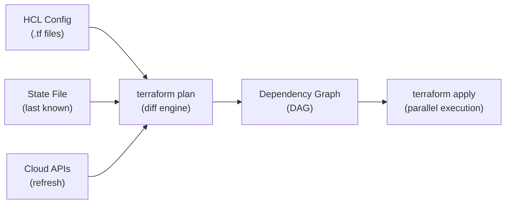
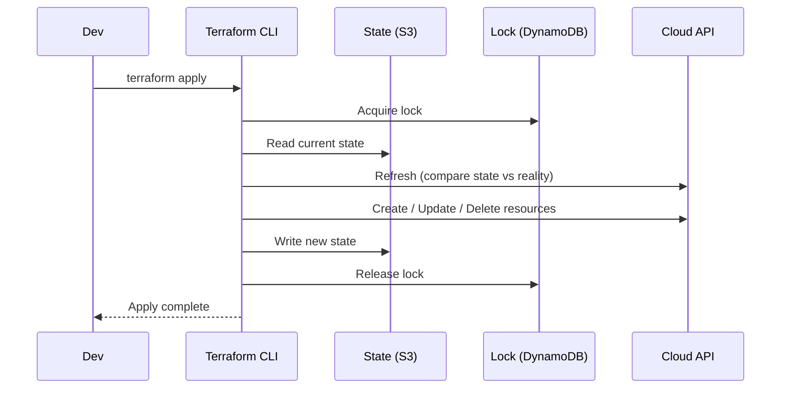
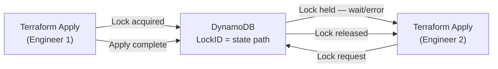
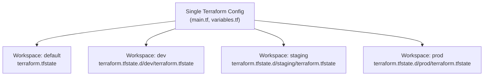
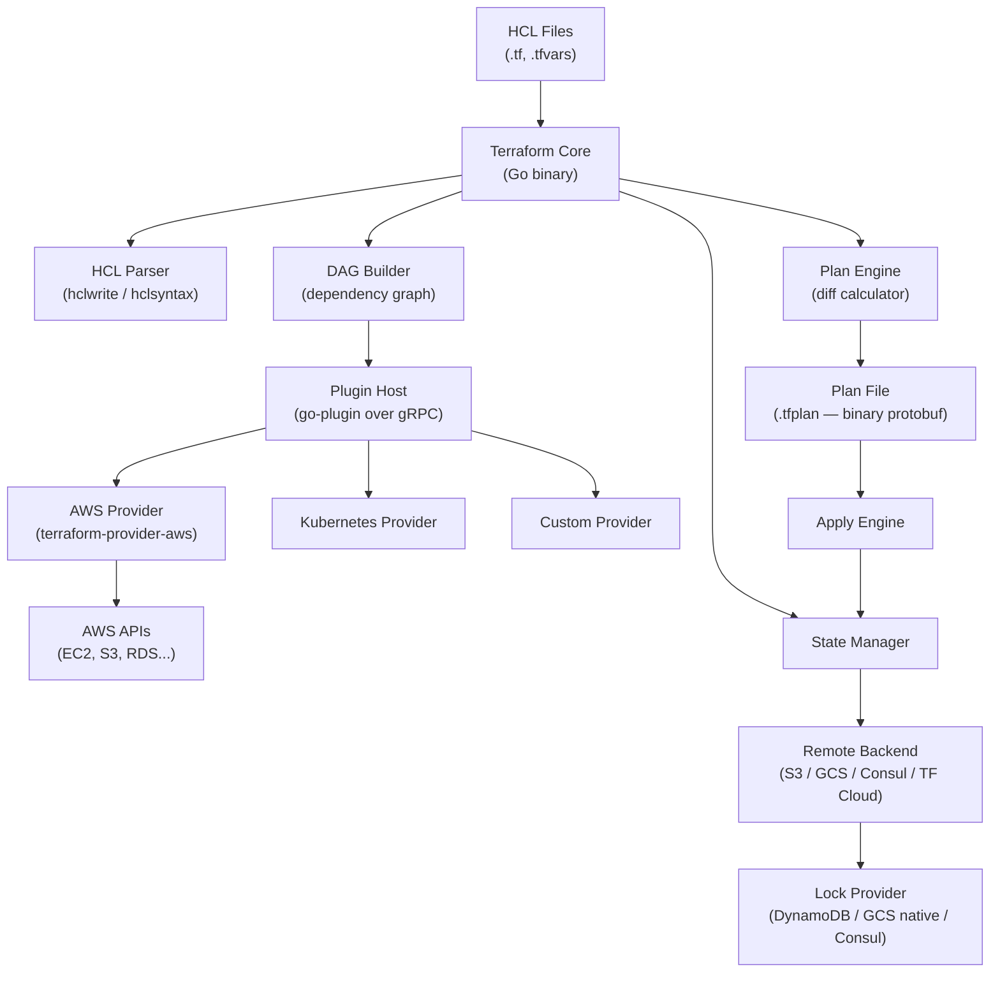
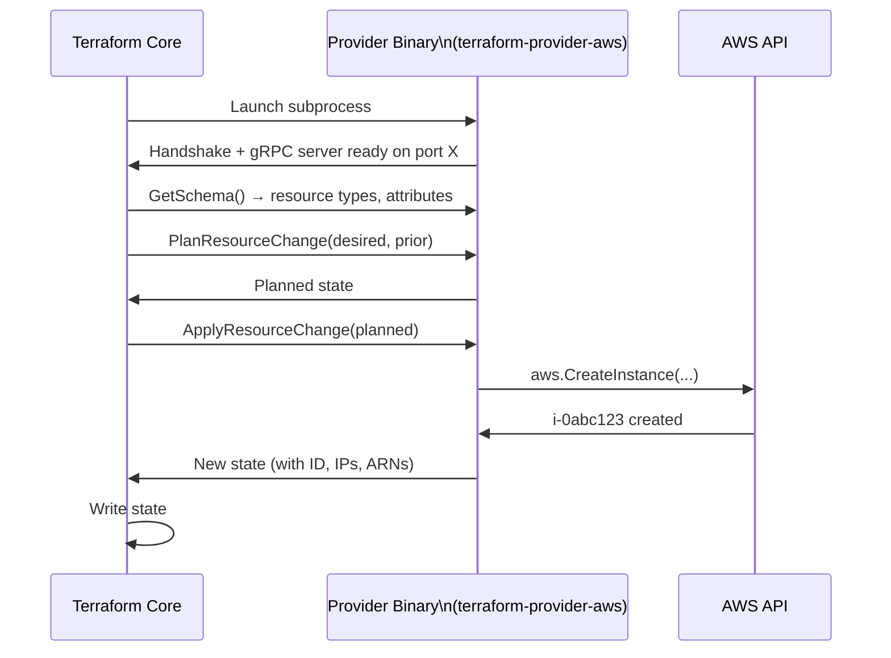
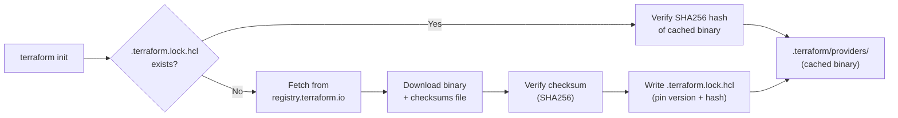
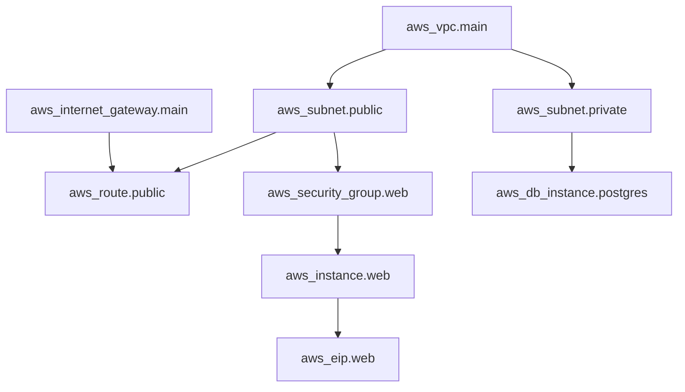

# 🌍 Terraform — Complete Reference
**65 Slides · Introduction → State → Modules → Workspaces → Provisioners → Terragrunt**

---

# 🗂️ Introduction

---

# 🎯 What Is Terraform?

**Infrastructure as Code** — define cloud resources in files, not clicks.

- 🔹 **Declarative** — say *what* you want, Terraform figures out *how*
- 🔹 **Idempotent** — run the same config 10 times, same result
- 🔹 **Multi-cloud** — AWS, GCP, Azure, Kubernetes + 3000+ providers
- 🔹 **Version-controlled** — infra lives in Git alongside your code

> 💡 **Takeaway:** Terraform replaces "clicking in the console" with code that can be reviewed, versioned, and automated.

---

# ⚙️ The 3-Stage Workflow

```
  .tf files  →  terraform plan  →  terraform apply
  (desired)      (show the diff)    (make it real)
```

| Stage | Command | What happens |
|-------|---------|-------------|
| **Write** | _(edit .tf files)_ | Define desired resources in HCL |
| **Plan** | `terraform plan` | Diff: desired state vs actual state |
| **Apply** | `terraform apply` | API calls to create / update / delete |
| **Destroy** | `terraform destroy` | Tear down all managed resources |

> 💡 **Takeaway:** You never skip Plan. If the diff looks wrong, you stop.

---

# 🔄 Full Command Sequence

```bash
terraform init                     # download providers, configure backend
terraform fmt -recursive           # format code (run before every commit)
terraform validate                 # check syntax without hitting APIs
terraform plan -out=plan.tfplan    # preview + save the plan
terraform apply plan.tfplan        # apply exactly what was reviewed
terraform destroy                  # teardown everything
```

> ✅ **Rule:** Always `plan -out=plan.tfplan` then `apply plan.tfplan`. Without a saved plan, plan and apply run separately and may produce different results if config changed in between.

---

# 📋 Core Concepts Cheat Sheet

| Concept | What it is | Example |
|---------|-----------|---------|
| **Provider** | Plugin for a cloud API | `hashicorp/aws` |
| **Resource** | Cloud object to manage | `aws_instance.web` |
| **Data Source** | Read-only lookup | `data.aws_vpc.main` |
| **Variable** | Input parameter | `var.environment` |
| **Local** | Computed / derived value | `local.name_prefix` |
| **Output** | Export a value | `output.vpc_id` |
| **Module** | Reusable resource group | `module.vpc` |
| **Backend** | Where state lives | S3 + DynamoDB |
| **State** | JSON snapshot of reality | `terraform.tfstate` |

> 💡 **Takeaway:** Resources + Providers = what you build. State = Terraform's memory. Modules = reusable patterns.

---

# ⚡ Provider & Backend Config

```hcl
terraform {
  required_version = ">= 1.6"
  required_providers {
    aws = {
      source  = "hashicorp/aws"
      version = "~> 5.0"           # ← allows 5.x, blocks 6.0 breaking changes
    }
  }
  backend "s3" {
    bucket         = "my-tf-state"
    key            = "prod/terraform.tfstate"
    region         = "us-east-1"
    dynamodb_table = "terraform-locks"  # ← enables state locking
    encrypt        = true               # ← state at rest is encrypted
  }
}

provider "aws" {
  region = var.region
  default_tags {
    tags = { ManagedBy = "terraform", Env = var.environment }
  }
}
```

> ✅ **Rule:** Pin providers with `~>` and always use S3 + DynamoDB backend for team work.

---

# 📌 Version Constraint Operators

| Operator | Meaning | Allows |
|----------|---------|--------|
| `= 5.0.0` | Exact only | 5.0.0 only |
| `>= 5.0` | At least | 5.x, 6.x, 7.x… |
| `~> 5.0` | Minor updates | 5.0, 5.9 — **NOT 6.0** |
| `~> 5.1.0` | Patch only | 5.1.x — **NOT 5.2.0** |
| `!= 5.2.0` | Exclude one | Anything except 5.2.0 |

**Production standard:** use `~> 5.0` for providers, `>= 1.6.0` for Terraform itself.

> ⚠️ **Watch out:** `~> 5.0` ≠ `~> 5.0.0`. The first allows `5.9.0`; the second only allows `5.0.x`. Use `~> 5.0` in most cases.

---

# 🔧 terraform init — What It Does

**What `init` does internally (in order):**

1. Reads `required_providers` block
2. Downloads provider plugins → `.terraform/providers/`
3. Creates `.terraform.lock.hcl` (pins exact binary hashes)
4. Configures the backend
5. Downloads modules → `.terraform/modules/`

```bash
terraform init                   # standard
terraform init -upgrade          # upgrade to latest allowed versions
terraform init -reconfigure      # reinit backend, does NOT migrate state
terraform init -migrate-state    # copy state to a new backend
terraform init -backend=false    # skip backend (local dev only)
```

> ✅ **Rule:** Run `init` after any change to `required_providers`, backend, or modules. Always commit `.terraform.lock.hcl`.

---

# 🔒 The Lock File

```hcl
# .terraform.lock.hcl — ALWAYS commit this file to git
provider "registry.terraform.io/hashicorp/aws" {
  version     = "5.31.0"      # ← exact version in use
  constraints = "~> 5.0"      # ← constraint from your config
  hashes = [
    "h1:ABC...xyz",            # ← sha256 of the downloaded binary
  ]
}
```

| | Commit? | What it contains |
|--|---------|-----------------|
| `.terraform.lock.hcl` | ✅ Yes | Provider version + hash |
| `.terraform/` | ❌ No | Downloaded binaries (large) |
| `terraform.tfstate` | ❌ No | Contains secrets, use S3 |

> ⚠️ **Watch out:** Without the lock file, `terraform init` on a new machine can pull a **different provider version** → inconsistent behavior across team and CI.

---

# 🏗️ How Terraform Builds Execution Order



- Terraform reads all `.tf` files and builds a **Directed Acyclic Graph**
- Independent resources run **in parallel** (default: 10 concurrent)
- Resources with `depends_on` or attribute references wait for dependencies

> 💡 **Takeaway:** Order in your `.tf` files doesn't matter — references do. Terraform figures out the sequence.

---

# 🔄 The Apply Lifecycle (with Locking)



> ⚠️ **Watch out:** If apply crashes between "Write state" and "Release lock", the lock stays held. Use `terraform force-unlock <ID>` — only after confirming the process is truly dead.

---

# 🆚 Terraform vs CloudFormation vs CDK

| | **Terraform** | **CloudFormation** | **CDK** |
|--|-------------|------------------|---------|
| Language | HCL | YAML / JSON | Python / TS / Go / Java |
| Multi-cloud | ✅ 3000+ providers | AWS only | AWS only |
| State | External (S3) | Managed by AWS | Managed by CF |
| Plan preview | `terraform plan` | Change sets | `cdk diff` |
| Drift detection | `plan -refresh-only` | Drift detection | `cdk diff` |
| Testing | Terratest, tftest | cfn-lint | Jest / Pytest |
| Learning curve | Medium | Low | High |

> 💡 **Pick Terraform when:** multi-cloud, widest provider ecosystem, team comfort with HCL. **Pick CDK when:** AWS-only and team prefers real programming languages.

---

# 🎤 Introduction · Interview Q&A

**Q: How does Terraform know what to create vs update vs delete?**
- Reads your HCL config (desired state)
- Reads the state file (last-known actual state)
- Refreshes from the real cloud (current state)
- Diffs desired vs current → produces the plan

> 💬 **Say:** *"Terraform diffs three sources: your config, the state file, and a live API refresh."*

**Q: Why is the state file critical and where must you store it?**
- Maps `aws_instance.web` → real resource ID `i-0abc123`
- Without it, Terraform can't manage existing resources — it's blind
- **Store:** S3 + DynamoDB locking + KMS encryption + versioning enabled
- **Never:** git, unencrypted local file

> 💬 **Say:** *"The state file is Terraform's memory. Lose it and Terraform loses track of everything it manages."*

**Q: Two engineers run `terraform apply` simultaneously — what happens?**
- Second apply hits DynamoDB, sees a lock record
- Errors immediately: "Error acquiring the state lock" + shows who holds it
- First finishes → releases lock → second can run
- If first crashes: `terraform force-unlock <LOCK_ID>` after confirming process is dead

> 💬 **Say:** *"DynamoDB locking is optimistic — it fails fast rather than queueing, so the team coordinates manually."*

---

# 🗂️ State Management

---

# 🎯 What Is the State File?

- **Resource IDs** — maps `aws_instance.web` → `i-0abcd1234`
- **Metadata** — dependencies, provider configs
- **Attributes returned by provider** — IPs, DNS names, ARNs
- **Dependency graph** — resource ordering information
- Created on the first `terraform apply`; acts as a local database before making API calls

> 💡 **Takeaway:** The state file is Terraform's only way to know which real cloud resource corresponds to which HCL block — without it, Terraform is blind.

---

# ⚡ State File JSON Structure

```json
{
  "version": 4,                          // ← state format version (not Terraform version)
  "terraform_version": "1.6.0",
  "serial": 42,                          // ← incremented on every apply
  "lineage": "abc-123-uuid",             // ← UUID assigned at creation, never changes
  "outputs": { "vpc_id": { "value": "vpc-0abc123", "type": "string" } },
  "resources": [
    {
      "mode": "managed",
      "type": "aws_vpc",
      "name": "main",
      "instances": [
        {
          "attributes": { "id": "vpc-0abc123", "cidr_block": "10.0.0.0/16" },
          "dependencies": []
        }
      ]
    }
  ]
}
```

> ✅ **Rule:** `lineage` prevents applying the wrong state to the wrong environment — Terraform refuses if lineage mismatches. `serial` rejects the second of two concurrent writes.

---

# 📦 What State Stores vs Does NOT Store

| Stored in State | NOT Stored in State |
|---|---|
| Resource IDs | Full cloud API response |
| Provider-returned attributes | Complete resource configuration |
| Private IPs, DNS names, ARNs | History (needs S3 versioning) |
| Dependency graph | Secrets (usually redacted — but not always) |
| Passwords if provider leaks them | — |

> ⚠️ **Watch out:** State may contain sensitive values. Treat it like a secrets file — encrypt at rest, restrict IAM access, never store in Git.

---

# 🔄 Local vs Remote State

- **Local (default)** — `terraform apply` writes `terraform.tfstate` to your working directory; fine for solo developers only
- **Remote (required for teams)** — store in a central location such as AWS S3; every engineer reads and writes the same state
- Remote state enables **state locking** to prevent concurrent writes
- Never commit `terraform.tfstate` or `terraform.tfstate.backup` to Git — they contain sensitive resource attributes

> 💡 **Takeaway:** Any team of 2+ engineers must use remote state — local state in a shared repo causes merge conflicts and race conditions.

---

# ⚡ State as a Performance Cache

- Before making cloud API calls, Terraform reads state to understand current resource configuration
- `terraform plan` uses state as the baseline to compute what needs to change
- This avoids unnecessary API calls for every resource on every plan

**What `terraform plan` reports using state:**

- Resources to be **added**
- Resources to be **changed**
- Resources to be **destroyed**

> 💡 **Takeaway:** State is a local cache of infrastructure reality — it makes plans fast by eliminating redundant cloud API calls.

---

# 🔒 DynamoDB State Locking — Setup

```hcl
resource "aws_dynamodb_table" "state_locking" {
  hash_key     = "LockID"               # ← required primary key name (exact string)
  name         = "dynamodb-state-locking"
  attribute {
    name = "LockID"
    type = "S"
  }
  billing_mode = "PAY_PER_REQUEST"
}

terraform {
  backend "s3" {
    bucket         = "jhooq-terraform-s3-bucket"
    key            = "jhooq/terraform/remote/s3/terraform.tfstate"
    region         = "eu-central-1"
    dynamodb_table = "dynamodb-state-locking"
  }
}
```

> ✅ **Rule:** The DynamoDB table's primary key MUST be named `LockID` (string type) — this is a hard requirement of the S3 backend.

---

# 🏗️ State Locking — How It Works



```bash
aws dynamodb scan --table-name terraform-locks   # inspect who holds the lock
terraform force-unlock LOCK_ID                   # use only when process is confirmed dead
```

> ⚠️ **Watch out:** `force-unlock` while the original apply is still running causes concurrent state writes and corruption — confirm the process is truly dead first.

---

# ⚠️ Drift Detection

```bash
terraform plan -refresh-only       # shows what state would update to match reality
terraform apply -refresh-only      # syncs state to real infra, no resource changes
terraform plan -refresh=false      # skip refresh (faster plans, but stale state)

# What drift looks like in plan output:
# ~ aws_instance.web
#   ~ tags = {
#       + "ManualTag" = "someone-added-this-in-console"
#     }
```

- Drift = someone changed a resource outside Terraform; state won't reflect it
- `terraform plan -refresh-only` (recommended) — shows the diff before committing
- `terraform refresh` (legacy) — deprecated; updates state without preview

> ✅ **Rule:** Prefer `terraform plan -refresh-only` over `terraform refresh` — it's safer because you see the diff before committing the state update.

---

# 🔄 Drift Handling in CI/CD

```bash
terraform plan -detailed-exitcode

# Exit codes:
# 0 → No changes (infrastructure matches config)
# 2 → Drift detected (changes exist)
# 1 → Error (plan failed)
```

**What to do when drift is detected (exit code 2):**

- **Accept drift** — update Terraform code to match the manual change, then apply to sync state
- **Revert drift** — run `terraform apply` to restore infrastructure to the code-defined state

> ✅ **Rule:** Use exit code `2` in CI to trigger alerts or auto-apply workflows — never let drift accumulate silently.

---

# 💥 State Corruption — Causes and Symptoms

| Cause | Example |
|---|---|
| Concurrent writes | No locking configured |
| Force-unlock misuse | Unlock while apply is still running |
| Manual edits | Editing the JSON directly |
| Provider crash | Partial write to state |
| Network failure | Write interrupted mid-apply |

**Symptoms:**
- Apply wants to recreate everything
- Missing or duplicate resources in state
- Invalid JSON parse error
- Inconsistent result after apply

> ⚠️ **Watch out:** Never edit the state file manually — a corrupted JSON or wrong serial number can cause Terraform to recreate everything.

---

# ✅ State Corruption Recovery (Priority Order)

```bash
# Step 1: restore a previous S3 version (best path — requires versioning enabled)
aws s3api list-object-versions \
  --bucket my-tf-state --prefix env/prod/terraform.tfstate

aws s3api copy-object \
  --bucket my-tf-state \
  --copy-source "my-tf-state/env/prod/terraform.tfstate?versionId=PREVIOUS_VERSION_ID" \
  --key env/prod/terraform.tfstate

# Step 2: if no backup, re-import missing resources
terraform import aws_vpc.main vpc-0abc123
terraform import aws_subnet.public subnet-0abc123

# Step 3: verify — should show "No changes"
terraform plan
```

- **Option 1:** Backend version rollback (S3 versioning) — best
- **Option 2:** `terraform refresh` — if infra is correct but state is stale
- **Option 3:** `terraform import` — re-associate resources missing from state
- **Option 4:** Manual state JSON surgery — last resort only; always back up first

> ✅ **Rule:** Enable S3 versioning on your state bucket on day one — it's the only reliable recovery path for state corruption.

---

# ⚡ State Manipulation — Inspect and Move

```bash
# List all resources tracked in state
terraform state list

# Show full attributes of a specific resource
terraform state show aws_instance.web

# Move resource to new address (after rename or module restructure)
terraform state mv aws_instance.web module.ec2.aws_instance.web

# Rename an index key
terraform state mv 'aws_instance.servers[0]' 'aws_instance.servers["prod"]'

# After any state mv — verify zero changes
terraform plan   # ← should show "No changes"
```

> ✅ **Rule:** After any `state mv`, run `terraform plan` — it should show zero changes. If it shows destroy+create, the state mv or HCL update is wrong.

---

# ⚡ State Manipulation — Remove, Pull, Push, Import

```bash
# Remove resource from state (Terraform forgets it; cloud resource is untouched)
terraform state rm aws_instance.web

# Pull remote state as JSON (for inspection or backup)
terraform state pull > backup.tfstate

# Push local state to remote (overwrites — use with extreme care)
terraform state push backup.tfstate

# Import existing cloud resource into state (classic CLI style)
terraform import aws_instance.web i-1234567890abcdef0

# Terraform 1.5+: declarative import block (reviewable in plan)
import {
  to = aws_instance.web
  id = "i-1234567890abcdef0"
}
```

> ⚠️ **Watch out:** `state rm` makes Terraform forget the resource — if the HCL block still references it, the next `apply` will try to CREATE it, potentially duplicating cloud resources.

---

# 🏗️ Targeted Operations and Backend Configuration

```bash
# Target specific resources (emergency/debug only)
terraform plan  -target=aws_vpc.main
terraform apply -target=aws_vpc.main -target=aws_subnet.public
terraform plan  # ← always run full plan after targeted apply
```

```hcl
backend "s3" {
  bucket         = "my-tf-state"
  key            = "prod/vpc/terraform.tfstate"
  region         = "us-east-1"
  dynamodb_table = "terraform-locks"
  encrypt        = true
  kms_key_id     = "arn:aws:kms:us-east-1:123:key/abc"
  role_arn       = "arn:aws:iam::ACCOUNT:role/TerraformStateRole"
}
# terraform init -backend-config=backend.hcl  ← partial config keeps secrets out of code
```

> ✅ **Rule:** Targeted applies are a debugging/emergency tool — never use them as a regular workflow; always follow up with a full plan.

---

# 🎤 State · Interview Q&A

**Q1: Two engineers run `terraform apply` simultaneously — what happens?**
- Second apply fails with "Error acquiring the state lock"
- DynamoDB lock record shows: LockID, Who, Created, Info
- Use `terraform force-unlock <LOCK_ID>` only if process is confirmed dead

> 💬 **Say:** "DynamoDB locking serializes applies — the second engineer sees exactly who holds the lock."

**Q2: How do you move resources between modules without destroying them?**
- Use `terraform state mv aws_s3_bucket.logs module.logging.aws_s3_bucket.logs`
- Update HCL to reference the new module path
- Run `terraform plan` — zero changes means the move was clean

> 💬 **Say:** "`state mv` updates Terraform's records without touching the cloud resource."

**Q3: S3 state bucket — what configuration is required for production?**
- Versioning enabled; SSE-KMS; block public access; MFA delete
- DynamoDB table with `LockID` primary key; IAM policy restricting access to CI role only

> 💬 **Say:** "S3 versioning is non-negotiable — it's your only recovery option if state gets corrupted."

**Q4: When would you use `terraform state rm` and what's the risk?**
- Use to stop managing a manually-created resource, or hand it to a different workspace
- Risk: next `apply` tries to CREATE it — potential duplicates or uniqueness constraint errors

> 💬 **Say:** "`state rm` is a one-way door — Terraform forgets the resource, but your config still wants it."

---

# 🔬 Lineage + Serial — How They Actually Work

**Lineage** is a UUID generated once when state is first created. It never changes.

```
"lineage": "7a3f291b-bc48-4e91-a6d4-f0b1234c9999"
```

**What Terraform does with lineage:**
- Before every apply, Terraform reads the remote state file
- If the `lineage` in remote state does not match what this workspace expects → Terraform **refuses to apply** with an error: `"state lineage mismatch"`
- This prevents: a developer pointing their staging config at the prod state bucket key by accident
- The lineage check is your last safety net against applying the wrong codebase to the wrong environment

**Serial** is a counter that increments by 1 on every successful apply.

```
"serial": 42   → apply succeeds → state is now serial: 43
```

**What Terraform does with serial:**
- Before writing new state, Terraform checks: "Is the serial in remote storage still 42?"
- If yes → write new state with serial 43
- If no (someone else already wrote serial 43) → **reject the write with a conflict error**
- This means even if DynamoDB locking failed to block a second concurrent apply, the serial check still prevents the second writer from overwriting the first writer's state

**Timeline of a concurrent apply (worst case):**
```
Engineer 1: reads state serial=10, plans, applies, writes serial=11 ✅
Engineer 2: reads state serial=10 (same time), plans, tries to write serial=11
            → Backend sees serial is now 11 (not 10 as E2 read)
            → Write rejected: "state serial mismatch" ✅
```

> 💡 **Takeaway:** Lineage = which environment am I talking to? Serial = did anyone else write since I last read? Together they are the state file's own concurrency safety system on top of DynamoDB.

---

# 💧 How Passwords End Up in State (Provider Leaks)

The state file stores every attribute the provider returns after creating a resource. Most providers are careful — but not all.

**Example — RDS creates a DB with a password:**
```hcl
resource "aws_db_instance" "postgres" {
  password = var.db_password   # ← you pass this in
}
```

After `terraform apply`, the state contains:
```json
"attributes": {
  "id": "mydb",
  "password": "super-secret-123",   ← stored in PLAIN TEXT in state
  "endpoint": "mydb.abc.rds.amazonaws.com"
}
```

**Why does this happen?**
- The AWS provider returns ALL resource attributes after creation — including `password`
- Terraform stores the full provider response in state so it knows the current configuration
- The provider has no mechanism to redact sensitive fields from what it returns to Core
- HashiCorp has been working on `WriteOnlyAttribute` (Terraform 1.10+) to fix this — but most resources don't use it yet

**What `sensitive = true` does NOT do:**
- It does NOT prevent the value from being stored in state
- It only prevents the value from appearing in `terraform plan` and `terraform output` terminal output
- The state file on S3 still contains it in plain text

**What you must do:**
- Always encrypt state at rest: `encrypt = true` + `kms_key_id` in your S3 backend config
- Restrict S3 bucket access via IAM — only the CI role and break-glass users
- Enable S3 Object Lock or MFA delete — prevent accidental deletion of state
- Never put state bucket access in developer IAM policies

> ⚠️ **Watch out:** `sensitive = true` on a variable masks the value in plan output but has zero effect on what is stored in state. Treat your state file as a secrets file — the encryption and access controls matter more than `sensitive`.

---

# 🔑 Why DynamoDB LockID Must Be Named Exactly "LockID"

This is a hard-coded requirement in the Terraform S3 backend source code — not configurable.

**How the lock works:**
```
terraform apply starts
  → S3 backend calls: DynamoDB PutItem
      Item: { "LockID": "s3://bucket/path/terraform.tfstate" }
      Condition: attribute_not_exists(LockID)   ← atomic check-and-set
  → If item already exists → ConditionalCheckFailedException → "Error acquiring state lock"
  → If item does not exist → PutItem succeeds → lock is held
  → apply runs...
  → S3 backend calls: DynamoDB DeleteItem(LockID) → lock released
```

**Why the attribute is named "LockID" specifically:**
- The Terraform S3 backend source code hardcodes the string `"LockID"` as the partition key name
- The `PutItem`, `GetItem`, and `DeleteItem` calls in the backend code all reference `"LockID"` directly
- If your table's partition key is named anything else (e.g., `"id"`, `"lock_key"`) → the `PutItem` will succeed even when a lock is held, because the condition check targets a non-existent attribute
- Result: **locking silently stops working** — you get no error, but two applies can run simultaneously

**Why `PAY_PER_REQUEST` and not `PROVISIONED`:**
- Lock operations are infrequent — typically a few per day per team
- Provisioned capacity requires estimating RCU/WCU — wasteful for a rarely-used table
- A lock acquire/release is two DynamoDB operations — at PAY_PER_REQUEST, essentially free

**Creating the table correctly:**
```hcl
resource "aws_dynamodb_table" "tf_lock" {
  name         = "terraform-state-locks"
  billing_mode = "PAY_PER_REQUEST"
  hash_key     = "LockID"   # ← MUST be exactly this string

  attribute {
    name = "LockID"   # ← same here
    type = "S"        # ← must be String (S), not Number (N)
  }
}
```

> ⚠️ **Watch out:** You can create a DynamoDB table with a different key name and Terraform will not warn you — the `dynamodb_table` config just tells Terraform which table to use. The key name validation only happens at lock time, and silently fails if wrong.

---

# 🔧 State Manipulation — Why You Actually Need It

`terraform state` commands exist because the real world never perfectly matches your HCL.

**Scenario 1: Refactoring — moving resources into a module**
```
Before: aws_instance.web           (resource at root level)
After:  module.compute.aws_instance.web   (moved into a module)
```
Without `state mv`: Terraform sees destroy(old) + create(new) → **your instance gets deleted and recreated**
With `state mv`: Terraform updates the state address only — instance keeps running

```bash
terraform state mv aws_instance.web module.compute.aws_instance.web
terraform plan  # → must show "No changes" to confirm the move was clean
```

**Scenario 2: Someone created a resource manually and now Terraform should manage it**
```bash
# An S3 bucket was created in the console months ago
# Now you're writing Terraform for it
terraform import aws_s3_bucket.logs my-app-logs-bucket
# State now contains the bucket; plan will show "No changes" if HCL matches
```

**Scenario 3: Handing a resource to a different workspace**
```bash
# Resource belongs in a shared-infra workspace, not this app workspace
terraform state rm aws_vpc.legacy
# (The VPC keeps running; the shared-infra workspace will import it)
```

**Scenario 4: Debugging a "resource already exists" error**
```bash
# Terraform wants to create an IAM role that already exists (state got corrupted)
terraform state list   # find all tracked resources
terraform state show aws_iam_role.ci_role   # inspect what state thinks it is
terraform import aws_iam_role.ci_role ci-terraform-role   # re-associate
```

**Scenario 5: Renaming a for_each key without destroying the resource**
```bash
terraform state mv 'aws_instance.servers["app"]' 'aws_instance.servers["web"]'
# Key renamed in state; instance not touched
```

> 💡 **Takeaway:** State manipulation commands are your surgical tools for keeping Terraform's view of the world aligned with reality when refactoring, importing, or recovering from incidents.

---

# 🚨 terraform state rm — Why It "Creates Again" Next Apply

This is one of the most misunderstood Terraform commands.

**`terraform state rm` does exactly ONE thing:**
- Removes the resource entry from the state file
- **Does NOT delete the resource in the cloud**
- **Does NOT delete the resource block from your `.tf` files**

**What happens on the next `terraform apply`:**

```
terraform state rm aws_instance.web
  → State file: aws_instance.web entry deleted
  → AWS: i-0abc123 still running
  → Your main.tf: resource "aws_instance" "web" { ... }  ← STILL THERE

terraform apply
  → Terraform reads main.tf: "I want aws_instance.web to exist"
  → Terraform reads state: "I have no record of aws_instance.web"
  → Terraform conclusion: "I need to CREATE aws_instance.web"
  → apply: creates a NEW EC2 instance alongside the existing one
  → Result: TWO instances running, one unmanaged, one managed
```

**When is `state rm` actually useful then?**

| Use case | What you do | What happens |
|---|---|---|
| Hand resource to another workspace | `state rm` + import in other workspace | Resource still runs; now managed by other workspace |
| Stop managing a resource forever | `state rm` + delete the HCL block | Resource runs unmanaged; Terraform ignores it |
| Fix "resource already exists" | `state rm` + `terraform import` | Re-associate resource correctly |

**The correct workflow when you want to "forget" a resource:**

```bash
# Step 1: Remove from state
terraform state rm aws_instance.web

# Step 2: ALSO remove the resource block from main.tf
# Delete the entire resource "aws_instance" "web" { ... } block

# Now: terraform plan → "No changes" (resource not in state, not in HCL)
# The EC2 instance keeps running, unmanaged
```

> ⚠️ **Critical:** `state rm` without removing the HCL block = next apply tries to CREATE the resource. For stateful resources (RDS, S3) this can cause naming conflicts or data duplication. Always do both: `state rm` AND remove the `.tf` block if you want Terraform to stop managing it.

---

# 🗂️ Modules

---

# 1️⃣ Why Use Modules?

- **Organize** — Break complex infra into navigable, understandable pieces
- **Encapsulate** — Hide internal implementation; prevent accidental changes by other devs
- **Re-usability** — Generic modules can be dropped into any environment
- **Consistency** — Same module = same behaviour across dev/staging/prod

> 💡 **Takeaway:** Modules are the primary unit of reuse in Terraform — treat them like libraries, not scripts.

---

# 2️⃣ Registry vs Custom Modules

| Dimension | Registry Modules | Custom Modules |
|-----------|-----------------|----------------|
| Source | Terraform Registry (`terraform-aws-modules/...`) | Written by you or your org |
| Time to ship | Fast — already built | Slower — you build it |
| Control | Limited to exposed variables | Full control over every resource |
| Maintenance | Community/vendor maintained | You own it |
| Best for | Common infra: VPC, EKS, RDS, IAM | Org standards, security, compliance |

> 💡 **Takeaway:** Use registry modules for standard infra; wrap them in custom modules when you need org-specific defaults or security enforcement.

---

# 3️⃣ Module Directory Structure

```
modules/
  vpc/
    main.tf          # resources
    variables.tf     # input variables
    outputs.tf       # output values
    README.md

environments/
  dev/
    main.tf          # calls module with dev config
  prod/
    main.tf          # calls module with prod config
```

> ✅ **Rule:** Every module needs `main.tf`, `variables.tf`, and `outputs.tf` — treat these as required files, not optional.

---

# 4️⃣ Calling a Registry Module (VPC Example)

```hcl
module "vpc" {
  source  = "terraform-aws-modules/vpc/aws"
  version = "5.1.0"         # ← always pin version!

  name = "production-vpc"
  cidr = "10.0.0.0/16"
  azs  = ["us-east-1a", "us-east-1b", "us-east-1c"]

  private_subnets = ["10.0.1.0/24", "10.0.2.0/24", "10.0.3.0/24"]
  public_subnets  = ["10.0.101.0/24", "10.0.102.0/24", "10.0.103.0/24"]

  enable_nat_gateway = true
  single_nat_gateway = false  # ← HA: one NAT per AZ
}

resource "aws_eks_cluster" "main" {
  vpc_config {
    subnet_ids = module.vpc.private_subnets  # ← reference module output
  }
}
```

> ✅ **Rule:** Always pin `version` on registry modules — without it, a new release can silently break your infra on the next `terraform init`.

---

# 5️⃣ Writing a Custom Module

```hcl
# variables.tf
variable "cluster_name"       { type = string }
variable "node_instance_type" { type = string; default = "t3.medium" }
variable "min_nodes"          { type = number; default = 2 }
variable "max_nodes"          { type = number; default = 10 }

# main.tf
resource "aws_eks_cluster" "main" {
  name = var.cluster_name
}

resource "aws_eks_node_group" "workers" {
  cluster_name   = aws_eks_cluster.main.name
  instance_types = [var.node_instance_type]
  scaling_config {
    min_size     = var.min_nodes
    max_size     = var.max_nodes
    desired_size = var.min_nodes
  }
}

# outputs.tf
output "cluster_endpoint" { value = aws_eks_cluster.main.endpoint }
output "cluster_name"     { value = aws_eks_cluster.main.name }
```

> ✅ **Rule:** Always output IDs and ARNs — downstream resources depend on them. Use `sensitive = true` for any output containing secrets.

---

# 6️⃣ Calling the Custom Module

```hcl
module "eks" {
  source             = "../../modules/eks"
  cluster_name       = "prod-cluster"
  node_instance_type = "m5.xlarge"
  min_nodes          = 3
  max_nodes          = 20
}

output "eks_endpoint" {
  value = module.eks.cluster_endpoint
}
```

> ✅ **Rule:** Reference module outputs as `module.<name>.<output_name>` — this is how cross-module data flows without hardcoding values.

---

# 7️⃣ Module Sources

```hcl
# 1. Terraform Registry (public)
source = "terraform-aws-modules/eks/aws"

# 2. Git repository — pin to tag or commit for safety
source = "git::https://github.com/org/terraform-modules.git//modules/eks?ref=v1.2.0"

# 3. Local path — for monorepo layouts
source = "../../modules/vpc"

# 4. S3 — private module registry
source = "s3::https://s3.amazonaws.com/my-bucket/modules/vpc.zip"
```

> ⚠️ **Watch out:** Git sources without `?ref=` always pull the latest commit — a broken push to main will break every caller on their next `terraform init`.

---

# 8️⃣ Modules · Interview Q&A

**Q: How do you version control modules?**
- Store modules in a separate Git repo or a `modules/` directory in a monorepo
- Tag releases using semver: `v1.2.0`; callers pin to a tag: `source = "git::...?ref=v1.2.0"`
- Test module changes with a dev environment before bumping the version

> 💬 **Say:** "Pin to a version tag — treat module changes like library releases."

**Q: Module outputs — when do you need them?**
- Always output IDs and ARNs that will be referenced downstream
- Use `sensitive = true` on outputs containing secrets
- Outputs enable cross-module data flow: `module.vpc.private_subnets` passes subnet IDs to EKS

> 💬 **Say:** "Outputs are the public API of your module — expose what callers need, hide everything else."

---

# 🏭 When to Use Custom Modules — Decision Framework

Not every set of resources needs a module. Here is how to decide.

**Write a custom module when:**

| Signal | Example |
|---|---|
| Same resource group repeated across environments | VPC + subnets + IGW + NACLs used in dev/staging/prod |
| Org-specific defaults must be enforced | "All S3 buckets must have versioning + encryption + public access blocked" |
| A registry module exposes too many options | You want to lock down choices: only `gp3`, only `t3.medium`, only `us-east-1a/b` |
| Multiple teams consume the same infra pattern | "Platform team provides the EKS cluster module; app teams consume it" |
| Complexity should be hidden from the caller | 20 resources behind a single `module "database" {}` call |

**Do NOT write a custom module when:**
- You only use it once — just write the resources directly
- You're wrapping a registry module with no changes — use the registry module directly
- The "module" would just pass every variable straight through — that's not encapsulation, that's indirection
- The resource set changes frequently — modules add friction to iteration

**The rule of three:**
- First time: write the resources directly
- Second time: duplicate (acceptable)
- Third time: extract into a module

**Good module boundaries:**
```
✅ module "vpc"      → VPC + subnets + IGW + route tables (always deployed together)
✅ module "eks"      → EKS cluster + node groups + IRSA role
✅ module "rds"      → RDS + subnet group + parameter group + security group
❌ module "s3-bucket-with-policy"  → just one resource with one policy — too thin
❌ module "everything"             → 50 unrelated resources — no coherent boundary
```

> 💡 **Takeaway:** A module is justified when the same combination of resources is used in multiple places AND when callers benefit from not seeing the internal complexity.

---

# 📤 Why outputs.tf Is Not Optional in a Module

**What outputs.tf does:**
- It is the module's **public interface** — the values it exposes to whoever calls it
- Without it, the calling code cannot reference anything the module created
- It is the only way for data to flow OUT of a module

**Concrete example — without outputs.tf:**
```hcl
# Module creates a VPC
resource "aws_vpc" "main" { cidr_block = var.cidr }

# Caller tries to use it:
resource "aws_eks_cluster" "main" {
  vpc_config {
    subnet_ids = module.vpc.private_subnets  # ← ERROR: "module has no output named private_subnets"
  }
}
```
The EKS resource cannot get the VPC ID or subnet IDs because the module never exported them.

**With outputs.tf:**
```hcl
# modules/vpc/outputs.tf
output "vpc_id"         { value = aws_vpc.main.id }
output "private_subnets" { value = aws_subnet.private[*].id }
output "public_subnets"  { value = aws_subnet.public[*].id }
```

Now the caller can use `module.vpc.vpc_id`, `module.vpc.private_subnets` etc.

**What to always output from a module:**
- The ID of every primary resource (`vpc_id`, `cluster_id`, `db_instance_id`)
- ARNs of resources that other modules or resources will reference
- DNS names or endpoints that applications need
- Security group IDs that callers need to attach rules to

**Why main.tf and variables.tf are also required:**
- `main.tf` — without it, the module has no resources — it's an empty box
- `variables.tf` — without it, callers cannot configure the module — it has hardcoded values everywhere

> ✅ **Rule:** Think of the three files as: `variables.tf` = what goes in, `main.tf` = what gets built, `outputs.tf` = what comes out. A module without `outputs.tf` is a black hole — resources go in, nothing can reference what was created.

---

# 🔗 What Happens When You Reference module.X.output_name

When you write `module.vpc.private_subnets` in a calling file, here is the full chain:

**Step 1 — Terraform parses the reference**
```hcl
# In environments/prod/main.tf
module "eks" {
  source     = "../../modules/eks"
  subnet_ids = module.vpc.private_subnets   # ← Terraform reads this reference
}
```

**Step 2 — Terraform builds the dependency edge**
- The reference `module.vpc.private_subnets` creates an implicit dependency
- Terraform's DAG: `module.vpc` must complete **before** `module.eks` starts
- You do not need `depends_on` — the reference IS the dependency

**Step 3 — Terraform resolves the value at apply time**
- After `module.vpc` finishes applying, Terraform reads `output "private_subnets"` from the vpc module's output
- That value is `aws_subnet.private[*].id` — the actual subnet IDs created by the VPC module
- Those IDs are then passed as `subnet_ids` into the EKS module

**Step 4 — What if the output block is missing?**
```
Error: Unsupported attribute
  on environments/prod/main.tf line 12:
  module.vpc.private_subnets is not defined in module.vpc
```
Terraform fails at parse time — before any API calls.

**Defining an output block in the calling file (re-exporting):**
```hcl
# environments/prod/main.tf
output "eks_cluster_endpoint" {
  value = module.eks.cluster_endpoint   # ← re-exports module output to the root
  description = "Use this URL to connect to the cluster"
}
```
This lets `terraform output eks_cluster_endpoint` return the value at the CLI level, or lets a parent module consume it.

> 💡 **Takeaway:** Module output references are how data flows between modules. The reference also wires the dependency graph — no explicit `depends_on` needed when you reference module outputs.

---

# 🔐 sensitive = true on Output Blocks — What Actually Happens

```hcl
output "db_password" {
  value     = aws_db_instance.postgres.password
  sensitive = true
}
```

**What it does:**
1. **Masks in terminal** — `terraform apply` and `terraform output` show `(sensitive value)` instead of the actual value
2. **Masks in plan** — the plan output shows `(sensitive)` for this attribute
3. **Propagates sensitivity** — any resource that references this output also marks that attribute as sensitive

**What it does NOT do:**
- Does NOT encrypt the value in state — still stored as plain text in `terraform.tfstate`
- Does NOT prevent the value from being passed to child modules — it flows through but stays masked in output

**Accessing a sensitive output:**
```bash
terraform output db_password            # → Error: Output value is sensitive
terraform output -json db_password      # → prints the actual value (explicit intent)
terraform output -raw db_password       # → prints the actual value (raw string)
```

**Sensitive output in child module:**
```hcl
module "database" {
  source = "../../modules/rds"
}

resource "aws_ssm_parameter" "db_pass" {
  value = module.database.db_password   # ← Terraform marks this entire resource as sensitive
  type  = "SecureString"
}
```

**When Terraform auto-marks outputs as sensitive:**
```hcl
variable "api_key" {
  sensitive = true
}

output "derived_url" {
  value = "https://api.example.com?key=${var.api_key}"  # ← auto-sensitive: uses a sensitive variable
}
# You don't need sensitive = true here — Terraform infers it
```

> ⚠️ **Watch out:** `sensitive = true` on an output does not protect the value — it just hides it from casual display. The value is accessible via `terraform output -json` and is always in state. For real protection: encrypt state (S3 + KMS) and restrict who can run `terraform output`.

---

# 🗂️ Workspaces

---

# 1️⃣ What Are Workspaces?

- Run the **same Terraform config** against **multiple isolated state files**
- Think of them like Git branches — `default` is `main`, each workspace is a feature branch
- Every Terraform project starts with a `default` workspace (cannot be deleted)
- Each workspace gets its own state file under `terraform.tfstate.d/<name>/`

> 💡 **Takeaway:** Workspaces = one config, N isolated state files — perfect for dev/staging/prod with identical topology.

---

# 2️⃣ When to Use vs NOT Use Workspaces

| Situation | Use Workspaces? |
|-----------|----------------|
| dev / staging / prod with identical topology | ✅ Yes |
| Testing changes before promoting to production | ✅ Yes |
| Different AWS accounts per environment | ⚠️ No — use Terragrunt |
| Structurally different infra across envs | ⚠️ No — use separate configs |
| Decomposing infra into separate components | ⚠️ No — use separate backends |

> 💡 **Takeaway:** Workspaces work best when environments have the same shape — same resources, same account, just different sizes.

---

# 3️⃣ State Isolation — How It Works



Each workspace has its own state file — same config, isolated infrastructure.

> ✅ **Rule:** One config + N workspaces = N independent state files. Changing resources in `staging` never touches `prod` state.

---

# 4️⃣ All CLI Commands

```bash
terraform workspace new staging      # create and switch to a new workspace
terraform workspace list             # list all workspaces (* marks active)
terraform workspace show             # show current active workspace
terraform workspace select prod      # switch to an existing workspace
terraform workspace delete dev       # delete (must have no managed resources)
```

> ⚠️ **Watch out:** You cannot delete `default`, and you cannot delete a workspace that still manages resources — destroy all resources first, then delete.

---

# 5️⃣ Environment-Aware HCL

```hcl
locals {
  env = terraform.workspace  # ← built-in variable: current workspace name

  instance_type = {
    default = "t3.micro"
    dev     = "t3.small"
    staging = "t3.medium"
    prod    = "m5.xlarge"
  }

  min_size = {
    default = 1
    dev     = 1
    staging = 2
    prod    = 5
  }
}

resource "aws_instance" "app" {
  instance_type = local.instance_type[local.env]
  tags          = { Environment = local.env }
}

resource "aws_autoscaling_group" "app" {
  min_size = local.min_size[local.env]
  max_size = local.min_size[local.env] * 3
}
```

> ✅ **Rule:** Use `locals` maps keyed on `terraform.workspace` — avoids long `if/else` chains and is easy to extend with new environments.

---

# 6️⃣ S3 Backend with workspace_key_prefix

```hcl
terraform {
  backend "s3" {
    bucket = "my-terraform-state"
    key    = "infra/terraform.tfstate"
    region = "us-east-1"

    workspace_key_prefix = "env"
    dynamodb_table       = "terraform-locks"
  }
}
```

State file locations in S3:
```
env/default/infra/terraform.tfstate
env/dev/infra/terraform.tfstate
env/staging/infra/terraform.tfstate
env/prod/infra/terraform.tfstate
```

> ✅ **Rule:** Always set `workspace_key_prefix` with S3 backends — without it, workspaces still isolate state but the S3 key structure is harder to audit.

---

# 7️⃣ Workspaces · Interview Q&A

**Q: Workspaces vs Separate Dirs vs Terragrunt — when to use each?**

| Approach | Use case | Pros | Cons |
|----------|---------|------|------|
| **Workspaces** | Same topology, same account | One config, easy to manage | Accidental apply to wrong env |
| **Separate dirs + state** | Different structure or credentials | Clear isolation | More code duplication |
| **Terragrunt** | Many envs, DRY config needed | Best isolation + DRY | Extra tool complexity |

> 💬 **Say:** "Workspaces = same account, same shape, different state. Terragrunt = different accounts, different configs, automatic dependency ordering."

**Q: What is the risk of using workspaces for production?**
- Running `terraform apply` in the wrong workspace — staging changes against prod state
- Mitigation: always run `terraform workspace show` before apply in CI
- Mitigation: add a confirmation step in CI for the prod workspace

> 💬 **Say:** "The blast radius of a wrong-workspace apply is why many teams keep prod state in a completely separate backend."

---

# 🏗️ "Identical Topology" — What It Actually Means

**Identical topology = the same set of resource TYPES, just configured differently.**

```hcl
# Example: dev and prod have the SAME shape
resource "aws_vpc" "main"            { ... }    # both have a VPC
resource "aws_eks_cluster" "main"    { ... }    # both have EKS
resource "aws_db_instance" "postgres"{ ... }    # both have RDS
resource "aws_elasticache_cluster"   { ... }    # both have Redis

# What changes between workspaces:
locals {
  env = terraform.workspace
  instance_type = { dev = "t3.small",  prod = "m5.xlarge" }
  node_count    = { dev = 1,           prod = 5 }
  rds_class     = { dev = "db.t3.micro", prod = "db.r6g.large" }
}
```

Both dev and prod deploy **the same types of resources** — a VPC, EKS, RDS, Redis. The difference is size, count, and configuration — not the topology itself.

**Broken by workspaces — non-identical topology:**
```hcl
# Dev has a simple EC2 instance
# Prod has an Auto Scaling Group + ALB + Target Group + multiple AZs

# These are structurally different — workspaces can't express this cleanly
# You'd need conditionals everywhere: if workspace == "prod" { ... }
# → use separate directories or Terragrunt instead
```

---

# 🔀 Separate State Files + Different Resources — The Full Answer

**Your question:** If I have separate state files, shouldn't I be able to use completely different resources per environment?

**Yes — but that means workspaces are the wrong tool.**

Here is the honest breakdown:

| Scenario | Right tool | Why |
|---|---|---|
| Same resources, same account, different sizes | ✅ Workspaces | One config, N state files, `terraform.workspace` drives the differences |
| Same resources, different AWS accounts | ✅ Terragrunt | Different provider configs per env; workspaces can't switch accounts |
| Different resources per environment | ✅ Separate directories (or Terragrunt) | Workspaces share one codebase — diverging resource sets make the code a mess of conditionals |
| Dev has EC2, prod has EKS | ✅ Separate directories | Completely different topology; should be completely different code |

**The "same config across workspaces" constraint:**

Workspaces use exactly ONE set of `.tf` files. Every workspace runs the same `main.tf`. The only thing that changes is:
- `terraform.workspace` built-in variable (gives you the name)
- The state file location

If dev and prod have different resources, you end up writing:
```hcl
resource "aws_autoscaling_group" "app" {
  count = terraform.workspace == "prod" ? 1 : 0   # ← code smell
  ...
}
```
And this compounds — every prod-only resource needs this count trick. Now your codebase is unreadable.

**When separate directories with separate state is correct:**

```
environments/
  dev/
    main.tf    ← just has aws_instance.app (simple EC2)
    backend.tf ← state in s3://state-bucket/dev/
  prod/
    main.tf    ← has ASG + ALB + multi-AZ RDS + ElastiCache
    backend.tf ← state in s3://state-bucket/prod/
```

Each directory is its own Terraform root — completely independent configs, completely independent state. This is the right answer when topology genuinely differs.

> 💡 **Takeaway:** Workspaces are for "same shape, different size." Separate directories are for "different shape." Terragrunt manages separate directories at scale without copy-pasting backend configs.

---

# 🔄 Same Code Across All Workspaces — How It Works

**Yes — every workspace runs the exact same `.tf` files.** There is no per-workspace code.

```
your-infra/
  main.tf          ← single file, read by ALL workspaces
  variables.tf
  outputs.tf
  .terraform/      ← downloaded providers (shared)
  terraform.tfstate.d/
    dev/           ← dev workspace state
    staging/       ← staging workspace state
    prod/          ← prod workspace state
```

**How differences between environments come from a single file:**
```hcl
# main.tf — runs identically in all workspaces
locals {
  env = terraform.workspace  # ← "dev", "staging", or "prod"

  # Config table — all environments in one place
  config = {
    dev     = { instance_type = "t3.micro",  min = 1, max = 2,  db_class = "db.t3.micro"  }
    staging = { instance_type = "t3.medium", min = 2, max = 5,  db_class = "db.t3.medium" }
    prod    = { instance_type = "m5.xlarge", min = 5, max = 20, db_class = "db.r6g.large" }
  }

  c = local.config[local.env]   # ← select current env's config
}

resource "aws_instance" "app" {
  instance_type = local.c.instance_type   # ← resolved at runtime per workspace
}

resource "aws_db_instance" "postgres" {
  instance_class = local.c.db_class
}
```

**When you run `terraform workspace select prod && terraform apply`:**
1. Terraform reads `main.tf` (same file)
2. `terraform.workspace` returns `"prod"`
3. `local.c` resolves to the prod config block
4. All resources are created with prod sizing
5. State is written to `terraform.tfstate.d/prod/terraform.tfstate`

**The key insight:**
- The code is the same — the workspace name is the runtime parameter that selects configuration
- Think of it like a function: `apply(workspace_name)` → different outputs, same function body

> ✅ **Rule:** Keep the config lookup table in `locals` at the top of your file. Anyone reading the code immediately sees all environment differences in one place — no hunting through conditionals.

---

# 🗂️ Provisioners

---

# 🎯 What Are Provisioners?

Provisioners perform custom actions either on the local machine or on a remote machine — things Terraform resources can't express natively.

**Two categories:**

| Category | Provisioners | Notes |
|---|---|---|
| Generic | `file`, `local-exec`, `remote-exec` | Vendor-independent — interview-relevant |
| Vendor | `chef`, `puppet`, `salt-masterless`, `habitat` | Tool-specific — largely obsolete |

**Three use cases:**
- Running a custom shell script on the **local** machine (`local-exec`)
- Running a custom shell script on the **remote** machine (`remote-exec`)
- Copying a file to the **remote** machine (`file`)

> 💡 **Takeaway:** Generic provisioners are the only ones that matter for interviews — vendor provisioners have been replaced by purpose-built tools.

---

# ⚠️ Why Provisioners Are a Last Resort

HashiCorp's own docs call provisioners "a last resort." Here's why:

- **Not idempotent** — Terraform doesn't track what they did; re-run = re-execute the script
- **Invisible to plan** — `terraform plan` cannot show what provisioners will do
- **Tightly couple infra + config** — instance state is split between Terraform and scripts
- **Failures leave partial state** — resource gets marked tainted, forced to recreate next apply
- **Require network access** — SSH-based provisioners need connectivity from Terraform host to instance

> ✅ Rule: If you can express it as a Terraform resource or as `user_data`, do that instead of a provisioner.

---

# 🔄 Better Alternatives

| Better Alternative | Replaces |
|---|---|
| AWS User Data / cloud-init | `remote-exec` for bootstrap |
| AWS Systems Manager (SSM) | SSH-based `remote-exec` |
| Packer (pre-baked AMI) | Install software via provisioner |
| Ansible after Terraform | Configuration management |
| `local-exec` with AWS CLI | Use a Terraform resource instead |
| `null_resource` + triggers | Complex orchestration |

> 💡 **Takeaway:** The question "when do you use provisioners?" should be answered with "rarely — here's what I use instead."

---

# ⚡ `file` Provisioner

```hcl
resource "aws_instance" "example" {
  ami           = "ami-0abc123"
  instance_type = "t3.micro"

  connection {
    type        = "ssh"
    user        = "ec2-user"
    private_key = file("~/.ssh/id_rsa")
    host        = self.public_ip
  }

  provisioner "file" {
    source      = "app.conf"              # ← local path (relative to module)
    destination = "/etc/app.conf"         # ← remote path on the instance
  }
}
```

- `source` — path to a local file or directory to copy
- `content` — alternative: inline string written directly to destination

> ⚠️ Watch out: The instance must be network-reachable from the Terraform host — this fails in private subnets without a bastion or VPN.

---

# ⚡ `local-exec` Provisioner

```hcl
provisioner "local-exec" {
  command     = "./scripts/register-instance.sh"
  environment = {
    INSTANCE_IP  = self.public_ip
    INSTANCE_ID  = self.id
    ENVIRONMENT  = var.environment
  }
  working_dir = path.module
  interpreter = ["/bin/bash", "-c"]
}
```

- No `connection` block needed — always runs locally
- Use for: writing inventory files, calling external APIs, triggering webhooks
- In CI/CD, "local" means the runner — not your laptop

> ✅ Rule: Use `local-exec` for side effects that are genuinely local: writing an inventory file, calling an external API, triggering a webhook.

---

# ⚡ `remote-exec` Provisioner

```hcl
provisioner "remote-exec" {
  inline = [
    "sudo apt-get update",
    "sudo apt-get install -y nginx",
    "sudo systemctl enable nginx",
  ]
}
```

**Three argument modes:**

| Mode | What it does |
|---|---|
| `inline` | Ordered list of shell commands, executed sequentially |
| `script` | Path to a local script; copied to remote and executed |
| `scripts` | List of local scripts; each copied and executed in order |

> ⚠️ Watch out: Each `inline` command runs in a fresh shell — you cannot `cd` in one command and expect it to persist to the next.

---

# 🎯 All Three Provisioners — Combined Example

```hcl
resource "aws_instance" "web" {
  ami           = data.aws_ami.ubuntu.id
  instance_type = "t3.medium"

  provisioner "local-exec" {
    command = "echo ${self.public_ip} >> inventory.txt"
  }

  provisioner "file" {
    source      = "scripts/setup.sh"
    destination = "/tmp/setup.sh"
    connection {
      type        = "ssh"
      user        = "ubuntu"
      private_key = file("~/.ssh/id_rsa")
      host        = self.public_ip
    }
  }

  provisioner "remote-exec" {
    inline = ["chmod +x /tmp/setup.sh", "sudo /tmp/setup.sh"]
    connection {
      type        = "ssh"
      user        = "ubuntu"
      private_key = file("~/.ssh/id_rsa")
      host        = self.public_ip
    }
  }
}
```

> ✅ Rule: Multiple provisioners in one resource execute in order — chain: `file` (copy script) → `remote-exec` (run it).

---

# 🔄 Destroy Provisioners

```hcl
resource "aws_instance" "web" {
  provisioner "local-exec" {
    when    = destroy   # ← only runs on destroy, not on create
    command = "aws elb deregister-instances-from-load-balancer \
      --load-balancer-name ${var.lb_name} --instances ${self.id}"
  }
}
```

- `when = destroy` — runs during destroy, skipped during create/update
- Default (no `when`) — runs only during create
- If the destroy provisioner fails, the resource is NOT destroyed — Terraform errors

> ✅ Rule: Use destroy provisioners for graceful deregistration (ELB, service mesh, DNS) — not for cleanup that can be handled by resource dependencies.

---

# ⚠️ `on_failure` Behavior

```hcl
provisioner "remote-exec" {
  on_failure = continue   # ← ignore provisioner failure, mark resource as created
  # on_failure = fail     # ← default: resource is tainted, forces recreation on next apply
  inline = ["./risky-script.sh"]
}
```

| `on_failure` value | What happens on provisioner failure |
|---|---|
| `fail` (default) | Resource is marked **tainted** — destroyed and recreated on next apply |
| `continue` | Failure is ignored — resource marked as created, error is logged only |

> ✅ Rule: Use `on_failure = continue` when the provisioner is non-critical and you don't want a script glitch to destroy a running instance.

---

# ✅ Cloud-Init — The Preferred Alternative

```hcl
resource "aws_instance" "web" {
  ami           = data.aws_ami.ubuntu.id
  instance_type = "t3.medium"

  user_data = base64encode(templatefile("${path.module}/cloud-init.yaml", {
    hostname = "web-${var.environment}"
    packages = ["nginx", "awscli"]
  }))

  user_data_replace_on_change = true  # ← forces instance replacement if user_data changes
}
```

- Runs at launch — no timing dependency on Terraform waiting for SSH
- No network connectivity required from Terraform host to instance
- Truly immutable — instance config is baked in at launch

> ✅ Rule: Always prefer `user_data` + cloud-init for bootstrap over `remote-exec`. Use Packer for complex builds.

---

# 🎤 Provisioners · Interview Q&A

**Q: Why does HashiCorp discourage provisioners?**
- "A last resort" — HashiCorp's own wording
- Run outside the plan — completely invisible in `terraform plan`
- Not idempotent — Terraform has no knowledge of whether the script succeeded
- Failure marks resources as tainted, forcing destroy and recreate on the next apply

> 💬 **Say:** "Provisioners break the terraform plan contract — you can't preview what they'll do, and failure creates tainted resources."

**Q: If a `remote-exec` provisioner fails, what happens to the resource?**
- By default (`on_failure = fail`), Terraform marks the resource as **tainted** and records it in state
- On the next `terraform apply`, Terraform will destroy and recreate the tainted resource
- With `on_failure = continue`, the failure is logged but the resource is marked as successfully created

> 💬 **Say:** "Default on_failure=fail taints the resource — it's still in state but flagged for destruction on the next apply."

**Q: What is the difference between `local-exec` and `remote-exec`?**
- `local-exec` runs commands on the machine where `terraform apply` is running
- `remote-exec` SSHs into the newly created resource and runs commands there
- `local-exec` use cases: writing inventory files, calling APIs, triggering webhooks
- `remote-exec` use cases: installing packages, running setup scripts on the instance

> 💬 **Say:** "local-exec = runs where Terraform runs; remote-exec = runs where the resource runs."

**Q: What is `when = destroy` and when would you use it?**
- Marks a provisioner to run BEFORE the resource is destroyed, not on create
- Use cases: deregistering from a load balancer, draining connections, removing from a service registry
- If the destroy provisioner fails, the destroy is blocked — resource stays alive

> 💬 **Say:** "Destroy provisioners are for graceful deregistration — run cleanup before the instance disappears."

---

# ⚡ local-exec — Real-World Examples

`local-exec` runs a command on the machine running Terraform (your laptop or CI runner). No SSH involved.

**Example 1 — Write an Ansible inventory file after EC2 is created:**
```hcl
resource "aws_instance" "web" {
  ami           = data.aws_ami.ubuntu.id
  instance_type = "t3.medium"
}

resource "null_resource" "write_inventory" {
  triggers = { instance_ip = aws_instance.web.public_ip }

  provisioner "local-exec" {
    command = <<-EOT
      cat > inventory.ini <<EOF
      [webservers]
      ${aws_instance.web.public_ip} ansible_user=ubuntu ansible_ssh_private_key_file=~/.ssh/id_rsa
      EOF
    EOT
  }
}
```

**Example 2 — Trigger a Jenkins job after infrastructure is ready:**
```hcl
provisioner "local-exec" {
  command = "curl -X POST https://jenkins.company.com/job/deploy-app/build --user $JENKINS_USER:$JENKINS_TOKEN"
  environment = {
    JENKINS_USER  = var.jenkins_user
    JENKINS_TOKEN = var.jenkins_token   # ← passed via env var, not in command string
  }
}
```

**Example 3 — Run AWS CLI to tag a resource Terraform can't tag directly:**
```hcl
provisioner "local-exec" {
  command = "aws ec2 create-tags --resources ${self.id} --tags Key=CostCenter,Value=${var.cost_center}"
  # self.id = the EC2 instance ID created by this resource
}
```

**Example 4 — Run a database migration after RDS is ready:**
```hcl
provisioner "local-exec" {
  command = "flyway -url=jdbc:postgresql://${aws_db_instance.postgres.endpoint}/mydb migrate"
  environment = {
    FLYWAY_USER     = var.db_user
    FLYWAY_PASSWORD = var.db_password
  }
}
```

**Example 5 — Send a Slack notification when infra is deployed:**
```hcl
provisioner "local-exec" {
  command = <<-EOT
    curl -X POST -H 'Content-type: application/json' \
      --data '{"text":"Infrastructure deployed to ${terraform.workspace} — VPC: ${aws_vpc.main.id}"}' \
      $SLACK_WEBHOOK_URL
  EOT
}
```

> ✅ **Rule:** Use `environment = {}` to pass secrets into `local-exec` — never put credentials directly in the `command` string (they appear in Terraform logs and shell history).

---

# ⚠️ Why Provisioners Are the Last Resort — The Full Argument

**The fundamental problem: provisioners are invisible to `terraform plan`.**

```bash
terraform plan
# Shows: aws_instance.web will be created
# Does NOT show: what remote-exec will do on that instance
# You cannot review, rollback, or audit provisioner actions from the plan
```

**Problem 1 — Not idempotent**
```bash
terraform apply    # EC2 created, remote-exec runs: installs nginx ✅
terraform apply    # EC2 unchanged (no-op), remote-exec does NOT run
# BUT: if remote-exec ran "sudo apt upgrade -y" — that command is now stale
# Terraform has no record of what the provisioner changed
```

**Problem 2 — Failure behavior is harsh**
```bash
terraform apply
# EC2 created ✅ — tracked in state
# remote-exec fails ❌ (ssh timeout, script error)
# → EC2 is marked as "tainted" in state
# → Next apply: DESTROY the EC2 and create a new one
# → If the EC2 had data on it → that data is gone
```

**Problem 3 — Timing dependency**
```bash
# remote-exec tries to SSH immediately after EC2 starts
# But EC2 needs ~30-60 seconds to finish booting and start sshd
# Solution: add a sleep, retry loop, or wait condition
# But now you're fighting the provisioner instead of using user_data
```

**Problem 4 — SSH from Terraform runner is a security risk**
```
Your CI runner needs:
  - Inbound SSH allowed from runner IP in the security group
  - Private SSH key stored somewhere the runner can access
  - Network path from runner to instance (fails in private subnets)
This is a significant attack surface
```

**The correct mental model:**
```
Provisioner = "I'll run this script after the resource is created"
user_data   = "The instance will run this script when it boots"

The difference: user_data runs on the instance itself, from inside.
No SSH, no network dependency, no Terraform runner involvement.
```

> 💡 **Takeaway:** Every time you reach for a provisioner, ask: "Can I express this as user_data, an SSM document, or a Packer image?" If yes — do that instead. Provisioners are for the rare case where none of those alternatives exist.

---

# 🔑 Connection Block + SSH Key — The Full Picture

**The connection block tells Terraform HOW to reach the instance:**

```hcl
resource "aws_instance" "web" {
  ami                    = data.aws_ami.ubuntu.id
  instance_type          = "t3.medium"
  key_name               = aws_key_pair.deployer.key_name  # ← the key pair registered with AWS
  vpc_security_group_ids = [aws_security_group.allow_ssh.id]

  connection {
    type        = "ssh"
    user        = "ubuntu"            # ← AMI-specific: ubuntu for Ubuntu, ec2-user for AL2
    private_key = file("~/.ssh/id_rsa")  # ← reads private key from local disk at apply time
    host        = self.public_ip      # ← self = this aws_instance resource; public_ip populated after creation
    timeout     = "5m"               # ← wait up to 5 min for SSH to become available
  }

  provisioner "remote-exec" {
    inline = ["sudo apt update", "sudo apt install -y nginx"]
  }
}
```

**What "automatic connection" actually means:**
- Terraform establishes the SSH connection once and reuses it for all provisioners on that resource
- The connection does NOT persist after `terraform apply` finishes — it's only open during provisioning
- The private key you provide is used only during the apply run

**Can you SSH into the server again after creation?**
YES — but Terraform is not involved. Here is how:

```bash
# The same private key you gave the connection block works for manual SSH
ssh -i ~/.ssh/id_rsa ubuntu@<instance-public-ip>

# Why it works:
# 1. AWS registered the PUBLIC key (aws_key_pair resource) on the instance at creation
# 2. The PRIVATE key you use to SSH matches that public key
# 3. The security group allows inbound port 22
# Terraform's connection block just uses the same standard SSH protocol
```

**The key pair flow:**
```hcl
# Step 1: Create a key pair (puts public key on the instance)
resource "aws_key_pair" "deployer" {
  key_name   = "deployer-key"
  public_key = file("~/.ssh/id_rsa.pub")   # ← public key goes to AWS
}

# Step 2: Instance uses that key pair
resource "aws_instance" "web" {
  key_name = aws_key_pair.deployer.key_name  # ← AWS injects public key at boot via cloud-init
}

# Step 3: Connection block uses the PRIVATE key
connection {
  private_key = file("~/.ssh/id_rsa")  # ← private key never leaves your machine
}
```

**What if the instance is in a private subnet?**
```hcl
connection {
  type         = "ssh"
  user         = "ubuntu"
  private_key  = file("~/.ssh/id_rsa")
  host         = self.private_ip        # ← use private IP
  bastion_host = "bastion.company.com"  # ← jump through a bastion
  bastion_user = "ec2-user"
  bastion_private_key = file("~/.ssh/bastion-key.pem")
}
```

> ✅ **Rule:** The connection block is only active during `terraform apply`. After that, your normal SSH workflow applies — same key, same user, same host. Terraform doesn't manage ongoing SSH access.

---

# ☁️ Cloud-Init Deep Dive

Cloud-init is the industry-standard multi-distribution initialization system for cloud instances. Every major cloud provider and every major Linux distribution supports it.

**How cloud-init works:**
```
EC2 instance boots
  → kernel starts
  → systemd starts
  → cloud-init service starts (before any user-facing services)
  → cloud-init fetches user_data from AWS metadata service (169.254.169.254)
  → cloud-init executes the script/config
  → instance is "ready"
```

**Three formats cloud-init accepts:**

**Format 1 — Shell script (starts with `#!/bin/bash`):**
```bash
#!/bin/bash
set -e
apt-get update -y
apt-get install -y nginx
systemctl enable nginx
systemctl start nginx
echo "Server ready" > /var/www/html/index.html
```

**Format 2 — Cloud-init YAML (starts with `#cloud-config`):**
```yaml
#cloud-config
packages:
  - nginx
  - awscli
  - jq

write_files:
  - path: /etc/nginx/conf.d/app.conf
    content: |
      server {
        listen 80;
        location / { proxy_pass http://localhost:3000; }
      }

runcmd:
  - systemctl enable nginx
  - systemctl start nginx

users:
  - name: deploy
    groups: [sudo]
    ssh_authorized_keys:
      - ssh-rsa AAAAB3... deploy@company.com
```

**Format 3 — Multipart (combine shell + cloud-config):**
```
Content-Type: multipart/mixed; boundary="======"
MIME-Version: 1.0

--======
Content-Type: text/cloud-config

#cloud-config
packages: [nginx]

--======
Content-Type: text/x-shellscript

#!/bin/bash
systemctl start nginx
```

**In Terraform — the `user_data` attribute:**
```hcl
resource "aws_instance" "web" {
  ami           = data.aws_ami.ubuntu.id
  instance_type = "t3.medium"

  # Option 1: inline shell script
  user_data = <<-EOF
    #!/bin/bash
    apt-get update && apt-get install -y nginx
    systemctl start nginx
  EOF

  # Option 2: templatefile — inject Terraform values into cloud-config
  user_data = base64encode(templatefile("${path.module}/cloud-init.yaml", {
    app_version = var.app_version
    db_endpoint = aws_db_instance.postgres.endpoint
    environment = var.environment
  }))

  user_data_replace_on_change = true  # ← changing user_data forces instance replacement
}
```

**cloud-init.yaml (the template file):**
```yaml
#cloud-config
runcmd:
  - echo "APP_VERSION=${app_version}" >> /etc/app.env
  - echo "DB_HOST=${db_endpoint}" >> /etc/app.env
  - echo "ENVIRONMENT=${environment}" >> /etc/app.env
  - systemctl start myapp
```

**Debugging cloud-init:**
```bash
# On the instance after SSH
sudo cat /var/log/cloud-init-output.log   # ← all output from runcmd and scripts
sudo cat /var/log/cloud-init.log          # ← cloud-init internal log (stage-by-stage)
cloud-init status                         # ← "done", "running", or "error"
cloud-init status --wait                  # ← blocks until cloud-init completes
```

> ✅ **Rule:** Always set `user_data_replace_on_change = true` if your user_data contains app config. Without it, changing the script has no effect — the existing instance never re-runs it. With it, Terraform replaces the instance (old one destroyed, new one created with new config).

---

# 🆚 Cloud-Init vs remote-exec — Why Cloud-Init Wins Every Time

| Dimension | `user_data` / cloud-init | `remote-exec` provisioner |
|---|---|---|
| **Runs on** | The instance itself, at boot | Terraform runner (via SSH) |
| **SSH required** | ❌ None | ✅ Yes — runner must reach instance |
| **Network dependency** | ❌ None (uses metadata service) | ✅ Runner → instance network path |
| **Security group** | No inbound SSH needed | Port 22 open to runner required |
| **Timing** | Runs as part of boot sequence | Runs AFTER instance is "running" — but sshd may not be ready |
| **Idempotent** | By design — runs once at first boot | Only on create, but re-runs if resource is tainted |
| **Visible to plan** | ✅ As `user_data` attribute | ❌ Invisible — plan can't show script content |
| **Template support** | ✅ `templatefile()` injects Terraform values | ✅ Inline HCL string interpolation |
| **Immutable infra** | ✅ Config baked in at launch | ❌ Mutates instance after creation |
| **Works in private subnets** | ✅ Always | ❌ Needs bastion or VPN |
| **Failure handling** | Instance log captures errors | Taints the resource → forced destroy+create |
| **Audit trail** | `/var/log/cloud-init-output.log` on the instance | Terraform run log (gone after pipeline) |

**The SSH timing problem with remote-exec:**
```
Instance starts → status = "running" in AWS
                → Terraform starts remote-exec connection
                → sshd starts 20-45 seconds AFTER "running"
                → Connection refused during that window
                → remote-exec fails (or needs retry logic you have to build yourself)
```

**Cloud-init has no timing problem:**
```
Instance boots → cloud-init runs immediately (it's baked into the boot sequence)
              → cloud-init finishes → instance is truly ready
```

**The one case where remote-exec beats cloud-init:**
- You need to run a command that depends on a Terraform output that is only known AFTER apply
- Example: configure the instance to point at an RDS endpoint that was created in the same apply
- Solution: use `templatefile()` to inject the endpoint into user_data — this solves it without remote-exec

> 💡 **Takeaway:** cloud-init is the correct solution for 99% of what people use remote-exec for. The only remaining 1% is complex orchestration across multiple existing instances — and for that, use Ansible, not remote-exec.

---

# 🔴 What "Tainted" Means — Is the Resource Still Running?

**Yes — a tainted resource is still running in the cloud. It is NOT destroyed immediately.**

**What "tainted" actually is:**
- A flag Terraform sets in the state file on a resource that failed during provisioning
- The resource exists in the cloud (Terraform created it successfully)
- But a provisioner (or some post-creation step) failed
- Terraform marks it: `status = "tainted"` in state

**What the state entry looks like:**
```json
{
  "mode": "managed",
  "type": "aws_instance",
  "name": "web",
  "instances": [{
    "status": "tainted",          ← this flag
    "attributes": {
      "id": "i-0abc123",          ← instance still exists in AWS with this ID
      "public_ip": "52.1.2.3"
    }
  }]
}
```

**What happens on the next `terraform apply`:**
```
Terraform reads state: aws_instance.web is tainted
Terraform plan shows:
  # aws_instance.web is tainted, so must be replaced
  -/+ resource "aws_instance" "web" {
      ...
    }
Plan: 1 to add, 0 to change, 1 to destroy.

terraform apply:
  Step 1: Create NEW aws_instance.web (i-0def456)
  Step 2: Delete OLD aws_instance.web (i-0abc123)
```

**How to manually taint a resource (force recreation):**
```bash
terraform taint aws_instance.web    # ← mark for destruction+recreation on next apply
terraform plan                      # ← confirms: resource will be replaced
terraform apply                     # ← destroys old, creates new
```

**How to un-taint (cancel the forced recreation):**
```bash
terraform untaint aws_instance.web  # ← removes the tainted flag; resource stays as-is
```

**When does Terraform automatically taint a resource?**
1. A provisioner (`remote-exec`, `local-exec`, `file`) on the resource fails
2. `on_failure = fail` (the default) is set on that provisioner
3. The resource exists in cloud but provisioner didn't finish successfully

**The tainted resource in the cloud:**
```
The EC2 instance i-0abc123 is running fine — EC2 doesn't know Terraform tainted it
It is serving traffic (if configured), it has its data, it is healthy
Terraform just has a note saying "I'm not confident this is in a good state"
```

**Is this dangerous?**
- If the provisioner was supposed to install software: the instance may be running without that software
- If the instance is behind a load balancer: it may be receiving traffic but returning errors
- The tainted flag forces you to acknowledge the problem on next apply

> ⚠️ **Watch out:** If a tainted instance has important data on it (logs, uploads, database files), the next apply will DESTROY it. Either `terraform untaint` to keep it, or manually investigate and fix the underlying issue first. Never blindly apply when you see a tainted resource in the plan.

---

# 🗂️ Terragrunt

---

# 1️⃣ Why Terragrunt? The 3 Problems It Solves

- **DRY backend config** — Terraform requires copy-pasting the S3 backend block into every module directory; Terragrunt defines it once in a root file
- **Cross-module dependencies** — Terraform can't reference outputs from a separately-managed state file without manual `data` source lookups; Terragrunt's `dependency` block does this automatically
- **Ordered multi-module deployments** — `run-all apply` builds a dependency graph and applies VPC → EKS → apps in the correct order

> 💡 **Takeaway:** Terragrunt is a thin wrapper over Terraform that solves DRY config, automatic dependency resolution, and ordered multi-module apply — the three things Terraform forces you to do manually at scale.

---

# 2️⃣ Directory Structure — Simple Layout

```
infrastructure/
├── terragrunt.hcl              # root config (provider, backend, common vars)
├── dev/
│   ├── terragrunt.hcl          # dev-specific vars
│   ├── vpc/
│   │   └── terragrunt.hcl      # calls vpc module
│   └── eks/
│       └── terragrunt.hcl      # calls eks module
└── prod/
    ├── terragrunt.hcl
    ├── vpc/
    │   └── terragrunt.hcl
    └── eks/
        └── terragrunt.hcl
```

> ✅ **Rule:** One `terragrunt.hcl` per module per environment — this gives each module its own isolated state file.

---

# 3️⃣ Directory Structure — Advanced with _envcommon

```
infrastructure/
├── terragrunt.hcl              # Root config (backend defaults, provider settings)
├── _envcommon/
│   ├── vpc.hcl                 # Shared VPC config across all envs
│   └── eks.hcl                 # Shared EKS config
├── prod/
│   ├── env.hcl                 # prod-specific vars (account ID, region)
│   ├── vpc/
│   │   └── terragrunt.hcl
│   └── eks/
│       └── terragrunt.hcl
└── staging/
    ├── env.hcl
    └── vpc/
        └── terragrunt.hcl
```

> ✅ **Rule:** `_envcommon/` stores config shared across environments — each env's module `terragrunt.hcl` includes it with `expose = true`.

---

# 4️⃣ Root terragrunt.hcl — DRY Backend + Provider Generate

```hcl
locals {
  account_id = get_aws_account_id()
  region     = "us-east-1"
  env        = basename(dirname(path_relative_to_include()))
}

remote_state {
  backend = "s3"
  config = {
    bucket         = "my-terraform-state-${local.account_id}"
    key            = "${local.env}/${path_relative_to_include()}/terraform.tfstate"
    region         = local.region
    encrypt        = true
    dynamodb_table = "terraform-locks"
  }
  generate = {
    path      = "backend.tf"
    if_exists = "overwrite_terragrunt"
  }
}

generate "provider" {
  path      = "provider.tf"
  if_exists = "overwrite_terragrunt"
  contents  = <<EOF
provider "aws" {
  region = "${local.region}"
  default_tags { tags = { Environment = "${local.env}", ManagedBy = "Terraform" } }
}
EOF
}
```

> ✅ **Rule:** `generate` blocks write real `.tf` files at plan/apply time — you never manually write `backend.tf` or `provider.tf` in any module.

---

# 5️⃣ Root terragrunt.hcl — Advanced with assume_role

```hcl
locals {
  env_vars = read_terragrunt_config(find_in_parent_folders("env.hcl"))
  env      = local.env_vars.locals.env
  account  = local.env_vars.locals.aws_account_id
  region   = "us-east-1"
}

remote_state {
  backend = "s3"
  generate = { path = "backend.tf"; if_exists = "overwrite_terragrunt" }
  config = {
    bucket         = "my-tf-state-${local.account}"
    key            = "${path_relative_to_include()}/terraform.tfstate"
    region         = local.region
    encrypt        = true
    dynamodb_table = "terraform-locks"
  }
}

generate "provider" {
  path      = "provider.tf"
  if_exists = "overwrite_terragrunt"
  contents  = <<EOF
provider "aws" {
  region = "${local.region}"
  assume_role {
    role_arn = "arn:aws:iam::${local.account}:role/TerraformRole"
  }
  default_tags { tags = { Environment = "${local.env}", ManagedBy = "terragrunt" } }
}
EOF
}
```

> ✅ **Rule:** Use `assume_role` in the generated provider when each environment lives in a different AWS account.

---

# 6️⃣ Module terragrunt.hcl — dependency + mock_outputs

```hcl
include "root" {
  path = find_in_parent_folders()   # ← walks up to find root terragrunt.hcl
}

terraform {
  source = "git::https://github.com/myorg/tf-modules//eks?ref=v2.1.0"
}

dependency "vpc" {
  config_path = "../vpc"
  mock_outputs = {
    vpc_id          = "vpc-mock"
    private_subnets = ["subnet-mock1", "subnet-mock2"]
  }
  mock_outputs_allowed_terraform_commands = ["validate", "plan"]
}

inputs = {
  cluster_name    = "dev-eks"
  cluster_version = "1.29"
  vpc_id          = dependency.vpc.outputs.vpc_id
  subnet_ids      = dependency.vpc.outputs.private_subnets
}
```

> ✅ **Rule:** `mock_outputs` + `mock_outputs_allowed_terraform_commands = ["validate", "plan"]` lets CI run `plan` on all modules even before any are applied.

---

# 7️⃣ Commands — run-all and more

```bash
# SINGLE MODULE COMMANDS
terragrunt plan
terragrunt apply
terragrunt destroy

# RUN-ALL — operates across ALL modules in dependency order
cd infrastructure/dev
terragrunt run-all plan
terragrunt run-all apply
terragrunt run-all destroy --terragrunt-non-interactive

# TARGET SPECIFIC MODULES ONLY
terragrunt run-all plan --terragrunt-include-dir '*/eks'

# SHOW DEPENDENCY GRAPH
terragrunt graph-dependencies

# CI-FRIENDLY
cd prod && terragrunt run-all apply --terragrunt-non-interactive
```

> ✅ **Rule:** `run-all apply` builds a DAG from all `dependency` blocks and applies in topological order — VPC first, then EKS, then apps.

---

# 8️⃣ Four-Way Comparison Table

| Approach | State Isolation | Code DRY | Dependency Mgmt | Learning Curve |
|----------|----------------|----------|-----------------|----------------|
| **Workspaces** | One backend per workspace | Good | No — manual | Low |
| **Separate dirs** | Separate state files | Low — copy-paste | No — manual | Low |
| **Terragrunt** | Separate state per module | Very high | Automatic (DAG) | High |
| **Terraform Cloud** | Workspace + VCS integration | Moderate | Registry | Medium |

> 💡 **Takeaway:** Terragrunt wins on DRY and dependency automation at the cost of an extra tool — worth it at scale, overkill for a single small environment.

---

# 9️⃣ Terragrunt · Interview Q&A

**Q: Why Terragrunt instead of Terraform workspaces?**
- Workspaces share the same module code and backend — environment differences become complex conditionals
- Terragrunt uses separate directories per environment: clear isolation, no shared state risk
- `dependency {}` expresses cross-module relationships explicitly with automatic ordering
- `run-all apply` executes modules in dependency order across an entire environment

> 💬 **Say:** "Workspaces share state backend and provider config — Terragrunt isolates both per environment and automates the dependency graph."

**Q: How does Terragrunt handle dependencies between modules?**
- The `dependency {}` block declares that a module needs outputs from another module before it can run
- `run-all apply` builds a dependency graph and applies modules in correct order
- `mock_outputs` provides fake values used only during `plan`/`validate` — not at apply time

> 💬 **Say:** "dependency blocks + mock_outputs = you can plan everything in CI before anything is built in the real environment."

**Q: What does `find_in_parent_folders()` do?**
- Walks up the directory tree to find the nearest `terragrunt.hcl` file
- Enables the `include "root"` pattern — child modules include the root config automatically
- Changes to the root propagate to all modules automatically

> 💬 **Say:** "`find_in_parent_folders()` is what makes the whole DRY hierarchy work — one root config, inherited by every module beneath it."

**Q: What problem does Terragrunt solve that Terraform doesn't natively handle?**
- **DRY backend config** — defines backend once, generates `backend.tf` automatically
- **Cross-module dependencies** — `dependency` block auto-fetches outputs with mock outputs for planning
- **Ordered multi-module deployments** — `run-all apply` executes modules in dependency order

> 💬 **Say:** "DRY config, automatic dependency resolution, and ordered multi-module apply — the three things Terraform forces you to do manually at scale."

---

# 🗂️ Terraform Internals

---

# 🏛️ Internal Architecture — The Full Picture



**Key insight:** Terraform Core is a single Go binary. It never calls cloud APIs directly — all API calls go through provider plugins over gRPC.

---

# 📝 HCL — Why Not YAML, JSON, or Python?

**HCL (HashiCorp Configuration Language)** — purpose-built configuration language, not a general-purpose language.

| | **HCL** | **YAML** | **JSON** | **Python/CDK** |
|--|---------|---------|---------|--------------|
| Human readable | ✅ Very | ✅ Yes | ❌ Verbose | ✅ Yes |
| Comments | ✅ `#` and `//` | ✅ `#` | ❌ Not supported | ✅ Yes |
| Multi-line strings | ✅ heredoc `<<EOF` | ✅ `|` | ❌ Escape-heavy | ✅ Yes |
| Expressions / functions | ✅ Built-in | ❌ No | ❌ No | ✅ Full language |
| Loops / conditionals | ✅ `for`, ternary | ❌ No | ❌ No | ✅ Full language |
| Declarative (not imperative) | ✅ Yes | ✅ Yes | ✅ Yes | ❌ Procedural |
| Turing complete | ❌ By design | ❌ | ❌ | ✅ Yes |

**Why NOT Python/general-purpose languages?**
- A full language can express infinite logic — you can write an infinite loop, conditionals, side effects
- Terraform guarantees **idempotency** because HCL is *declarative* — not because Terraform is smart
- HCL deliberately limits what you can express — no loops that mutate state, no arbitrary side effects
- CDK (Python/TS) trades this guarantee for flexibility — the user must ensure idempotency themselves

**Why HCL and not YAML?**
- YAML doesn't support expressions, functions, or references between values (`var.name`, `local.prefix`)
- CloudFormation uses YAML — which is why it needs `!Ref`, `!Sub`, `!GetAtt` as ugly workarounds

> 💡 **Takeaway:** HCL is intentionally limited. The constraint is the feature — limited expressibility = guaranteed declarative behavior.

---

# 🔌 The Plugin System — go-plugin + gRPC

Every provider (`aws`, `kubernetes`, `datadog`) is a **separate binary** that runs as a subprocess.



**Why separate processes?**
- A crashing provider doesn't crash Terraform Core
- Providers can be written in any language that supports gRPC (not just Go)
- Each provider is versioned and upgraded independently of Core
- HashiCorp can ship provider updates without releasing a new `terraform` binary

**Why gRPC?**
- Language-agnostic — provider in Go, Rust, or Python works the same way
- Strongly typed via protobuf schemas — no ambiguous JSON parsing
- Bidirectional streaming — provider can stream progress back during long operations
- Binary protocol — faster than JSON REST for the volume of schema data providers expose

**The protocol:**
- Core launches the provider binary, they exchange a **handshake** (magic cookie prevents running wrong binary)
- Provider exposes its schema (all resource types, attributes, types)
- Core calls `PlanResourceChange` and `ApplyResourceChange` for each resource
- Provider makes the actual API calls; Core only manages state

> 💡 **Takeaway:** Terraform Core is an orchestrator — it knows nothing about AWS, GCP, or any cloud. All cloud knowledge lives in provider plugins.

---

# 🌐 Provider Registry — How Plugins Are Downloaded

```
registry.terraform.io  ←  Official public registry (HashiCorp)
   └── hashicorp/aws          ← namespace/provider
   └── hashicorp/kubernetes
   └── datadog/datadog         ← third-party (namespace = company)
```

**`terraform init` download flow:**



**Private / air-gapped registries:**

| Option | Use case |
|---|---|
| `network_mirror` in `.terraformrc` | Proxy that mirrors the public registry |
| `filesystem_mirror` | Local directory with pre-downloaded providers |
| Artifactory / Nexus | Enterprise private registry with access control |
| Terraform Enterprise / HCP Terraform | Built-in private module + provider registry |

```hcl
# ~/.terraformrc — redirect to internal mirror
provider_installation {
  network_mirror {
    url     = "https://artifactory.company.com/terraform/"
    include = ["registry.terraform.io/*/*"]
  }
  direct {
    exclude = ["registry.terraform.io/*/*"]  # ← block public registry access
  }
}
```

> ⚠️ **Watch out:** In air-gapped environments, `terraform init` will fail without a mirror — configure `filesystem_mirror` or a network proxy before running init.

---

# 🗃️ State File — Why JSON and What's Inside

**Format:** Plain JSON, stored as `terraform.tfstate`

**Why JSON?**
- Human-readable and inspectable without special tools (`cat`, `jq`)
- Every language can parse it — no proprietary format dependency
- Git diffs are readable (though you shouldn't store state in Git)
- `terraform state pull | jq` is a standard debugging workflow

**What's actually inside:**

```json
{
  "version": 4,          ← state schema version (not Terraform version)
  "terraform_version": "1.6.0",
  "serial": 42,          ← monotonically increasing; prevents stale-state writes
  "lineage": "uuid",     ← environment fingerprint; Terraform refuses wrong lineage
  "resources": [
    {
      "mode": "managed",       ← "managed" | "data"
      "type": "aws_instance",
      "name": "web",
      "provider": "provider[\"registry.terraform.io/hashicorp/aws\"]",
      "instances": [{
        "schema_version": 1,
        "attributes": {
          "id": "i-0abc123",
          "public_ip": "52.1.2.3",
          "ami": "ami-0abcd1234"
          ... ALL attributes the provider returned
        },
        "private": "base64-encoded provider private state",
        "dependencies": ["aws_vpc.main"]
      }]
    }
  ]
}
```

**The `serial` field** — the concurrency guard:
- Every apply increments `serial` by 1
- Before writing new state, Terraform checks the remote `serial` matches what it read
- If two applies run concurrently, the second write is rejected (serial mismatch)
- This is the **optimistic concurrency control** layer — DynamoDB locking is pessimistic (blocks); serial is the fallback

> ⚠️ **Watch out:** The `private` field contains provider-internal data that may include raw secrets (passwords, tokens). This is why state must be encrypted — `sensitive = true` on variables does NOT redact state.

---

# 🪣 State Backend — Why S3, and What Are the Alternatives?

**S3 is not built into Terraform** — it's one of many supported backends.

**Why S3 is the default AWS choice:**

| Property | Why it matters |
|---|---|
| 11 nines durability | State file is never lost |
| Versioning | Every state version is recoverable — point-in-time restore |
| Server-side encryption | KMS or SSE-S3 encrypts state at rest |
| Fine-grained IAM | Per-bucket, per-prefix, per-operation access control |
| Cross-region replication | State survives regional outage |
| Eventual → strong consistency (since 2020) | No stale-read problem; reads after writes are consistent |

**All supported backends and when to use them:**

| Backend | Best for | Notes |
|---|---|---|
| `s3` | AWS workloads | Most common; requires DynamoDB for locking |
| `gcs` | GCP workloads | Built-in locking — no separate lock table needed |
| `azurerm` | Azure workloads | Blob storage; uses blob leases for locking |
| `consul` | HashiCorp stack | Native locking via Consul sessions |
| `kubernetes` | K8s-only infra | Stores state in a Kubernetes secret |
| `http` | Custom systems | Generic REST API — you implement the server |
| `pg` (PostgreSQL) | Small teams | Locking via `pg_advisory_lock`; simple setup |
| `local` | Dev/testing only | No sharing, no locking — single developer only |
| **HCP Terraform / TF Enterprise** | Enterprise | Managed state + locking + policy + audit log |

**Why NOT local backend for teams?**
- No locking → concurrent applies corrupt state
- No versioning → no recovery if state is deleted
- No encryption → state sits as a plaintext JSON file on disk

> 💡 **Takeaway:** S3 + DynamoDB is the AWS idiom, but every cloud has an equivalent. GCS is actually simpler — locking is built in with no extra resource.

---

# 🔒 State Locking — Why DynamoDB, and What Are the Alternatives?

**The problem locking solves:** Two `terraform apply` runs starting simultaneously would both read the same state, compute overlapping plans, and write conflicting new states — corrupting the state file.

**Why DynamoDB for S3 locking:**

| Property | Why it works |
|---|---|
| Single-digit millisecond latency | Lock acquire/release is nearly instant |
| Conditional writes (`condition-expression`) | Terraform uses `attribute_not_exists(LockID)` to prevent two processes locking simultaneously |
| Strongly consistent reads | Lock check is never stale |
| TTL support | Locks can auto-expire (not used by Terraform, but available) |
| Serverless / PAY_PER_REQUEST | Locks are infrequent — no capacity to provision |
| IAM-native | Lock table access controlled by the same IAM policy as state |

**How the DynamoDB lock works internally:**
```
Lock acquire:  PutItem with condition attribute_not_exists(LockID)
               → succeeds if no item exists (lock free)
               → fails with ConditionalCheckFailedException (lock held)

Lock release:  DeleteItem(LockID)

Stuck lock:    Item stays in table → terraform force-unlock deletes it manually
```

**Alternatives to DynamoDB for locking:**

| Alternative | Backend | Locking mechanism | When to use |
|---|---|---|---|
| **GCS native locking** | `gcs` | Object metadata + If-Match ETags | GCP — no extra resource |
| **Azure Blob leases** | `azurerm` | Blob lease API (15s–60s TTL) | Azure — built-in |
| **Consul sessions** | `consul` | Distributed KV with session TTL | HashiCorp stack |
| **PostgreSQL advisory locks** | `pg` | `pg_advisory_lock(hash)` | Small teams, existing PG |
| **HCP Terraform** | Terraform Cloud | Managed — no config needed | Enterprise |
| **None (local)** | `local` | ❌ No locking | Single developer only |

**Why NOT use a regular S3 object for locking?**
- S3 object writes are not atomic — two simultaneous PutObject calls can both succeed
- No conditional write support in S3 (`attribute_not_exists` is DynamoDB-specific)
- DynamoDB's conditional expressions are the only AWS primitive with true atomic compare-and-set

> 💡 **Takeaway:** DynamoDB is chosen because it has atomic conditional writes — the fundamental primitive required for distributed locking. GCS and Azure have equivalent native primitives built into their object storage APIs, so they don't need a separate lock table.

---

# 📐 The DAG — How Terraform Determines Execution Order

**DAG = Directed Acyclic Graph** — Terraform builds this from your `.tf` files before any API call.



**How edges (dependencies) are built:**
1. **Attribute references** — `subnet_id = aws_subnet.public.id` creates an edge VPC → Subnet → EC2
2. **`depends_on`** — explicit edges for side effects not visible in attributes
3. **Module outputs** — `module.vpc.private_subnets` creates an edge between modules

**Execution rules:**
- Resources with no dependencies run **immediately in parallel** (default: 10 goroutines)
- A resource runs only after **all its upstream dependencies** complete successfully
- On destroy, the graph is **reversed** — dependents are destroyed before dependencies
- Cycles are detected at parse time — Terraform errors before any apply starts

**Why DAG and not a simple sequence?**
- A real AWS environment has hundreds of resources — sequential execution would take hours
- Parallelism collapses that to wall-clock time of the longest dependency chain
- Adding `depends_on = []` everywhere manually is what you'd need without automatic graph analysis

**The `terraform graph` command** outputs the raw DOT format of the DAG:
```bash
terraform graph | dot -Tsvg > graph.svg   # ← visualize the full dependency graph
```

> 💡 **Takeaway:** The DAG is why `terraform apply` is fast and safe — it automatically parallelizes independent resources while respecting all dependencies. You write resources in any order; Terraform figures out the correct sequence.

---

# 📦 The Plan File — Binary Protobuf

```bash
terraform plan -out=plan.tfplan   # ← saves the plan to a binary file
terraform show plan.tfplan        # ← human-readable view of the saved plan
terraform apply plan.tfplan       # ← apply exactly this plan, no re-evaluation
```

**Why binary protobuf and not JSON?**
- Plan files contain the full state snapshot + proposed changes + provider configuration
- Protobuf is smaller, faster to parse, and strongly typed
- Binary format prevents accidental manual editing (which would be dangerous)
- The plan includes provider credentials scoped for that session — binary is harder to exfiltrate

**What's inside the plan file:**
- Current state (before)
- Planned state (after)
- Resource changes (create / update / delete / no-op)
- Provider configs and versions
- Input variable values

**Why `plan -out` + `apply plan.tfplan` is critical in CI:**
- Without `-out`: `terraform plan` and `terraform apply` run the plan independently
- If someone merges a PR between your plan and apply, the apply might execute a different plan
- With a saved plan: `apply plan.tfplan` executes **exactly** what was reviewed in the plan

**Inspect the plan:**
```bash
terraform show -json plan.tfplan | jq '.resource_changes[] | {type, name, action: .change.actions}'
```

> ⚠️ **Watch out:** Plan files contain credentials. Treat `*.tfplan` files like secrets — never commit them to Git. They are valid only for the session that generated them.

---

# 🔐 The Lock File — Why SHA256 Hashes?

```hcl
# .terraform.lock.hcl
provider "registry.terraform.io/hashicorp/aws" {
  version     = "5.31.0"
  constraints = "~> 5.0"
  hashes = [
    "h1:ABC...xyz",           ← h1: = SHA256 of zip archive (platform-independent)
    "zh:DEF...uvw",           ← zh: = SHA256 of individual platform binary
  ]
}
```

**Why SHA256 hashes and not just version numbers?**
- A version number (`5.31.0`) doesn't guarantee the binary is the same on your machine vs CI
- A registry could be compromised and serve a different binary at the same version
- SHA256 of the binary ensures **bit-for-bit reproducibility** across machines
- If the hash mismatches, `terraform init` fails — no silent supply-chain attacks

**Two hash formats:**
| Prefix | Hash of | Purpose |
|---|---|---|
| `h1:` | ZIP archive | Platform-independent, verifiable without downloading all binaries |
| `zh:` | Specific platform binary | Exact binary check per OS/arch |

**`terraform providers lock` — add hashes for all platforms:**
```bash
terraform providers lock \
  -platform=linux_amd64 \
  -platform=linux_arm64 \
  -platform=darwin_amd64
# ← adds hashes for all 3 platforms to the lock file
# ← required if devs use Mac (darwin) but CI runs on Linux
```

**Why you must commit `.terraform.lock.hcl`:**
- Without it: `terraform init` on a new machine picks the latest allowed version (within `~> 5.0`)
- With it: every machine, every CI run, uses exactly the same binary hash
- This is the same principle as `package-lock.json` (npm) or `Pipfile.lock`

> 💡 **Takeaway:** The lock file is Terraform's supply chain security mechanism — it ensures no machine silently uses a different provider binary than what was tested.

---

# 🧠 Terraform Core vs Provider — Responsibility Split

| Responsibility | Terraform Core | Provider Plugin |
|---|---|---|
| Parse HCL | ✅ | ❌ |
| Build DAG | ✅ | ❌ |
| Compute plan (diff) | ✅ | ❌ |
| Know AWS resource types | ❌ | ✅ |
| Make API calls | ❌ | ✅ |
| Handle API auth | ❌ | ✅ |
| Map API response → state | ❌ | ✅ |
| Manage state file | ✅ | ❌ |
| Manage backend / locking | ✅ | ❌ |
| Schema validation | Both | Provider sends schema to Core |

**Providers are versioned independently because:**
- AWS releases new resources and attributes constantly
- If providers were bundled in Core, every new AWS resource would require a Terraform release
- Decoupling lets AWS provider ship weekly while Core ships quarterly

**The handshake prevents wrong binary execution:**
```go
// go-plugin magic cookie — prevents running provider as a standalone CLI
const ProviderHandshake = plugin.HandshakeConfig{
    ProtocolVersion:  5,
    MagicCookieKey:   "TF_PLUGIN_MAGIC_COOKIE",
    MagicCookieValue: "d602bf8f470bc67ca7faa0386276bbdd4330efaf76d1a219cb4d6991ca9872b2",
}
```
If you run `terraform-provider-aws` directly in a terminal, it prints an error and exits — it only works when launched by Terraform Core through the plugin protocol.

> 💡 **Takeaway:** Terraform Core is a dumb orchestrator that knows nothing about any cloud. All intelligence about AWS, GCP, or Kubernetes lives in provider binaries that are downloaded, verified, and run as separate processes.

---

# 🎤 Terraform Internals · Interview Q&A

**Q: Why does Terraform use DynamoDB for state locking and not a plain S3 object?**
- S3 object writes are not atomic — two simultaneous PutObject calls can both succeed, causing a race
- DynamoDB supports conditional writes with `attribute_not_exists(LockID)` — this is atomic compare-and-set
- If the item already exists, the PutItem fails with `ConditionalCheckFailedException` — the second caller is immediately rejected
- Alternatives: GCS and Azure have native locking built into object storage; PostgreSQL uses advisory locks; Consul uses session-based distributed locks

> 💬 **Say:** "DynamoDB is chosen because it has atomic conditional writes — the one primitive required for distributed locking. GCS doesn't need it because locking is built into GCS object storage natively."

**Q: How does Terraform decide the order to create resources?**
- Terraform reads all `.tf` files and builds a Directed Acyclic Graph (DAG) from attribute references and `depends_on` blocks
- Resources with no dependencies start immediately and run in parallel (default: 10 goroutines)
- A resource waits until all its upstream dependencies have completed successfully
- Destroy runs the same graph in reverse — dependents are destroyed before dependencies
- Cycles are detected at parse time and cause an error before any apply

> 💬 **Say:** "Attribute references ARE the dependency graph — Terraform reads `subnet_id = aws_subnet.public.id` and automatically infers that the subnet must exist before the instance."

**Q: Why does Terraform use provider plugins instead of building all cloud support into the core binary?**
- AWS, GCP, and Azure release new resources and attributes constantly — if providers were in Core, every new resource would require a Terraform release
- Provider crashes don't crash Core — process isolation prevents one faulty provider from taking down the whole run
- Providers can be written by third parties (Datadog, MongoDB, Cloudflare) without forking Terraform
- Each provider is versioned independently — teams control AWS provider upgrades separately from Core upgrades

> 💬 **Say:** "Terraform Core knows nothing about AWS. It just orchestrates — all API calls are made by the provider subprocess over gRPC."

**Q: Why is HCL used instead of YAML or a general-purpose language like Python?**
- YAML has no expressions, functions, or references — CloudFormation's `!Ref` / `!Sub` hacks prove how painful that is at scale
- Python/CDK gives full language power but loses declarative guarantees — you must ensure idempotency yourself
- HCL is intentionally limited: expressions, functions, and loops — but no arbitrary side effects, no mutable state
- This constraint is what makes `terraform plan` reliable — HCL code with the same inputs always produces the same plan

> 💬 **Say:** "HCL's limitations are a feature — you can't write code that behaves differently on the second run, which is exactly what idempotent infrastructure requires."

**Q: What is the `serial` field in state and why does it matter?**
- `serial` is a monotonically increasing integer incremented on every apply
- Before writing new state, Terraform checks the remote serial matches what it read at the start of the apply
- If two applies ran concurrently, the second write would find a mismatched serial and be rejected
- This is optimistic concurrency control — the serial check is the last line of defense after DynamoDB locking

> 💬 **Say:** "DynamoDB locking prevents concurrent runs. The serial field catches the rare case where the lock was bypassed — it's the state file's own version conflict detector."

---
