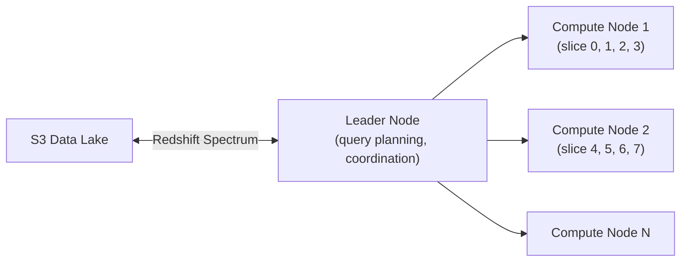

# AWS Analytics-Focused Databases & Services

## Amazon Redshift — Data Warehouse

Columnar MPP (Massively Parallel Processing) data warehouse for OLAP workloads.

### Architecture



**Columnar storage:** Data stored by column, not row → reads only the columns needed for a query → massive I/O reduction for analytics.

**Slices:** Each compute node is divided into slices (CPU cores). Queries execute in parallel across all slices — linear performance scaling.

### Key Features

```sql
-- COPY command: bulk load from S3 (fastest ingestion)
COPY orders FROM 's3://my-bucket/orders/'
IAM_ROLE 'arn:aws:iam::123:role/RedshiftS3Role'
FORMAT AS PARQUET;

-- Redshift Spectrum: query S3 directly without loading
SELECT o.order_id, c.customer_name
FROM orders o
JOIN spectrum_schema.customers_s3 c ON o.customer_id = c.id
WHERE o.created_at > '2024-01-01';

-- VACUUM: reclaim space + resort after deletes/updates
VACUUM orders;

-- ANALYZE: update statistics for query planner
ANALYZE orders;
```

### Node Types

| Type | Best for |
|------|---------|
| **RA3** | Separate compute from storage (managed storage on S3) — flexible scaling |
| **dc2** | Dense compute, local SSD — high performance, fixed storage |

**Redshift Serverless:** auto-scale compute capacity, pay only when queries run.

---

## Amazon Athena — Serverless SQL on S3

Query S3 data with SQL — no servers, no loading data.

```sql
-- Create external table pointing to S3
CREATE EXTERNAL TABLE orders (
  order_id STRING,
  amount DOUBLE,
  status STRING,
  created_at TIMESTAMP
)
PARTITIONED BY (year STRING, month STRING)
STORED AS PARQUET
LOCATION 's3://my-data-lake/orders/';

-- Query (pay only for data scanned — $5/TB)
SELECT status, count(*), avg(amount)
FROM orders
WHERE year='2024' AND month='01'   -- partition pruning: only scan Jan data
GROUP BY status;
```

### Cost Optimization for Athena

| Strategy | Savings |
|----------|---------|
| **Parquet/ORC format** (columnar) | 10x less data scanned vs CSV |
| **Partitioning** (year/month/day) | Only scan relevant partitions |
| **Compression** (Snappy, Gzip) | Smaller files = less data |
| **Athena result caching** | Same query within 24h = no scan charge |

### Athena Federated Query

Query across data sources with one SQL:

```sql
-- Join S3 data with DynamoDB and RDS
SELECT s3.order_id, dynamo.customer_tier, rds.product_name
FROM orders s3
JOIN "lambda:dynamodb".customers dynamo ON s3.customer_id = dynamo.id
JOIN "lambda:rds-mysql".products rds ON s3.product_id = rds.id
```

Connectors available for: DynamoDB, RDS, ElastiCache, CloudWatch Logs, DocumentDB.

---

## AWS Glue — Serverless ETL

### Glue Data Catalog

Central metadata repository — schema and table definitions for S3, RDS, Redshift:

```
Glue Data Catalog
├── Database: raw_data
│   ├── Table: orders (points to s3://raw/orders/, Parquet schema)
│   └── Table: products (points to s3://raw/products/, CSV schema)
└── Database: processed
    └── Table: order_summary (points to s3://processed/, Parquet)
```

Athena, Redshift Spectrum, EMR all use the Glue Data Catalog as their metastore.

### Glue Crawlers

Auto-discover and register schemas from S3 or databases:

```bash
aws glue start-crawler --name my-s3-crawler
# Crawler scans s3://my-bucket/orders/ → infers schema → creates/updates Glue table
```

### Glue ETL Jobs

```python
# Glue ETL job (PySpark)
from awsglue.context import GlueContext
from pyspark.context import SparkContext

sc = SparkContext()
glueContext = GlueContext(sc)

# Read from S3 via Glue Catalog
orders = glueContext.create_dynamic_frame.from_catalog(
    database="raw_data", table_name="orders"
)

# Transform
from awsglue.transforms import Filter, ApplyMapping
completed = Filter.apply(orders, f=lambda x: x['status'] == 'COMPLETED')
mapped = ApplyMapping.apply(completed, mappings=[
    ('order_id', 'string', 'id', 'string'),
    ('amount', 'double', 'total', 'double'),
    ('created_at', 'timestamp', 'date', 'date')
])

# Write to S3 as Parquet
glueContext.write_dynamic_frame.from_options(
    frame=mapped,
    connection_type='s3',
    connection_options={'path': 's3://processed/orders/'},
    format='parquet'
)
```

---

## Redshift vs Athena vs EMR

| | Redshift | Athena | EMR |
|--|---------|--------|-----|
| **Type** | Data warehouse (persistent) | Serverless SQL | Managed Spark/Hadoop |
| **Cost model** | Per node-hour | Per TB scanned | Per instance-hour |
| **Performance** | Fastest for repeated queries (cache) | Pay per scan | Configurable |
| **Setup** | Provision cluster | Zero | Provision cluster |
| **Best for** | BI dashboards, reporting | Ad-hoc S3 queries, exploration | Large-scale ETL, ML training |
| **Data location** | Loaded into Redshift | Stays in S3 | S3 + cluster |

## Common Interview Questions

**Q: Athena vs Redshift for ad-hoc analytics?**
Athena: zero setup, pay per TB scanned, data stays in S3 — great for exploration, one-off queries, infrequent analysts. Redshift: provisioned cluster cost even when idle, but faster for repeated queries (cached results, materialized views, columnar index). Use Athena for exploration and Redshift for production BI dashboards queried constantly.

**Q: What is Glue Data Catalog and why is it important?**
The Glue Data Catalog is a central metastore — it stores table definitions (schema, S3 location, format) that Athena, Redshift Spectrum, and EMR all share. Without it, each service would need its own schema definition. With it, you define the schema once and all analytics tools see the same tables. It's the de-facto AWS data lake catalog.

**Q: How does Redshift Spectrum work?**
Spectrum is an extension to Redshift that queries S3 data directly without loading it into Redshift. Spectrum uses thousands of AWS-managed workers to scan S3 data in parallel, then returns results to the Redshift leader node for final aggregation. You pay Redshift cluster costs plus $5/TB of S3 data scanned. Use for: data in S3 that's too large or infrequently queried to justify loading into Redshift.

**Q: When to use Glue ETL vs Lambda for data processing?**
Glue ETL (Spark): large-scale batch processing (gigabytes to petabytes), complex multi-step transformations, joins across datasets. Lambda: small, event-driven transformations (< 15 min, < 10GB), record-by-record processing, triggered by S3 events or Kinesis. Lambda for real-time small events; Glue for scheduled batch ETL.
