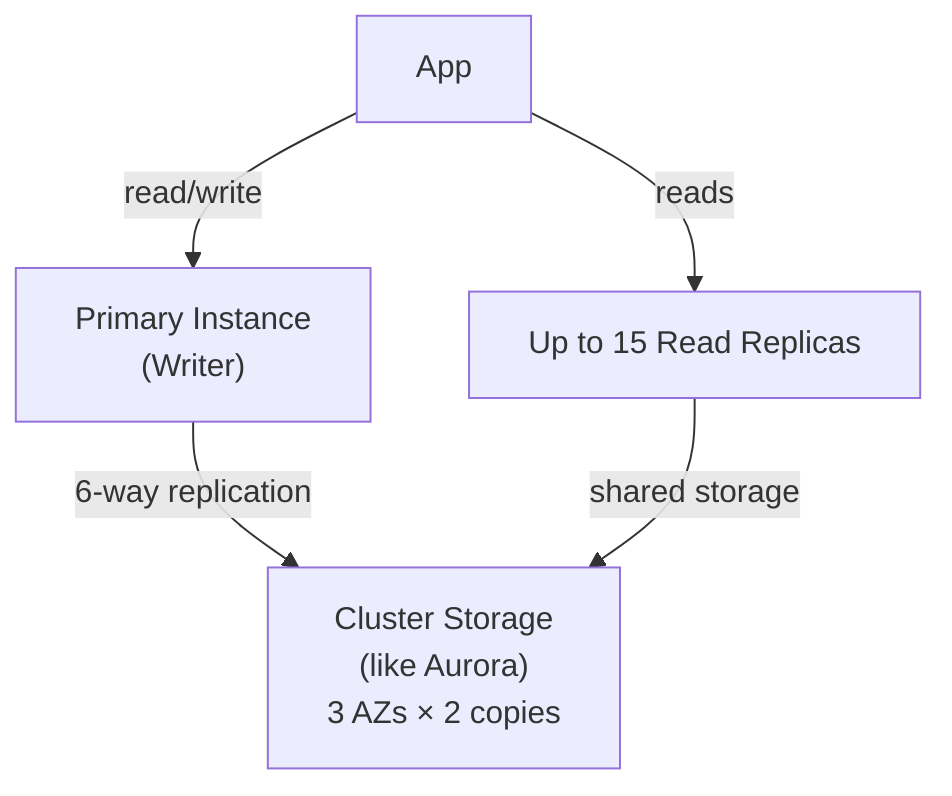

# Amazon Neptune — Graph Database

> Managed graph database service supporting property graphs (Gremlin, openCypher) and RDF graphs (SPARQL). Purpose-built for highly connected data.

## Why Graph Databases?

Relational databases handle relationships via JOINs — performance degrades with depth:

```sql
-- "Friends of friends who like hiking" in SQL
SELECT u3.name FROM users u1
JOIN friendships f1 ON u1.id = f1.user_id
JOIN users u2 ON f1.friend_id = u2.id
JOIN friendships f2 ON u2.id = f2.user_id
JOIN users u3 ON f2.friend_id = u3.id
JOIN interests i ON u3.id = i.user_id
WHERE u1.id = 'alice' AND i.name = 'hiking'
```

Same query in Gremlin (graph traversal):
```groovy
g.V('alice').out('FRIEND').out('FRIEND').has('interest', 'hiking').values('name')
```

Graph DBs are designed for relationship traversal — O(1) per hop vs O(n) joins.

## Neptune Architecture



- Same Aurora-style cluster storage (6-way replication, 3 AZs)
- Failover < 30 seconds (reader promoted to writer)
- Up to 15 read replicas
- Storage auto-grows in 10GB increments

## Query Languages

| Language | Graph model | Query style |
|----------|------------|-------------|
| **Gremlin** | Property Graph | Imperative traversal (Grovvy-like) |
| **openCypher** | Property Graph | Declarative (SQL-like) — now supported |
| **SPARQL** | RDF Graph | SQL-like for semantic data |

### Gremlin Examples

```groovy
// Add vertices and edges
g.addV('Person').property('name', 'Alice').as('a')
 .addV('Person').property('name', 'Bob').as('b')
 .addE('KNOWS').from('a').to('b')

// Find friends
g.V().has('Person', 'name', 'Alice').out('KNOWS').values('name')

// Friends of friends (depth 2)
g.V().has('name', 'Alice').repeat(out('KNOWS')).times(2).dedup().values('name')

// Fraud detection: transactions through multiple accounts
g.V().has('Account', 'id', 'ACC-123')
 .repeat(out('TRANSFERRED_TO').simplePath())
 .emit()
 .has('Account', 'flagged', true)
 .path()
```

### openCypher Example

```cypher
// Find products frequently bought together
MATCH (u:User)-[:PURCHASED]->(p1:Product)
MATCH (u)-[:PURCHASED]->(p2:Product)
WHERE p1 <> p2
RETURN p1.name, p2.name, count(*) as cooccurrence
ORDER BY cooccurrence DESC
LIMIT 10
```

## Neptune Streams

Change log for real-time graph updates — stream to Kinesis for event-driven processing:

```bash
# Enable streams on a Neptune cluster
aws neptune modify-db-cluster \
  --db-cluster-identifier my-neptune-cluster \
  --enable-cloudwatch-logs-exports '["audit"]'
```

## Neptune ML

Graph neural networks (GNNs) with SageMaker:

- Export Neptune graph to S3 → Train GNN on SageMaker → Deploy as endpoint
- Use cases: link prediction (recommend connections), node classification (fraud scoring)

## Use Cases

| Use Case | Why Graph DB? |
|----------|--------------|
| **Social networks** | Friend-of-friend, mutual connections, influence scoring |
| **Fraud detection** | Relationship patterns (money mules, synthetic identity rings) |
| **Knowledge graphs** | Entity relationships, semantic search |
| **Recommendation engines** | Collaborative filtering via graph traversal |
| **IT asset management** | Dependency graphs, blast radius analysis |
| **Compliance/lineage** | Data lineage, regulatory relationships |

## Neptune vs DynamoDB for Graph Data

| | Neptune | DynamoDB |
|--|---------|---------|
| Traversal performance | Native (1 hop ≈ 1ms) | Manual joins (expensive at depth) |
| Query language | Gremlin/Cypher/SPARQL | PartiQL (SQL-like, no traversal) |
| Relationship depth | Arbitrary | Expensive > 2 hops |
| Schema | Flexible property graph | Flexible key-value |
| Use case | Highly connected data | Key-value, time-series |

## Common Interview Questions

**Q: When would you choose Neptune vs DynamoDB?**
Neptune when: your primary access pattern involves traversing relationships (fraud detection, social graphs, recommendation engines, knowledge graphs). DynamoDB when: primary access is by key (get user by ID, get order by orderId) — DynamoDB excels at point lookups and range queries but suffers at multi-hop traversals.

**Q: What's the difference between Property Graph and RDF?**
Property Graph (Gremlin/Cypher): vertices and edges can have arbitrary key-value properties — more flexible, more common for application use cases. RDF (SPARQL): triples (subject-predicate-object) following linked data standards — used for semantic web, ontologies, knowledge graphs where data must conform to shared vocabularies (OWL, RDFS).

**Q: How does Neptune handle fraud detection better than SQL?**
Fraud rings involve chains of accounts and transactions. A query like "find all accounts reachable within 3 transfers from this flagged account" requires 3-level JOINs in SQL — performance collapses at scale. In Neptune, `g.V(account).repeat(out('TRANSFERRED_TO')).times(3)` uses index-free adjacency — each hop follows a pointer, not a full table scan.

**Q: Neptune Streams — what are they used for?**
Neptune Streams capture every graph mutation (vertex/edge add/modify/delete) in a log. Use for: real-time event processing (trigger alerts when a fraud pattern is detected), materializing views of the graph in another store (e.g., Elasticsearch for full-text search on graph data), audit trails, or replication.
