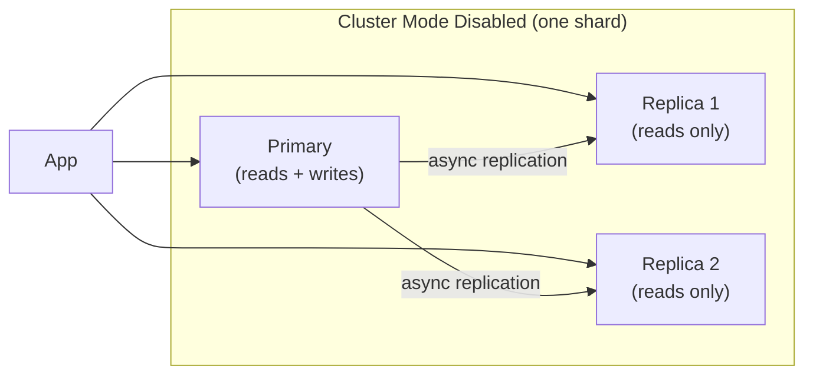
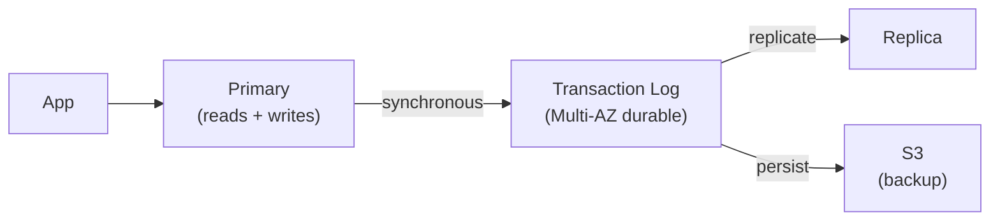

# AWS In-Memory Databases — ElastiCache & MemoryDB

## Amazon ElastiCache

Managed in-memory caching. Two engines: **Redis** (feature-rich) and **Memcached** (simple, multi-threaded).

### Redis vs Memcached

| Feature | Redis | Memcached |
|---------|-------|-----------|
| Data types | Strings, Hashes, Lists, Sets, Sorted Sets, Streams, JSON | Strings only |
| Persistence | ✅ RDB snapshots + AOF log | ❌ No persistence |
| Replication | ✅ Primary + replicas | ❌ No replication |
| Pub/Sub | ✅ | ❌ |
| Transactions | ✅ MULTI/EXEC | ❌ |
| Lua scripting | ✅ | ❌ |
| Cluster mode | ✅ Sharding | ✅ (simple) |
| Multi-threaded | ❌ (single-threaded event loop) | ✅ Multi-threaded |
| Use case | Caching + session + pub/sub + queues | Pure caching, high throughput simple reads |

**Choose Redis** for almost everything. Choose Memcached only if: you need multi-threading for CPU-bound workloads and only need simple string caching.

### ElastiCache for Redis — Cluster Modes



| | Cluster Mode Disabled | Cluster Mode Enabled |
|--|----------------------|---------------------|
| **Shards** | 1 (one primary) | Up to 500 shards |
| **Max data** | ~6.5 TB | ~340 TB |
| **Scaling** | Vertical only | Horizontal (add shards) |
| **Complexity** | Simple | Requires cluster-aware client |
| **Use case** | Most apps | Very large datasets, hot keys |

### Caching Patterns

**Cache-aside (lazy loading) — most common:**

```python
def get_user(user_id):
    cached = redis.get(f"user:{user_id}")
    if cached:
        return json.loads(cached)        # cache hit

    user = db.query("SELECT * FROM users WHERE id = ?", user_id)
    redis.setex(f"user:{user_id}", 300, json.dumps(user))  # TTL=300s
    return user
```

Pros: only caches what's read (no wasted memory). Cons: cache miss = DB hit + latency spike (cold cache).

**Write-through:**

```python
def update_user(user_id, data):
    db.query("UPDATE users SET ...", data)
    redis.setex(f"user:{user_id}", 300, json.dumps(data))  # write to cache too
```

Pros: cache always up-to-date. Cons: writes are slower (double write), cache polluted with infrequently-read data.

**Write-behind (write-back):**

Write to cache first, async flush to DB. Pros: lowest write latency. Cons: data loss risk if cache fails before flush.

### ElastiCache Redis — Security

```yaml
# Enable encryption in transit (TLS) and at rest (KMS)
aws elasticache create-replication-group \
  --replication-group-id prod-redis \
  --transit-encryption-enabled \
  --at-rest-encryption-enabled \
  --kms-key-id alias/my-elasticache-key \
  --auth-token "my-strong-auth-token"  # Redis AUTH command
```

---

## Amazon MemoryDB for Redis

Redis-compatible database with **durable storage** — not just a cache, a primary database:



**Key difference from ElastiCache:** MemoryDB uses a distributed transaction log for durability — data survives instance failures without loss. ElastiCache can lose recent writes on failure (async replication).

| | ElastiCache Redis | MemoryDB |
|--|-----------------|---------|
| Durability | Eventual (async replication) | Strong (sync transaction log) |
| Recovery | May lose recent writes | No data loss |
| Use as primary DB | ❌ (cache only) | ✅ (replace MySQL for simple data) |
| Read replicas | Up to 5 | Up to 5 |
| Cost | Lower | Higher (~2x) |
| Redis compatibility | 100% | 100% |

**Use MemoryDB when:** you want Redis as your primary database (not just cache) — gaming leaderboards, session stores, real-time queues that need durability.

---

## Caching Strategies at Scale

### Cache Stampede Prevention

When cache expires, all requests hit DB simultaneously:

```python
# Solution: probabilistic early expiration
import random
import math

def get_with_early_expire(key, ttl, beta=1.0):
    value, expiry = redis.get_with_expiry(key)
    current_time = time.time()

    # Probabilistically recompute before expiry
    if current_time - beta * math.log(random.random()) >= expiry:
        value = recompute_from_db(key)
        redis.setex(key, ttl, value)

    return value
```

### Redis Sorted Sets for Leaderboards

```python
# Add/update player score
redis.zadd('leaderboard:global', {'player:123': 1500})

# Get top 10 players
redis.zrevrange('leaderboard:global', 0, 9, withscores=True)

# Get player rank
redis.zrevrank('leaderboard:global', 'player:123')
```

## Common Interview Questions

**Q: Redis cluster mode vs non-cluster mode — when to use?**
Non-cluster (single shard): simpler, one primary + up to 5 replicas, max ~6.5TB. Use for most applications. Cluster mode (up to 500 shards): when data > 6.5TB or a single key receives too many requests (hot key) — cluster mode spreads keys across shards. Requires cluster-aware client library.

**Q: Cache-aside vs write-through — trade-offs?**
Cache-aside: cache miss on cold data, but cache only contains frequently-read data (no waste). Write-through: cache is always current (no stale reads), but writes are slower and cache may be full of infrequently-read data. Cache-aside is more common; write-through for read-heavy workloads where stale cache is unacceptable.

**Q: MemoryDB vs ElastiCache Redis — key difference?**
ElastiCache Redis: in-memory cache with async replication — on failure, may lose recent writes (milliseconds of data). MemoryDB: uses a distributed transaction log (synchronously replicated to a quorum) — no data loss on failure, can be used as a primary database. ~2x the cost of ElastiCache.

**Q: How do you handle cache stampede?**
1. Probabilistic early expiration (XFetch algorithm) — proactively refresh before actual expiry
2. Distributed lock (Redis SETNX) — only one process recomputes, others wait
3. Stale-while-revalidate — return stale value immediately, refresh async
4. Cache warming — pre-populate cache before deployment
