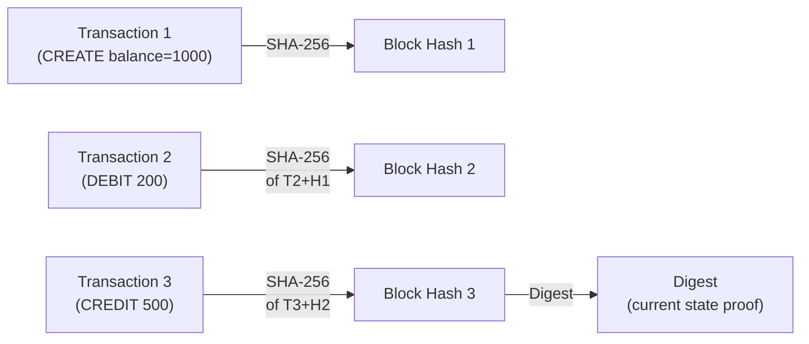

# Amazon QLDB — Quantum Ledger Database

> Fully managed ledger database with a cryptographically verifiable, immutable transaction log. Every change is recorded and can be mathematically proven to be unaltered.

## What Makes QLDB Unique

QLDB uses a **journal-based architecture** with SHA-256 hash chaining:



- Append-only journal: transactions can never be modified or deleted
- Each block's hash includes the previous block's hash (like blockchain)
- Get a **Digest** (root hash of the Merkle tree) that proves the complete history
- **Verify** that any specific transaction was recorded and never altered, using the Digest

## Core Operations

```python
import boto3
from pyqldb.driver.qldb_driver import QldbDriver

driver = QldbDriver(ledger_name='my-ledger')

# Insert (PartiQL)
def create_account(account_id, balance):
    driver.execute_lambda(
        lambda executor: executor.execute_statement(
            "INSERT INTO Accounts VALUE {'accountId': ?, 'balance': ?}",
            account_id, balance
        )
    )

# Query history of a document
def get_history(account_id):
    driver.execute_lambda(
        lambda executor: executor.execute_statement(
            """
            SELECT h.data.balance, h.metadata.txTime, h.metadata.txId
            FROM history(Accounts) AS h
            WHERE h.data.accountId = ?
            """,
            account_id
        )
    )
```

## Cryptographic Verification

```bash
# Get current digest (hash of entire ledger history)
aws qldb get-digest --name my-ledger

# Verify a specific revision hasn't been tampered with
aws qldb get-revision \
  --name my-ledger \
  --block-address '{"strandId": "KmA3...", "sequenceNo": 1}' \
  --document-id "JyDy..." \
  --digest-tip-address '{"strandId": "KmA3...", "sequenceNo": 10}'
# Returns a proof (Merkle path) that mathematically proves the revision is in the digest
```

## QLDB vs DynamoDB Streams

| | QLDB | DynamoDB + Streams |
|--|------|-------------------|
| Audit trail | Cryptographically verifiable | Eventlog (no proof) |
| Immutability | Guaranteed (journal cannot be altered) | Data can be deleted/modified |
| History queries | `history()` function built-in | Reconstruct from stream archive |
| Verification | Mathematical proof via Digest | Not available |
| Use case | Legal/compliance records | Change data capture |

## QLDB vs Blockchain

| | QLDB | Blockchain (e.g., Ethereum) |
|--|------|-----------------------------|
| Trust model | Centralized (AWS is trusted) | Trustless (no single authority) |
| Consensus | None needed (single owner) | Distributed consensus (PoW/PoS) |
| Performance | High throughput | Low throughput |
| Use case | Single organization audit | Multi-party trustless agreement |

**Choose QLDB when:** you own the data, need auditability, but don't need multiple untrusted parties to agree. Choose blockchain when: multiple parties who don't trust each other must agree on state.

## QLDB Streams → Kinesis

Real-time processing of ledger changes:

```bash
aws qldb create-stream \
  --ledger-name my-ledger \
  --role-arn arn:aws:iam::123:role/QLDBStreamRole \
  --inclusive-start-time 2024-01-01T00:00:00Z \
  --destination-stream-arn arn:aws:kinesis:us-east-1:123:stream/ledger-stream \
  --stream-name my-ledger-stream
```

Use for: real-time event processing, replicating to Elasticsearch for full-text search, triggering downstream workflows on commits.

## Limitations

- Single region only (no multi-region, no read replicas)
- No multi-master (single writer)
- Not a general-purpose DB — optimized for audit use cases
- Limited query performance vs DynamoDB for high-throughput workloads
- PartiQL (SQL-like) but not full SQL

## Use Cases

- **Financial transactions:** Prove a debit/credit occurred and was never altered
- **Medical records:** Immutable patient history with regulatory audit trail
- **Insurance claims:** Verifiable claim processing history
- **Supply chain:** Track custody chain with cryptographic proof
- **HR records:** Immutable employment history (promotions, pay changes)
- **Government/legal:** Court records, title deeds, compliance evidence

## Common Interview Questions

**Q: QLDB vs DynamoDB Streams for audit trails?**
DynamoDB Streams capture changes but data in the table can be modified or deleted — a bad actor with write access can alter data and the Streams log is gone after 24 hours. QLDB's journal is append-only (even AWS cannot alter it) and provides cryptographic proof (via Digest) that any past transaction existed and was never changed. QLDB for compliance/legal requirements; DynamoDB Streams for operational event processing.

**Q: What is the Digest and why is it important?**
The Digest is a hash of the entire ledger's journal up to a specific point (like a root hash of a Merkle tree). Store the Digest in an independent system (e.g., print it, store in another DB). Later, use the QLDB verification API to prove that any specific transaction is included in that Digest — mathematical proof it was recorded and never altered. This is the core of QLDB's value proposition.

**Q: QLDB vs blockchain — when to use each?**
QLDB when one organization owns and controls the data but needs a tamper-evident audit trail (most enterprise use cases). Blockchain when multiple organizations that don't trust each other need to agree on a shared record (multi-party supply chain, crypto, DeFi). QLDB is much faster and simpler; blockchain is complex and slow but trustless.

**Q: What are QLDB's limitations?**
Single-region only (no disaster recovery to another region without custom streaming). No multiple writers — single primary writer serializes all transactions. Performance is lower than DynamoDB for high-throughput point reads. Not suitable as a general-purpose database — best for audit-specific workloads where immutability and verifiability are the primary requirements.
